<p align="center">
  <br>
</p>

# RAGIX v0.33.0

*(Retrieval-Augmented Generative Interactive eXecution Agent)*

**A Sovereign Multi-Agent Orchestration Platform with AST Analysis**
**Unix-Native · Fully Local · Production-Ready · Claude-Compatible**

[](https://www.python.org/downloads/)
[](LICENSE)
[](https://fastapi.tiangolo.com/)

---

**Version:** 0.33.0 | **Author:** Olivier Vitrac, PhD, HDR | olivier.vitrac@adservio.fr | Adservio
**Updated:** 2025-12-05

---

## **Mission**

**RAGIX** is a sovereign, fully-local, Claude-Code–style development assistant that has evolved into a complete multi-agent orchestration platform.

It combines:

- **Local LLM reasoning** (via Ollama: Mistral/Qwen/DeepSeek/Granite)
- **Multi-agent workflow execution** with dependency graphs
- **Hybrid retrieval** (BM25 + vector semantic search)
- **Production-grade monitoring** and resilience
- **Claude MCP integration** for seamless AI collaboration
- **Sandboxed execution** with safety policies

RAGIX's primary objective:

> **Make local LLMs behave like disciplined software engineers.**
> Without hallucinated facts, without remote calls, without blind trust.

All processing happens **100% on your machine**. Not a single token leaves it.

---

## **What's New in v0.33.0**

| Feature | Description |
|---------|-------------|
| **RAG Feed Interface** | Upload files directly to RAG index with chunking parameters |
| **Document Conversion** | PDF (pdftotext), DOCX (pandoc), PPTX (python-pptx), XLSX (openpyxl) |
| **ZIP Archive Support** | Drop ZIP files to index entire archives at once |
| **RAG-Aware Reasoning** | Classifier detects RAG context and uses BYPASS mode (no shell commands) |
| **Chat-to-RAG Export** | Index conversation history to RAG for later retrieval |
| **Configurable Chunking** | Set chunk size and overlap in sidebar UI |
| **Converter Toggles** | Enable/disable PDF and Office document converters |
| **Context Limits Config** | Configure conversation context limits in Settings |

### v0.33.0 Highlights (Latest)

- **RAG Upload Button** — Upload files directly to RAG index from sidebar
  - Supports: txt, md, py, js, json, yaml, xml, pdf, docx, pptx, xlsx, zip
  - Configurable chunk size (200-5000) and overlap (0-1000)
  - Converter toggles for PDF (pdftotext) and Office (pandoc/python-pptx/openpyxl)
- **RAG Context Retrieval** — Automatic context injection when RAG is enabled
  - Retrieves relevant chunks based on query terms
  - Classifier recognizes "📚 DOCUMENT CONTEXT" and uses BYPASS mode
  - Agent answers directly from indexed content without shell commands
- **Chat History Indexing** — Export conversation to RAG with 💬→📚 button
  - Converts chat history to text chunks for later retrieval
- **BM25 Index Building** — Proper search index created on upload
  - Keyword-based retrieval with term frequency scoring

### v0.32.x Highlights

- **Memory Explorer Panel** — Sidebar section to browse episodic memory entries
  - Search with debounce, delete individual entries or clear all
  - Stats: episode count, files touched, commands run
- **Memory Context in Reasoning Tab** — Panel showing memories during reasoning
  - Search input, "All", "Relevant", "Used (N)" filter buttons
  - Current goal display, WebSocket updates when reasoning starts
- **Memory Details Modal** — Proper modal instead of alert()
  - Color-coded sections: Plan (purple), Result (green), Decisions (yellow), Files (blue), Commands (orange)
  - Delete button, code formatting for files/commands
- **Context Window Management** — Visual indicator with compaction
  - Progress bar with warning (80%) and critical (95%) states
  - Manual compact button, auto-compaction at 95%
- **File Handling** — Drag & drop with conversion
  - Text files: py, js, ts, json, yaml, md, txt, html, css, sql, etc.
  - Conversion: PDF (pdftotext), DOCX/ODT/RTF (pandoc)
  - Configurable in `ragix.yaml`

### v0.30.0 Highlights

- **Real-Time Streaming Progress** — No more waiting blindly during complex tasks
  - Classification result shown immediately: `[0.0s] 📊 Task classified as: complex`
  - Plan steps listed as they're generated: `📋 Plan: <objective>` then `📌 Step 1: ...`
  - Execution progress streamed: `⚙️ Executing step 1/N` → `✅ Step 1 complete: <result>`
- **Progress Callback Pipeline** — End-to-end streaming from graph nodes to WebSocket
  - `ReasoningGraph._emit_progress()` → `GraphReasoningLoop._add_trace()` → WebSocket
  - Server sets callback before execution for real-time updates
- **Robust JSON Action Handling** — LLMs often return malformed JSON; now handled gracefully
  - Fixes unquoted keys: `{action: "bash"}` → `{"action": "bash"}`
  - Fixes single quotes: `{'action': 'bash'}` → `{"action": "bash"}`
  - Regex fallback extracts commands even from broken JSON
- **Improved `_execute_step_wrapper`** — When LLM returns JSON action, execute it directly
  - Detects `bash`, `bash_and_respond`, `respond` actions
  - Executes commands via `shell_executor` and returns actual stdout/stderr
- **Clean Output** — `RespondNode` filters raw JSON patterns from final response

### v0.23.0 Highlights

- **Model Inheritance Architecture** — Single source of truth for LLM model selection
  - Session model = default (configured in Settings → Session tab)
  - Agent Config = inherits from Session in MINIMAL mode
  - Reasoning = inherits from Agent Config (Planner/Worker/Verifier)
- **Fixed Agent Config Router** — `/api/agents/config` endpoint now properly reads session model from `active_sessions`
- **UI Consistency** — All panels (Chat sidebar, Chat thread, Reasoning cards) show correct model
- **Session Auto-Creation** — Handles server restart gracefully by auto-creating missing sessions
- **Removed Redundant Settings** — Reasoning model selector removed (now inherits automatically)
- **Version 0.23.0** — Centralized version management

### v0.22.0 Highlights

- **Galaxy Visualization Physics** — Multi-body simulation with mass-based phase separation
  - Classes (stars): Heavy, anchor solar systems
  - Interfaces/Enums: Heavy planets in inner orbits
  - Methods: Light planets in outer orbits
  - Fields/Constants: Asteroids at outer edges
- **PCoA-Based Topology** — Initial class positions derived from inheritance/call graph distances via MDS
- **Refined Physics Constants** — Balanced gravitational repulsion (-35), strong central gravity (0.1), proper spring lengths
- **Edge Force Hierarchy** — Structural (50) → Inheritance (100) → Call (180) → Reference (250)
- **Fixed Metrics API** — Dependency count now properly returned from cached and fresh analysis

### v0.21.0 Highlights

- **Analysis Caching** — Fast fingerprint-based caching for large codebases
- **SonarQube Integration** — TTL-based cache for SonarQube API responses
- **Performance** — PCoA seeding with constant scale factor (no bounding box normalization)

### v0.20.0 Highlights

- **Report Generation** — Executive Summary, Technical Audit, Compliance reports (PDF/HTML)
- **Advanced Visualizations** — Treemap, Sunburst, Chord diagram for dependency analysis
- **Accurate Documentation Coverage** — Filters placeholder Javadocs, shows real coverage
- **Maven & SonarQube in Reports** — Build tool and quality gate integration
- **Separate Doc Metrics** — Class vs Method documentation coverage (balanced 50/50)
- **Robust Web UI** — Defensive JavaScript, fixed logs page, improved error handling
- **Knowledge Base** — Solution patterns and project-specific conventions
- **Session Memory** — Full conversation history management

### Tested on Production Codebase

Successfully analyzed **1,315 Java files** from enterprise project:
- **18,210 symbols** extracted
- **45,113 dependencies** mapped
- **362 hours** of technical debt estimated
- Analysis completed in **~10 seconds**

---

## **Core Capabilities**

### **Multi-Agent Workflows**

Define complex workflows with dependencies:

```python
from ragix_core import get_template_manager, GraphExecutor

# Use a pre-built template
manager = get_template_manager()
graph = manager.instantiate("bug_fix", {
    "bug_description": "TypeError in handler.py",
    "affected_files": "src/handlers/",
})

# Execute with streaming
async for event in executor.execute_streaming(agent_factory):
    print(f"[{event.event_type}] {event.node_id}")
```

**Built-in templates:**
- `bug_fix` - Locate, diagnose, fix, test
- `feature_addition` - Design, implement, test, document
- `code_review` - Quality and security review
- `refactoring` - Analyze, plan, refactor, verify
- `documentation` - Code analysis and doc generation
- `security_audit` - Static analysis and dependency checks
- `test_coverage` - Coverage analysis and test generation
- `exploration` - Codebase exploration and analysis

### **Hybrid Search (BM25 + Vector)**

Combine keyword and semantic search:

```python
from ragix_core import create_hybrid_engine, FusionStrategy

engine = create_hybrid_engine(
    index_path=Path(".ragix/index"),
    embedding_model="all-MiniLM-L6-v2",
)

results = engine.search(
    "database connection error",
    k=10,
    strategy=FusionStrategy.RRF,
)

for r in results:
    print(f"{r.file_path}:{r.name} (score: {r.combined_score:.3f})")
    print(f"  Source: {r.source}")  # 'bm25', 'vector', or 'both'
```

**Fusion strategies:**
- **RRF** - Reciprocal Rank Fusion (default)
- **Weighted** - Configurable BM25/vector balance
- **Interleave** - Round-robin merging
- **BM25 Rerank** - Vector search with BM25 reranking
- **Vector Rerank** - BM25 search with vector reranking

### **Production Monitoring**

```python
from ragix_core import get_health_checker, get_agent_monitor

# Health checks
checker = get_health_checker()
report = checker.get_status_report()
print(f"Status: {report['status']}")

# Agent monitoring
monitor = get_agent_monitor()
monitor.start_execution("exec_001", "Fix bug", "code")
monitor.record_tool_call("read_file", success=True, duration=0.1)
monitor.end_execution("exec_001", success=True, agent_type="code")
```

### **Resilience Patterns**

```python
from ragix_core import retry_async, RetryConfig, CircuitBreaker

# Retry with exponential backoff
@retry_async(RetryConfig(max_attempts=5, base_delay=1.0))
async def unreliable_call():
    return await api.request()

# Circuit breaker
breaker = CircuitBreaker(failure_threshold=5, recovery_timeout=30)
if breaker.is_allowed():
    try:
        result = await api.call()
        breaker.record_success()
    except Exception:
        breaker.record_failure()
```

### **AST Analysis & Code Metrics**

Professional-grade static analysis for Python and Java:

```bash
# Scan project and extract symbols
ragix-ast scan ./src --lang java

# Get code metrics (complexity, debt, maintainability)
ragix-ast metrics ./src

# Find complexity hotspots
ragix-ast hotspots ./src --top 20

# Search with AST query language
ragix-ast search ./src "type:class @Transactional"
ragix-ast search ./src "extends:BaseService"
```

```python
from ragix_core import build_dependency_graph, calculate_metrics

# Build dependency graph
graph = build_dependency_graph([Path("./src")])
cycles = graph.detect_cycles()
coupling = graph.get_coupling_metrics()

# Calculate code metrics
metrics = calculate_metrics(Path("./src"))
print(f"Technical debt: {metrics.total_debt_hours:.1f} hours")
print(f"Avg complexity: {metrics.avg_cyclomatic:.2f}")
```

### **Interactive Visualizations**

Three visualization types for dependency analysis:

```bash
# Force-directed dependency graph with package clustering
ragix-ast graph ./src --format html --output deps.html

# Dependency Structure Matrix (heatmap with cycles)
ragix-ast matrix ./src --level package --output matrix.html

# Radial ego-centric explorer
ragix-ast radial ./src --focal ClassName --levels 3 --output radial.html

# Live radial server (real-time exploration)
python -m ragix_unix.radial_server --path ./src --port 8090
```

**Features:**
- Package clustering with convex hulls
- Edge bundling for clarity
- Cycle detection (red cells in DSM)
- Auto-selection of highest-connectivity focal node
- Breadcrumb navigation for exploration history

---

## **Architecture**

```mermaid
flowchart TB
    subgraph "User Interface"
        CLI["🖥️ CLI"]
        WEB["🌐 Web UI"]
        MCP["🔌 MCP Client (Claude)"]
    end

    subgraph "Orchestration Layer"
        ORCH["🧠 Graph Executor"]
        TEMPLATES["📋 Workflow Templates"]
        STREAM["📡 Event Streaming"]
    end

    subgraph "Agent Layer"
        CODE["💻 Code Agent"]
        DOC["📝 Doc Agent"]
        TEST["🧪 Test Agent"]
        GIT["🌿 Git Agent"]
    end

    subgraph "AST Layer"
        AST["🌳 AST Analysis"]
        DEPS["📊 Dependencies"]
        METRICS["📈 Code Metrics"]
        VIZ["🎨 Visualization"]
    end

    subgraph "Retrieval Layer"
        HYBRID["🔍 Hybrid Search"]
        BM25["📊 BM25 Index"]
        VEC["🧮 Vector Index"]
    end

    subgraph "Execution Layer"
        LLM["🤖 Local LLM (Ollama)"]
        SHELL["🐚 Sandboxed Shell"]
        TOOLS["🛠️ Tool Registry"]
    end

    subgraph "Infrastructure"
        CACHE["💾 Caching"]
        MONITOR["📈 Monitoring"]
        RESIL["🛡️ Resilience"]
    end

    CLI --> ORCH
    WEB --> ORCH
    MCP --> ORCH

    ORCH --> TEMPLATES
    ORCH --> STREAM
    ORCH --> CODE
    ORCH --> DOC
    ORCH --> TEST
    ORCH --> GIT

    CODE --> HYBRID
    CODE --> LLM
    CODE --> SHELL

    HYBRID --> BM25
    HYBRID --> VEC

    LLM --> CACHE
    SHELL --> TOOLS
    TOOLS --> MONITOR
    LLM --> RESIL
```



---

## **Installation**

### Option A: Using the Launcher (Recommended)

The easiest way to get started is with the launcher script:

```bash
# 1. Install Ollama
curl -fsSL https://ollama.com/install.sh | sh
ollama pull mistral  # or granite3.1-moe:3b for speed

# 2. Clone RAGIX
git clone https://github.com/ovitrac/RAGIX.git
cd RAGIX

# 3. Run the launcher
./launch_ragix.sh
```

The launcher will automatically:
- Initialize Conda (searches common locations)
- Create `ragix-env` environment if missing
- Install all dependencies from `environment.yaml` and `requirements.txt`
- Check Ollama status and available models
- Present an interactive menu to launch components

**Launcher options:**
```bash
./launch_ragix.sh           # Interactive menu
./launch_ragix.sh gui       # Launch Web GUI directly
./launch_ragix.sh demo      # Run Claude demo
./launch_ragix.sh mcp       # Start MCP server
./launch_ragix.sh test      # Test LLM backends
```

### Option B: Manual Installation

#### 1. Install Ollama

```bash
curl -fsSL https://ollama.com/install.sh | sh
```

#### 2. Pull a model

```bash
ollama pull mistral
# Or: ollama pull qwen2.5 | deepseek-coder | granite
```

#### 3. Clone and install

```bash
git clone https://github.com/ovitrac/RAGIX.git
cd RAGIX
pip install -e .
```

#### 4. (Optional) Install with extras

```bash
# For semantic search
pip install sentence-transformers faiss-cpu

# For monitoring
pip install psutil

# For MCP
pip install "mcp[cli]"

# For Web UI
pip install streamlit
```

### Option C: Using Conda Environment

```bash
# Clone and create environment
git clone https://github.com/ovitrac/RAGIX.git
cd RAGIX

# Create conda environment
conda env create -f environment.yaml
conda activate ragix-env

# Install RAGIX in development mode
pip install -e .
```

---

## **Quick Start**

### Interactive CLI

```bash
python3 unix-rag-agent.py
```

### Build Search Index

```bash
ragix-index ./my-project --output .ragix/index
```

### Run Workflow Template

```bash
ragix-batch --template bug_fix --params "bug_description=TypeError in handler"
```

### Start Web UI

```bash
# Via launcher (recommended)
./launch_ragix.sh gui

# Or directly
streamlit run ragix_app.py
```

The web interface provides:
- Dashboard with sovereignty status
- Hybrid search (BM25 + Vector)
- Chat with local LLMs
- Workflow template browser
- System health monitoring

**URL:** http://localhost:8501

---

## **Using RAGIX with Claude (Beginner's Guide)**

This section explains how to connect RAGIX with Claude Desktop or Claude Code, giving Claude powerful local coding capabilities.

### What This Does

When you connect RAGIX to Claude:
- **Claude gains access to your local codebase** through safe, sandboxed tools
- **Claude can search, read, and analyze your code** using hybrid search
- **Claude can execute multi-step workflows** like bug fixing or code review
- **Everything runs locally** — your code never leaves your machine

Think of it as giving Claude a "local workspace" where it can help you with real coding tasks.

### What You Need

| Requirement | Purpose |
|-------------|---------|
| **Python 3.10+** | Run RAGIX |
| **Ollama** | Local LLM for RAGIX's internal reasoning |
| **Claude Desktop** or **Claude Code** | The Claude interface you'll interact with |
| **MCP SDK** | Protocol for Claude to talk to RAGIX |

### Step-by-Step Setup

#### 1. Install Ollama and pull a model

```bash
# Install Ollama
curl -fsSL https://ollama.com/install.sh | sh

# Pull a model (choose one)
ollama pull mistral          # Recommended: good balance
ollama pull qwen2.5          # Alternative: multilingual
ollama pull deepseek-coder   # Alternative: code-focused
```

#### 2. Install RAGIX

```bash
git clone https://github.com/ovitrac/RAGIX.git
cd RAGIX
pip install -e .
```

#### 3. Install the MCP SDK

```bash
pip install "mcp[cli]"
```

#### 4. Configure your environment

```bash
# Set the sandbox root to your project folder
export UNIX_RAG_SANDBOX="$HOME/my-project"

# Set the Ollama model
export UNIX_RAG_MODEL="mistral"

# Set safety profile (dev is recommended)
export UNIX_RAG_PROFILE="dev"
```

#### 5. Install RAGIX as an MCP server

```bash
# Navigate to RAGIX directory
cd /path/to/RAGIX

# Install into Claude
mcp install MCP/ragix_mcp_server.py --name "RAGIX"
```

#### 6. Enable in Claude Desktop

1. Open **Claude Desktop**
2. Go to **Settings** → **MCP Servers**
3. Find **RAGIX** and toggle it **ON**
4. Restart Claude Desktop

### How to Use It

Once connected, you can ask Claude to help with your code. Claude will automatically use RAGIX tools when appropriate.

#### Example Conversations

**Finding code:**
```
You: Where is the database connection configured in my project?

Claude: I'll search your codebase for database configuration.
[Uses ragix_search to find relevant files]
I found the database configuration in src/config/database.py...
```

**Understanding code:**
```
You: Explain what the UserAuthentication class does

Claude: Let me read that file for you.
[Uses ragix_read_file to examine the code]
The UserAuthentication class handles login, logout, and session management...
```

**Fixing bugs:**
```
You: There's a TypeError in my handlers module, can you find and fix it?

Claude: I'll use a bug-fixing workflow to locate and fix this.
[Uses ragix_workflow with bug_fix template]
I found the issue: on line 42 of handlers.py, you're calling .lower()
on a None value. Here's the fix...
```

**Code review:**
```
You: Review the code in src/api/ for potential issues

Claude: I'll perform an automated code review.
[Uses ragix_workflow with code_review template]
I found 3 issues: 1) Missing input validation in endpoint X...
```

### Available Tools

When connected, Claude has access to these RAGIX tools:

| Tool | What It Does | When Claude Uses It |
|------|--------------|---------------------|
| `ragix_chat` | Execute a reasoning step with shell commands | Complex analysis tasks |
| `ragix_search` | Find code using keywords + semantic search | "Where is X?", "Find all Y" |
| `ragix_read_file` | Read a specific file safely | "Show me file X", "What's in Y?" |
| `ragix_scan_repo` | Get project structure overview | "What files are in this project?" |
| `ragix_workflow` | Run multi-step automated workflows | Bug fixing, code review, refactoring |
| `ragix_templates` | List available workflow templates | "What workflows can you run?" |
| `ragix_health` | Check system status | Troubleshooting, status checks |

### Workflow Templates

Ask Claude to run these pre-built workflows:

| Template | What It Does | Example Request |
|----------|--------------|-----------------|
| `bug_fix` | Locate, diagnose, fix, and test bugs | "Fix the null pointer error in auth.py" |
| `feature_addition` | Design, implement, test new features | "Add a caching layer to the API" |
| `code_review` | Automated quality & security review | "Review the payment module" |
| `refactoring` | Identify and fix code smells | "Refactor the utils folder" |
| `documentation` | Generate/update documentation | "Document the API endpoints" |
| `security_audit` | Check for security vulnerabilities | "Audit the login system" |
| `test_coverage` | Analyze and improve tests | "Improve tests for user module" |
| `exploration` | Understand unfamiliar code | "Explain how the cache works" |

### What to Expect

**Response times:**
- Simple searches: 1-3 seconds
- File reading: < 1 second
- Workflow execution: 5-30 seconds (depends on complexity)

**Safety:**
- RAGIX runs in a **sandboxed environment** — it can only access files in your configured sandbox
- Destructive commands (like `rm -rf`) are **blocked by default**
- Git operations are **protected** — no force pushes or hard resets

**Limitations:**
- RAGIX uses a local LLM (Ollama) for its reasoning, which may be slower than cloud models
- Complex workflows may take longer on less powerful machines
- The local LLM quality affects RAGIX's internal reasoning (Claude's quality is unchanged)

### Troubleshooting

**Claude says "RAGIX not available":**
```bash
# Check if Ollama is running
ollama list

# Check if MCP server is installed
mcp list

# Reinstall if needed
mcp install MCP/ragix_mcp_server.py --name "RAGIX"
```

**Searches return no results:**
```bash
# Make sure sandbox is set to your project
echo $UNIX_RAG_SANDBOX

# Should point to your project folder
export UNIX_RAG_SANDBOX="/path/to/your/project"
```

**"Permission denied" errors:**
```bash
# Check your safety profile
echo $UNIX_RAG_PROFILE

# Use 'dev' for normal development
export UNIX_RAG_PROFILE="dev"
```

**Test the connection:**
```bash
# Run the demo to verify everything works
python examples/claude_demo.py
```

### Quick Reference Card

```bash
# === SETUP ===
ollama pull mistral
pip install -e .
pip install "mcp[cli]"
mcp install MCP/ragix_mcp_server.py --name "RAGIX"

# === ENVIRONMENT ===
export UNIX_RAG_SANDBOX="$HOME/my-project"
export UNIX_RAG_MODEL="mistral"
export UNIX_RAG_PROFILE="dev"

# === TEST ===
python examples/claude_demo.py

# === USE WITH CLAUDE ===
# Just ask naturally:
# "Search for authentication code"
# "Fix the bug in handlers.py"
# "Review the API module"
```

---

## **Configuration**

### Environment Variables

```bash
# Required
export UNIX_RAG_MODEL="mistral"
export UNIX_RAG_SANDBOX="$HOME/projects"
export UNIX_RAG_PROFILE="dev"  # safe-read-only | dev | unsafe

# Optional
export UNIX_RAG_ALLOW_GIT_DESTRUCTIVE=0
export RAGIX_CACHE_TYPE="memory"  # memory | disk
export RAGIX_CACHE_TTL=3600
export RAGIX_LOG_LEVEL="INFO"
```

### Safety Profiles

| Profile | Description |
|---------|-------------|
| `safe-read-only` | No writes, no destructive commands |
| `dev` | Normal editing, git protected |
| `unsafe` | Full access (use with caution) |

---

## **LLM Backends**

RAGIX supports multiple LLM backends. Choose based on your privacy requirements and desired quality.

### Backend Comparison

| Backend | Sovereignty | Quality | Speed | Cost | Privacy |
|---------|-------------|---------|-------|------|---------|
| 🟢 **Ollama** | SOVEREIGN | Good | Depends on HW | Free | 100% local |
| 🔴 **Claude** | CLOUD | Excellent | Fast | API costs | Data sent to Anthropic |
| 🔴 **OpenAI** | CLOUD | Excellent | Fast | API costs | Data sent to OpenAI |

### 🟢 Ollama Backend (SOVEREIGN - Default)

**100% local execution. No data leaves your machine.**

This is the default and recommended backend for sensitive codebases.

```bash
# Configuration
export RAGIX_LLM_BACKEND="ollama"
export UNIX_RAG_MODEL="mistral"  # or: qwen2.5, deepseek-coder, granite

# Install and run
ollama pull mistral
ollama serve
```

```python
from ragix_core import OllamaLLM, create_llm_backend

# Direct instantiation
llm = OllamaLLM("mistral")

# Or via factory
llm = create_llm_backend("ollama", model="mistral")

# Check sovereignty
print(llm.sovereignty)  # "sovereign" - ✅ safe
```

**Supported models:**
- `mistral` - Recommended, good balance of speed and quality
- `qwen2.5` - Good multilingual support
- `deepseek-coder` - Optimized for code
- `granite` - IBM's code model
- `llama3.2` - Meta's latest
- `codellama` - Code-specialized Llama

---

### 🔴 Claude Backend (CLOUD)

> ⚠️ **SOVEREIGNTY WARNING** ⚠️
>
> This backend sends your prompts and code to Anthropic's servers.
> Your code leaves your machine. Use only if you accept this trade-off.

**Best reasoning quality, especially for complex code tasks.**

```bash
# Configuration
export RAGIX_LLM_BACKEND="claude"
export RAGIX_CLAUDE_MODEL="claude-sonnet-4-20250514"
export ANTHROPIC_API_KEY="sk-ant-..."

# Install dependency
pip install anthropic
```

```python
from ragix_core import ClaudeLLM, create_llm_backend

# Direct instantiation
llm = ClaudeLLM("claude-sonnet-4-20250514")

# Or via factory
llm = create_llm_backend("claude", model="claude-sonnet-4-20250514")

# Check sovereignty
print(llm.sovereignty)  # "cloud" - ⚠️ data leaves your machine
```

**Supported models:**
- `claude-sonnet-4-20250514` - Recommended, best balance
- `claude-opus-4-20250514` - Most capable, higher cost
- `claude-haiku-3-20240307` - Fastest, lowest cost

**When to use Claude backend:**
- You need the highest quality code reasoning
- Your code is not sensitive/proprietary
- You're working on open-source projects
- Speed is more important than privacy

---

### 🔴 OpenAI Backend (CLOUD)

> ⚠️ **SOVEREIGNTY WARNING** ⚠️
>
> This backend sends your prompts and code to OpenAI's servers.
> Your code leaves your machine. Use only if you accept this trade-off.

**ChatGPT models, widely used and well-documented.**

```bash
# Configuration
export RAGIX_LLM_BACKEND="openai"
export RAGIX_OPENAI_MODEL="gpt-4o"
export OPENAI_API_KEY="sk-..."

# Install dependency
pip install openai
```

```python
from ragix_core import OpenAILLM, create_llm_backend

# Direct instantiation
llm = OpenAILLM("gpt-4o")

# Or via factory
llm = create_llm_backend("openai", model="gpt-4o")

# Check sovereignty
print(llm.sovereignty)  # "cloud" - ⚠️ data leaves your machine
```

**Supported models:**
- `gpt-4o` - Recommended, multimodal
- `gpt-4o-mini` - Faster, cheaper
- `gpt-4-turbo` - Previous generation
- `gpt-3.5-turbo` - Fastest, cheapest

---

### Choosing a Backend

```
┌─────────────────────────────────────────────────────────────────┐
│                    BACKEND SELECTION GUIDE                      │
├─────────────────────────────────────────────────────────────────┤
│                                                                 │
│  Is your code sensitive/proprietary?                            │
│     │                                                           │
│     ├── YES ──▶ 🟢 Use Ollama (SOVEREIGN)                       │
│     │           Your code never leaves your machine             │
│     │                                                           │
│     └── NO ───▶ Do you need highest quality reasoning?          │
│                    │                                            │
│                    ├── YES ──▶ 🔴 Use Claude                    │
│                    │           Best code understanding          │
│                    │                                            │
│                    └── NO ───▶ 🔴 Use OpenAI or Ollama          │
│                                Both work well for most tasks    │
│                                                                 │
└─────────────────────────────────────────────────────────────────┘
```

### Environment Variable Summary

```bash
# === BACKEND SELECTION ===
export RAGIX_LLM_BACKEND="ollama"  # ollama | claude | openai

# === 🟢 OLLAMA (SOVEREIGN) ===
export UNIX_RAG_MODEL="mistral"

# === 🔴 CLAUDE (CLOUD) ===
export RAGIX_CLAUDE_MODEL="claude-sonnet-4-20250514"
export ANTHROPIC_API_KEY="sk-ant-..."   # ⚠️ Required for Claude

# === 🔴 OPENAI (CLOUD) ===
export RAGIX_OPENAI_MODEL="gpt-4o"
export OPENAI_API_KEY="sk-..."          # ⚠️ Required for OpenAI
```

### Architecture: Where Your Data Goes

```
🟢 SOVEREIGN MODE (Ollama):
┌──────────────┐    ┌──────────────┐    ┌──────────────┐
│  Your Code   │───▶│    RAGIX     │───▶│   Ollama     │
│  (local)     │    │   (local)    │    │   (local)    │
└──────────────┘    └──────────────┘    └──────────────┘
                    Everything stays on your machine ✅


🔴 CLOUD MODE (Claude/OpenAI):
┌──────────────┐    ┌──────────────┐    ┌──────────────┐
│  Your Code   │───▶│    RAGIX     │───▶│  Claude API  │
│  (local)     │    │   (local)    │    │   (CLOUD)    │
└──────────────┘    └──────────────┘    └──────────────┘
                         │                     │
                         │     ════════════════╧════════════════
                         │     ⚠️  YOUR CODE IS SENT TO THE CLOUD
                         │     ═════════════════════════════════
                         │
                    Retrieval stays local,
                    but LLM calls go to cloud
```

### Programmatic Backend Selection

```python
from ragix_core import create_llm_backend, get_backend_from_env

# Option 1: Explicit selection
llm_local = create_llm_backend("ollama", model="mistral")      # 🟢 Sovereign
llm_claude = create_llm_backend("claude")                       # 🔴 Cloud
llm_openai = create_llm_backend("openai", model="gpt-4o-mini")  # 🔴 Cloud

# Option 2: From environment variables
llm = get_backend_from_env()  # Uses RAGIX_LLM_BACKEND

# Check what you're using
print(f"Backend: {llm.__class__.__name__}")
print(f"Model: {llm.model_name}")
print(f"Sovereignty: {llm.sovereignty}")  # "sovereign" or "cloud"

# All backends have the same interface
response = llm.generate(
    system_prompt="You are a helpful coding assistant.",
    history=[{"role": "user", "content": "Explain this code..."}]
)
```

---

## **Examples**

Run the included examples:

```bash
# Workflow execution with streaming
python examples/workflow_example.py

# Hybrid search demonstration
python examples/hybrid_search_example.py

# Resilience patterns
python examples/resilience_example.py

# Full Claude demonstration
python examples/claude_demo.py
```

---

## **Project Structure**

```
RAGIX/
├── ragix_core/              # Core library
│   ├── agents/              # Agent implementations
│   ├── ast_base.py          # AST types & registry
│   ├── ast_python.py        # Python AST backend
│   ├── ast_java.py          # Java AST backend
│   ├── ast_query.py         # AST query language
│   ├── ast_viz.py           # Visualizations (HTML, DSM, Radial)
│   ├── dependencies.py      # Dependency graph
│   ├── code_metrics.py      # Professional metrics
│   ├── maven.py             # Maven POM parsing
│   ├── sonar.py             # SonarQube client
│   ├── plugin_system.py     # Plugin system
│   ├── swe_workflows.py     # Chunked workflows
│   ├── agent_graph.py       # Graph data structures
│   ├── graph_executor.py    # Workflow execution
│   ├── bm25_index.py        # BM25 search
│   ├── hybrid_search.py     # Hybrid retrieval
│   ├── caching.py           # LLM/tool caching
│   ├── monitoring.py        # Metrics & health
│   ├── resilience.py        # Retry & circuit breaker
│   └── workflow_templates.py
├── ragix_unix/              # CLI tools
│   ├── ast_cli.py           # ragix-ast (12 commands)
│   ├── wasp_cli.py          # ragix-wasp
│   └── radial_server.py     # Standalone radial server
├── ragix_web/               # Web interface
│   ├── server.py            # FastAPI server
│   └── static/js/           # D3.js components
├── wasp_tools/              # WASP deterministic tools
│   ├── validate.py          # JSON/YAML validation
│   ├── mdparse.py           # Markdown tools
│   └── search.py            # Pattern search
├── plugins/                 # Example plugins
├── MCP/                     # Claude MCP server
├── tests/                   # Test suite
└── examples/                # Usage examples
```

---

## **API Reference**

### Core Classes

```python
from ragix_core import (
    # AST Analysis
    build_dependency_graph,
    DependencyGraph,
    calculate_metrics,
    ASTNode,
    NodeType,
    Language,

    # Visualization
    HTMLRenderer,
    DSMRenderer,
    RadialExplorer,
    VizConfig,

    # Workflow
    GraphExecutor,
    AgentGraph,
    WorkflowTemplate,
    get_template_manager,

    # Search
    HybridSearchEngine,
    BM25Index,
    FusionStrategy,

    # Caching
    LLMCache,
    ToolResultCache,
    create_llm_cache,

    # Monitoring
    MetricsCollector,
    HealthChecker,
    AgentMonitor,

    # Resilience
    CircuitBreaker,
    RateLimiter,
    retry_async,
    with_timeout,
)
```

---

## **Testing**

```bash
# Run all tests
pytest tests/ -v

# With coverage
pytest tests/ --cov=ragix_core --cov-report=html

# Specific tests
pytest tests/test_caching.py -v
```

---

## **Roadmap**

### v0.30 (Next)
- **Reflective Reasoning Graph v3** — Complete reasoning rewrite with versioned module `reasoning_v30/`
- **BYPASS Complexity** — New level for pure conversational answers (no tools, no plan)
- **Confidence Tracking** — `Plan.confidence` and `State.confidence` for safety/model selection
- **Unified Tool Protocol** — `ToolCall`/`ToolResult` schema for all Unix tools
- **Experience Corpus** — Hybrid global (`~/.ragix/`) + project (`.ragix/`) with canonical layout
- **Evaluation Harness** — Scenario-based testing with success metrics

### v0.31
- **Dry-run Preview** — `rt_edit --dry-run` for dev profile
- **Stabilization** — Bug fixes, performance optimization
- **MCP Client** — RAGIX as MCP client to control other tools

### v0.32
- **Default Graph Strategy** — `graph_v30` becomes default, `loop_v1` deprecated
- **Git integration** — Complexity evolution over commits, hotspot tracking
- **Trend analysis** — Technical debt timeline, churn analysis

### Future (v1.0+)
- IDE integrations (VS Code, JetBrains)
- WASM-compiled tools for browser execution
- Jupyter notebook integration
- Distributed execution, real-time collaboration
- Multi-agent orchestration

See `PLAN_v0.30_REASONING.md` and `TODO.md` for detailed roadmap.

---

## **Documentation**

| Document | Description |
|----------|-------------|
| [CLI Guide](docs/CLI_GUIDE.md) | Complete reference for all `ragix-*` commands |
| [AST Guide](docs/AST_GUIDE.md) | Deep dive into code analysis with `ragix-ast` |
| [API Reference](docs/API_REFERENCE.md) | REST API documentation for `ragix-web` |
| [Architecture](docs/ARCHITECTURE.md) | System architecture and component overview |
| [Playbook Guide](docs/PLAYBOOK_GUIDE.md) | How to write automation playbooks |
| [MCP Guide](MCP/README_MCP.md) | Using RAGIX with Claude via MCP |

---

## **License**

**MIT License** — Compatible with enterprise, research, and compliance environments.

---

## **Author**

**Dr. Olivier Vitrac, PhD, HDR**
Adservio Innovation Lab
*Creator of RAGIX, RAGGAE, and the Generative Simulation Framework*

Contact: olivier.vitrac@adservio.fr

---

## **Contributing**

1. Fork the repository
2. Create a feature branch
3. Make your changes
4. Run tests: `pytest tests/`
5. Submit a pull request

---

## **Acknowledgments**

RAGIX builds on excellent open-source projects:
- [Ollama](https://ollama.com) - Local LLM serving
- [Sentence Transformers](https://www.sbert.net) - Embeddings
- [FAISS](https://faiss.ai) - Vector search
- [D3.js](https://d3js.org) - Visualization
