Below is a **fully revised `README.md` (v0.4)**, rewritten professionally and cleanly, integrating:

✔ Updated installation
 ✔ Updated environment variables
 ✔ Updated MCP integration with Claude Desktop / Claude Code
 ✔ Updated tooling section (`ragix_tools.py`, `rt-*`)
 ✔ Correct naming (**RAGIX**, not RADIX)
 ✔ Your existing content reorganized for clarity, concision, and impact
 ✔ Preserves your style (ASCII mindmaps, diagrams, sovereignty focus)

Everything is integrated into a single final file you can **copy/paste directly** into `README.md`.

------

# **📘 README.md — RAGIX v0.4**

*(Retrieval-Augmented Generative Interactive eXecution Agent)*

# 🧬 **RAGIX v0.4**

**A Sovereign Claude-Code–Style Local Development Environment**
 **Unix-Native · Fully Local · Auditable · Deterministic**

------

# **0. Mission**

**RAGIX** is a sovereign, fully-local, Claude-Code–style development assistant.
 It combines:

- **Local LLM reasoning** (via Ollama: Mistral/Qwen/DeepSeek/Qwen2.5)
- **Sandboxed shell execution with safety policies**
- **JSON-based action protocol** (`bash`, `bash_and_respond`, `edit_file`, `respond`)
- **Unix-RAG retrieval** (grep, find, awk, sed, wc, python one-liners)
- **Structured, reproducible, logged command traces**

RAGIX’s primary objective:

> **Make local LLMs behave like disciplined software engineers.**
>  Without hallucinated facts, without remote calls, without blind trust.

All processing happens **100% on your machine**. Not a single token leaves it.

------

# **1. Core Capabilities**

### 🔍 **Unix-RAG Retrieval**

The assistant *must* inspect real files using:

- `grep -R -n` · `find` · `wc -l` · `head` · `tail`
- `awk`, `sed`, `cut`, `sort`, `uniq`
- Python one-shot scripts
- Structured output extraction (regex, context windows)

This prevents hallucinations and forces evidence-based reasoning.

### 🐚 **Sandboxed Shell**

All commands run inside a dedicated folder with:

- Command denylist
- Configurable safe/destructive Git mode
- Profiles:
  - `safe-read-only`
  - `dev`
  - `unsafe`

Logs stored in:

```
SANDBOX_ROOT/.agent_logs/commands.log
```

### 📝 **Structured Editing**

RAGIX emits reproducible patches:

```json
{
  "action": "edit_file",
  "path": "src/config.py",
  "old": "DEBUG = True",
  "new": "DEBUG = False"
}
```

### 🧩 **MCP Tooling (v0.4)**

RAGIX v0.4 is MCP-compatible (Claude Desktop / Claude Code / Codex).

MCP Tools exposed:

- `ragix_chat(prompt)`
- `ragix_scan_repo(max_depth, include_hidden)`
- `ragix_read_file(path, max_bytes)`

Plus optional **Unix Toolbox**:
 `rt_find`, `rt_grep`, `rt_stats`, `rt_replace`, `rt_doc2md` via `ragix_tools.py`.

### 📦 **Observability & Compliance**

Every action is logged, reproducible and auditable.

------

# **2. Architecture Overview**

```mermaid
flowchart TB
    U["👤 User / Terminal / MCP Client"]
    ORCH["🧠 RAGIX Orchestrator"]
    ROUTE["🔀 Action Planner (JSON tools)"]
    CTX["📦 Context Builder (Unix-RAG + history)"]
    SAFETY["🛡️ Safety Profiles"]
    LLM["🧩 Local LLM (Ollama: mistral / qwen / deepseek)"]
    SHELL["🐚 Sandboxed Shell Executor"]
    GIT["🌿 Git CLI Wrapper"]
    TOOLS["🛠️ RAGIX Unix Toolbox"]
    OBS["📝 Logs & Diffs"]

    U --> ORCH
    ORCH --> ROUTE
    ORCH --> CTX
    ORCH --> SAFETY
    ROUTE --> SHELL
    ROUTE --> GIT
    ROUTE --> TOOLS
    SHELL --> OBS
    GIT --> OBS
```



------

# **3. Installation (v0.4)**

### ✔ 1. Install Ollama

```bash
curl -fsSL https://ollama.com/install.sh | sh
```

### ✔ 2. Pull a model

```bash
ollama pull mistral
```

(You may also use `qwen2.5`, `deepseek-coder`, etc.)

### ✔ 3. Clone the repo

```bash
git clone https://github.com/ovitrac/RAGIX.git
cd RAGIX
```

### ✔ 4. Install dependencies

```bash
pip install -r requirements.txt
# or:
# uv sync
```

### ✔ 5. (Recommended) Add the RAGIX toolbox to PATH

```bash
chmod +x rt.sh rt-find.sh rt-grep.sh
export PATH="$PWD:$PATH"
```

------

# **4. Environment Configuration**

RAGIX reads configuration from environment variables:

### **Required**

```bash
export UNIX_RAG_MODEL="mistral"
export UNIX_RAG_SANDBOX="$HOME/projects"     # root of allowed operations
export UNIX_RAG_PROFILE="dev"                # safe-read-only | dev | unsafe
export UNIX_RAG_ALLOW_GIT_DESTRUCTIVE=0      # 1 = allow dangerous git operations
```

### Optional

```bash
export RAGIX_LOGGING=1                       # verbose trace logging
export RAGIX_HISTORY_LIMIT=50                # history trimming
```

------

# **5. Running RAGIX**

### **Interactive mode**

```bash
python3 unix-rag-agent.py
```

Example commands:

```
explore the repo
show database init
search for 'token' in config
open src/server.py
apply a patch to fix logging
```

------

# **6. MCP Integration (v0.4)**

*(Claude Desktop · Claude Code · Codex · Any MCP client)*

RAGIX now offers a **full MCP server** located in:

```
MCP/ragix_mcp_server.py
```

### ✔ Install MCP dependencies

```bash
pip install "mcp[cli]"
```

### ✔ Install RAGIX as a Claude MCP Server

From the repo root:

```bash
mcp install MCP/ragix_mcp_server.py --name "RAGIX"
```

Claude will detect:

### MCP Tools available

| Tool                                         | Description                                 |
| -------------------------------------------- | ------------------------------------------- |
| `ragix_chat(prompt)`                         | Single reasoning step, with shell execution |
| `ragix_scan_repo(max_depth, include_hidden)` | Quick repo overview                         |
| `ragix_read_file(path, max_bytes)`           | Safe file read                              |

### After installation:

1. Open **Claude Desktop**
2. `Settings → MCP Servers`
3. Enable **RAGIX**
4. Start talking to Claude → it gains full RAGIX capabilities.

------

# **7. RAGIX Unix Toolbox (rt-\*, ragix_tools.py)**

Your sovereign alternative to “weak shell generation” from local models.

Tools available:

| Command      | Description                              |
| ------------ | ---------------------------------------- |
| `rt-find`    | Recursive search with filters            |
| `rt-grep`    | OR/AND search with regex support         |
| `rt-stats`   | File stats by extension                  |
| `rt-lines`   | Count lines per file                     |
| `rt-top`     | Top-N files by size/mtime/lines          |
| `rt-replace` | Safe replacement with backups            |
| `rt-doc2md`  | Convert docx/odt/pdf → markdown (pandoc) |

### Example:

```bash
rt-grep --root . --ext py -e TODO -e FIXME
```

AND logic:

```bash
rt-grep --root . -e password -l \
  | rt-grep --from-stdin -e DEBUG -l
```

------

# **8. Demo**

See included:

```
demo.md
```

Which illustrates:

- exploration
- real-world grep
- safe editing
- multi-step reasoning
- reproducible diffs

------

# **9. Roadmap (v0.4 → v0.5)**

-  RAGIX + RAGGAE shared orchestrator
-  Web UI (local, WASM shell, no cloud)
-  Multi-agent workflows
-  Embeddings & hybrid retrieval for codebases
-  Plug-and-play CI integration
-  Secrets vault + credential MCP adapter

------

# **10. License**

**MIT License** — compatible with enterprise, research, compliance environments.

------

# **11. Author**

**Dr. Olivier Vitrac, PhD, HDR**
 Adservio Innovation Lab
 *Creator of RAGIX, RAGGAE and the Generative Simulation Framework*

