<p align="center">
  <br>
</p>


# 🧬 RAGIX

**R**etrieval-**A**ugmented **G**enerative **I**nteractive e**X**ecution Agent
**A Sovereign Claude-Code–Style Local Development Environment**

> A fully local, auditable, Unix-native development agent combining
> **LLM reasoning**, **sandboxed shell execution**, **structured JSON tools**,
> and **Unix-RAG** (grep, find, awk, sed, python).
>
> Part of the **RAGIX** ecosystem — sister project to **RAGGAE**
> (*Retrieval-Augmented Generation Generalized Architecture for Enterprise*).

[](https://www.python.org/downloads/)
[](LICENSE)

---

# 0. Mission

**RAGIX** is a Claude-Code–style agent that runs **entirely on your machine**, using:

* a **local model served by Ollama** (Mistral/Qwen/DeepSeek),
* a **sandboxed Unix shell** with safety and logging,
* a **JSON action protocol** (`bash`, `bash_and_respond`, `edit_file`, `respond`),
* an embedded **Unix-RAG retrieval strategy**.

It acts as a **sovereign developer assistant** capable of:

* exploring repositories
* reading and summarizing logs
* performing code-aware search
* editing files with structured diffs
* orchestrating build/test loops
* providing reproducible, auditable command traces

All *without ever sending a single token outside your machine.*

---

# 1. Key Functionalities

RAGIX is intentionally opinionated: it trains the LLM to behave like a Unix-native engineer.

### 🐚 Unix-RAG Retrieval

* `grep -R -n`, `find`, `wc -l`
* `sed`, `awk`, `cut`, `sort`, `uniq`
* small Python one-liners
* mitigates hallucination by *forcing the model to inspect real files*

### 🔒 Sandboxed Execution

* All commands run inside a controlled directory
* Full denylist (`rm -rf /`, `mkfs`, `dd`, `shutdown`, …)
* Optional blocking of destructive git commands (`reset --hard`, `clean -fd`, `push --force`)
* Safety profiles:

  * **safe-read-only**
  * **dev**
  * **unsafe**

### 📝 Structured File Editing

Built-in tool:

```json
{
  "action": "edit_file",
  "path": "config.py",
  "old": "DEBUG = True",
  "new": "DEBUG = False"
}
```

With automatic logging and optional `git diff`.

### 🌱 System Prompt Engineered for Reliability

The prompt enforces:

* incremental exploration
* line-limited extraction
* safe diffs
* Unix-RAG reasoning
* mandatory JSON responses

### 🧾 Full Observability & Compliance

Every command or edit is logged here:

```
SANDBOX_ROOT/.agent_logs/commands.log
```

---

# 2. RAGIX: Functional Overview (mindmap)

*(Shared identity with RAGGAE to unify the ecosystem.)*

```mermaid
mindmap
  root((🧬 RAGIX))
    🤖 Local Agents
      💻 RAGIX (Unix-RAG Dev Assistant)
      📚 RAGGAE (Enterprise Document RAG)
      🧪 Data/Log Analysis Agents
    🔎 Retrieval
      🐚 Unix-RAG (grep/find/sed/awk)
      📖 Markdown/Docs RAG
      🧾 Config & Log Inspection
    🧩 Orchestration
      🎛️ Planning & Routing
      🔌 MCP/Tool Integration
      🧵 Multi-step Reasoning
    🔒 Sovereignty
      🏰 On-Prem Deployment
      🔐 Secrets Protection
      🛡️ Safety Profiles
    📈 Observability
      📝 Logs & Diffs
      🕰️ Reproducibility
      📊 Metrics
```



---

# 3. Architecture

```mermaid
flowchart TB
 subgraph ORCH_SUB["🧠 Orchestration Layer"]
        ROUTE["🧵 Action Planner"]
        ORCH["🧬 RAGIX Orchestrator"]
        CTX["📦 Context Builder (Unix-RAG + history)"]
        POLICY["📏 Safety & Profiles"]
  end
 subgraph LLM["🧩 Local LLM Backend (Ollama)"]
        MSTRL["🖥️ mistral / qwen / deepseek"]
  end
 subgraph TOOLS["🛠️ Tooling"]
        SHELL["🐚 Sandbox Shell"]
        GIT["🌿 Git CLI"]
        FS["📁 File System"]
        PY["🐍 Python snippets"]
  end
 subgraph OBS["📈 Observability"]
        LOGS["📝 Command Logs"]
  end
    U["👤 User / Terminal"] --> ORCH
    ORCH --> ROUTE & CTX & POLICY
    ROUTE --> RAGIX["💻 RAGIX Agent (Unix-RAG)"]
    RAGIX --> MSTRL & SHELL & GIT & FS & PY & LOGS
    SHELL --> LOGS
    style ORCH_SUB fill:#FFE0B2
    style LLM fill:#BBDEFB
    style TOOLS fill:#C8E6C9
    style OBS fill:#E1BEE7

```



---

# 4. Installing

### 1. Install Ollama

```bash
curl -fsSL https://ollama.com/install.sh | sh
```

### 2. Pull a model

```bash
ollama pull mistral
```

### 3. Clone and run RAGIX

```bash
git clone https://github.com/ovitrac/ragix
cd ragix
python3 unix-rag-agent.py
```

---

# 5. The Unix-RAG Agent: Anatomy

Your provided code implements:

* **OllamaLLM** – local LLM wrapper
* **ShellSandbox** – safe executor + logging
* **JSON action protocol** – the heart of reproducibility
* **UnixRAGAgent** – orchestrates reasoning and actions

The agent bootstraps itself by scanning the project:

```bash
find . -maxdepth 4 -type f ...
```

This gives the model a “mental map” of the environment.

---

# 6. Example Interactions

```
You: explore the project
You: search for where the database is initialized
You: show me 30 lines around init_app()
You: run make test and summarize failures
You: propose a fix and apply the edit
```

---

# 7. RAGIX and RAGGAE: The RAGIX Duo

| Capability | **RAGIX** (Dev)            | **RAGGAE** (Enterprise RAG)         |
| ---------- | -------------------------- | ----------------------------------- |
| Retrieval  | Unix-RAG                   | Embeddings, Hybrid RAG              |
| Data       | Repos, code, logs, configs | PDFs, tenders, CVs, reports         |
| Actions    | bash, edit_file            | ranking, scoring, extraction        |
| LLMs       | Mistral/Qwen local         | same                                |
| Output     | diffs, summaries, patches  | JSON schemas, NLI evaluation        |
| Use cases  | debugging, refactoring, CI | tender analysis, compliance scoring |

Both projects are meant to live under **RAGIX**, sharing:

* sovereignty
* zero-cloud dependency
* safety profiles
* explainability
* reproducibility

---

# 8. Roadmap

* [ ] RAGIX + RAGGAE shared orchestrator
* [ ] Web UI (local, no cloud)
* [ ] Multi-agent workflows
* [ ] Embedding-based RAG for code (optional)
* [ ] Notebook mode (Jupyter + RAGIX)
* [ ] MCP tool adapters (tickets, CI, secrets vault)

---

# 9. License

**MIT** — safe for enterprise and commercial use.

---

# 10. Author

**Olivier Vitrac, PhD, HDR**
Adservio Innovation Lab
[olivier.vitrac@adservio.fr](mailto:olivier.vitrac@adservio.fr)
