<p align="center">
  <br>
</p>

# RAGIX v0.58.0

*(Retrieval-Augmented Generative Interactive eXecution Agent)*

**A Sovereign Platform for AI-Assisted Software Engineering**

[](https://www.python.org/downloads/)
[](LICENSE)
[](https://fastapi.tiangolo.com/)
[](https://deepwiki.com/ovitrac/RAGIX)

---

**Version:** 0.58.0 | **Author:** Olivier Vitrac, PhD, HDR | olivier.vitrac@adservio.fr | Adservio
**Updated:** 2025-12-12 | **Codebase:** 500K+ LOC analyzed in production

---

<video src="assets/ragix-demo-loop.mp4"
       autoplay
       loop
       muted
       playsinline
       controls
       width="960">
</video>

---

▶️ <strong>Watch the full audit demo on YouTube:</strong>
<a href="https://youtu.be/vDHI70ZPnDE">https://youtu.be/vDHI70ZPnDE</a>

---


## Why RAGIX?

**RAGIX** is a **sovereign, fully-local platform** that transforms local LLMs into disciplined software engineering assistants. Unlike cloud-based AI coding tools, RAGIX:

- **Runs 100% on your machine** — No tokens leave your infrastructure
- **Integrates professional tooling** — AST analysis, code audit, dependency graphs, tech debt estimation
- **Supports multiple interfaces** — Web UI, CLI, MCP (Claude Desktop), REST API
- **Provides enterprise features** — Code partitioning, service detection, compliance checking

> **Make local LLMs behave like disciplined software engineers.**
> Without hallucinated facts, without remote calls, without blind trust.

---

## Quick Start (30 seconds)

```bash
# Clone and setup
git clone https://github.com/ovitrac/RAGIX.git
cd RAGIX
python3 -m venv .venv && source .venv/bin/activate
pip install -r requirements.txt

# Start the flagship Web UI
python ragix_web/server.py
```

Open **http://localhost:8421** — You have access to:
- **Dashboard** — Project overview and metrics
- **Chat** — AI-assisted coding with local LLMs
- **Reasoning** — Multi-step workflow visualization
- **AST Analysis** — Code structure and dependencies
- **Project RAG** — Semantic search across your codebase
- **Audit** — Risk matrix, drift tracking, compliance
- **Partitioner** — Visual dependency graphs with propagation algorithms

> **Tip:** For full AI capabilities, start Ollama: `ollama serve && ollama pull mistral`

---

## Platform Capabilities

### 🖥️ **Four Access Modes**

| Interface | Use Case | Features |
|-----------|----------|----------|
| **Web UI** | Interactive development | 7 specialized tabs, real-time streaming, visualizations |
| **CLI** | Automation & scripting | 15+ commands, batch processing, CI/CD integration |
| **MCP Server** | Claude Desktop | Native integration, tool schemas, bidirectional |
| **REST API** | Custom integrations | FastAPI, WebSocket, OpenAPI docs |

### 🔍 **Dual RAG Architecture**

| RAG Type | Scope | Storage | Use Case |
|----------|-------|---------|----------|
| **Unix-RAG** | Shell-native | In-memory | Real-time code exploration with `grep`, `find`, `awk` |
| **Project RAG** | Per-project | ChromaDB | Semantic search, concept discovery, knowledge graphs |

Both support **hybrid search** (BM25 + vector) with multiple fusion strategies: RRF, Weighted, Interleave, Rerank.

### 🌳 **AST Analysis & Code Metrics**

Professional-grade static analysis for **Java** and **Python**:

```bash
ragix-ast scan ./src --lang java          # Extract 18K+ symbols
ragix-ast metrics ./src                   # Complexity, debt, maintainability
ragix-ast hotspots ./src --top 20         # Find complexity hotspots
ragix-ast graph ./src --output deps.html  # Interactive dependency graph
ragix-ast matrix ./src --level package    # DSM with cycle detection
```

**Production-tested:** 1,315 Java files, 18,210 symbols, 45,113 dependencies, 362h tech debt estimated in ~10 seconds.

### 📊 **Code Audit & Governance**

| Feature | Description |
|---------|-------------|
| **Risk Matrix** | Visual risk assessment with configurable weights |
| **Drift Tracking** | Monitor code changes over time |
| **Dead Code Detection** | Find isolated classes (no callers AND no callees) |
| **Service Detection** | Enterprise patterns (SIAS/GRDF, IOWIZME) |
| **Compliance Reports** | PDF/HTML audit reports |

### 🧩 **Codebase Partitioner**

Visual tool for understanding and decomposing large codebases:

- **Graph Propagation Algorithm** — Multi-phase directional classification
- **Dependency Visualization** — Force-directed graphs with D3.js
- **MDS Layout** — Eigendecomposition for optimal positioning
- **Export** — JSON, CSV, SVG, PNG for documentation

### 🤖 **Multi-Agent Workflows**

Pre-built templates for common tasks:

| Template | Steps | Use Case |
|----------|-------|----------|
| `bug_fix` | Locate → Diagnose → Fix → Test | Bug resolution |
| `feature_addition` | Design → Implement → Test → Document | New features |
| `code_review` | Quality + Security review | PR review |
| `refactoring` | Analyze → Plan → Refactor → Verify | Tech debt |
| `security_audit` | Static analysis + Dependency checks | Security |

### 🔒 **Safety & Sovereignty**

| Feature | Description |
|---------|-------------|
| **Three Profiles** | `safe-read-only`, `dev`, `unsafe` |
| **Dangerous Pattern Filtering** | Blocks `rm -rf`, `dd`, `mkfs`, etc. |
| **Git Protection** | Prevents destructive operations |
| **Audit Trail** | SHA256 hash chain for all operations |
| **Air-Gapped Mode** | Enforces local-only processing |

---

## The RAGIX Ecosystem

RAGIX is part of a suite of sovereign AI tools:

### 🔐 **CloakMCP** — Secret Sanitization

Deterministic sanitizer for secrets before LLM exposure.

- **Reversible redaction** with encrypted vaults
- **Policy-driven detection** (regex, entropy, JWT, SSH keys)
- **VS Code integration** and CLI tools
- **Repository:** [github.com/ovitrac/CloakMCP](https://github.com/ovitrac/CloakMCP)

### 📚 **RAGGAE** — Enterprise Document RAG

Production-ready RAG for document processing (tenders, CVs, reports).

- **Hybrid retrieval** (FAISS + BM25)
- **NLI compliance checking** via Ollama
- **Multi-format** (PDF, DOCX, ODT, Markdown)
- **Full traceability** (document → page → block → bounding box)
- **Repository:** [github.com/ovitrac/RAGGAE](https://github.com/ovitrac/RAGGAE)
- **Website:** [raggae.pages.dev](https://raggae.pages.dev/)

---

## Documentation

### 📖 **DeepWiki** (Comprehensive)

**[deepwiki.com/ovitrac/RAGIX](https://deepwiki.com/ovitrac/RAGIX)** — AI-generated documentation covering:

- Six-tier architecture (Presentation → Storage)
- Agent orchestration and reasoning graphs
- LLM integration patterns
- RAG system internals
- Security model

> **Note:** DeepWiki is generated by Devin and refreshes every ~5 days. This repository is typically ahead with latest features.

### 📁 **Local Documentation**

| Document | Description |
|----------|-------------|
| [QUICKSTART_CLAUDE_CODE.md](QUICKSTART_CLAUDE_CODE.md) | Getting started guide |
| [docs/API_REFERENCE.md](docs/API_REFERENCE.md) | REST API documentation |
| [docs/CLI_GUIDE.md](docs/CLI_GUIDE.md) | Command-line interface |
| [docs/AST_GUIDE.md](docs/AST_GUIDE.md) | AST analysis guide |
| [docs/ARCHITECTURE.md](docs/ARCHITECTURE.md) | System architecture |
| [CHANGELOG.md](CHANGELOG.md) | Version history |

---

## Architecture

```mermaid
flowchart TB
    subgraph "User Interfaces"
        WEB["🌐 Web UI (ragix-web)"]
        CLI["🖥️ CLI Tools"]
        MCP["🔌 MCP Server"]
        API["📡 REST API"]
    end

    subgraph "Orchestration"
        ORCH["🧠 Graph Executor"]
        REASON["🔄 Reasoning Loop"]
        TEMPLATES["📋 Workflow Templates"]
    end

    subgraph "Analysis & Audit"
        AST["🌳 AST Parser"]
        METRICS["📈 Code Metrics"]
        AUDIT["📊 Risk Matrix"]
        PARTITION["🧩 Partitioner"]
    end

    subgraph "Retrieval"
        UNIX_RAG["🔧 Unix-RAG"]
        PROJ_RAG["📚 Project RAG"]
        HYBRID["🔍 Hybrid Search"]
    end

    subgraph "Execution"
        SHELL["🐚 Sandboxed Shell"]
        LLM["🤖 LLM Backends"]
        SAFETY["🔒 Safety Policies"]
    end

    WEB --> ORCH
    CLI --> ORCH
    MCP --> ORCH
    API --> ORCH

    ORCH --> REASON
    ORCH --> TEMPLATES

    REASON --> AST
    REASON --> UNIX_RAG
    REASON --> PROJ_RAG

    AST --> METRICS
    AST --> AUDIT
    AST --> PARTITION

    UNIX_RAG --> SHELL
    PROJ_RAG --> HYBRID

    SHELL --> SAFETY
    REASON --> LLM
    LLM --> SAFETY
```



---

## Installation

### Option A: Quick Install

```bash
git clone https://github.com/ovitrac/RAGIX.git
cd RAGIX
python3 -m venv .venv && source .venv/bin/activate
pip install -r requirements.txt
```

### Option B: With Ollama (Recommended)

```bash
# Install Ollama
curl -fsSL https://ollama.com/install.sh | sh

# Pull a model
ollama pull mistral        # Fast, general purpose
ollama pull qwen2.5:14b    # Better reasoning
ollama pull deepseek-coder # Code-specialized

# Start RAGIX
python ragix_web/server.py
```

### Option C: Using Launcher

```bash
./start_ragix.sh          # Interactive launcher
./start_ragix.sh --web    # Direct web server start
./start_ragix.sh --cli    # CLI mode
```

---

## LLM Backend Configuration

RAGIX supports multiple LLM backends with a sovereignty-first model:

| Backend | Type | Configuration |
|---------|------|---------------|
| **Ollama** | Local | Default, no API key needed |
| **Claude** | Cloud | `ANTHROPIC_API_KEY` env var |
| **OpenAI** | Cloud | `OPENAI_API_KEY` env var |

Configure in `ragix.yaml` or via Web UI Settings:

```yaml
llm:
  backend: ollama
  model: mistral
  temperature: 0.7

sovereignty:
  enforce_local: true  # Block cloud backends
```

---

## API Reference

### REST Endpoints

| Endpoint | Method | Description |
|----------|--------|-------------|
| `/api/health` | GET | Health check |
| `/api/sessions` | POST | Create session |
| `/api/threads/{id}/messages` | POST | Send message |
| `/api/ast/scan` | POST | Scan codebase |
| `/api/ast/metrics` | GET | Get metrics |
| `/api/ast/partition` | POST | Run partitioner |
| `/api/rag/search` | POST | Search documents |
| `/api/rag/index` | POST | Index files |

### WebSocket

```javascript
const ws = new WebSocket('ws://localhost:8421/ws/chat');
ws.send(JSON.stringify({ message: "Analyze this code", session_id: "..." }));
```

Full API documentation: [docs/API_REFERENCE.md](docs/API_REFERENCE.md)

---

## Tools & Applications

### 🚀 **Main Applications**

| Application | Entry Point | Description |
|-------------|-------------|-------------|
| **Web UI** | `python ragix_web/server.py` | Full-featured dashboard (8 tabs) |
| **Unix-RAG Agent** | `python unix-rag-agent.py` | Interactive shell-based assistant |
| **MCP Server** | `python MCP/ragix_mcp_server.py` | Claude Desktop integration |
| **Radial Server** | `python ragix_unix/radial_server.py` | Live dependency explorer |

### 🛠️ **CLI Tools**

| Tool | Command | Description |
|------|---------|-------------|
| **AST Analysis** | `ragix-ast scan/metrics/graph/matrix/radial` | Code analysis & visualization |
| **Project Index** | `ragix-unix index_cli.py` | Index codebase for RAG |
| **Batch Processing** | `ragix-unix batch_cli.py` | Bulk file operations |
| **Vault Manager** | `ragix-unix vault_cli.py` | Secure credential storage |
| **WASP Tools** | `ragix-unix wasp_cli.py` | Workflow automation |
| **Core CLI** | `ragix_core/cli.py` | Main orchestrator CLI |

### 📡 **API Routers** (REST + WebSocket)

| Router | Endpoints | Purpose |
|--------|-----------|---------|
| `sessions.py` | `/api/sessions/*` | Session management |
| `threads.py` | `/api/threads/*` | Conversation threads |
| `reasoning.py` | `/api/reasoning/*` | Multi-step workflows |
| `rag.py` | `/api/rag/*` | Document RAG |
| `rag_project.py` | `/api/rag/project/*` | Project-level RAG |
| `audit.py` | `/api/audit/*` | Code audit & partitioner |
| `agents.py` | `/api/agents/*` | Agent configuration |
| `memory.py` | `/api/memory/*` | Episodic memory |
| `context.py` | `/api/context/*` | Global context |
| `logs.py` | `/api/logs/*` | Operation logs |

### 🔧 **Shell Scripts**

| Script | Purpose |
|--------|---------|
| `launch_ragix.sh` | Interactive launcher with menu |
| `ragixinit.sh` | Environment initialization |
| `release.sh` | Release automation |
| `rt.sh`, `rt-find.sh`, `rt-grep.sh` | Testing utilities |

### 🧪 **Test Suites**

| Test File | Coverage |
|-----------|----------|
| `test_ast.py` | AST parsing & metrics |
| `test_reasoning_graph.py` | Multi-step reasoning |
| `test_graph_executor.py` | Workflow execution |
| `test_hybrid_search.py` | BM25 + Vector search |
| `test_bm25_index.py` | Keyword indexing |
| `test_workflow_templates.py` | Pre-built workflows |
| `test_wasp_*.py` | WASP integration |
| `tests/audit/*` | Audit & partitioner |

### 📚 **Examples**

| Example | Description |
|---------|-------------|
| `claude_demo.py` | Claude API integration |
| `hybrid_search_example.py` | Hybrid RAG demo |
| `resilience_example.py` | Retry & circuit breaker |
| `workflow_example.py` | Multi-agent workflow |
| `test_llm_backends.sh` | Backend comparison |

Full CLI reference: [docs/CLI_GUIDE.md](docs/CLI_GUIDE.md)

---

## Project Structure

```
RAGIX/
├── ragix_core/          # Core libraries
│   ├── agents/          # Agent implementations
│   ├── reasoning_slim/  # Reasoning engine
│   ├── ast_*.py         # AST analysis
│   └── rag_*.py         # RAG components
├── ragix_web/           # Web application
│   ├── server.py        # FastAPI server
│   ├── routers/         # API routes
│   └── static/          # Frontend
├── ragix_unix/          # Unix tools
│   ├── unix_rag_agent.py
│   └── radial_server.py
├── ragix_audit/         # Audit tools
│   └── partitioner.py
├── MCP/                 # MCP integration
├── docs/                # Documentation
├── tests/               # Test suite
└── examples/            # Usage examples
```

---

## Testing

```bash
# Run all tests
pytest tests/ -v

# Run specific test suite
pytest tests/audit/ -v
pytest tests/ast/ -v

# With coverage
pytest tests/ --cov=ragix_core --cov-report=html
```

---

## What's New

See [CHANGELOG.md](CHANGELOG.md) for complete version history.

**Latest: v0.58.0** (2025-12-12)
- Partitioner UI polish: search filter, accordion pagination, config panel toggle, fullscreen fix

**Recent highlights:**
- v0.57.0: Graph Propagation Algorithm with multi-phase directional propagation
- v0.56.0: Improved dead code detection (strict isolated class criteria)
- v0.55.0: SIAS/GRDF service detection, MDS graph layout, dedicated Partitioner tab

---

## Roadmap

| Priority | Feature | Status |
|----------|---------|--------|
| ✅ | Multi-agent workflows | Complete |
| ✅ | Hybrid RAG (BM25 + Vector) | Complete |
| ✅ | AST analysis (Java/Python) | Complete |
| ✅ | Code audit & partitioning | Complete |
| ✅ | MCP integration | Complete |
| 🔄 | Enhanced reasoning traces | In progress |
| 📋 | Multi-language AST (Go, Rust) | Planned |
| 📋 | Distributed agent execution | Planned |

---

## License

MIT License — See [LICENSE](LICENSE) for details.

---

## Author

**Olivier Vitrac, PhD, HDR**
Head of Innovation Lab, Adservio
olivier.vitrac@adservio.fr

---

## Contributing

Contributions welcome! Please:

1. Fork the repository
2. Create a feature branch (`git checkout -b feature/amazing-feature`)
3. Follow existing code style and documentation standards
4. Add tests for new functionality
5. Submit a pull request

---

## Acknowledgments

- **Ollama** — Local LLM serving
- **FastAPI** — Web framework
- **D3.js** — Visualizations
- **ChromaDB** — Vector storage
- **javalang** — Java AST parsing
