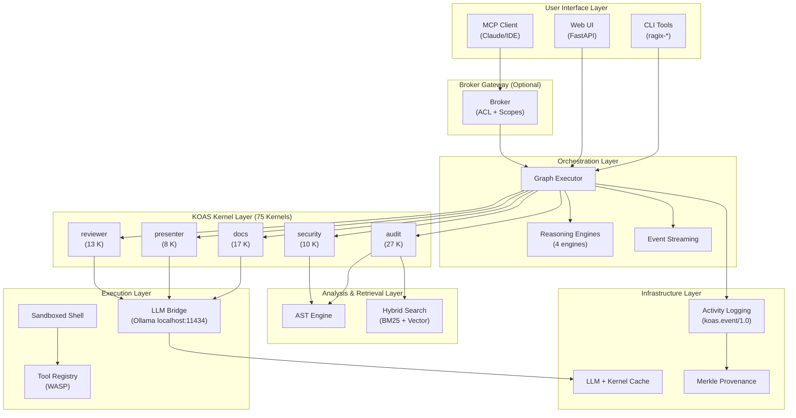
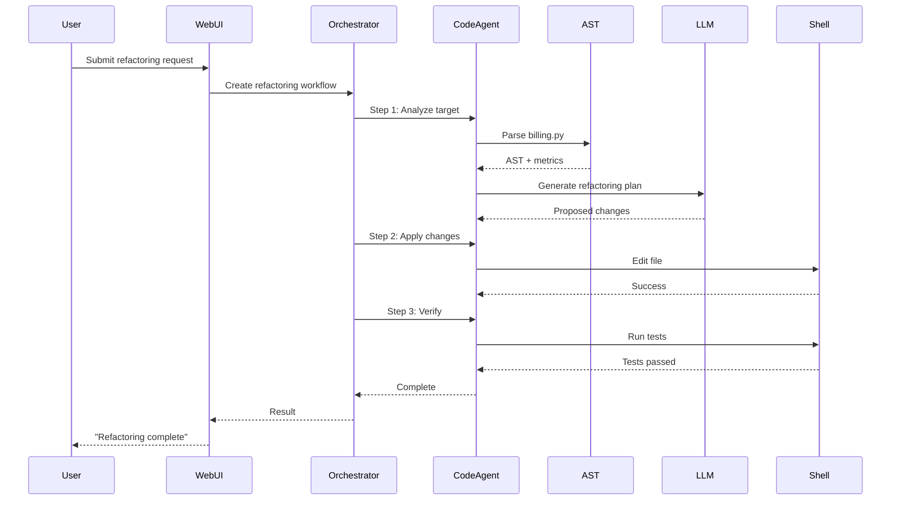

# RAGIX Architecture

**Version:** 0.66.0 | **Author:** Olivier Vitrac, PhD, HDR | olivier.vitrac@adservio.fr | Adservio
**Updated:** 2026-02-13

---

This document provides a comprehensive overview of the RAGIX architecture. The system is designed to be modular, sovereign, and extensible, following the Unix philosophy of small, single-purpose components that compose together effectively.

## Table of Contents

1. [Design Philosophy](#1-design-philosophy)
2. [Architectural Diagram](#2-architectural-diagram)
3. [Component Layers](#3-component-layers)
4. [KOAS Kernel Layer](#4-koas-kernel-layer)
5. [Sovereignty Architecture](#5-sovereignty-architecture)
6. [Multi-Model Reasoning](#6-multi-model-reasoning)
7. [Activity Logging and Audit Trail](#7-activity-logging-and-audit-trail)
8. [Broker Gateway](#8-broker-gateway)
9. [Data Flow Examples](#9-data-flow-examples)
10. [Security Model](#10-security-model)
11. [Extension Points](#11-extension-points)

---

## 1. Design Philosophy

RAGIX is built on five core principles:

### Sovereign by Design
All LLM inference runs via Ollama on `localhost:11434` — zero data exfiltration. Every kernel execution carries a sovereignty attestation (`sovereignty.local_only: true`). This ensures:
- **Data containment:** No document content, code, or intermediate results leave the sovereign perimeter
- **Compliance:** Suitable for regulated environments (GDPR, ANSSI, air-gapped)
- **Verifiable:** Sovereignty claims are machine-auditable, not policy-assumed

### Deterministic First
75 deterministic KOAS kernels handle computation; LLMs are restricted to planning and interpretation. No hallucinated metrics — every number is produced by a kernel, not an LLM:
- **Reproducibility:** Same input → same output (deterministic kernels)
- **Auditability:** Cryptographic hash chain across all executions
- **Separation:** Kernels compute, LLMs reason

### Local-First
The agent operates directly on the local filesystem within a secure sandbox, treating the file system as its primary source of truth. This enables:
- **Low latency:** No network round-trips for data access
- **Full context:** Complete access to project structure
- **Real execution:** Actual command execution, not simulation

### Modular
The system is composed of distinct layers and components, each with a specific responsibility:
- **Loose coupling:** Components can be replaced or upgraded independently
- **Testability:** Each layer can be tested in isolation
- **Extensibility:** New features can be added without modifying core code

### Unix-like
The system provides a suite of command-line tools that can be composed and used in scripts:
- **Composability:** Tools work together via standard interfaces
- **Scriptability:** Automation-friendly CLI design
- **Transparency:** Clear input/output semantics

---

## 2. Architectural Diagram

The following diagram illustrates the main component layers and their interactions:



---

## 3. Component Layers

### 3.1. User Interface Layer

This is the entry point for all user interactions.

#### CLI Tools (`ragix_unix/`)

A suite of command-line tools for power users and automation:

| Command | Purpose |
|---------|---------|
| `ragix-unix-agent` | Interactive chat agent |
| `ragix-ast` | Code analysis (12 subcommands) |
| `ragix-batch` | Workflow execution |
| `ragix-index` | Build search indexes |
| `ragix-web` | Launch web UI server |
| `ragix-vault` | Secret management |
| `ragix-wasp` | Plugin management |

#### Web UI (`ragix_web/`)

A rich, browser-based interface built on FastAPI:
- Real-time streaming chat
- AST visualizations (force-directed graph, DSM, radial)
- Session and memory management
- Workflow browser and executor

#### MCP Client (`MCP/`)

An adapter that exposes RAGIX tools to MCP-compatible clients:
- Claude Desktop integration
- VS Code extensions
- Custom IDE integrations

### 3.2. Orchestration Layer

Manages complex, multi-step tasks through workflow execution.

#### Graph Executor (`ragix_core/graph_executor.py`)

Executes workflow templates by traversing a dependency graph:
- Topological sorting of task dependencies
- Parallel execution of independent steps
- State management and checkpointing
- Error handling and recovery

#### Workflow Templates (`ragix_core/templates/`)

Pre-defined task graphs for common operations:

| Template | Description |
|----------|-------------|
| `bug_fix` | Locate → Diagnose → Fix → Test |
| `feature_addition` | Design → Implement → Test → Document |
| `code_review` | Quality → Security → Feedback |
| `refactoring` | Analyze → Plan → Refactor → Verify |
| `security_audit` | Static analysis → Dependency scan → Report |

#### Event Streaming

Real-time progress updates via:
- Server-Sent Events (SSE) for web UI
- Callback hooks for programmatic use
- Log streaming for CLI

### 3.3. Agent Layer

Specialized agents responsible for specific task categories.

#### Code Agent
- Code reading and modification
- Symbol search and navigation
- AST-powered refactoring
- Pattern recognition

#### Doc Agent
- Documentation generation
- API documentation extraction
- README and changelog updates
- Comment analysis

#### Test Agent
- Test execution and monitoring
- Coverage analysis
- Test generation suggestions
- Regression detection

#### Git Agent
- Version control operations
- Commit message generation
- Branch management
- Conflict resolution assistance

### 3.4. Analysis & Retrieval Layer

Understanding and navigating the codebase.

#### AST Engine (`ragix_core/ast_*.py`)

Multi-language Abstract Syntax Tree analysis:
- **Parsers:** Python (`ast` module), Java (`javalang`)
- **Dependency Graph:** Full project dependency tracking
- **Code Metrics:** Cyclomatic complexity, maintainability index, technical debt
- **Visualizations:** Force-directed graph, DSM heatmap, radial explorer

#### Hybrid Search (`ragix_core/hybrid_search.py`)

Combines multiple retrieval strategies:
- **BM25:** Keyword-based search with TF-IDF ranking
- **Vector Search:** Semantic similarity via embeddings
- **Fusion Strategies:** RRF, weighted combination

#### Knowledge Base (`ragix_core/knowledge_base.py`)

Pattern storage for improved reasoning:
- Solution patterns for common problems
- Project-specific conventions
- Historical context

### 3.5. Execution Layer

Where actions are actually performed.

#### LLM Bridge (`ragix_core/llm_backends.py`)

Interface to local Large Language Models:
- **Backend:** Ollama (default)
- **Models:** Mistral, Qwen, DeepSeek, Granite, etc.
- **Features:** Prompt formatting, history management, response parsing
- **Extensibility:** Swappable backend architecture

#### Sandboxed Shell (`ragix_core/tools_shell.py`)

Secure command execution environment:
- **Profiles:** `strict` (read-only), `dev` (default), `unsafe` (expert)
- **Denylist:** Blocks dangerous commands (`rm -rf /`, `dd`, etc.)
- **Logging:** Complete command audit trail
- **Containment:** Operations restricted to sandbox root

#### Tool Registry (`wasp_tools/`)

Deterministic, non-LLM tools:
- 18 WASP tools for validation, formatting, search
- JSON Schema validation
- Markdown processing
- File utilities

### 3.6. Infrastructure Layer

Cross-cutting services supporting the entire system.

#### Caching
- LLM response caching (memory/disk)
- Tool result caching
- AST parse tree caching

#### Monitoring
- Agent performance metrics
- Tool usage statistics
- System health indicators

#### Secure Logging
- SHA256 hash-chained command logs
- Immutable audit trail
- Log verification endpoint

---

## 4. KOAS Kernel Layer

As of v0.66, RAGIX includes **75 deterministic computation kernels** organized into 5 families via the KOAS (Kernel-Orchestrated Audit System) architecture. Kernels are pure computation units — no LLM logic inside.

### 4.1 The Kernel Guarantee

```
Deterministic kernels          LLMs (via Ollama)
─────────────────────          ──────────────────
• Produce metrics              • Plan next steps
• Parse AST                    • Interpret results
• Build dependency graphs      • Generate summaries
• Compute risk scores          • Refine drafts (Worker+Tutor)
• Assemble reports             • Classify tasks

→ No hallucinated numbers     → Constrained to reasoning only
```

### 4.2 Five Kernel Families

| Family | Kernels | Scope | LLM Usage |
|--------|---------|-------|-----------|
| **audit** | 27 | Java codebase analysis (AST, metrics, coupling, risk, reports) | None (pure deterministic) |
| **docs** | 17 | Document summarization (pyramidal + Leiden clustering) | Worker + Tutor pattern |
| **presenter** | 8 | MARP slide deck generation (3 compression modes) | Optional normalization only |
| **reviewer** | 13 | Traceable Markdown review (chunk edits, selective revert) | Worker + Tutor pattern |
| **security** | 10 | Vulnerability scanning, dependency analysis, secrets detection | None (pure deterministic) |

### 4.3 Three-Stage Pipeline

Every kernel family follows the same three-stage pattern:

```
Stage 1: Collection     Stage 2: Analysis       Stage 3: Reporting
─────────────────────   ──────────────────────   ──────────────────────
• Parse, extract        • Cross-reference        • Generate sections
• Inventory             • Score, classify        • Assemble report
• Build indexes         • Detect patterns        • Apply output level
```

Stages execute in dependency order. Independent kernels within a stage run in parallel.

See [KOAS.md](KOAS.md) for the full architecture and [ragix_kernels/README.md](../ragix_kernels/README.md) for the 75-kernel catalog.

---

## 5. Sovereignty Architecture

### 5.1 Data Containment

All LLM inference is routed through Ollama on `localhost:11434`. No document content, code, or intermediate results cross the network boundary.

```
┌─────────────────────────────────────────────────────────────┐
│                    SOVEREIGN PERIMETER                      │
│                                                             │
│  Documents ──▶ KOAS Kernels ──▶ Reports                     │
│                     │                                       │
│                     ▼                                       │
│              Ollama (localhost:11434)                       │
│              ┌──────────┬──────────┬──────────┐             │
│              │ Granite  │ Mistral  │ DeepSeek │             │
│              │ 3B/8B    │ 7B      │ R1 14B    │             │
│              │ (Worker) │ (Tutor)  │(Planner) │             │
│              └──────────┴──────────┴──────────┘             │
│                                                             │
│  Activity Log (.KOAS/activity/events.jsonl)                 │
│  → sovereignty.local_only: true per event                   │
│  → SHA256 hash chain for tamper evidence                    │
│                                                             │
│  ═══════════════ NETWORK BOUNDARY ══════════════════        │
│  ❌ No outbound to api.openai.com / api.anthropic.com       │
└─────────────────────────────────────────────────────────────┘
```

### 5.2 Sovereignty Attestation

Every kernel execution event records:
- `sovereignty.local_only: true` — machine-verifiable, not policy-assumed
- `sovereignty.hostname` — execution host
- `sovereignty.llm_endpoint` — confirmed `localhost:11434`

### 5.3 Output Sanitization

Four isolation levels prevent internal provenance from leaking:

| Level | Audience | Content |
|-------|----------|---------|
| `INTERNAL` | Developer/operator | Full traces, Merkle roots, call hashes |
| `EXTERNAL` | Client delivery | Clean report, paths redacted, IDs anonymized |
| `ORCHESTRATOR` | External LLM (Claude/GPT-4) | Metrics only, no document content |
| `COMPLIANCE` | Auditor/regulator | Hash chain + attestations, no content |

See [SOVEREIGN_LLM_OPERATIONS.md](SOVEREIGN_LLM_OPERATIONS.md) for the complete sovereignty framework.

---

## 6. Multi-Model Reasoning

RAGIX supports tiered model assignment, where different roles use models optimized for their purpose.

### 6.1 Planner-Worker-Verifier

Used in `ragix_web` and `ragix_unix` agent sessions:

| Role | Default Model | Purpose |
|------|---------------|---------|
| **Planner** | Mistral 7B / DeepSeek-R1 14B | Task classification, plan generation |
| **Worker** | Granite 3B-8B | Step execution, fast inference |
| **Verifier** | Granite 3B | Output validation, deterministic checks |

Configurable per session via `planner_model`, `worker_model`, `verifier_model` parameters.

### 6.2 Worker + Tutor (KOAS Docs/Reviewer)

Used in the `docs` and `reviewer` kernel families:

| Role | Model | Purpose |
|------|-------|---------|
| **Worker** | Granite 3B-8B | Generate initial summary / edit plan |
| **Tutor** | Mistral 7B | Refine, critique, and improve Worker output |

The Worker produces a fast first draft; the Tutor applies domain knowledge to refine it. This dual-LLM pattern compensates for smaller model limitations without cloud dependencies.

### 6.3 Four Reasoning Engines

| Engine | Architecture | Best For | Location |
|--------|-------------|----------|----------|
| **ReasoningLoop** (v1) | Iterative plan-execute | Production agent sessions | `ragix_core/reasoning.py` |
| **ReasoningGraph** (v30) | Graph state machine | Structured workflows with reflection | `ragix_core/reasoning_v30/` |
| **ContractiveReasoner** | Tree-based decomposition | Deep exploration, uncertainty | `ragix_core/reasoning_slim/` |
| **Interpreter-Tutor** | Game-theoretic proof game | Hallucination suppression | `ragix_core/reasoning_tutor/` |

See [REASONING.md](REASONING.md) for the complete reasoning engines guide.

---

## 7. Activity Logging and Audit Trail

Every kernel execution, LLM call, and orchestration event is recorded in an append-only JSONL stream at `.KOAS/activity/events.jsonl`.

### 7.1 Event Schema (`koas.event/1.0`)

Each event captures: who (actor), what (kernel/scope), when (timestamp), result (success/failure/metrics), and sovereignty attestation.

### 7.2 Hash Chain

The orchestrator maintains a SHA256 chain across executions. Each entry's hash incorporates the previous, creating tamper-evident provenance. The Merkle module computes `inputs_merkle_root` for document-level provenance.

### 7.3 Actor Model

| Actor Type | Auth | Scope |
|------------|------|-------|
| `SYSTEM` | None (internal) | All scopes |
| `OPERATOR` | API key | Configurable via ACL |
| `EXTERNAL_ORCHESTRATOR` | API key + scope restriction | `docs.trigger`, `docs.status`, `docs.export_external` |
| `AUDITOR` | API key | Read-only activity stream |

See [KOAS_ACTIVITY.md](KOAS_ACTIVITY.md) for the full event schema and querying reference.

---

## 8. Broker Gateway

For production deployments, RAGIX supports a **Core-Shell (Onion) architecture** where an external orchestrator (Claude, GPT-4, or a human operator) triggers and monitors KOAS pipelines through an authenticated gateway — without ever seeing document content.

### 8.1 Core-Shell Model

```
┌─────────────────────────────────────────────────────────┐
│                EXTERNAL ORCHESTRATOR                    │
│            (Claude / GPT-4 / Operator)                  │
│                                                         │
│   Can: trigger jobs, poll status, download sanitized    │
│   Cannot: see content, read internal traces, bypass ACL │
└────────────────────────┬────────────────────────────────┘
                         │ HTTP + API key
                         ▼
┌─────────────────────────────────────────────────────────┐
│                    BROKER GATEWAY                       │
│           (FastAPI, ACL enforcement, rate limit)        │
└────────────────────────┬────────────────────────────────┘
                         │
┌─────────────────────────────────────────────────────────┐
│                 SOVEREIGN CORE                          │
│          (KOAS kernels + Ollama + documents)            │
│                                                         │
│   Documents never cross this boundary.                  │
│   External view = metrics + sanitized artifacts only.   │
└─────────────────────────────────────────────────────────┘
```

### 8.2 ACL and Scopes

Access is controlled by scope-based ACL (`koas.acl/1.0`):

| Scope | Description |
|-------|-------------|
| `docs.trigger` | Start a KOAS pipeline run |
| `docs.status` | Read job status and aggregate metrics |
| `docs.export_external` | Download sanitized (external-safe) artifacts |
| `docs.export_internal` | Download full artifacts with internal traces |
| `activity.read` | Read the activity event stream |

External orchestrators are restricted to `docs.trigger` + `docs.status` + `docs.export_external` — they can drive the analysis without accessing raw content.

See the [KOAS Docs Audit demo](../demos/koas_docs_audit/README.md) for a working example with relaxed and restricted modes.

---

## 9. Data Flow Examples

### Example 1: Refactoring Task

**User Request:** *"Refactor the `calculate_totals` function in `billing.py` to be more efficient."*



### Example 2: Bug Fix Workflow

1. **Receive:** User describes the bug
2. **Search:** Hybrid search locates relevant files
3. **Analyze:** AST engine identifies affected symbols
4. **Diagnose:** LLM analyzes root cause
5. **Fix:** Code agent applies targeted changes
6. **Test:** Test agent runs regression suite
7. **Report:** Results returned to user

---

## 10. Security Model

### Sandbox Architecture

```
┌─────────────────────────────────────────┐
│           User's System                 │
│  ┌───────────────────────────────────┐  │
│  │        RAGIX Process              │  │
│  │  ┌─────────────────────────────┐  │  │
│  │  │      Sandbox Root           │  │  │
│  │  │   /path/to/project          │  │  │
│  │  │                             │  │  │
│  │  │  ✅ Read/Write allowed      │  │  │
│  │  │  ✅ Command execution       │  │  │
│  │  │  ✅ File creation           │  │  │
│  │  └─────────────────────────────┘  │  │
│  │                                   │  │
│  │  ❌ Outside sandbox: blocked      │  │
│  │  ❌ Dangerous commands: blocked   │  │
│  └───────────────────────────────────┘  │
└─────────────────────────────────────────┘
```

### Safety Profiles

| Profile | Description | Use Case |
|---------|-------------|----------|
| `strict` | Read-only, no modifications | CI/CD, audits |
| `dev` | Normal editing, protected | Daily development |
| `unsafe` | Minimal restrictions | Expert workbench |

### Command Denylist

Always blocked regardless of profile:
- `rm -rf /`, `rm -rf /*`
- `dd`, `mkfs`, `fdisk`
- `shutdown`, `reboot`, `halt`
- `:(){ :|:& };:` (fork bomb)

### Output Sanitization

The output sanitizer (`ragix_kernels/output_sanitizer.py`) enforces 4 isolation levels at build time:
- **INTERNAL:** Full traces (call_hash, merkle_root, paths, model IDs)
- **EXTERNAL:** Clean content (metadata stripped, paths redacted, IDs anonymized)
- **ORCHESTRATOR:** Metrics only (kernel names, timing, counts — no text content)
- **COMPLIANCE:** Hash chain + attestations (no content, provenance only)

Build-time validation fails if denylist keys (`call_hash`, `inputs_merkle_root`, `run_id`, `endpoint`, `model`) appear in external output.

### Merkle Provenance

The Merkle module (`ragix_kernels/merkle.py`) computes:
- `call_hash` — SHA256 of canonical LLM request (sorted keys, normalized whitespace)
- `inputs_merkle_root` — Merkle root of ordered child hashes for pyramidal synthesis
- Chain hash linking sequential kernel executions

### Audit Trail

Every action is logged with:
- Timestamp and kernel name
- Actor identity and auth method
- Input/output SHA256 hashes
- Chain hash linking to previous entry
- Sovereignty attestation (`local_only: true`)
- Duration and success/failure metrics

See §7 (Activity Logging) and [KOAS_ACTIVITY.md](KOAS_ACTIVITY.md) for the full event schema.

---

## 11. Extension Points

### Adding New Agents

```python
from ragix_core.agents import BaseAgent

class CustomAgent(BaseAgent):
    """Custom agent for specialized tasks."""

    def __init__(self, llm_bridge, sandbox):
        super().__init__(llm_bridge, sandbox)
        self.capabilities = ["custom_capability"]

    async def execute(self, task: Task) -> Result:
        # Implementation
        pass
```

### Adding New Tools

```python
from ragix_core.tools import register_tool

@register_tool("my_tool")
def my_custom_tool(input_data: dict) -> dict:
    """Custom deterministic tool."""
    return {"result": process(input_data)}
```

### Adding New Workflow Templates

```yaml
# templates/my_workflow.yaml
name: my_custom_workflow
description: Custom workflow for specific task
steps:
  - id: step1
    agent: code_agent
    prompt: "First step instructions"
  - id: step2
    agent: test_agent
    depends_on: [step1]
    prompt: "Second step instructions"
```

### Adding New Language Support

1. Implement parser in `ragix_core/ast_<lang>.py`
2. Register in `ragix_core/ast_base.py`
3. Add tests in `tests/test_ast_<lang>.py`

---

---

## Related Documentation

| Document | Description |
|----------|-------------|
| [KOAS.md](KOAS.md) | KOAS architecture and 5 kernel families |
| [KOAS_ACTIVITY.md](KOAS_ACTIVITY.md) | Activity logging event schema |
| [SOVEREIGN_LLM_OPERATIONS.md](SOVEREIGN_LLM_OPERATIONS.md) | Sovereignty framework |
| [REASONING.md](REASONING.md) | Reasoning engines guide |
| [MCP.md](MCP.md) | Model Context Protocol |
| [CLI_GUIDE.md](CLI_GUIDE.md) | Command-line usage |
| [API_REFERENCE.md](API_REFERENCE.md) | API documentation |

---

**Document Version:** 2.0.0
**Last Updated:** 2026-02-13
**Author:** Olivier Vitrac, PhD, HDR | olivier.vitrac@adservio.fr | Adservio
