# RAGIX Architecture

**Version:** 0.20.0 | **Author:** Olivier Vitrac, PhD, HDR | olivier.vitrac@adservio.fr | Adservio
**Updated:** 2025-11-28

---

This document provides a comprehensive overview of the RAGIX architecture. The system is designed to be modular, sovereign, and extensible, following the Unix philosophy of small, single-purpose components that compose together effectively.

## Table of Contents

1. [Design Philosophy](#1-design-philosophy)
2. [Architectural Diagram](#2-architectural-diagram)
3. [Component Layers](#3-component-layers)
4. [Data Flow Examples](#4-data-flow-examples)
5. [Security Model](#5-security-model)
6. [Extension Points](#6-extension-points)

---

## 1. Design Philosophy

RAGIX is built on four core principles:

### Sovereign
All processing—especially LLM reasoning and code analysis—happens 100% on the local machine. No data is sent to third-party cloud services by default. This ensures:
- **Data privacy:** Your code never leaves your infrastructure
- **Compliance:** Suitable for regulated environments
- **Reliability:** No external service dependencies

### Local-First
The agent operates directly on the local filesystem within a secure sandbox, treating the file system as its primary source of truth. This enables:
- **Low latency:** No network round-trips for data access
- **Full context:** Complete access to project structure
- **Real execution:** Actual command execution, not simulation

### Modular
The system is composed of distinct layers and components, each with a specific responsibility:
- **Loose coupling:** Components can be replaced or upgraded independently
- **Testability:** Each layer can be tested in isolation
- **Extensibility:** New features can be added without modifying core code

### Unix-like
The system provides a suite of command-line tools that can be composed and used in scripts:
- **Composability:** Tools work together via standard interfaces
- **Scriptability:** Automation-friendly CLI design
- **Transparency:** Clear input/output semantics

---

## 2. Architectural Diagram

The following diagram illustrates the main component layers and their interactions:

```mermaid
flowchart TB
    subgraph "User Interface Layer"
        direction LR
        CLI["🖥️ CLI Tools<br/>(ragix-*)"]
        WEB["🌐 Web UI<br/>(FastAPI)"]
        MCP["🔌 MCP Client<br/>(Claude/IDE)"]
    end

    subgraph "Orchestration Layer"
        ORCH["🧠 Graph Executor"]
        TEMPLATES["📋 Workflow Templates"]
        STREAM["📡 Event Streaming"]
    end

    subgraph "Agent Layer"
        direction LR
        CODE["💻 Code Agent"]
        DOC["📝 Doc Agent"]
        TEST["🧪 Test Agent"]
        GIT["🌿 Git Agent"]
    end

    subgraph "Analysis & Retrieval Layer"
        AST["🌳 AST Engine"]
        HYBRID["🔍 Hybrid Search"]
        KB["📚 Knowledge Base"]
    end

    subgraph "Execution Layer"
        LLM["🤖 LLM Bridge<br/>(Ollama)"]
        SHELL["🐚 Sandboxed Shell"]
        TOOLS["🛠️ Tool Registry<br/>(WASP)"]
    end

    subgraph "Infrastructure Layer"
        direction LR
        CACHE["💾 Caching"]
        MONITOR["📈 Monitoring"]
        LOGS["🛡️ Secure Logging"]
    end

    CLI --> ORCH
    WEB --> ORCH
    MCP --> ORCH

    ORCH --> TEMPLATES
    ORCH --> STREAM
    ORCH --> CODE
    ORCH --> DOC
    ORCH --> TEST
    ORCH --> GIT

    CODE --> AST
    CODE --> HYBRID
    CODE --> KB
    CODE --> LLM
    CODE --> SHELL

    AST --> DEPS[Dependency Graph]
    AST --> METRICS[Code Metrics]

    HYBRID --> BM25[BM25 Index]
    HYBRID --> VEC[Vector Index]

    SHELL --> TOOLS
    LLM --> CACHE
    SHELL --> LOGS
    ORCH --> MONITOR
```



---

## 3. Component Layers

### 3.1. User Interface Layer

This is the entry point for all user interactions.

#### CLI Tools (`ragix_unix/`)

A suite of command-line tools for power users and automation:

| Command | Purpose |
|---------|---------|
| `ragix-unix-agent` | Interactive chat agent |
| `ragix-ast` | Code analysis (12 subcommands) |
| `ragix-batch` | Workflow execution |
| `ragix-index` | Build search indexes |
| `ragix-web` | Launch web UI server |
| `ragix-vault` | Secret management |
| `ragix-wasp` | Plugin management |

#### Web UI (`ragix_web/`)

A rich, browser-based interface built on FastAPI:
- Real-time streaming chat
- AST visualizations (force-directed graph, DSM, radial)
- Session and memory management
- Workflow browser and executor

#### MCP Client (`MCP/`)

An adapter that exposes RAGIX tools to MCP-compatible clients:
- Claude Desktop integration
- VS Code extensions
- Custom IDE integrations

### 3.2. Orchestration Layer

Manages complex, multi-step tasks through workflow execution.

#### Graph Executor (`ragix_core/graph_executor.py`)

Executes workflow templates by traversing a dependency graph:
- Topological sorting of task dependencies
- Parallel execution of independent steps
- State management and checkpointing
- Error handling and recovery

#### Workflow Templates (`ragix_core/templates/`)

Pre-defined task graphs for common operations:

| Template | Description |
|----------|-------------|
| `bug_fix` | Locate → Diagnose → Fix → Test |
| `feature_addition` | Design → Implement → Test → Document |
| `code_review` | Quality → Security → Feedback |
| `refactoring` | Analyze → Plan → Refactor → Verify |
| `security_audit` | Static analysis → Dependency scan → Report |

#### Event Streaming

Real-time progress updates via:
- Server-Sent Events (SSE) for web UI
- Callback hooks for programmatic use
- Log streaming for CLI

### 3.3. Agent Layer

Specialized agents responsible for specific task categories.

#### Code Agent
- Code reading and modification
- Symbol search and navigation
- AST-powered refactoring
- Pattern recognition

#### Doc Agent
- Documentation generation
- API documentation extraction
- README and changelog updates
- Comment analysis

#### Test Agent
- Test execution and monitoring
- Coverage analysis
- Test generation suggestions
- Regression detection

#### Git Agent
- Version control operations
- Commit message generation
- Branch management
- Conflict resolution assistance

### 3.4. Analysis & Retrieval Layer

Understanding and navigating the codebase.

#### AST Engine (`ragix_core/ast_*.py`)

Multi-language Abstract Syntax Tree analysis:
- **Parsers:** Python (`ast` module), Java (`javalang`)
- **Dependency Graph:** Full project dependency tracking
- **Code Metrics:** Cyclomatic complexity, maintainability index, technical debt
- **Visualizations:** Force-directed graph, DSM heatmap, radial explorer

#### Hybrid Search (`ragix_core/hybrid_search.py`)

Combines multiple retrieval strategies:
- **BM25:** Keyword-based search with TF-IDF ranking
- **Vector Search:** Semantic similarity via embeddings
- **Fusion Strategies:** RRF, weighted combination

#### Knowledge Base (`ragix_core/knowledge_base.py`)

Pattern storage for improved reasoning:
- Solution patterns for common problems
- Project-specific conventions
- Historical context

### 3.5. Execution Layer

Where actions are actually performed.

#### LLM Bridge (`ragix_core/llm_backends.py`)

Interface to local Large Language Models:
- **Backend:** Ollama (default)
- **Models:** Mistral, Qwen, DeepSeek, Granite, etc.
- **Features:** Prompt formatting, history management, response parsing
- **Extensibility:** Swappable backend architecture

#### Sandboxed Shell (`ragix_core/tools_shell.py`)

Secure command execution environment:
- **Profiles:** `strict` (read-only), `dev` (default), `unsafe` (expert)
- **Denylist:** Blocks dangerous commands (`rm -rf /`, `dd`, etc.)
- **Logging:** Complete command audit trail
- **Containment:** Operations restricted to sandbox root

#### Tool Registry (`wasp_tools/`)

Deterministic, non-LLM tools:
- 18 WASP tools for validation, formatting, search
- JSON Schema validation
- Markdown processing
- File utilities

### 3.6. Infrastructure Layer

Cross-cutting services supporting the entire system.

#### Caching
- LLM response caching (memory/disk)
- Tool result caching
- AST parse tree caching

#### Monitoring
- Agent performance metrics
- Tool usage statistics
- System health indicators

#### Secure Logging
- SHA256 hash-chained command logs
- Immutable audit trail
- Log verification endpoint

---

## 4. Data Flow Examples

### Example 1: Refactoring Task

**User Request:** *"Refactor the `calculate_totals` function in `billing.py` to be more efficient."*


### Example 2: Bug Fix Workflow

1. **Receive:** User describes the bug
2. **Search:** Hybrid search locates relevant files
3. **Analyze:** AST engine identifies affected symbols
4. **Diagnose:** LLM analyzes root cause
5. **Fix:** Code agent applies targeted changes
6. **Test:** Test agent runs regression suite
7. **Report:** Results returned to user

---

## 5. Security Model

### Sandbox Architecture

```
┌─────────────────────────────────────────┐
│           User's System                 │
│  ┌───────────────────────────────────┐  │
│  │        RAGIX Process              │  │
│  │  ┌─────────────────────────────┐  │  │
│  │  │      Sandbox Root           │  │  │
│  │  │   /path/to/project          │  │  │
│  │  │                             │  │  │
│  │  │  ✅ Read/Write allowed      │  │  │
│  │  │  ✅ Command execution       │  │  │
│  │  │  ✅ File creation           │  │  │
│  │  └─────────────────────────────┘  │  │
│  │                                   │  │
│  │  ❌ Outside sandbox: blocked      │  │
│  │  ❌ Dangerous commands: blocked   │  │
│  └───────────────────────────────────┘  │
└─────────────────────────────────────────┘
```

### Safety Profiles

| Profile | Description | Use Case |
|---------|-------------|----------|
| `strict` | Read-only, no modifications | CI/CD, audits |
| `dev` | Normal editing, protected | Daily development |
| `unsafe` | Minimal restrictions | Expert workbench |

### Command Denylist

Always blocked regardless of profile:
- `rm -rf /`, `rm -rf /*`
- `dd`, `mkfs`, `fdisk`
- `shutdown`, `reboot`, `halt`
- `:(){ :|:& };:` (fork bomb)

### Audit Trail

Every action is logged with:
- Timestamp
- Command/action
- Working directory
- Return code
- SHA256 hash chain

---

## 6. Extension Points

### Adding New Agents

```python
from ragix_core.agents import BaseAgent

class CustomAgent(BaseAgent):
    """Custom agent for specialized tasks."""

    def __init__(self, llm_bridge, sandbox):
        super().__init__(llm_bridge, sandbox)
        self.capabilities = ["custom_capability"]

    async def execute(self, task: Task) -> Result:
        # Implementation
        pass
```

### Adding New Tools

```python
from ragix_core.tools import register_tool

@register_tool("my_tool")
def my_custom_tool(input_data: dict) -> dict:
    """Custom deterministic tool."""
    return {"result": process(input_data)}
```

### Adding New Workflow Templates

```yaml
# templates/my_workflow.yaml
name: my_custom_workflow
description: Custom workflow for specific task
steps:
  - id: step1
    agent: code_agent
    prompt: "First step instructions"
  - id: step2
    agent: test_agent
    depends_on: [step1]
    prompt: "Second step instructions"
```

### Adding New Language Support

1. Implement parser in `ragix_core/ast_<lang>.py`
2. Register in `ragix_core/ast_base.py`
3. Add tests in `tests/test_ast_<lang>.py`

---

*For more information, see the [CLI Guide](CLI_GUIDE.md) or the [API Reference](API_REFERENCE.md).*
