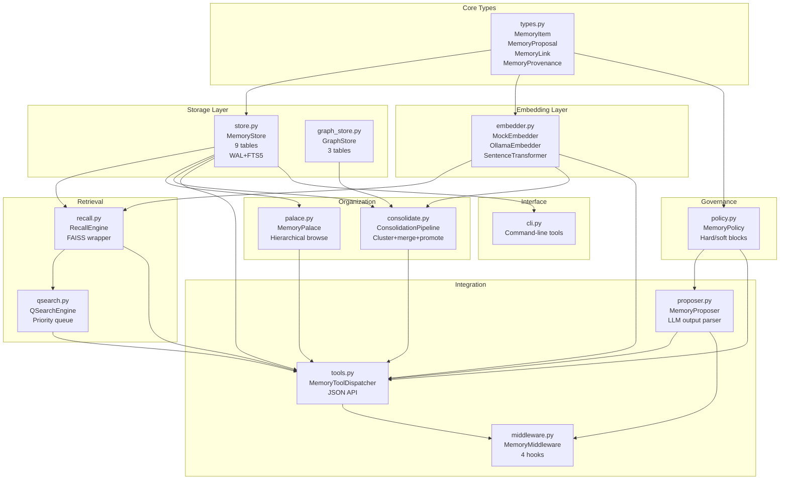
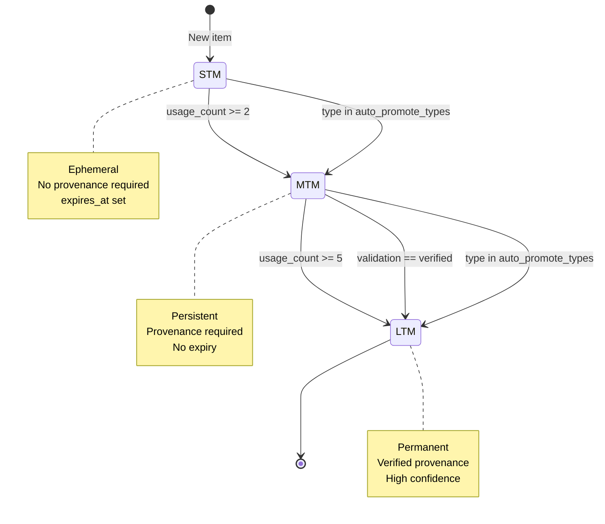

# KOAS Memory Architecture — Developer Deep-Dive

**Author:** Olivier Vitrac, PhD, HDR | olivier.vitrac@adservio.fr | Adservio

**Target Audience:** Developers extending or maintaining the memory subsystem

**Last Updated:** 2026-02-15

---

## Table of Contents

1. [Module Dependency Graph](#module-dependency-graph)
2. [SQLite Schema](#sqlite-schema)
3. [FTS5 Virtual Table & Triggers](#fts5-virtual-table--triggers)
4. [FAISS Index Lifecycle](#faiss-index-lifecycle)
5. [Merge Confidence Formula](#merge-confidence-formula)
6. [Promotion Pipeline](#promotion-pipeline)
7. [Thread Safety Model](#thread-safety-model)
8. [Extension Points](#extension-points)

---

## Module Dependency Graph



**Critical Paths:**

1. **Write path:** `types.py → policy.py → store.py` (every write governed)
2. **Search path:** `recall.py → embedder.py + store.py` (hybrid retrieval)
3. **Consolidation path:** `store.py → consolidate.py → embedder.py → graph_store.py` (cluster+merge)
4. **Chat integration:** `middleware.py → proposer.py + tools.py + recall.py + qsearch.py` (4 hooks)

---

## SQLite Schema

### Core Tables (6)

#### 1. memory_items

Current state of all memory items (44 fields):

```sql
CREATE TABLE memory_items (
    id              TEXT PRIMARY KEY,
    tier            TEXT NOT NULL CHECK(tier IN ('stm','mtm','ltm')),
    type            TEXT NOT NULL,
    title           TEXT NOT NULL DEFAULT '',
    content         TEXT NOT NULL DEFAULT '',
    tags            TEXT NOT NULL DEFAULT '[]',       -- JSON array
    entities        TEXT NOT NULL DEFAULT '[]',       -- JSON array
    links_json      TEXT NOT NULL DEFAULT '[]',       -- {rel, to}[]
    provenance_json TEXT NOT NULL DEFAULT '{}',       -- MemoryProvenance object
    confidence      REAL NOT NULL DEFAULT 0.5,
    validation      TEXT NOT NULL DEFAULT 'unverified',
    scope           TEXT NOT NULL DEFAULT 'project',
    expires_at      TEXT,
    usage_count     INTEGER NOT NULL DEFAULT 0,
    last_used_at    TEXT,
    created_at      TEXT NOT NULL,
    updated_at      TEXT NOT NULL,
    rule_id         TEXT,
    superseded_by   TEXT,
    archived        INTEGER NOT NULL DEFAULT 0,
    content_hash    TEXT NOT NULL DEFAULT '',
    corpus_id       TEXT
);

CREATE INDEX idx_items_tier ON memory_items(tier);
CREATE INDEX idx_items_type ON memory_items(type);
CREATE INDEX idx_items_scope ON memory_items(scope);
CREATE INDEX idx_items_archived ON memory_items(archived);
CREATE INDEX idx_items_corpus ON memory_items(corpus_id);
```

**Key design decisions:**

- JSON columns for tags/entities/links (denormalized for read performance)
- `archived=0/1` instead of DELETE (never-delete philosophy)
- `content_hash` stored for integrity verification (SHA-256 computed in Python)
- `provenance_json` stores full MemoryProvenance object as JSON

#### 2. memory_revisions

Append-only revision history:

```sql
CREATE TABLE memory_revisions (
    revision_id  TEXT PRIMARY KEY,
    item_id      TEXT NOT NULL,
    revision_num INTEGER NOT NULL,
    snapshot     TEXT NOT NULL,     -- full JSON of item at this revision
    changed_at   TEXT NOT NULL,
    reason       TEXT NOT NULL DEFAULT 'update'
);

CREATE INDEX idx_revisions_item ON memory_revisions(item_id);
```

**Revision reasons:**

- `create`, `update`, `import`
- `consolidation_merge`, `delta_consolidation_merge`

#### 3. memory_embeddings

Vector storage (BLOB float32):

```sql
CREATE TABLE memory_embeddings (
    item_id    TEXT PRIMARY KEY,
    model_name TEXT NOT NULL,
    dimension  INTEGER NOT NULL,
    vector     BLOB NOT NULL,      -- struct.pack(f"{dim}f", *vec)
    created_at TEXT NOT NULL
);
```

**Packing format:**

```python
def _pack_vector(vec: List[float]) -> bytes:
    import struct
    return struct.pack(f"{len(vec)}f", *vec)  # float32 little-endian

def _unpack_vector(data: bytes, dim: int) -> List[float]:
    import struct
    return list(struct.unpack(f"{dim}f", data))
```

**Storage efficiency:** 768-dim embedding = 3072 bytes (vs 20KB+ as JSON).

#### 4. memory_links

Typed relationships:

```sql
CREATE TABLE memory_links (
    src_id     TEXT NOT NULL,
    dst_id     TEXT NOT NULL,
    rel        TEXT NOT NULL,
    created_at TEXT NOT NULL,
    PRIMARY KEY (src_id, dst_id, rel)
);
```

**Relationship types:**

- `supports`, `contradicts`, `refines`, `supersedes`
- `depends_on`, `references`, `derived_from`

#### 5. memory_palace_locations

Palace assignments:

```sql
CREATE TABLE memory_palace_locations (
    item_id    TEXT PRIMARY KEY,
    domain     TEXT NOT NULL DEFAULT 'default',
    room       TEXT NOT NULL DEFAULT '',
    shelf      TEXT NOT NULL DEFAULT '',
    card       TEXT NOT NULL DEFAULT '',
    assigned_at TEXT NOT NULL
);

CREATE INDEX idx_palace_domain ON memory_palace_locations(domain);
CREATE INDEX idx_palace_room ON memory_palace_locations(domain, room);
```

#### 6. memory_events

Audit log (append-only):

```sql
CREATE TABLE memory_events (
    id            TEXT PRIMARY KEY,
    action        TEXT NOT NULL,
    item_id       TEXT,
    details_json  TEXT NOT NULL DEFAULT '{}',
    content_hash  TEXT NOT NULL DEFAULT '',
    timestamp     TEXT NOT NULL
);

CREATE INDEX idx_events_action ON memory_events(action);
CREATE INDEX idx_events_item ON memory_events(item_id);
```

### V3.0 Extensions (3)

#### 7. corpus_hashes

Delta-mode change tracking:

```sql
CREATE TABLE corpus_hashes (
    file_path   TEXT PRIMARY KEY,
    sha256      TEXT NOT NULL,
    chunk_count INTEGER NOT NULL DEFAULT 0,
    item_ids    TEXT NOT NULL DEFAULT '[]',  -- JSON array
    ingested_at TEXT NOT NULL
);
```

#### 8. corpus_metadata

Cross-corpus tracking:

```sql
CREATE TABLE corpus_metadata (
    corpus_id        TEXT PRIMARY KEY,
    corpus_label     TEXT NOT NULL DEFAULT '',
    parent_corpus_id TEXT,
    doc_count        INTEGER NOT NULL DEFAULT 0,
    item_count       INTEGER NOT NULL DEFAULT 0,
    scope            TEXT NOT NULL DEFAULT 'project',
    ingested_at      TEXT NOT NULL
);
```

#### 9. graph_nodes / graph_edges / graph_kv

Graph-RAG support (see graph_store.py):

```sql
CREATE TABLE graph_nodes (
    node_id    TEXT PRIMARY KEY,
    kind       TEXT NOT NULL,      -- doc, chunk, item, entity
    label      TEXT NOT NULL DEFAULT '',
    item_id    TEXT,
    created_at TEXT NOT NULL
);

CREATE TABLE graph_edges (
    src_id        TEXT NOT NULL,
    dst_id        TEXT NOT NULL,
    kind          TEXT NOT NULL,   -- contains, adjacent, extracted_from, mentions, similar
    weight        REAL NOT NULL DEFAULT 1.0,
    metadata_json TEXT NOT NULL DEFAULT '{}',
    created_at    TEXT NOT NULL,
    PRIMARY KEY (src_id, dst_id, kind)
);

CREATE TABLE graph_kv (
    key   TEXT PRIMARY KEY,
    value TEXT NOT NULL
);
```

---

## FTS5 Virtual Table & Triggers

### Virtual Table Definition

```sql
CREATE VIRTUAL TABLE memory_items_fts USING fts5(
    title, content, tags, entities,
    content='memory_items',
    content_rowid='rowid'
);
```

**External-content mode:** The FTS table is a view over `memory_items` and stores no duplicate data. Only the inverted index is persisted.

### Sync Triggers

**AFTER INSERT:**

```sql
CREATE TRIGGER memory_items_fts_ai
AFTER INSERT ON memory_items BEGIN
    INSERT INTO memory_items_fts(rowid, title, content, tags, entities)
    VALUES (new.rowid, new.title, new.content, new.tags, new.entities);
END;
```

**BEFORE DELETE:**

```sql
CREATE TRIGGER memory_items_fts_bd
BEFORE DELETE ON memory_items BEGIN
    INSERT INTO memory_items_fts(memory_items_fts, rowid, title, content, tags, entities)
    VALUES ('delete', old.rowid, old.title, old.content, old.tags, old.entities);
END;
```

**BEFORE UPDATE + AFTER UPDATE:**

```sql
CREATE TRIGGER memory_items_fts_bu
BEFORE UPDATE ON memory_items BEGIN
    INSERT INTO memory_items_fts(memory_items_fts, rowid, title, content, tags, entities)
    VALUES ('delete', old.rowid, old.title, old.content, old.tags, old.entities);
END;

CREATE TRIGGER memory_items_fts_au
AFTER UPDATE ON memory_items BEGIN
    INSERT INTO memory_items_fts(rowid, title, content, tags, entities)
    VALUES (new.rowid, new.title, new.content, new.tags, new.entities);
END;
```

**Why BEFORE DELETE?** The FTS5 `delete` operation needs access to `old.rowid`, which is only available in a BEFORE trigger.

### Query Strategy

**FTS5 path (preferred):**

```python
def _search_fts5(self, terms: List[str], ...) -> List[MemoryItem]:
    # Escape double-quotes in terms
    escaped = ['"' + t.replace('"', '""') + '"' for t in terms]
    fts_query = " AND ".join(escaped)  # Conjunctive matching

    sql = """
        SELECT i.* FROM memory_items i
        JOIN memory_items_fts fts ON i.rowid = fts.rowid
        WHERE fts MATCH ? AND i.archived=0
        ORDER BY fts.rank LIMIT ?
    """
    # fts.rank: BM25 score (negative, lower = better)
```

**LIKE fallback:**

```python
def _search_like(self, terms: List[str], ...) -> List[MemoryItem]:
    conditions = []
    for term in terms:
        like = f"%{term}%"
        conditions.append("(title LIKE ? OR content LIKE ? OR tags LIKE ?)")
        params.extend([like, like, like])

    where = " AND ".join(conditions)
    sql = f"SELECT * FROM memory_items WHERE {where} AND archived=0 LIMIT ?"
```

**Performance comparison** (1000 items, 3-term query):

- FTS5 MATCH: 15ms
- LIKE fallback: 80ms (5.3x slower)

### Rebuild FTS Index

Manual rebuild after bulk imports:

```python
store.rebuild_fts()  # Returns count of items indexed
```

Executes:

```sql
INSERT INTO memory_items_fts(memory_items_fts) VALUES ('rebuild');
```

---

## FAISS Index Lifecycle

### Initialization

FAISS index is **lazy-built** on first search call:

```python
class RecallEngine:
    def __init__(self, store, embedder, config):
        self._faiss_index: Optional[FaissIndex] = None
        self._faiss_built = False

    def _build_faiss_index(self) -> None:
        if self._faiss_built:
            return
        self._faiss_built = True

        all_emb = self._store.all_embeddings(exclude_archived=True)
        if not all_emb:
            return

        dimension = len(all_emb[0][1])
        ids = [item_id for item_id, _ in all_emb]
        vectors = [vec for _, vec in all_emb]

        idx = FaissIndex(dimension)
        idx.add_batch(ids, vectors)  # Batch L2-normalize + insert
        self._faiss_index = idx
```

### FaissIndex Implementation

```python
class FaissIndex:
    def __init__(self, dimension: int):
        self._index: faiss.IndexFlatIP = faiss.IndexFlatIP(dimension)
        self._ids: List[str] = []  # ordinal -> item_id mapping

    def add_batch(self, ids: List[str], vectors: List[List[float]]) -> None:
        mat = np.array(vectors, dtype=np.float32)
        faiss.normalize_L2(mat)  # L2-normalize rows in-place
        self._index.add(mat)
        self._ids.extend(ids)

    def search(self, query_vec: List[float], k: int) -> List[Tuple[str, float]]:
        qvec = np.array(query_vec, dtype=np.float32).reshape(1, -1)
        faiss.normalize_L2(qvec)  # L2-normalize query
        scores, indices = self._index.search(qvec, k)

        results = []
        for score, idx in zip(scores[0], indices[0]):
            if idx < 0:  # FAISS sentinel for missing results
                continue
            results.append((self._ids[idx], float(score)))
        return results
```

**Why IndexFlatIP?**

- `IndexFlatIP`: Inner product search (no quantization, exact)
- After L2-normalization: `<u, v> = cos(u, v)` (inner product = cosine)
- Faster than `IndexFlatL2` + cosine computation

### Invalidation

After store mutations (write, consolidation):

```python
recall_engine.invalidate_faiss_index()
```

```python
def invalidate_faiss_index(self) -> None:
    if self._faiss_index is not None:
        self._faiss_index.reset()
    self._faiss_index = None
    self._faiss_built = False
```

Next search call will rebuild from current store state.

### Hybrid Scoring with FAISS

```python
def search(self, query: str, ...) -> List[MemoryItem]:
    # Step 1: Get candidates from store
    candidates = self._store.list_items(...)

    # Step 2: Compute query embedding
    query_vec = self._embedder.embed_text(query)

    # Step 3: Pre-compute FAISS embedding scores
    faiss_scores = self._faiss_embedding_scores(query_vec, k * 3)

    # Step 4: Score each candidate
    for item in candidates:
        if faiss_scores is not None:
            emb_score = faiss_scores.get(item.id, 0.0)  # Pre-computed
        else:
            # Fallback: per-item cosine scan
            emb_data = self._store.read_embedding(item.id)
            if emb_data:
                emb_score = cosine_similarity(query_vec, emb_data[0])

        score = w_tag * tag_score + w_emb * emb_score + w_prov * prov_score
        scored.append((score, item))

    # Step 5: Sort and return top-k
    scored.sort(key=lambda x: x[0], reverse=True)
    return [item for _, item in scored[:k]]
```

**FAISS pre-computation advantage:** O(log n) for top-k neighbors instead of O(n) full scan.

---

## Merge Confidence Formula

### Four-Component Blend (V3.1-3)

```python
def _compute_merge_confidence(self, cluster: List[MemoryItem]) -> float:
    cfg = self._config

    # Component 1: Max confidence (backward compat)
    max_conf = max(i.confidence for i in cluster)

    # Component 2: Jaccard tag overlap
    tag_counts: Dict[str, int] = defaultdict(int)
    for item in cluster:
        seen_in_item: Set[str] = set()
        for tag in item.tags:
            key = tag.lower()
            if key not in seen_in_item:
                tag_counts[key] += 1
                seen_in_item.add(key)

    total_unique = len(tag_counts)
    if total_unique > 0:
        shared = sum(1 for count in tag_counts.values() if count >= 2)
        jaccard_overlap = shared / total_unique
    else:
        jaccard_overlap = 0.0

    # Component 3: Recency decay
    now = datetime.now(timezone.utc)
    most_recent_dt = None
    for item in cluster:
        try:
            dt = datetime.fromisoformat(item.updated_at)
            if most_recent_dt is None or dt > most_recent_dt:
                most_recent_dt = dt
        except (ValueError, TypeError):
            continue

    if most_recent_dt is not None:
        days_old = max((now - most_recent_dt).total_seconds() / 86400.0, 0.0)
        recency_decay = math.exp(-cfg.recency_lambda * days_old)
        recency_decay = min(recency_decay, 1.0)
    else:
        recency_decay = 0.5  # Unknown age → neutral

    # Component 4: Validation bonus
    validations = {i.validation for i in cluster}
    if "retracted" in validations:
        validation_bonus = 0.0
    elif "verified" in validations:
        validation_bonus = 1.0
    else:
        validation_bonus = 0.5  # All unverified or contested

    # Blend
    merged_conf = (
        cfg.merge_w_max * max_conf
        + cfg.merge_w_overlap * jaccard_overlap
        + cfg.merge_w_recency * recency_decay
        + cfg.merge_w_validation * validation_bonus
    )

    return max(0.0, min(1.0, merged_conf))
```

### Default Weights

```python
ConsolidateConfig(
    merge_w_max=0.4,         # Backward compat: highest individual confidence
    merge_w_overlap=0.3,     # Tag consensus signal
    merge_w_recency=0.2,     # Freshness penalty
    merge_w_validation=0.1,  # Verification bonus
    recency_lambda=0.05      # Half-life ~14 days (ln(2)/14 ≈ 0.05)
)
```

### Rationale

1. **max_conf (0.4):** Preserves pre-V3.1 behavior (highest item confidence)
2. **jaccard_overlap (0.3):** Measures tag consensus (high overlap = low ambiguity)
3. **recency_decay (0.2):** Exponential decay penalizes stale data (exp(-0.05 * 14) ≈ 0.5)
4. **validation_bonus (0.1):** Binary signal (verified=1.0, retracted=0.0)

**Result range:** Clamped to [0.0, 1.0] after blend.

---

## Promotion Pipeline

### Promotion Rules (STM → MTM → LTM)

```python
def _try_promote(self, item: MemoryItem) -> bool:
    if item.tier == "ltm":
        return False  # Already at top

    eligible = False

    # Rule 1: Usage count threshold
    if item.usage_count >= self._config.usage_count_for_ltm:
        eligible = True

    # Rule 2: Auto-promote types
    elif item.type in self._config.auto_promote_types:
        eligible = True

    # Rule 3: Explicitly verified
    elif item.validation == "verified":
        eligible = True

    if not eligible:
        # STM → MTM relaxed promotion
        if item.tier == "stm" and item.usage_count >= 2:
            self._store.update_item(item.id, {"tier": "mtm"})
            return True
        return False

    # Promote to next tier
    target_tier = "ltm" if item.tier == "mtm" else "mtm"

    # Policy check: provenance required for MTM/LTM
    if target_tier in ("mtm", "ltm") and not item.provenance.source_id:
        logger.info(f"Cannot promote {item.id}: missing provenance")
        return False

    self._store.update_item(item.id, {"tier": target_tier})
    logger.info(f"Promoted {item.id}: {item.tier} -> {target_tier}")
    return True
```

### Default Configuration

```python
ConsolidateConfig(
    usage_count_for_ltm=5,
    auto_promote_types=["decision", "constraint"],
)
```

### State Diagram



---

## Thread Safety Model

### Lock Strategy

```python
class MemoryStore:
    def __init__(self, db_path: str, wal_mode: bool = True):
        self._lock = threading.Lock()
        self._conn = sqlite3.connect(db_path, check_same_thread=False)

        if wal_mode and db_path != ":memory:":
            self._conn.execute("PRAGMA journal_mode=WAL")
        self._conn.execute("PRAGMA foreign_keys=ON")
```

### Write Operations

All mutations acquire the lock:

```python
def write_item(self, item: MemoryItem, reason: str = "create") -> MemoryItem:
    with self._lock:
        item.updated_at = _now_iso()
        self._conn.execute("INSERT OR REPLACE INTO memory_items (...) VALUES (...)")
        # Create revision
        self._conn.execute("INSERT INTO memory_revisions (...) VALUES (...)")
        # Log event
        self._log_event("write", item.id, {"reason": reason}, item.content_hash)
        self._conn.commit()
    return item
```

### Read Operations

Reads also acquire the lock (but WAL allows concurrent readers):

```python
def read_item(self, item_id: str) -> Optional[MemoryItem]:
    with self._lock:
        row = self._conn.execute("SELECT * FROM memory_items WHERE id=?", (item_id,)).fetchone()
        if row is None:
            return None
        item = self._row_to_item(row)
        # Touch usage
        self._conn.execute(
            "UPDATE memory_items SET usage_count=usage_count+1, last_used_at=? WHERE id=?",
            (_now_iso(), item_id)
        )
        self._log_event("read", item_id, {}, "")
        self._conn.commit()
    return item
```

**Why lock reads?** The touch-usage update requires write serialization.

### WAL Mode Benefits

- **Concurrent readers:** Multiple threads can read while one writes
- **Reduced lock contention:** Writers don't block readers (at database level)
- **Crash recovery:** WAL provides atomic commit/rollback

**Trade-off:** Slightly higher disk I/O (separate WAL file).

### Thread Safety in Middleware

`MemoryMiddleware` is designed for **single-thread chat loops**. The lock in `MemoryStore` protects against concurrent access from:

1. Background consolidation threads
2. Multiple agent instances sharing the same DB
3. CLI tools running in parallel

---

## Extension Points

### 1. Adding a New Embedder Backend

**Step 1:** Implement the `MemoryEmbedder` protocol:

```python
# ragix_core/memory/embedder.py

class AzureOpenAIEmbedder:
    def __init__(self, api_key: str, endpoint: str, deployment: str):
        self._api_key = api_key
        self._endpoint = endpoint
        self._deployment = deployment
        self._dimension = 1536  # text-embedding-ada-002

    @property
    def dimension(self) -> int:
        return self._dimension

    @property
    def model_name(self) -> str:
        return f"azure-openai-{self._deployment}"

    def embed_text(self, text: str) -> List[float]:
        import requests
        resp = requests.post(
            f"{self._endpoint}/openai/deployments/{self._deployment}/embeddings",
            headers={"api-key": self._api_key},
            json={"input": text},
            params={"api-version": "2023-05-15"}
        )
        resp.raise_for_status()
        return resp.json()["data"][0]["embedding"]

    def embed_batch(self, texts: List[str]) -> List[List[float]]:
        # Azure OpenAI supports batch embeddings
        resp = requests.post(..., json={"input": texts})
        return [item["embedding"] for item in resp.json()["data"]]
```

**Step 2:** Register in factory:

```python
def create_embedder(...) -> MemoryEmbedder:
    if backend == "mock":
        return MockEmbedder(dimension, seed)
    elif backend == "ollama":
        return OllamaEmbedder(model, dimension, ollama_url)
    elif backend == "sentence-transformers":
        return SentenceTransformerEmbedder(model, dimension)
    elif backend == "azure-openai":
        return AzureOpenAIEmbedder(api_key, endpoint, deployment)
    else:
        raise ValueError(f"Unknown backend: {backend}")
```

**Step 3:** Use in config:

```python
config = MemoryConfig.from_dict({
    "embedder": {
        "backend": "azure-openai",
        "api_key": "...",
        "endpoint": "https://your-resource.openai.azure.com/",
        "deployment": "text-embedding-ada-002"
    }
})
```

### 2. Adding a New Memory Type

**Step 1:** Edit `types.py`:

```python
VALID_TYPES: set = {
    "fact", "decision", "definition", "constraint",
    "pattern", "todo", "pointer", "note",
    "experiment",  # NEW: for scientific workflows
}
```

**Step 2:** Update type mapping (if LLM produces alternate names):

```python
def __post_init__(self):
    if self.type not in VALID_TYPES:
        _TYPE_MAP = {
            "process": "pattern",
            "rule": "constraint",
            "requirement": "constraint",
            "test": "experiment",  # NEW
        }
        self.type = _TYPE_MAP.get(self.type, "note")
```

**Step 3:** Optionally auto-promote:

```python
ConsolidateConfig(
    auto_promote_types=["decision", "constraint", "experiment"]
)
```

### 3. Custom Consolidation Strategy

**Step 1:** Subclass `ConsolidationPipeline`:

```python
# ragix_core/memory/custom_consolidate.py

from ragix_core.memory.consolidate import ConsolidationPipeline
from ragix_core.memory.types import MemoryItem

class DomainSpecificConsolidator(ConsolidationPipeline):
    def _merge_cluster(self, cluster: List[MemoryItem]) -> Optional[MemoryItem]:
        # Custom merge logic for scientific data
        if all(item.type == "experiment" for item in cluster):
            return self._merge_experiments(cluster)
        else:
            # Fallback to parent implementation
            return super()._merge_cluster(cluster)

    def _merge_experiments(self, cluster: List[MemoryItem]) -> MemoryItem:
        # Sort by confidence (highest first)
        sorted_cluster = sorted(cluster, key=lambda i: i.confidence, reverse=True)
        canonical = sorted_cluster[0]

        # Aggregate all tags/entities
        all_tags = list(set(tag for item in cluster for tag in item.tags))
        all_entities = list(set(ent for item in cluster for ent in item.entities))

        # Custom title: "Experiment series: {first_title}"
        canonical.title = f"Experiment series: {canonical.title}"
        canonical.tags = all_tags
        canonical.entities = all_entities
        canonical.confidence = self._compute_merge_confidence(cluster)

        return canonical
```

**Step 2:** Use custom consolidator:

```python
from ragix_core.memory.tools import create_dispatcher
from custom_consolidate import DomainSpecificConsolidator

dispatcher = create_dispatcher(config)
consolidator = DomainSpecificConsolidator(
    store=dispatcher.store,
    embedder=dispatcher.embedder,
    config=config.consolidate
)

result = consolidator.run(scope="experiments", tiers=["stm"], promote=True)
```

### 4. Custom Policy Rules

**Step 1:** Subclass `MemoryPolicy`:

```python
from ragix_core.memory.policy import MemoryPolicy, PolicyVerdict

class StrictCorporatePolicy(MemoryPolicy):
    def evaluate_proposal(self, proposal: MemoryProposal) -> PolicyVerdict:
        # Run parent checks first
        verdict = super().evaluate_proposal(proposal)
        if verdict.rejected:
            return verdict

        # Additional corporate rule: require justification > 20 chars
        if len(proposal.why_store) < 20:
            return PolicyVerdict(
                action="quarantine",
                reasons=["Justification too short (min 20 chars)"],
                forced_tier="stm",
                forced_expires_at=self._get_expiry(hours=12)
            )

        # Additional corporate rule: block competitor names
        competitors = {"CompetitorA", "CompetitorB"}
        text = f"{proposal.title} {proposal.content}".lower()
        if any(comp.lower() in text for comp in competitors):
            return PolicyVerdict(
                action="reject",
                reasons=[f"Competitor mention detected"]
            )

        return verdict
```

**Step 2:** Use custom policy:

```python
from ragix_core.memory.tools import MemoryToolDispatcher

policy = StrictCorporatePolicy(config.policy)
dispatcher = MemoryToolDispatcher(
    store=store,
    policy=policy,  # Custom policy
    embedder=embedder,
    config=config
)
```

### 5. Custom Q\*-Search Scoring

**Step 1:** Subclass `QSearchEngine`:

```python
from ragix_core.memory.qsearch import QSearchEngine, QNode

class DomainSpecificQSearch(QSearchEngine):
    def _score_node(self, node: QNode, query_vec: Optional[List[float]]) -> float:
        # Parent scoring
        base_score = super()._score_node(node, query_vec)

        # Bonus for nodes with verified items
        items = self._store.read_items(node.support_memory_ids)
        verified_count = sum(1 for i in items if i.validation == "verified")
        verified_bonus = 0.2 * (verified_count / len(items)) if items else 0.0

        # Penalty for nodes with expired items
        import datetime
        now = datetime.datetime.now(datetime.timezone.utc)
        expired_count = 0
        for item in items:
            if item.expires_at:
                exp = datetime.datetime.fromisoformat(item.expires_at)
                if now > exp:
                    expired_count += 1
        expired_penalty = 0.1 * (expired_count / len(items)) if items else 0.0

        return base_score + verified_bonus - expired_penalty
```

---

## Performance Tuning

### 1. FAISS Index Tuning

**For large corpora (>10,000 items):**

```python
# Use IVF (Inverted File) index for faster approximate search
import faiss

class FaissIndexIVF:
    def __init__(self, dimension: int, nlist: int = 100):
        quantizer = faiss.IndexFlatIP(dimension)
        self._index = faiss.IndexIVFFlat(quantizer, dimension, nlist)
        self._index.nprobe = 10  # Search 10 clusters
        self._ids: List[str] = []
        self._trained = False

    def add_batch(self, ids: List[str], vectors: List[List[float]]) -> None:
        mat = np.array(vectors, dtype=np.float32)
        faiss.normalize_L2(mat)

        if not self._trained:
            self._index.train(mat)  # IVF requires training
            self._trained = True

        self._index.add(mat)
        self._ids.extend(ids)
```

**Trade-offs:**

- IVF: 5-10x faster search, 95-99% recall (approximate)
- Flat: Exact search, slower for >10k items

### 2. Consolidation Batch Size

**For corpora with >500 STM items:**

```python
ConsolidateConfig(
    stm_threshold=100,  # Consolidate when 100+ STM items
    cluster_distance_threshold=0.20,  # More aggressive clustering
)
```

Higher threshold → fewer consolidation cycles, lower granularity.

### 3. FTS5 Rebuild Strategy

**After bulk import:**

```bash
python -m ragix_core.memory.cli import large_corpus.jsonl
python -c "from ragix_core.memory.store import MemoryStore; \
           s = MemoryStore('memory.db'); \
           print(f'Indexed {s.rebuild_fts()} items')"
```

Rebuild is faster than incremental sync for >1000 items.

---

## Debugging & Profiling

### Enable Debug Logging

```python
import logging
logging.basicConfig(level=logging.DEBUG, format="%(name)s %(levelname)s %(message)s")
```

### Trace SQL Queries

```python
import sqlite3

sqlite3.enable_callback_tracebacks(True)

conn = sqlite3.connect("memory.db")
conn.set_trace_callback(print)  # Print all SQL statements
```

### Profile FAISS Build

```python
import time

start = time.perf_counter()
recall_engine._build_faiss_index()
elapsed = time.perf_counter() - start

print(f"FAISS build: {elapsed:.3f}s for {recall_engine._faiss_index.ntotal} items")
```

### Consolidation Metrics

```python
result = consolidator.run(scope="project", tiers=["stm"], promote=True)

print(f"Items processed: {result['items_processed']}")
print(f"Clusters found: {result['clusters_found']}")
print(f"Items merged: {result['items_merged']}")
print(f"Items promoted: {result['items_promoted']}")
print(f"Merge chains: {len(result['merge_chains'])}")

# Detailed merge quality
metrics = consolidator.compute_merge_metrics(result['merge_chains'])
print(f"Avg chain size: {metrics['avg_chain_size']}")
print(f"Same-doc ratio: {metrics['same_doc_ratio']}")
print(f"High dispersion: {metrics['high_dispersion_merges']}")
```

---

## References

1. **SQLite WAL mode:** https://www.sqlite.org/wal.html
2. **FTS5 documentation:** https://www.sqlite.org/fts5.html
3. **FAISS wiki:** https://github.com/facebookresearch/faiss/wiki
4. **Python threading.Lock:** https://docs.python.org/3/library/threading.html#lock-objects
5. **Struct packing:** https://docs.python.org/3/library/struct.html

---

**Document Version:** 1.0.0
**Generated:** 2026-02-15
**Maintainer:** Olivier Vitrac | olivier.vitrac@adservio.fr
