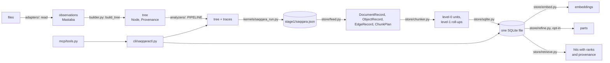

# KOAS Saqqara — Developer Reference

**Author:** Olivier Vitrac, PhD, HDR | olivier.vitrac@adservio.fr | Adservio

**Version:** 1.0 (2026-09-10) — describes RAGIX 0.74.0 at commit `75b0fe1`

**Audience:** developers. Installing, running and querying are in the user page,
[KOAS_SAQQARA.md](KOAS_SAQQARA.md); this page does not repeat them. Paths are relative to the
repository root unless they start inside `ragix_kernels/saqqara/`, in which case the package prefix
is dropped.

---

## Table of Contents

1. [Architecture and data flow](#1-architecture-and-data-flow)
2. [Every file of the package](#2-every-file-of-the-package)
3. [The kernels and their envelope](#3-the-kernels-and-their-envelope)
4. [The record types](#4-the-record-types)
5. [The SQLite schema](#5-the-sqlite-schema)
6. [Seams: what saqqara plugs into](#6-seams-what-saqqara-plugs-into)
7. [Configuration: the loader and every key's consumer](#7-configuration-the-loader-and-every-keys-consumer)
8. [Every refusal, drop and abstention, with its code path](#8-every-refusal-drop-and-abstention-with-its-code-path)
9. [Extension points](#9-extension-points)
10. [Gates, the test suite and the baseline](#10-gates-the-test-suite-and-the-baseline)
11. [Behaviours a developer will meet](#11-behaviours-a-developer-will-meet)

---

## 1. Architecture and data flow



Two separations carry the design.

- **Reader and analyzer.** An adapter emits what the file says, with `origin` read and confidence
  1.0. An analyzer decides what it means, and does so by **adding** nodes or facts, never by
  rewriting an observation. An inferred node carries `origin` inferred, a confidence below 1.0 and
  its producer's name.
- **Tree and store.** Stage 1 computes and writes only its envelope. Stage 2 never reads a source
  file again: it reads the trees, which are the only things carrying provenance, and writes the
  store.

---

## 2. Every file of the package

### 2.1 Top level

- **`__init__.py`** — the family's docstring: its stages, its layers and the design rules the gates
  enforce. It exports nothing. The K0.3 gate asserts that the package documents itself.
- **`kernel.py`** — a compatibility re-export of `SaqqaraKernel` for callers that import
  `ragix_kernels.saqqara.kernel`. It defines nothing, so the registry walk still finds one
  definition site.
- **`model.py`** — the tree. `Locator` and one subclass per format (`DocumentLocator`, `PdfLocator`,
  `XlsxLocator`, `DocxLocator`, `PptxLocator`, `MdLocator`), registered by `register_locator` and
  rebuilt by `locator_from_dict`; `Provenance`, required at construction; `KindRegistry` and the
  process-wide `kind_registry` holding `STANDARD_KINDS`; `Node`; `Tree`, serialised through
  `CANONICAL_JSON` (sorted keys, fixed separators, no ASCII escaping). `_serialisable` writes facts
  and raises on anything neither JSON-native nor `to_dict`-aware. Carries K1.
- **`builder.py`** — observations into a tree, under one contract for every format. `FORMAT_PLANS`
  declares, per format, which observation kinds open containers, the locator key that ties a child
  to its container, the node kind of every other observation, and what is attached rather than made
  into a node. It registers the kinds `cell`, `marker`, `note`, `shape`, `page`, `slide`, `sheet`
  and `vector_region`. Every observation ends as a node, an attachment or a counted drop, and the
  three totals reconcile (`BuildResult.reconciles`). Carries K3.j.
- **`services.py`** — the three questions every consumer asks of a tree. `doc_title` walks
  `TITLE_RUNGS` (`metadata`, `heading`, `first-text`) and returns the node it answered from.
  `page_nodes` groups nodes by the format's page policy: exact page for pdf, one-based slide for
  pptx, sheet index for xlsx, and word windows of `PAGE_WORD_WINDOW` = 400 words, marked
  approximate, for docx and md. `lookup` finds a literal, an alternation, a regular expression or a
  compiled pattern, and honours a page restriction under every policy. Carries K3.35–K3.39.
- **`views.py`** — lazy projections that store nothing. `signature_core` and `structure_signature`
  give a document's shape: node counts by kind, headings by level, an outline capped at
  `OUTLINE_CAP` = 50 with its total, and `flat_mass_ratio`, the share of text under no heading or
  section (`STRUCTURING_KINDS`). Carries K1.5–K1.8.
- **`assets.py`** — the side-car store for picture bytes, which never enter a tree. `AssetStore`
  keeps bytes under their sha256 with a `manifest.json` of every reference to them; `read` raises
  `MissingAsset` when bytes are absent or no longer hash to their name. Carries K6.2, K6.3 and K6.6.
- **`SPEC.md`** — the specification: 153 falsifiable propositions, each with its fixture and its
  falsifier, the rules for reading a measurement, and the known holes (ids prefixed `H`).
- **`README.md`** — the package's short introduction, its design rules, its layout and how to run
  its tests.

### 2.2 `adapters/` — one reader per format

- **`adapters/__init__.py`** — imports each reader so that it registers its extensions, and
  re-exports the contract.
- **`adapters/contract.py`** — what a reader is. `Mastaba` is one observation: a kind in the
  reader's vocabulary, a locator, optional text and facts. `Adapter` declares `format`, `version`,
  `extensions`, `fact_sets` (the facts it emits **per record kind**, or an `OpenVocabulary` where the
  names come from the document) and `skip_reasons`, and counts what it declines through `_skip`.
  `register_adapter`, `registered_adapters` and `adapter_for` map extensions to readers. `read_path`
  raises `UnsupportedFormat` or `UnreadableFile` rather than returning nothing; `read_corpus` and
  `read_paths` turn those into `Refusal` records in a `ReadReport` and drop byte-identical duplicates.
  The shared vocabularies live here: `FIGURE_FACTS`, `FIGURE_SOURCES`, `PART_SKIPS`,
  `GRID_TABLE_FACTS`, `GRID_CELL_FACTS`. Carries K2.
- **`adapters/pdf.py`** — the laid-out-document reader, version 0.8.0, extension `.pdf`. It emits a
  `page` per page (facts `has_text`, `image_count`, `needs_ocr`, `width`, `height`), a `text`
  observation per text-showing operation (facts `x`, `y`, `font_size`, `font`, `width`), the declared
  outline as `outline_entry` records (fact `level`), `drawing` records (facts `x`, `y`, `w`, `h`,
  `ops`, `stroke`, `fill`) and, when given an asset store, `figure` records. The font size is the
  size on the page, the operand scaled by both matrices (K2.24), and a run's width is measured from
  the font's own widths or left unknown (K2.25). No bounding box is invented for text. Its skip
  vocabulary is `OBJECT_SKIPS`: `inline-image-not-extracted`, `xobject-unresolvable`,
  `xobject-empty`, `form-cycle`, `form-too-deep` and `no-text-layer`. Carries K2.13, K2.14, K2.24,
  K2.25 and the pdf half of K6.
- **`adapters/docx.py`** — the word-processing reader, version 0.7.0, extension `.docx`. It resolves
  each table's grid (span, vertical merge, continuation cells) in the body, the page headers and
  nested tables, each indexed within its own flow; distinguishes a fillable marker in a cell from one
  in the body (`FIELD_MARKERS`: `FORMTEXT`, `FORMCHECKBOX`); records numbering, outline level, a bold
  **fraction** and the size against the document's modal size (`PARAGRAPH_FACTS`); and derives each
  node's page from the document's own break marks into a `derived` fact block (K6.20). Pictures are
  read as parts when an asset store is given; skips use `PART_SKIPS`. Carries K2.6–K2.10, K2.23 and
  K6.20.
- **`adapters/xlsx.py`** — the spreadsheet reader, version 0.6.0, extensions `.xlsx` and `.xlsm`.
  Exactly six facts per cell (`CELL_FACTS`: `dtype`, `bold`, `number_format`, `locked`, `formula`,
  `merged`), borders as their own records (`BORDER_EDGES`), sheet facts (`SHEET_FACTS`: `hidden`,
  `list_objects`, `max_row`, `max_column`). A whitespace-only cell is blank but keeps its data type;
  an empty cell gets a record when it is ruled or anchors a merge. Carries K2.1–K2.5 and K2.17.
- **`adapters/pptx.py`** — the presentation reader, version 0.5.0, extension `.pptx`. Slides are
  one-based; shapes carry `shape_type`, `is_title`, `on_slide`; speaker notes carry both their own
  address (`notes=True`) and the fact `on_slide=False`; a table shape is read as a grid in the shared
  grid vocabulary. Carries K2.15 and K2.18.
- **`adapters/md.py`** — the markdown reader, version 0.2.0, extensions `.md` and `.markdown`. One
  record per block with the line it starts on; front matter becomes a `metadata` observation, not
  body text. Carries K2.16.

### 2.3 `analyzers/` — chained recognisers

- **`analyzers/__init__.py`** — the exports and the standard order, `PIPELINE` = (`TablesAnalyzer`,
  `GridTablesAnalyzer`, `HeaderBandsAnalyzer`, `IslandsAnalyzer`, `SectionsAnalyzer`), with
  `pipeline(tree)` to run it. `OutlineAnalyzer` is opt-in and runs after it; `chains` is a
  projection, deliberately not a pass.
- **`analyzers/contract.py`** — what an analyzer is and how it may fail. `Analyzer` declares `name`,
  `version` and `DEFAULTS`, refuses an undeclared option at construction, and records its effective
  options in its trace (`traced`). `Abstention` carries a reason from `ABSTENTION_REASONS`,
  `TYPING_REASONS` or `CAPTION_ABSTENTIONS`. The abstention register is built here:
  `ABSTENTION_SOURCES` declares where each producer keeps its records, `abstention_records`
  normalises them, `TREE_ABSTENTION_SOURCES` adds records the reader left in the tree
  (`saqqara.text_layer`), and `count_reported` counts the declared report shapes. Carries K3.17 and
  K4.3.
- **`analyzers/tables.py`** — `tables`, version 0.1.0: the segmentation cascade on spreadsheets.
  S0 a declared table object bounds a block; S1 connected regions of occupied positions; S2 a drawn
  box bridges its own blanks; S3 typing by ordered rules `T1-declared-table-object` to
  `T6-single-cell`. It adds one node per block (kind `table`, `paragraph` or `list`), puts a
  `block_uncertain` abstention on a block it cannot type, and drops a ruled region with no value as
  `bordered-region-holds-no-value`. Carries K3.1–K3.7, K3.11 and K3.12.
- **`analyzers/grid_tables.py`** — `grid_tables`, version 0.2.0: types word-processing and slide
  tables (`GRID_TABLE_FORMATS`) as `data-form`, `layout` or `table_uncertain` by the rules
  `D1-fillable-markers`, `D2-ruled-grid-of-two-dimensions`, `D3-header-evidence`,
  `D4-unstyled-single-row` and `D5-no-positive-evidence`. Only a `data-form` table becomes a block
  the header rules read. Carries K3.29, K3.30 and K3.32.
- **`analyzers/header_bands.py`** — `header_bands`, version 0.2.0: splits a block into title, header
  band, label columns, section rows and core by the rules `R1-laminarity`, `R2-uniform`, `R3-title`,
  `R4-style-contrast` (with `R4-band-depth`), `R5-section-rows`, and finds the label zone by
  `L1-band-header-span`, `L2-slot-column`, `L3-type-contrast` or `L4-no-label-evidence`. Options:
  `max_header_rows` (default `MAX_HEADER_ROWS` = 3) and `max_label_cols` (default `MAX_LABEL_COLS`
  = 3). It counts a band to its end before abstaining and records the depth found beside the cap.
  Carries K3.13–K3.20 and K3.73.
- **`analyzers/islands.py`** — `islands`, version 0.1.0: finds disconnected value regions inside one
  block, records them and sets `segmentation_feedback`; it never re-segments. Carries K3.25–K3.28.
- **`analyzers/sections.py`** — `sections`, version 0.1.0: collects section names per channel,
  `READER_CHANNELS` (`pdf-numbered-heading`, `pdf-native-toc`, `docx-heading-style`,
  `docx-numbering-property`, `xlsx-sheet-name`, `xlsx-section-row`, `xlsx-block-title`,
  `pptx-slide-title`) and `DERIVED_CHANNELS` (`outline-promotion`, `format-promotion`,
  `caption-binding`), runs every candidate through `GAUNTLET` (`G1-printed-contents`,
  `G2-orphan-number`, `G3-page-furniture`, with `FURNITURE_PAGES` = 3), and writes a
  `section_ancestry` fact on each node. It adds no node. Carries K3.40–K3.48.
- **`analyzers/outline.py`** — `outline`, version 0.1.0, opt-in: a numbered label promotes to an
  inferred `heading` node beneath its paragraph only where it takes a legal step in an outline walk;
  a chain shorter than `MIN_CHAIN` = 3 abstains; a flat chain promotes only when every one of its
  lines is at least 90 % bold (`BOLD_DOMINANT` = 0.9, read from the `bold_frac` fact). Unpromoted labels are counted under `OUTLINE_DROPS`. Carries K3.49–K3.53.
- **`analyzers/format_headings.py`** — `format_headings`, version 0.1.0, library only: headings a
  document only shows. It assembles placements into lines, takes the body size by character mass,
  clusters sizes into tiers, and promotes lines through the ordered `SHAPE_RULES`; weight is tried
  only where size found no contrast. Refusals: `TIER_DROPS`; abstentions: `FORMAT_ABSTENTIONS`.
  Promotions are inferred nodes on the `format-promotion` channel, at confidence 0.7 by size and 0.6
  by weight. Carries K3.59–K3.71.
- **`analyzers/chains.py`** — the column and row ancestry of one position, computed on demand and
  stored nowhere: broadest first by interval containment, a blank tile surfacing as the rung
  `BLANK_RUNG` = `(blank-label)`, every rung with the address it was read from, and
  `SelfReferenceError` for a position inside the header band or the label zone. Entry point:
  `anchors`. Carries K3.8–K3.10, K3.21–K3.24 and K3.72.
- **`analyzers/caption_binding.py`** — `saqqara.caption_binding`, version 0.1.0, library only: binds
  a figure to its caption by `CAPTION_RULES` in order (`caption-below-overlapping` at 0.9,
  `caption-below-offset` at 0.8, `caption-above-overlapping` at 0.7), set-level so that a line
  captions at most one figure, and abstains under `CAPTION_ABSTENTIONS`. A binding is a new inferred
  node recording `BINDING_FACTS`. Carries K6.11–K6.13.
- **`analyzers/vector_regions.py`** — `saqqara.vector_regions`, version 0.1.0, library only: groups
  drawn marks into a figure only above `MIN_REGION_OPS` = 8 operators and `MIN_REGION_AREA` = 0.01,
  excludes page furniture before grouping (`MARK_EXCLUSIONS`), refuses under `REGION_REFUSALS`, and
  routes a drawn lattice as `table-as-image` at 0.5 rather than as a table. A region's asset is the
  hash of its marks and extent, never of a raster. Carries K6.14, K6.15, K6.17 and K6.18.
- **`analyzers/geometry.py`** — the shared rectangle vocabulary: A1 notation in and out, one-based
  `(row, column)` coordinates inside, `Rect` and `parse_range`.
- **`analyzers/grid.py`** — the format-neutral grid the rules see (`GridCell`), and the declared,
  ordered mappings from each format's facts: `XLSX_MAPPING` (X1–X3), `DOCX_MAPPING` (M1–M5),
  `PPTX_MAPPING` (M1, M2, M3, M5). Carries K3.34.

### 2.4 `render/` — pixels, kept out of identity

- **`render/__init__.py`** — the `Renderer` protocol, `RenderFailed`, `RENDER_DPI` = 150,
  `source_id` (the canonical description of what a region is), `raster_key` (source, renderer,
  version, resolution) and `default_renderer`, which always returns the Apache-2.0 renderer.
- **`render/pdfium.py`** — `PdfiumRenderer`, the default, on `pypdfium2`.
- **`render/mupdf.py`** — `MuPdfRenderer`, on `pymupdf` (AGPL-3.0): the only file allowed to import
  it, never imported by the package, installed only by the `saqqara-mupdf` extra.
- **`render/guard.py`** — `scan_sources` refuses an import of `AGPL_MODULES` (`pymupdf`, `fitz`,
  `pymupdf4llm`) outside `EXEMPT`; `loaded_agpl_modules` reports which are in `sys.modules`.
  Carries K6.16.

### 2.5 `kernels/`

- **`kernels/__init__.py`** — exports the two kernel classes.
- **`kernels/saqqara_run.py`** — `SaqqaraKernel`, stage 1 (§3.1).
- **`kernels/saqqara_index.py`** — `SaqqaraIndexKernel`, stage 2 (§3.2).

### 2.6 `store/`

- **`store/__init__.py`** — the subpackage docstring.
- **`store/ports.py`** — the `DocumentStore` protocol, `register_store`, `BUILTIN_PROVIDERS` and
  `build_store`, which imports a built-in provider's module on first use (§6.1). Carries K7.15.
- **`store/records.py`** — the stored records and the identity rules: `doc_id_for` checks a
  lowercase hex sha256, `chunk_id_for` digests `(doc_id, level, node_ids, text)` through canonical
  JSON, `node_ids_of` and `node_at` give and resolve child-index addresses (`""` for the root,
  `"0.3.2"` below it). `EDGE_TYPES` and `OBJECT_KINDS` are declared here. Carries K7.1, K7.2, K7.5
  and K7.9.
- **`store/sqlite.py`** — `SqliteDocumentStore`, the one-file store (§5), registered as `sqlite`. It
  imports `analyzers` and `builder` so that a process that only opens a store can rebuild the kinds
  its trees use. Carries K7.1, K7.6, K7.12, K7.13.
- **`store/chunker.py`** — `chunk_tree`: level-0 units, level-1 roll-ups, the declared window
  fallback, and a `ChunkPlan` with every refusal. `CHUNKABLE_KINDS`, `NON_CHUNKABLE_KINDS` (each
  with its reason), `AGGREGATING_KINDS`, `SECTION_KINDS`, `UNIT_MAX_CHARS` = 1200,
  `WINDOW_FALLBACK_CHARS` = 4000, `WINDOW_OVERLAP_CHARS` = 200. Carries K7.3, K7.4 and K7.5.
- **`store/feed.py`** — a read document becomes stored records. `feed_tree` works on a tree in
  memory and `feed_result` on a stage-1 result (a path, its text or its parsed form); both end in a
  `FeedResult`. `objects_of` keeps `table`, `figure` and `vector_region` nodes as objects;
  `edges_of` copies bindings an analyzer recorded (`BINDING_FROM_FACT` = `caption_of` to `binds`)
  and refuses one it cannot resolve. Carries K7.1, K7.3 and K7.11.
- **`store/embed.py`** — `PROVIDERS` (`none`, `sentence-transformers`, `ollama`, `dummy`),
  `build_embedder`, and `embed_missing`, which embeds only what a model lacks, one document at a
  time, and records refusals (§8.8). Carries K7.6, K7.7 and K7.21.
- **`store/refine.py`** — the refinement passes: `split_into_windows`, `refine_store`, and the
  `RefinePass` and `RefinePlan` records. Carries K7.22.
- **`store/retrieve.py`** — `Retriever` (the dense lane, the lexical lane, the fusion),
  `provenance_of` (the citation chain of every node a chunk names) and `related_of` (the objects a
  chunk covers and the edges touching them). `RRF_K` = 60. Carries K7.8–K7.11 and K7.13.
- **`store/config.py`** — `load_config`, `StoreConfig`, `resolve_secret`, `DEFAULTS_PATH` (§7).
  Carries K7.14 and K7.19.
- **`store/defaults.yaml`** — the packaged defaults: the single source of truth for the shape of a
  configuration.

### 2.7 Surfaces

- **`cli/__init__.py`** — the subpackage docstring.
- **`cli/saqqaractl.py`** — the command line: `build_parser`, `main`, and one function per command
  (`cmd_run`, `cmd_status`, `cmd_index`, `cmd_search`). The report reads the abstention register
  (`report.abstentions`), prints an unknown report key raw, and gives a hit the same shape as the MCP
  tool through `_hit_payload`. Carries the command-line half of K7.16.
- **`mcp/__init__.py`** — the subpackage docstring.
- **`mcp/tools.py`** — `register_saqqara_tools(server)` defines the four tools on a FastMCP server.
  `koas_saqqara_search` calls `cmd_search` with `--json` and returns what it prints, so the two
  surfaces cannot drift. `MCP/ragix_mcp_server.py` calls the registration at import and continues
  without the tools if it fails.

---

## 3. The kernels and their envelope

### 3.1 `SaqqaraKernel` — `kernels/saqqara_run.py`

| attribute | value |
|---|---|
| `name` | `saqqara` |
| `version` | `0.1.0` |
| `category` | `saqqara` |
| `stage` | 1 |
| `requires` | `[]` |
| `provides` | `document_tree`, `traces`, `merkle_root` |

`validate_input` adds `source.path is required` to the envelope's checks. `compute`:

1. refuses an `analyzers` entry naming an analyzer outside `PIPELINE` and `outline`;
2. lists the files (`_paths`): the source file itself, or every file under the directory, sorted,
   filtered by `formats` only when given;
3. reads them with `read_corpus`, with no asset store;
4. per document read: `build_tree`, then each `PIPELINE` analyzer constructed with its declared
   options, then `OutlineAnalyzer()` when `promote_outline` is true;
5. returns the documents, the two roots and the report.

| key of `data` | content |
|---|---|
| `documents[]` | `path`, `format`, `sha256`, `tree` (the tree's dict), `traces` (`builder`, `tables`, `grid_tables`, `header_bands`, `islands`, `sections`, and `outline` when run) |
| `merkle_root` | `ragix_kernels.merkle.compute_inputs_merkle_root` over each tree's canonical JSON, keyed by path |
| `source_root` | the same function over the sorted content hashes, with empty paths |
| `report.counts` | `read`, `refused`, `duplicate` |
| `report.refusals[]` | `path`, `reason`, `detail` |
| `report.duplicates[]` | the paths of byte-identical copies not read |
| `report.abstentions[]` | `path`, `analyzer`, `locator`, `reason`, `signals`, `count` (§8.3) |

`summarize` returns `N document(s), M nodes. Refused R, duplicate D. A abstention(s), K drop(s)
counted. root <12 hex>.`, deriving the abstention count from the register and the drop count from
each trace's `dropped` through `count_reported`. The kernel carries the K4 gate.

### 3.2 `SaqqaraIndexKernel` — `kernels/saqqara_index.py`

| attribute | value |
|---|---|
| `name` | `saqqara_index` |
| `version` | `0.1.0` |
| `category` | `saqqara` |
| `stage` | 2 |
| `requires` | `document_tree` |
| `provides` | `document_store` |

Configuration: `config` (a YAML path), `overrides` (dotted keys), `result` (a stage-1 result, or a
list of `(tree, source_path, source_sha256)` tuples, used instead of the dependency). `compute`:

1. loads the configuration, then builds the store at `store.path`, resolved against the workspace;
2. finds the trees: `result`, else the `document_tree` dependency, else
   `WORKSPACE/stage1/saqqara.json`, and raises `FileNotFoundError` if none exists;
3. feeds them with the `chunker` section as options;
4. builds the embedder from `embedder.provider` and `embedder.model`, passing `base_url` and
   `batch_size` when set;
5. per document: `upsert_document` with its objects and edges, `replace_chunks`, `embed_missing`;
6. runs `refine_store` when `refine.budgets` is non-empty and an embedder exists;
7. reads `store.status()`, adds `dense`, and raises when refusals exist and no vector does.

| key of `data` | content |
|---|---|
| `documents[]` | `doc_id`, `path`, `format`, `chunks`, `refused`, `objects`, `edges`, `level_0`, `level_1` (§11) |
| `status` | the store's status (user page §7) plus `dense` |
| `embedded`, `skipped`, `refused` | vectors written, chunks not embedded (already present, or no embedder), embedding refusals |
| `embedder_refusals[]` | `reason`, `chunk_id`, `doc_id`, `node_ids`, `signals`, `path` |
| `refinement` | `null`, or `passes[]`, `parts`, `remaining_refusals[]` |
| `config` | the configuration used, secrets unresolved |

`summarize` returns `N document(s), C chunk(s). Embedded E, already present S, refused R. Dense: …`,
with `refused` printed even when zero. The kernel carries K7.15 and K7.16.

### 3.3 The envelope — `ragix_kernels/base.py`

Both kernels are `Kernel` subclasses and are run by `Kernel.run`, which a subclass must not
override. It validates the input (the workspace exists; every `requires` entry is present in
`dependencies` and exists on disk), hashes the input, calls `compute` then `summarize`, truncates a
summary over 500 characters with a warning, and writes `WORKSPACE/stage<N>/<name>.json` as
`{"_meta": {kernel_name, kernel_version, execution_time_ms, input_hash, timestamp, success},
"data": …}` beside `<name>.summary.txt`. An exception in `compute` becomes `success: false` with
`data = {error, error_type}`; a validation failure returns without writing. Neither kernel writes
activity events: `Kernel.run` emits none, and the orchestrator emits them only through an activity
writer that some caller has initialised.

The registry discovers kernels by walking packages. K0.3 pins the exact list of kernel classes this
package defines, by defining module, in `DECLARED_KERNELS` in `tests/saqqara/test_k0_spec.py`.

---

## 4. The record types

### 4.1 The tree — `model.py`

| type | fields | rules |
|---|---|---|
| `Provenance` (frozen) | `source_path`, `source_format`, `chain` (tuple of `Locator`, broadest first), `kernel`, `kernel_version`, `source_sha256` (optional) | every field but the last required; an empty chain or a non-locator raises `ProvenanceError`; `leaf` is the narrowest locator |
| `Node` | `kind`, `provenance`, `text`, `level`, `span`, `facts`, `children`, `origin` (`read` or `inferred`), `confidence` | an unregistered kind raises `KindError`; confidence in (0, 1]; `inferred` at 1.0 and `read` below 1.0 both raise |
| `Tree` | `root`, `meta` | `to_json` and `from_json` through `CANONICAL_JSON`; `replace_source_path` proves path invariance |
| `KindRegistry` | the known kinds | `register`, `check`, `known`; `kind_registry` is the process-wide instance |

The locator classes are listed in the user page (§3.2). Each has a `format` class variable and a
`key()` for ordering within its format; ordering locators of two formats raises `LocatorError`.

### 4.2 Reading — `adapters/contract.py`

| type | fields |
|---|---|
| `Mastaba` (frozen) | `kind`, `locator`, `text`, `facts` |
| `Refusal` (frozen) | `path`, `reason`, `detail` |
| `ReadReport` | `read`, `refusals`, `duplicates`; `counts` gives `read`, `refused`, `duplicate` |
| `OpenVocabulary` (frozen) | `reserved`: the fact names a reader keeps for itself in an open vocabulary |
| `Adapter` | class attributes `format`, `version`, `extensions`, `fact_sets`, `skip_reasons`; instance attributes `store` (an asset store or `None`) and `skips` (reason to count) |

### 4.3 Building and analysing

| type | module | fields |
|---|---|---|
| `FormatPlan` (frozen) | `builder.py` | `format`, `containers`, `container_key`, `node_kinds`, `attach` |
| `BuildResult` | `builder.py` | `tree`, `trace` (`builder`, `builder_version`, `format`, `reader`, `reader_version`, `observations`, `nodes`, `attached`, `dropped`, `drops`); `reconciles` |
| `Abstention` (frozen) | `analyzers/contract.py` | `reason` (checked against the frozen vocabularies), `signals` |
| `AnalyzerResult` | `analyzers/contract.py` | `tree`, `trace` |
| `Analyzer` | `analyzers/contract.py` | `name`, `version`, `DEFAULTS`, `options` |
| `AbstentionSource` (frozen) | `analyzers/contract.py` | `records`, `reason`, `locator`, `tally`, `signals` |
| `TitleResult` | `services.py` | `title`, `rung`, `node`, `trace` |
| `PageMap` | `services.py` | `policy`, `pages`, `skipped`, `approximate`; `keys` |
| `LookupHit` (frozen) | `services.py` | `node`, `page`, `text` |

### 4.4 The store — `store/records.py` and its neighbours

| type | fields | rules |
|---|---|---|
| `DocumentRecord` | `doc_id`, `corpus`, `doc_class`, `source_path`, `source_sha256`, `kernel`, `kernel_version`, `tree`, `meta`, `digested_at`, `trashed` | `doc_id` must be a lowercase hex sha256 and equal `source_sha256` |
| `ObjectRecord` | `doc_id`, `node_id`, `kind`, `page`, `bbox`, `caption`, `asset_ref`, `cells`, `meta` | `kind` in `OBJECT_KINDS` (`table`, `figure`, `vector_region`) |
| `EdgeRecord` | `doc_id`, `src`, `dst`, `type` | `type` in `EDGE_TYPES` (`binds`, `refers_to`, `continues`, `supersedes`) |
| `ChunkRecord` | `chunk_id`, `doc_id`, `seq`, `text`, `level`, `node_ids`, `parent_id`, `section_path`, `pages`, `lang`, `object_refs`, `meta` | at least one node id |
| `EmbeddingRecord` | `chunk_id`, `model`, `dimensions`, `vector`, `indexed_at` | the vector's length must equal `dimensions` |
| `EmbeddingRefusalRecord` | `chunk_id`, `doc_id`, `model`, `reason`, `signals`, `refused_at` | a reason is required |
| `Hit` | `chunk`, `dense_rank`, `lexical_rank`, `final_rank`, `boosts`, `part` | lane ranks are kept beside the fused rank |
| `ChunkPlan` (`chunker.py`) | `chunks`, `refusals`; `counts()` gives `chunks`, `refused`, `level_<n>` | |
| `FeedResult` (`feed.py`) | `document`, `objects`, `edges`, `plan`; `chunks`, `counts()` | |
| `EmbedPlan` (`embed.py`) | `model`, `embedded`, `skipped`, `disabled`, `refusals`; `refused` | `skipped` and `refusals` are never merged |
| `RefinePass` (`refine.py`) | `number`, `budget`, `read`, `split`, `parts`, `embedded`, `refused`, `dropped_vectors`, `documents_attempted`, `documents_completed`, `stopped_on` | |
| `RefinePlan` (`refine.py`) | `passes`, `remaining_refusals`; `to_dict()` adds `parts` | |
| `StoreConfig` (`config.py`) | `data`; `section`, `get`, `to_dict`, `api_key` | |
| `EmbeddingRefusal` (`ragix_core/embeddings.py`) | `index`, `reason`, `status`, `message`, `model`, `batch_size`, `chars` | produced by the ollama backend |

---

## 5. The SQLite schema

`store/sqlite.py`, `SCHEMA_VERSION` = 1. Every connection runs `PRAGMA journal_mode=WAL` and
`PRAGMA foreign_keys=ON`, creates every table if absent, and inserts the schema version if absent.
JSON columns are written through canonical JSON where noted. Vectors are float32, little-endian.

### `meta`

| field | type | content |
|---|---|---|
| `key` | TEXT, primary key | `schema_version` |
| `value` | TEXT, not null | `1` |

### `documents` — index `documents_source(source_sha256)`

| field | type | content |
|---|---|---|
| `doc_id` | TEXT, primary key | the source sha256 |
| `corpus` | TEXT, not null | the record's corpus, or the store's when the record has none |
| `doc_class` | TEXT, not null | the reader's format, as the feed sets it |
| `source_path` | TEXT, not null | the last path the bytes were fed from |
| `source_sha256` | TEXT, not null | equal to `doc_id` |
| `meta_json` | TEXT, not null, default `{}` | the record's metadata, canonical JSON |
| `tree_json` | TEXT | the tree, canonical JSON |
| `digested_at` | TEXT | as given by the feed's caller |
| `kernel`, `kernel_version` | TEXT, not null | as given by the feed's caller |
| `trashed` | INTEGER, not null, default 0 | 1 while trashed |

### `document_paths` — primary key `(doc_id, source_path)`

| field | type | content |
|---|---|---|
| `doc_id` | TEXT, not null, references `documents` on delete cascade | the document |
| `source_path` | TEXT, not null | one path the bytes were seen at |
| `seen_at` | TEXT | the record's `digested_at` when first seen |

### `objects` — primary key `(doc_id, node_id)`

| field | type | content |
|---|---|---|
| `doc_id` | TEXT, not null, references `documents` on delete cascade | the document |
| `node_id` | TEXT, not null | the node's child-index address |
| `kind` | TEXT, not null | `table`, `figure` or `vector_region` |
| `page` | INTEGER | the first `page` found in the node's locator chain |
| `bbox_json` | TEXT | `[x0, y0, x1, y1]` from the facts `bbox`, `box`, or `x`, `y`, `w`, `h` |
| `caption` | TEXT | the fact `caption` |
| `asset_ref` | TEXT | the fact `asset_ref`, else `sha256` |
| `cells_json` | TEXT | the fact `cells` |
| `meta_json` | TEXT, not null, default `{}` | every other fact, canonical JSON |

Rewritten whole for a document on every upsert.

### `edges` — index `edges_doc(doc_id)`, no primary key

| field | type | content |
|---|---|---|
| `doc_id` | TEXT, not null, references `documents` on delete cascade | the document: an edge joins two nodes of one document |
| `src`, `dst` | TEXT, not null | node addresses |
| `type` | TEXT, not null | one of `EDGE_TYPES` |

Rewritten whole for a document on every upsert.

### `chunks` — index `chunks_doc(doc_id)`

| field | type | content |
|---|---|---|
| `chunk_id` | TEXT, primary key | `chunk_id_for(doc_id, level, node_ids, text)` |
| `doc_id` | TEXT, not null, references `documents` on delete cascade | the document |
| `seq` | INTEGER, not null | order within the document; roll-ups follow the units; parts take their parent's |
| `text` | TEXT, not null | the chunk's text |
| `level` | INTEGER, not null | 0 for a unit; 1 for a roll-up or a part |
| `parent_id` | TEXT | a unit's roll-up, or a part's parent; null on a roll-up |
| `section_path_json` | TEXT, not null, default `[]` | section titles, broadest first |
| `node_ids_json` | TEXT, not null | the node addresses the chunk covers, in order |
| `pages_json` | TEXT, not null, default `[]` | pages from the nodes' locators |
| `lang` | TEXT | not set by the chunker |
| `object_refs_json` | TEXT, not null, default `[]` | the object nodes the chunk covers |
| `meta_json` | TEXT, not null, default `{}` | `oversize`, `fallback`, or a part's `part` block, canonical JSON |

### `embeddings` — primary key `(chunk_id, model)`, no foreign key

| field | type | content |
|---|---|---|
| `chunk_id` | TEXT, not null | the chunk |
| `model` | TEXT, not null | the model name recorded by the caller |
| `dimensions` | INTEGER, not null | the vector's length |
| `vector` | BLOB, not null | float32 little-endian |
| `indexed_at` | TEXT | UTC ISO time of writing |

### `embedding_refusals` — primary key `(chunk_id, model)`, index `embedding_refusals_doc(doc_id)`

| field | type | content |
|---|---|---|
| `chunk_id`, `model` | TEXT, not null | the chunk and the model that refused it |
| `doc_id` | TEXT, not null, references `documents` on delete cascade | the document |
| `reason` | TEXT, not null | `input-rejected` |
| `signals_json` | TEXT, not null, default `{}` | `status`, `message`, `model`, `batch_size`, `chars`, `level`, `seq`, canonical JSON |
| `refused_at` | TEXT | UTC ISO time |

### `embeddings_trash` — primary key `(chunk_id, model)`, no foreign key

The fields of `embeddings`, plus `doc_id` (TEXT, not null): the vectors of a trashed document,
returned unchanged by a restore.

### `chunks_fts` — FTS5, tokenizer `unicode61 remove_diacritics 2`

| column | content |
|---|---|
| `chunk_id` | unindexed: the key back to `chunks` |
| `text` | the chunk's text |
| `section` | the section path joined by ` / ` |

Written with each chunk by `replace_chunks`, never for a part added by `add_chunks`. FTS5 keeps its
own shadow tables beside it (`chunks_fts_config`, `_content`, `_data`, `_docsize`, `_idx`).

---

## 6. Seams: what saqqara plugs into

### 6.1 The store — `store/ports.py`

`DocumentStore` is a runtime-checkable protocol. The pipeline builds a store with
`build_store(config)`, which reads `provider` (default `sqlite`) and passes every other key of the
section to the factory. `register_store(name, factory)` refuses a name already registered.
`BUILTIN_PROVIDERS` maps `sqlite` to its module, which `build_store` imports on first use, so that
resolution does not depend on import order.

| group | methods of the protocol |
|---|---|
| documents | `upsert_document(doc, objects=(), edges=())`, `get_document`, `list_documents(include_trashed=False)`, `find_doc_by_source(sha256)`, `delete_document(doc_id, purge=False)`, `restore_document` |
| pieces | `replace_chunks(doc_id, chunks)`, `get_chunks(doc_id=None)`, `get_objects`, `get_edges` |
| embeddings | `existing_embeddings(chunk_ids, model)`, `upsert_embeddings`, `replace_embedding_refusals(doc_id, records)`, `get_embedding_refusals(doc_id=None)` |
| retrieval | `search(vector, top_k, model)`, `lexical_search(query, top_k)`, `status()` |

`SqliteDocumentStore` also provides, and the rest of the package uses: `source_paths`,
`get_embeddings(model)` (live vectors, excluding trashed documents), `add_chunks`,
`delete_embeddings`, `add_embedding_refusals`, `result_digest` (16 hex characters), `fts_tokenizer`,
`fts_expression` (static), `invalidate_index`, `close` and the context-manager protocol, and the
attributes `drops` and `lexical_refusals`. Its `lexical_search` also takes `combinator`.
`Retriever` relies on `get_embeddings` and `get_chunks`; `refine_store` relies on `add_chunks`,
`delete_embeddings`, `add_embedding_refusals` and `result_digest`. A second provider must supply
them for those features.

### 6.2 The embedder — `store/embed.py` over `ragix_core/embeddings.py`

`build_embedder(provider, model="", **options)` returns `None` for `none`, and otherwise calls
`ragix_core.embeddings.create_embedding_backend` with an `EmbeddingConfig` whose attributes the
options set. A backend satisfies the core layer's `EmbeddingBackend` protocol: `embed_text`,
`embed_batch`, `dimension`, `model_name`. `embed_missing` looks for one optional capability **by
name**, `embed_batch_recording_refusals(texts) -> (vectors, refusals)`, where a refused text's
vector is `None`. The ollama backend provides it; a backend without it takes the strict path, where
any refusal raises. The ollama backend posts slices of `batch_size` texts to `/api/embed` with
`truncate: false` (`TRUNCATE`, with no setting to change it), and finds a refused text by halving
the slice; a 404 on that path raises rather than falling back. With `batch_size: 1` it sends one
text per request through `embed_text`, which tries `/api/embed` and then the legacy
`/api/embeddings`. The legacy endpoint has no truncate control, a hole the code names.

### 6.3 The vector index — `store/retrieve.py` over `ragix_core/vector_index.py`

`Retriever._ensure_index` reads `store.get_embeddings(model)` and builds
`ragix_core.vector_index.create_vector_index(dimension, backend)`, `numpy` or `faiss`, adding each
vector with `{"chunk_id": …}` as metadata. The index satisfies the core layer's `VectorIndex`
protocol (`add`, `search`, `save`, `load`, `size`); saqqara uses `add` and `search` and never saves
it. The fusion reproduces the core layer's reciprocal-rank formula rather than calling
`HybridSearchEngine._fuse_rrf`, whose result shape is a code chunk's.

### 6.4 The renderer — `render/__init__.py`

`Renderer` is a protocol: `name`, `version`, `render(path, page_number, box, dpi) -> (bytes,
media_type)`. `default_renderer()` returns `PdfiumRenderer`. Nothing in the package constructs
`MuPdfRenderer`.

### 6.5 No language-model seam

saqqara calls no language model, so it has no chat or completion port. The only model it can reach
is the embedder of §6.2.

---

## 7. Configuration: the loader and every key's consumer

`load_config(user=None, **overrides)` reads `store/defaults.yaml`, merges a user file (a path, or an
already-parsed mapping), then merges `overrides` given as dotted keys. `_merge` refuses a key the
defaults do not declare, naming its dotted path and the keys known at that level, and refuses a
value where the defaults hold a mapping, or the reverse. Then `embedder.provider` must be in
`PROVIDERS` and `index.backend` must be `numpy` or `faiss`. The loaded object's `to_dict` never holds
a resolved secret. `resolve_secret` reads `env:NAME` or `file:/path#Label` at the moment of use and
raises on every unresolvable form.

| key | consumer |
|---|---|
| `source.path`, `source.formats`, `source.promote_outline` | none; the run kernel takes its own configuration |
| `store.provider` | `store/ports.py`, `build_store` |
| `store.path` | `kernels/saqqara_index.py`, `cli/saqqaractl.py` `cmd_search` |
| `store.corpus` | `SqliteDocumentStore.__init__`, reported in `status` |
| `refine.budgets`, `refine.overlap_children` | `kernels/saqqara_index.py`, then `store/refine.py` |
| `embedder.provider`, `embedder.model` | `kernels/saqqara_index.py`, `cmd_search`, both through `build_embedder` |
| `embedder.base_url`, `embedder.batch_size` | `kernels/saqqara_index.py` only |
| `embedder.api_key_ref` | `StoreConfig.api_key()`, which nothing calls |
| `index.backend` | `cmd_search`, into `Retriever` |
| `index.use_gpu` | none |
| `chunker.unit_max_chars`, `chunker.rollup_levels`, `chunker.window_fallback_chars` | `store/feed.py` into `store/chunker.py` `chunk_tree` |
| `retrieval.fusion` | none |
| `retrieval.rrf_k`, `retrieval.dense_k`, `retrieval.lexical_k`, `retrieval.top_k` | `cmd_search` |

Defaults and effects are tabulated in the user page, §12.

---

## 8. Every refusal, drop and abstention, with its code path

### 8.1 Reading — `adapters/contract.py`

| reason | raised or recorded in | surfaced as |
|---|---|---|
| `unsupported-format` | `read_path` raises `UnsupportedFormat`; `read_corpus` records it | `report.refusals` |
| `unreadable-file` | `read_corpus` when the bytes cannot be read; `read_path` raises `UnreadableFile` when the path is not a file or the reader fails | `report.refusals`, `detail` carrying the message |
| (duplicate) | `read_corpus`, by content hash | `report.duplicates` |

### 8.2 Reader skips — `Adapter._skip`, counted on the adapter instance

| reasons | reader | reached from a run |
|---|---|---|
| `image-part-empty`, `image-part-unreadable` (`PART_SKIPS`) | `xlsx.py`, `docx.py`, `pptx.py` | no: pictures are read only with an asset store |
| `inline-image-not-extracted`, `xobject-unresolvable`, `xobject-empty`, `form-cycle`, `form-too-deep` | `pdf.py` | no, for the same reason |
| `no-text-layer` | `pdf.py` | yes, and listed in the register through the page's facts (§8.3) |

`_skip` raises `ValueError` for a reason outside the reader's `skip_reasons`. A run does not report
the adapter's `skips` counter.

### 8.3 The abstention register — `analyzers/contract.py`

`SaqqaraKernel._abstentions` walks every document's traces and calls `abstention_records` for each
trace that carries `abstained` or `abstentions`, then adds `tree_abstention_records`.

| producer | source declared in `ABSTENTION_SOURCES` | reasons | in a run |
|---|---|---|---|
| `header_bands` | records in `abstentions`, tally in `abstained`, locator `range`, signals under `signals` | `ABSTENTION_REASONS`: `no-populated-region`, `no-body-rows`, `uniform-block`, `band-too-deep`, `non-laminar-band-merges`, `no-column-evidence-within-cap` | yes |
| `grid_tables` | records in `abstained`, reason key `rule`, locator `flow`, `table_index` | `D4-unstyled-single-row` (type `layout`), `D5-no-positive-evidence` (type `table_uncertain`) | yes |
| `saqqara.text_layer` | `TREE_ABSTENTION_SOURCES`, from each `page` node whose `has_text` is false | `no-text-layer` | yes |
| `format_headings` | one record or `None` in `abstained` | `FORMAT_ABSTENTIONS`: `no-size-contrast`, `no-weight-contrast`, `declared-outline` | no: library only |
| `saqqara.caption_binding` | a histogram in `abstained` | `CAPTION_ABSTENTIONS`: `ambiguous-candidates`, `no-candidate-within-gap`, `candidate-already-bound` | no: library only |

`abstention_records` raises `KeyError` for a producer with no source, `TypeError` for an undeclared
report shape, and `ValueError` when a tally disagrees with its records. `count_reported` raises
`TypeError` for a flag or an undeclared shape.

### 8.4 Typing and recognition decisions carried on nodes and traces

| reason or rule | module | where it lands |
|---|---|---|
| `single-column-with-header-evidence`, `no-value-evidence` (`TYPING_REASONS`) | `analyzers/tables.py` | the block's `block_uncertain` fact, an `Abstention` |
| `T1-declared-table-object` … `T6-single-cell` | `analyzers/tables.py` | the block's typing signals |
| `D1-fillable-markers`, `D2-ruled-grid-of-two-dimensions`, `D3-header-evidence` | `analyzers/grid_tables.py` `type_table` | the table's `table_type` and `signals` facts |
| `R1-laminarity` … `R5-section-rows`, `L1-band-header-span` … `L4-no-label-evidence` | `analyzers/header_bands.py` | the block's trace and signals |
| `printed-contents`, `orphan-number`, `page-furniture` (`REJECTION_REASONS`, tests `GAUNTLET`) | `analyzers/sections.py` | the `sections` trace, rejected candidates |
| `no-channel-for-format`, `no-candidate-found` | `analyzers/sections.py` | the `sections` trace, a blind document |
| `illegal-step`, `chain-too-short`, `flat-uncorroborated` (`OUTLINE_DROPS`) | `analyzers/outline.py` | the `outline` trace |
| `segmentation_feedback`, `feedback[]` | `analyzers/islands.py` | the block, and the `islands` trace |
| `empty`, `too-long`, `too-many-words`, `ends-mid-sentence` (`SHAPE_RULES`) | `analyzers/format_headings.py` | its trace (library only) |
| `no-heading-shaped-line`, `unsupported-tier`, `beyond-the-ladder` (`TIER_DROPS`) | `analyzers/format_headings.py` | its trace (library only) |
| `too-few-operators`, `too-small`, `render-failed`, `region-spans-page` (`REGION_REFUSALS`); `page-furniture` (`MARK_EXCLUSIONS`) | `analyzers/vector_regions.py` | its trace (library only) |

### 8.5 Builder drops — `builder.py`, `Builder.build`

| reason | condition |
|---|---|
| `unmapped-observation` | an observation kind the format plan neither contains, maps nor attaches |
| `drawing-without-a-page` | a pdf drawing whose page container is missing |
| `border-matches-no-cell` | a border whose position matches no cell record |

`build_tree` raises `ValueError` for a format no plan declares. `tables` counts
`bordered-region-holds-no-value` in its own trace.

### 8.6 Chunker and feed — `store/chunker.py` `chunk_tree`, `store/feed.py` `edges_of`

| reason | condition |
|---|---|
| `absorbed-by-an-aggregating-node` | a descendant of a `table` chunk |
| `section-is-context` | a `section` node |
| `not-a-chunkable-kind` | a kind in `NON_CHUNKABLE_KINDS`, or any kind in neither list |
| `no-text` | a chunkable node with no text |
| `binding-target-not-found` | a `caption_of` locator that no node answers to |
| `binding-target-ambiguous` | a `caption_of` locator that more than one node answers to, none of them uniquely a figure |

`ChunkRecord` refuses a chunk with no node. `feed_result` raises `ValueError` on a result with no
documents.

### 8.7 The store — `store/sqlite.py`

| drop reason | method |
|---|---|
| `document-trashed` | `delete_document` |
| `document-purged` | `delete_document(purge=True)` |
| `chunk-superseded` | `replace_chunks` |
| `vector-superseded-by-parts` | `delete_embeddings` |

| lexical refusal | method |
|---|---|
| `empty query` | `lexical_search`, when the query is blank |
| `no term the index can search` | `lexical_search`, when `fts_expression` returns `None` |

`fts_expression` raises `ValueError` for a combinator outside `COMBINATORS` (`all`, `any`).

### 8.8 Embedding — `store/embed.py` `embed_missing`, `ragix_core/embeddings.py`

| outcome | code path |
|---|---|
| refusal `input-rejected` (`REFUSED_INPUT_REJECTED`) | `OllamaEmbeddingBackend._embed_slice`, on an HTTP 4xx other than 404 for a single text; recorded by `embed_missing` into `replace_embedding_refusals`, or `add_embedding_refusals` during refinement |
| raises: no endpoint or model not pulled | `_embed_slice` on HTTP 404 |
| raises: an answer that cannot be matched | `_embed_slice` on a wrong vector count; `embed_missing` on `N vectors for M chunks`, on an empty vector, or on a chunk both refused and embedded |
| raises: more than one document | `embed_missing`, since the refusal register is replaced per document |
| raises: a lane with refusals and no vector | `SaqqaraIndexKernel.compute` |
| raises: refinement stopped | `refine_store`, naming the document, the pass, the budget and the documents completed |

### 8.9 Construction and configuration

| refusal | code path |
|---|---|
| unknown key, mapping or value mismatch | `store/config.py` `_merge` |
| no configuration file; a top level that is not a mapping | `load_config`, `_load_yaml` |
| unknown provider or backend | `load_config`; `build_embedder` also checks the provider |
| unresolvable secret: no scheme, unset or empty variable, unreadable or empty file, label absent, unknown scheme | `resolve_secret` |
| unknown store provider; provider registered twice | `store/ports.py` `build_store`, `register_store` |
| analyzer not run by the kernel | `SaqqaraKernel.compute` |
| option an analyzer does not declare | `analyzers/contract.py` `Analyzer.__init__` |
| `source.path is required` | `SaqqaraKernel.validate_input` |
| no stage-1 result | `SaqqaraIndexKernel.compute` |
| record invariants | `DocumentRecord`, `ObjectRecord`, `EdgeRecord`, `ChunkRecord`, `EmbeddingRecord`, `EmbeddingRefusalRecord` in `__post_init__` |
| tree invariants | `Node`, `Provenance`, `KindRegistry`, `register_locator`, `locator_from_dict`, `_serialisable` in `model.py` |
| extension claimed twice | `register_adapter` |
| missing or altered asset | `AssetStore.read` raises `MissingAsset` |
| a region that cannot be rasterised | `RenderFailed`, from either renderer |

---

## 9. Extension points

**A new reader.**
1. Subclass `Adapter` with `format`, `version`, `extensions`, `fact_sets` for every record kind it
   emits, and `skip_reasons`; register it with `register_adapter`, and import it in
   `adapters/__init__.py`.
2. Declare its locator with `register_locator` and any new kind with `kind_registry.register`.
3. Add a `FormatPlan` to `builder.FORMAT_PLANS`; without one, `build_tree` refuses the format.
4. Put every node kind the plan can emit in `CHUNKABLE_KINDS` or in `NON_CHUNKABLE_KINDS` with its
   reason (K7.3 checks this).
5. Give the format a page policy in `services._PAGE_POLICY` or `_WINDOW_FORMATS`, or `page_nodes`
   raises.
6. Add its channels to `sections.READER_CHANNELS` if it declares section names.
7. Specify it: propositions in `SPEC.md`, fixtures in `tests/saqqara/generators.py`, and the new
   counts in `FROZEN_COUNTS`.

**A new analyzer.** Subclass `Analyzer` with `name`, `version` and `DEFAULTS`; return
`AnalyzerResult(tree, self.traced(trace))`. Add nodes or facts rather than rewriting observations,
with `origin="inferred"` and a confidence below 1.0 on what it infers. To be run by the kernel, add
it to `PIPELINE`. If it abstains, register its source in `ABSTENTION_SOURCES` in the same edit,
because an unregistered producer makes the register raise, and report counts in a shape
`count_reported` accepts.

**A new store provider.** Implement `DocumentStore` and the extra methods of §6.1 that the features
you need rely on; register the factory with `register_store`, and add it to `BUILTIN_PROVIDERS`
for lazy import.

**A new embedder.** Add the backend to `ragix_core.embeddings.create_embedding_backend` and its name
to `store/embed.py` `PROVIDERS`, which `load_config` also checks. Provide
`embed_batch_recording_refusals` if the backend can attribute a refusal to one text.

**A new edge type.** Add it to `records.EDGE_TYPES`, and map the analyzer fact that decides it in
`feed.BINDING_FROM_FACT`. The feed copies decisions and never makes them.

**A new configuration key.** Declare it in `store/defaults.yaml`; the loader refuses anything
undeclared.

**A new kernel.** Add a module under `kernels/`, and its class to `DECLARED_KERNELS` in
`tests/saqqara/test_k0_spec.py`.

**A new MCP tool.** Define it inside `register_saqqara_tools` in `mcp/tools.py`.

---

## 10. Gates, the test suite and the baseline

### 10.1 The gates

| gate | layer | propositions | test files |
|---|---|---:|---|
| K0 | the specification itself, the kernel list, the guard, the prose counts | — | `test_k0_spec.py` |
| K1 | the model | 10 | `test_k1_model.py` |
| K2 | the readers | 25 | `test_k2_adapters.py`, `test_k2p_pdf.py` |
| K3 | analyzers, builder, services | 73 | `test_k3_analyzers.py`, `test_k3f_cross_format.py`, `test_k3g_services.py`, `test_k3hi_sections_outline.py`, `test_k3j_builder.py`, `test_k3k_format_headings.py` |
| K4 | the envelope, the roots, the register | 3 | `test_k4_envelope.py` |
| K6 | objects | 20 | `test_k6_objects.py`, `test_k6_captions.py`, `test_k6_regions.py` |
| K7 | the store | 22 | `test_k7_store.py` |

K0 holds these, among others, in `tests/saqqara/test_k0_spec.py`:

- `FROZEN_COUNTS` = K1 10, K2 25, K3 73, K4 3, K6 20, K7 22. A change to `SPEC.md` that does not
  move this pin fails, and the comment beside it records why each count moved.
- The specification and `generators.FIXTURES` agree in both directions, and every fixture declares
  its suffix in `FIXTURE_SUFFIX`.
- `DECLARED_KERNELS`: the exact kernel classes, by defining module.
- The repository guard fires on a planted violation, finds nothing in the package or its tests, and
  its hashed table holds `FROZEN_TIER1_ROWS` = 6 rows.
- The prose gate: in `README.md` of the package, in `SPEC.md` and in the user page
  `docs/KOAS_SAQQARA.md`, every number written before the word "propositions" equals the frozen
  total, and a line naming a range of gates names them all.

### 10.2 Running the suite

```bash
python -m pytest tests/saqqara -q
OLLAMA_LIVE=1 OLLAMA_EMBED_MODEL=<a pulled embedding model> python -m pytest tests/saqqara -q
```

The live tests run only with `OLLAMA_LIVE=1`, against a generated oversized input and never a
document. Fixtures are generated by `tests/saqqara/generators.py`; a binary file under
`tests/saqqara/` is refused by the guard.

Continuous integration (`.github/workflows/guard.yml`) proves the guard fires, scans every blob
revision and commit message of a pull request with `tools/check_forbidden.py --history`, installs
`.[saqqara,mcp,dev]` on Python 3.12, runs `tests/saqqara` and `tests/tender`, and runs
`examples/saqqara/run_demo.sh`.

### 10.3 The baseline at `75b0fe1`

Python 3.12.12, `python -m pytest tests/saqqara -q`: **783 collected, 775 passed, 8 skipped**.

| skipped | where | reason as reported |
|---|---|---|
| 3 | `test_k3_analyzers.py` | this fixture pins an abstention, not a split |
| 2 | `test_k3hi_sections_outline.py` | counted as a refusal, asserted in K3.43 and K3.42 |
| 3 | `test_k7_store.py` | live embedding test; set `OLLAMA_LIVE=1` to run |

| test file | test functions |
|---|---:|
| `test_k0_spec.py` | 22 |
| `test_k1_model.py` | 36 |
| `test_k2_adapters.py` | 61 |
| `test_k2p_pdf.py` | 11 |
| `test_k3_analyzers.py` | 42 |
| `test_k3f_cross_format.py` | 22 |
| `test_k3g_services.py` | 26 |
| `test_k3hi_sections_outline.py` | 40 |
| `test_k3j_builder.py` | 16 |
| `test_k3k_format_headings.py` | 40 |
| `test_k4_envelope.py` | 31 |
| `test_k6_captions.py` | 15 |
| `test_k6_objects.py` | 45 |
| `test_k6_regions.py` | 35 |
| `test_k7_store.py` | 149 |

Parametrisation makes the collected count larger than the sum of functions.

---

## 11. Behaviours a developer will meet

1. **Importing the store registers kinds.** `store/sqlite.py` imports `analyzers` and `builder` for
   their side effect, so that a process opening a store can rebuild trees whose nodes use kinds those
   modules register.
2. **The index result's per-document keys collide.** Each `documents[]` entry is built as
   `{"chunks": <replace_chunks counts>, "refused": <embedding refusals>, **FeedResult.counts()}`, and
   the feed's counts overwrite both keys. `chunks` is therefore the number of chunks planned and
   `refused` the number of chunker refusals. Embedding refusals are in the top-level `refused` and
   `embedder_refusals`.
3. **What the index kernel writes into `documents`.** `feed_result` passes no corpus, kernel,
   version or time, so every document is stored with corpus `default`, kernel `saqqara`, kernel
   version `1.0`, and a null `digested_at`, and its `document_paths.seen_at` is null.
4. **`chunks.lang` is always null.** The chunker never sets it.
5. **Only pdf chunks carry pages.** `_pages_of` reads a `page` attribute from the locator chain, and
   only `PdfLocator` has one. The docx reader's derived pages live in node facts.
6. **A run leaves earlier refusals in place when the embedder is `none`.** `embed_missing` returns
   before touching the refusal register when there is no embedder.
7. **`Hit.from_dict` drops `part`.** `to_dict` writes it; the reverse does not read it back.
8. **`store.search()` uses the numpy index.** `SqliteDocumentStore.search` builds its `Retriever`
   with the default backend whatever `index.backend` says; only `cmd_search` passes the backend.
9. **`cmd_search` does not pass `base_url` or `batch_size`** to `build_embedder`, and does not catch
   `load_config` errors.
10. **The `outline` entry of `analyzers` is accepted and ignored.** `compute` admits its name and
    constructs `OutlineAnalyzer()` without options.
11. **`READABLE` in `kernels/saqqara_run.py` is not used.** The kernel offers every file to the
    readers.
12. **Two MCP docstrings differ from the code.** `koas_saqqara_run` says an empty workspace means a
    temporary one, and the code uses the source's parent directory; `koas_saqqara_search` lists a
    `dense` field, and the code returns only `hits`. `koas_saqqara_status` collects `abstentions` from
    each trace's own `abstentions` key rather than from the register.
13. **The drop trace and lexical refusals are per process.** `drops` and `lexical_refusals` are
    lists on the store object, not tables.
14. **Output files carry wall-clock time.** The envelope's `_meta` and the store's `indexed_at` and
    `refused_at` are times of writing; K4.1 measures reproducibility on the tree and its root, not on
    the output file.
15. **The connection is not shared across threads.** `SqliteDocumentStore` opens one `sqlite3`
    connection with the module's defaults.
