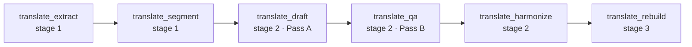

# KOAS-Translate — Local-First Scientific Translation Kernels

**Author:** Olivier Vitrac, PhD, HDR | olivier.vitrac@adservio.fr | Adservio | 2026-06-27
**Status:** P1 complete — 6/6 stage kernels registered (registry 94). EN→FR;
language-pair generalization + MCP/CLI exposure pending (P3).
**Design:** [developer/TRANSLATE_KERNELS_DESIGN.md](developer/TRANSLATE_KERNELS_DESIGN.md)

---

## 1. Overview

KOAS-Translate is the 7th KOAS kernel family (`ragix_kernels/translate/`): a
**local-first, resumable** pipeline that translates long technical/scientific
documents (currently English → French) while preserving equations, code,
citations, URLs, and Markdown structure verbatim.

It is a **generative** kernel family — the LLM produces translated content — so it
guarantees **reproducibility** (greedy decoding `temperature=0`, pinned model
digest, recorded `prompt_version`) rather than the bit-exact determinism of the
compute kernels. All inference runs locally via Ollama; no content leaves the
machine.

## 2. Pipeline

Six stage-ordered kernels over a SQLite **translation memory** (TM):



| Kernel | Stage | Requires | Reads → Writes | Key config |
|--------|-------|----------|----------------|------------|
| `translate_extract` | 1 | — | `src/*.pdf` → `out/source.md` | `src_dir`, `max_pages` |
| `translate_segment` | 1 | extract | `source.md` → `chunks.jsonl` + TM | `target_words` (1500), `max_words` (2500) |
| `translate_draft` | 2 | segment | TM.source → TM.raw_translation | `model`, `glossary_path`, `limit` |
| `translate_qa` | 2 | draft | TM.raw → TM.qa_report, TM.final (if ok) | `model`, `glossary_path` |
| `translate_harmonize` | 2 | qa | TM.final → `chapter_revisions` | `model`, `target_words`, `force` |
| `translate_rebuild` | 3 | harmonize | TM → `out/final.md` | `only_translated` |

Each kernel is **idempotent and resumable**: re-running only does work that is
missing or invalidated by a source change.

## 3. Translation memory (`tm_store`)

SQLite, keyed by `segment_id` + `source_hash`. Columns per segment: source text,
`protected_map` (JSON), raw / final translation, QA report, model,
`prompt_version`, timestamps; plus a `chapter_revisions` table. When a segment's
source changes, its downstream artefacts (translation / QA / final) are
invalidated automatically. The TM is a portable, inspectable CAT-tool artifact —
it is **not** folded into the generic kernel cache.

## 4. Protected spans (`shared/protected_spans`)

Before translation, non-translatable spans — fenced code, display/inline math,
inline code, Markdown links/images, bare URLs, HTML comments, and
author-year / numeric citations — are replaced with opaque `P####` tokens and
recorded per segment. `translate_rebuild` restores them, reporting any
**hallucinated** (token in text, no mapping) or **dropped** (mapping unused)
placeholders. A single `SpanCounter` spans the whole document so token names never
collide across chunks.

```python
from ragix_kernels.shared.protected_spans import protect, restore
masked, mapping = protect("Equation $E=mc^2$ and ref [Doe 2021].")
text, report = restore(masked, mapping)   # report.ok == True
```

## 5. Backends (the LLM seam)

The LLM call is abstracted behind `backends.Backend = Callable[[str], str]`. The
default wraps `ragix_core.llm_backends.OllamaLLM`; tests/programmatic callers
inject a deterministic stub via the kernel **instance attribute**
(`kernel.backend = ...`) — never through `config`, which must stay
JSON-serializable. `translate_qa` parses JSON leniently (whole → ```json fence →
first balanced object) and records a synthetic *revise* verdict on
unparseable/non-object/backend errors, so no segment is silently lost.

Determinism settings live in the pinned Ollama modelfile (e.g.
`granite4.1-translate`: `temperature 0`, `top_p 1`, `top_k 1`).

## 6. Glossary & prompts

- **Glossary** — per-project `EN,FR,rule` CSV, passed via `glossary_path`,
  rendered as a deterministic bullet list into the draft/qa prompts.
- **Prompts** — the EN→FR *method* prompts ship with the package
  (`ragix_kernels/translate/prompts/{translate,qa,harmonize}.txt`); override via
  `prompt_path` or `prompt_template`.

## 7. Install

```bash
pip install -e '.[translate]'    # pymupdf4llm + pymupdf (text-layer PDF→MD)
```

`marker-pdf` (heavy ML OCR for scanned/image-only PDFs) is an optional fallback —
install separately if your sources have no text layer.

## 8. Usage (programmatic)

The kernels run through the KOAS orchestrator like any family (manifest-driven).
A direct, single-stage example:

```python
from pathlib import Path
from ragix_kernels.base import KernelInput
from ragix_kernels.translate.rebuild import TranslateRebuildKernel

out = TranslateRebuildKernel().run(KernelInput(
    workspace=Path("project"),
    config={"tm_path": "project/out/tm.sqlite"},
    dependencies={"translate_harmonize": Path("project/out/tm.sqlite")},
))
print(out.summary)   # translate_rebuild: final.md (… chars), N chapter(s), 0 problem(s)
```

An orchestrator manifest (`templates/translate_manifest.yaml`) and a
`ragix-koas translate` CLI / MCP tools are planned (P3).

## 9. Testing & acceptance

- **Unit tests** (`tests/test_translate_*.py`, `tests/test_protected_spans.py`):
  codec round-trip, TM idempotency/invalidation, chunking, QA verdict gating, the
  draft/harmonize flows via deterministic stub backends — no Ollama required.
- **Acceptance** (`tests/test_translate_acceptance.py`): the deterministic kernels
  (`segment`, `rebuild`) reproduce the original translation pipeline
  **byte-for-byte** on real input. Gated on `RAGIX_TRANSLATE_FIXTURE` (a local
  translation project); **skipped** otherwise.

> **Data policy.** Source documents may be copyrighted. They are **never**
> committed and never appear in tests — the acceptance harness reads a local-only
> fixture at runtime and compares in memory. Keep operational corpora outside the
> repository.

## 10. Roadmap

- **P1 — done:** 6 kernels, shared codec, TM, backend seam, acceptance.
- **P2 — dropped:** a planned cross-family codec consolidation does not exist
  (presenter has no span codec; sealed uses crypto entity placeholders; reviewer
  uses region-avoidance spans). The codec stays translate-local.
- **P3 — pending:** language-pair generalization (per-pair glossary/model/prompt
  registry), MCP tools + `ragix-koas translate` CLI + manifest, and a full
  real-LLM end-to-end run.
