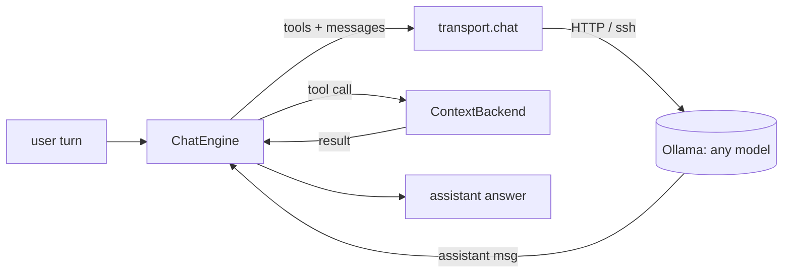

# ragix_chat — mode-agnostic tool-using chat engine

`ragix_chat` is a small, dependency-light chat engine for **tool-using conversations over a
document corpus**. One conversation engine drives any number of *context backends*, so the
same multi-turn loop works whether documents are read in the clear or behind a confidentiality
boundary — only the backend changes.

> Host-neutral by design: the engine talks to any Ollama endpoint (local or over SSH) supplied
> by the caller. It hardcodes no hosts, models, or paths.

---

## Why it exists

Local tool-capable models vary in how reliably they emit native tool calls. `ragix_chat`:

- runs a clean **multi-turn** loop (conversation state persists across turns);
- lets you **fully customize the system prompt**;
- targets **local or remote Ollama** (loopback HTTP, or `ssh host 'curl 127.0.0.1:11434 …'`);
- is robust to models that emit **tool calls as JSON text** in the reply rather than as native
  `tool_calls` (a built-in fallback executes them anyway);
- keeps **policy in the backend**, not the model — the engine only routes tool calls the
  backend chose to expose.

---

## Architecture



| Component | Responsibility |
|---|---|
| `ChatEngine` (`engine.py`) | multi-turn loop, system prompt, native + text-fallback tool dispatch |
| `ContextBackend` (`backends.py`) | abstract: exposes `tools` + `dispatch(name, args)`; optional `finish()` |
| `ClearBackend` (`backends.py`) | plaintext reference backend: BM25 search + `open_context`, no redaction |
| `transport.py` | one `chat()` call; local loopback HTTP **or** SSH→loopback for a remote GPU |
| `cli.py` | `python -m ragix_chat.cli` — interactive/scripted CLEAR-mode REPL |

The engine is **mode-agnostic**: it never assumes plaintext. A backend may search a redacted
index, meter disclosure, decrypt on demand, or seal its outputs — the engine neither knows nor
cares.

---

## Quickstart (CLEAR mode)

```bash
# local ollama
python -m ragix_chat.cli --docs ./my_docs --model mistral:latest

# remote GPU over SSH, custom prompt, one-shot
python -m ragix_chat.cli --docs ./my_docs --model <model> --host user@gpu \
    --system prompts/analyst.txt --ask "What changed in Q3?"
```

Each stdin line is a successive turn (`quit` to end). `--verbose` shows tool calls.

---

## Programmatic use

```python
from ragix_chat import ChatEngine, ClearBackend

backend = ClearBackend("./my_docs")            # or {name: text}
eng = ChatEngine(backend, model="mistral:latest", host=None,   # host=None -> localhost
                 system_prompt="You are ...", temperature=0.3, verbose=True)
print(eng.ask("Summarize the budget section."))
print(eng.ask("And who approved it?"))         # multi-turn; state persists
```

`host="user@h"` routes inference to a remote Ollama bound to loopback on that host — the request
body is the only thing that crosses; nothing is written to the remote disk.

---

## Writing a custom backend

Implement two members (and optionally `finish()`):

```python
from ragix_chat.backends import ContextBackend, tool_schema

class MyBackend(ContextBackend):
    @property
    def tools(self):
        return [tool_schema("search_sources", "Search the corpus.",
                            {"query": {"type": "string"}}, ["query"]),
                tool_schema("open_context", "Read a passage by ticket id.",
                            {"ticket_id": {"type": "string"}}, ["ticket_id"])]

    def dispatch(self, name, args):
        # deny-by-default: only handle tools you exposed; everything else is an error
        ...

    def finish(self):
        # optional: flush / seal / log session outputs
        ...
```

Because `dispatch` is the only place tools execute, the backend is the **policy boundary** —
e.g. a confidential backend can keep search over a redacted index, decrypt source spans only
inside `dispatch`, enforce a disclosure budget, and seal its outputs in `finish()`, all without
the engine changing.

---

## The text-tool-call fallback

Some models reply with `{"name": "open_context", "parameters": {...}}` *as text* instead of a
native tool call. `ChatEngine` parses such objects out of the reply and executes them
(`engine.extract_text_tool_calls`), so a model that mixes both styles still drives the loop.
This is what makes the engine usable with a wide range of local models.

---

## Notes

- Requires a tool-capable Ollama model. Verify with `ollama show <model>` (look for `tools`).
- No external dependencies beyond the standard library for the engine; backends may add their own.
- The engine never persists transcripts; persistence (if any) is a backend concern.
