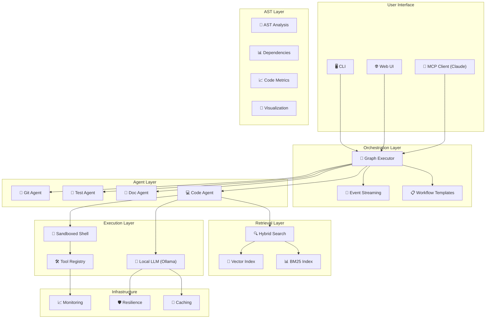

<p align="center">
  <br>
</p>

# RAGIX v0.20.0

*(Retrieval-Augmented Generative Interactive eXecution Agent)*

**A Sovereign Multi-Agent Orchestration Platform with AST Analysis**
**Unix-Native · Fully Local · Production-Ready · Claude-Compatible**

[](https://www.python.org/downloads/)
[](LICENSE)
[](https://fastapi.tiangolo.com/)

---

**Author:** Olivier Vitrac, PhD, HDR | olivier.vitrac@adservio.fr | Adservio
**Version:** 0.20.0 | **Updated:** 2025-11-28

---

## Mission

**RAGIX** is a sovereign, fully-local, Claude-Code–style development assistant that has evolved into a complete multi-agent orchestration platform.

It combines:

- **Local LLM reasoning** (via Ollama: Mistral/Qwen/DeepSeek/Granite)
- **Multi-agent workflow execution** with dependency graphs
- **Hybrid retrieval** (BM25 + vector semantic search)
- **Production-grade monitoring** and resilience
- **Claude MCP integration** for seamless AI collaboration
- **Sandboxed execution** with safety policies

RAGIX's primary objective:

> **Make local LLMs behave like disciplined software engineers.**
> Without hallucinated facts, without remote calls, without blind trust.

All processing happens **100% on your machine**. Not a single token leaves it.

---

## What's New in v0.20.0

| Feature | Description |
|---------|-------------|
| **AST Analysis** | Multi-language parsing (Python + Java) with symbol extraction |
| **Dependency Graph** | Full tracking with cycle detection and coupling metrics |
| **Code Metrics** | Cyclomatic complexity, technical debt, maintainability |
| **Interactive Visualizations** | Force-directed graph, DSM heatmap, radial explorer |
| **Plugin System** | Extensible tools and workflows with trust levels |
| **WASP Tools** | 18 deterministic tools for validation, markdown, search |
| **Live Radial Server** | FastAPI server for real-time dependency exploration |
| **ragix-ast CLI** | 12 commands for code analysis |
| **Web UI** | Comprehensive web interface with AST dashboards |
| **Knowledge Base** | Pattern storage for improved 7B model reasoning |
| **Session Memory** | View, delete, and clear conversation history |
| **User Context** | Custom instructions like Claude/ChatGPT |
| **Full Documentation** | New guides for CLI, AST, API, and Architecture |

### Tested on Production Codebase

Successfully analyzed **1,315 Java files** from enterprise project:
- **18,210 symbols** extracted
- **45,113 dependencies** mapped
- **362 hours** of technical debt estimated
- Analysis completed in **~10 seconds**

---

## Core Capabilities

### Multi-Agent Workflows

Define complex workflows with dependencies:

```python
from ragix_core import get_template_manager, GraphExecutor

# Use a pre-built template
manager = get_template_manager()
graph = manager.instantiate("bug_fix", {
    "bug_description": "TypeError in handler.py",
    "affected_files": "src/handlers/",
})

# Execute with streaming
async for event in executor.execute_streaming(agent_factory):
    print(f"[{event.event_type}] {event.node_id}")
```

**Built-in templates:**
- `bug_fix` - Locate, diagnose, fix, test
- `feature_addition` - Design, implement, test, document
- `code_review` - Quality and security review
- `refactoring` - Analyze, plan, refactor, verify
- `documentation` - Code analysis and doc generation
- `security_audit` - Static analysis and dependency checks
- `test_coverage` - Coverage analysis and test generation
- `exploration` - Codebase exploration and analysis

### Hybrid Search (BM25 + Vector)

Combine keyword and semantic search:

```python
from ragix_core import create_hybrid_engine, FusionStrategy

engine = create_hybrid_engine(
    index_path=Path(".ragix/index"),
    embedding_model="all-MiniLM-L6-v2",
)

results = engine.search(
    "database connection error",
    k=10,
    strategy=FusionStrategy.RRF,
)

for r in results:
    print(f"{r.file_path}:{r.name} (score: {r.combined_score:.3f})")
    print(f"  Source: {r.source}")  # 'bm25', 'vector', or 'both'
```

### AST Analysis & Code Metrics

Professional-grade static analysis for Python and Java:

```bash
# Scan project and extract symbols
ragix-ast scan ./src --lang java

# Get code metrics (complexity, debt, maintainability)
ragix-ast metrics ./src

# Find complexity hotspots
ragix-ast hotspots ./src --top 20

# Search with AST query language
ragix-ast search ./src "type:class @Transactional"
ragix-ast search ./src "extends:BaseService"
```

### Interactive Visualizations

Three visualization types for dependency analysis:

```bash
# Force-directed dependency graph with package clustering
ragix-ast graph ./src --format html --output deps.html

# Dependency Structure Matrix (heatmap with cycles)
ragix-ast matrix ./src --level package --output matrix.html

# Radial ego-centric explorer
ragix-ast radial ./src --focal ClassName --levels 3 --output radial.html
```

---

## Architecture



---

## Installation

The easiest way to get started is with the launcher script:

```bash
# 1. Install Ollama
curl -fsSL https://ollama.com/install.sh | sh
ollama pull mistral

# 2. Clone RAGIX
git clone https://github.com/ovitrac/RAGIX.git
cd RAGIX

# 3. Run the launcher
./launch_ragix.sh
```

The launcher will automatically:
- Initialize Conda
- Create the `ragix-env` environment
- Install all dependencies
- Present an interactive menu to launch components.

---

## Quick Start

### Interactive CLI

This is the classic way to interact with RAGIX for terminal lovers.

```bash
# Start the interactive agent
ragix-unix-agent
```

### Web UI (Recommended for new users)

The Web UI provides a rich, graphical interface for chat, code analysis, and workflow management.

```bash
# Start the web server
ragix-web --port 8000
```
Once launched, open your browser to **http://localhost:8000**.

### Build Search Index

To enable semantic search, you first need to index your project.

```bash
ragix-index ./my-project --output .ragix/index
```

### Run a Workflow

Automate complex tasks using pre-built templates.

```bash
ragix-batch --template bug_fix --params "bug_description=TypeError in handler"
```

---

## Web UI

RAGIX includes a comprehensive, browser-based graphical user interface for a more visual and interactive experience. It is the recommended way to explore a new codebase.

### Launching the Web UI

The easiest way to start the server is with the launcher script:

```bash
# From the RAGIX project root
./launch_ragix.sh gui
```

Alternatively, you can run the server directly:

```bash
ragix-web --host 127.0.0.1 --port 8000
```

Once launched, you can access the interface at **http://localhost:8000**.

### Key Features

The Web UI provides access to many of RAGIX's most powerful features in an integrated environment:

- **Interactive Chat:** A real-time, streaming chat interface to interact with the RAGIX agent.
- **Session Management:** Create and manage separate project sessions, each with its own sandbox and configuration.
- **Live File System Browser:** Explore the project's file structure within the safe sandbox.
- **AST Explorer:** A powerful dashboard for deep code analysis, featuring:
    - **Interactive Dependency Graphs:** Visualize the relationships between classes, functions, and modules.
    - **Code Metrics Dashboard:** View key metrics like Cyclomatic Complexity, Technical Debt, and Maintainability Index.
    - **Dependency Structure Matrix (DSM):** Analyze architectural layering and detect cycles.
    - **Radial Dependency Explorer:** Focus on a single class and explore its dependencies in an ego-centric view.
- **Workflow Browser:** Discover and run pre-built workflow templates.
- **System Health & Logs:** Monitor the status of RAGIX and view command logs in real-time.
- **Memory Management:** View and selectively delete conversation history.
- **User Context:** Set custom instructions like Claude's system prompts.

---

## Using RAGIX with Claude (Beginner's Guide)

This section explains how to connect RAGIX with Claude Desktop or Claude Code, giving Claude powerful local coding capabilities.

When you connect RAGIX to Claude:
- **Claude gains access to your local codebase** through safe, sandboxed tools.
- **Claude can search, read, and analyze your code** using hybrid search.
- **Claude can execute multi-step workflows** like bug fixing or code review.
- **Everything runs locally** — your code never leaves your machine.

### Step-by-Step Setup

1.  **Install Ollama and pull a model:**
    ```bash
    curl -fsSL https://ollama.com/install.sh | sh
    ollama pull mistral
    ```
2.  **Install RAGIX and MCP:**
    ```bash
    git clone https://github.com/ovitrac/RAGIX.git
    cd RAGIX
    pip install -e ".[mcp]"
    ```
3.  **Configure your environment:**
    ```bash
    export UNIX_RAG_SANDBOX="$HOME/my-project"
    export UNIX_RAG_MODEL="mistral"
    ```
4.  **Install RAGIX as an MCP server:**
    ```bash
    mcp install MCP/ragix_mcp_server.py --name "RAGIX"
    ```
5.  **Enable in Claude Desktop:**
    - Open **Claude Desktop** -> **Settings** -> **MCP Servers**.
    - Find **RAGIX** and toggle it **ON**.
    - Restart Claude Desktop.

---

## Configuration

RAGIX can be configured via environment variables.

```bash
# Required
export UNIX_RAG_MODEL="mistral"
export UNIX_RAG_SANDBOX="$HOME/projects"
export UNIX_RAG_PROFILE="dev"  # safe-read-only | dev | unsafe

# Optional
export RAGIX_CACHE_TYPE="memory"  # memory | disk
export RAGIX_LOG_LEVEL="INFO"
```

---

## Documentation

| Document | Description |
|----------|-------------|
| [CLI Guide](docs/CLI_GUIDE.md) | Complete reference for all `ragix-*` commands |
| [AST Guide](docs/AST_GUIDE.md) | Deep dive into code analysis with `ragix-ast` |
| [API Reference](docs/API_REFERENCE.md) | REST API documentation for `ragix-web` |
| [Architecture](docs/ARCHITECTURE.md) | System architecture and component overview |
| [Playbook Guide](docs/PLAYBOOK_GUIDE.md) | How to write automation playbooks |
| [MCP Guide](MCP/README_MCP.md) | Using RAGIX with Claude via MCP |

---

## License

**MIT License**

---

## Author

**Dr. Olivier Vitrac, PhD, HDR**
Adservio Innovation Lab

Contact: olivier.vitrac@adservio.fr
