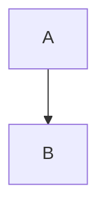

# ROADMAP — KOAS Presenter Kernel Family

**Author:** Olivier Vitrac, PhD, HDR | olivier.vitrac@adservio.fr | Adservio | 2026-02-11
**Status:** Brainstorm / Design Draft
**Depends on:** `ragix_kernels/base.py` (Kernel), KOAS pipeline (S1 → S2 → S3)
**Output format:** [MARP](https://marp.app/) (Markdown Presentation Ecosystem)

---

## 1. Vision

**One command turns a folder of documents into a polished presentation.**

```
presctl render ./workshop/ -o slides.pdf --theme adservio
```

The KOAS Presenter is a new kernel family (`ragix_kernels/presenter/`) that transforms
a corpus of Markdown/text documents — with their equations, illustrations, tables, and
code blocks — into structured MARP slide decks, then exports to PDF/HTML/PPTX.

### Core Architectural Principles

> **P1. Separate content generation from layout rendering.**

> **P2. Separate raw extraction from semantic normalization.**

These two principles create three clean boundaries:

```
   RAW EXTRACTION          SEMANTIC NORMALIZATION       LAYOUT RENDERING
 ┌──────────────────┐    ┌──────────────────────┐    ┌──────────────────────┐
 │  S1 Folder scan  │    │  S2a Normalize       │    │  S3a MARP renderer   │
 │  S1 Content ext. │──▶ │  S2b Slide planner   │──▶ │  S3b MARP export     │
 │  S1 Asset catalog│    │  S2c Layout mapper    │    │       (marp-cli)     │
 └──────────────────┘    └──────────────────────┘    └──────────────────────┘
     ▲ source files       ContentCorpus → JSON         ▼ .pdf / .html / .pptx
                         NormalizedCorpus  schema
```

Two contracts:
- **`NormalizedCorpus`** — between raw extraction (S1) and structuring (S2)
- **`SlideDeck` JSON schema** — between structuring (S2) and rendering (S3)

Content generation knows *what* to present; layout rendering knows *how* to render it.
Each boundary can be replaced or improved independently.

**Why two boundaries?** (per peer review) Well-structured Markdown passes directly
through the normalizer (identity transform). But messy real-world input — mixed notes,
email dumps, audit logs, RAG exports, scientific drafts — needs semantic intelligence
*before* the deterministic slide planner can produce coherent decks. The LLM operates
exclusively at the normalization boundary: it never touches layout, assets, or MARP syntax.

### Why MARP?

| Property | Benefit |
|----------|---------|
| **Markdown-native** | Zero impedance mismatch with KOAS document corpus |
| **KaTeX/MathJax built-in** | Block equations pass through unmodified |
| **CLI export** | `marp-cli` → PDF/HTML/PPTX, no GUI dependency |
| **Theme system** | CSS-based, supports custom corporate themes |
| **Speaker notes** | HTML comments → presenter mode / PDF annotations |
| **Image syntax** | `` — split layouts from Markdown |
| **Auto-scaling** | Long code blocks and equations scale to fit |
| **Sovereign** | Local binary, no cloud dependency |

---

## 2. Pipeline Architecture

### 2.1 Stage Map

```
folder/
  ├── notes.md
  ├── analysis.md
  ├── findings/
  │   ├── arch.md
  │   └── debt.md
  ├── figures/
  │   ├── fig01.svg
  │   └── fig02.png
  └── data/
      └── metrics.json

         ┌─────────────────────────── S1: COLLECTION ──────────────────────────┐
         │                                                                     │
         │   pres_folder_scan ──▶ pres_content_extract ──▶ pres_asset_catalog  │
         │   (file tree, types)    (semantic units)         (image/eq/table    │
         │                                                   inventory)        │
         └──────────────────────────────┬──────────────────────────────────────┘
                                        │ ContentCorpus
                                        │
         ┌─────────────────────── S2: STRUCTURING ─────────────────────────────┐
         │                                                                     │
         │   pres_semantic_normalize ──▶ pres_slide_plan ──▶ pres_layout_assign│
         │   (optional LLM:              (content → slides)  (slide → template)│
         │    cluster, dedupe,                                                 │
         │    narrative order)           Output: slide_deck.json               │
         │                                                                     │
         └──────────────────────────────┬──────────────────────────────────────┘
                                        │ SlideDeck JSON (THE CONTRACT)
                                        │
         ┌─────────────────────── S3: RENDERING ───────────────────────────────┐
         │                                                                     │
         │   pres_marp_render ──▶ pres_marp_export                             │
         │   (JSON → .md MARP)    (marp-cli → PDF/HTML/PPTX)                   │
         │                                                                     │
         └─────────────────────────────────────────────────────────────────────┘
```

### 2.2 Kernel Inventory (8 kernels)

| # | Kernel | Stage | LLM? | Input | Output |
|---|--------|-------|------|-------|--------|
| 1 | `pres_folder_scan` | S1 | No | folder path, glob patterns | `FileTree` — paths, types, sizes, hashes |
| 2 | `pres_content_extract` | S1 | No | FileTree + file contents | `ContentCorpus` — semantic units per file |
| 3 | `pres_asset_catalog` | S1 | No | FileTree + ContentCorpus | `AssetCatalog` — images, equations, tables, code |
| 4 | **`pres_semantic_normalize`** | **S2** | **Optional** | ContentCorpus | **`NormalizedCorpus`** — clustered, deduplicated, ordered |
| 5 | `pres_slide_plan` | S2 | No | NormalizedCorpus + AssetCatalog + outline? | `SlideDeck` (JSON schema) |
| 6 | `pres_layout_assign` | S2 | No | SlideDeck | `SlideDeck` (enriched with layout directives) |
| 7 | `pres_marp_render` | S3 | No | SlideDeck + AssetCatalog | `.md` file (MARP syntax) |
| 8 | `pres_marp_export` | S3 | No | `.md` file + theme CSS | `.pdf` / `.html` / `.pptx` |

### 2.3 Dependency Graph

```
pres_folder_scan
    ├──▶ pres_content_extract
    │        ├──▶ pres_asset_catalog
    │        │        │
    │        ▼        │
    │    pres_semantic_normalize  (optional LLM — identity fallback)
    │        │        │
    │        ▼        ▼
    │    pres_slide_plan ◀── (optional: user outline)
    │        │
    │        ▼
    │    pres_layout_assign
    │        │
    ▼        ▼
    pres_marp_render
         │
         ▼
    pres_marp_export
```

**Bypass path:** When `semantic_normalize.enabled = false`, the normalizer
passes `ContentCorpus` through unchanged as `NormalizedCorpus` (identity transform).
This preserves the fully deterministic pipeline for well-structured input.

---

## 3. Data Models

### 3.1 Content Extraction Units

The content extraction stage decomposes each document into **semantic units** —
the atomic building blocks of slides.

```python
class UnitType(str, Enum):
    HEADING       = "heading"        # Section title (H1-H6)
    PARAGRAPH     = "paragraph"      # Prose text block
    BULLET_LIST   = "bullet_list"    # Unordered list
    NUMBERED_LIST = "numbered_list"  # Ordered list
    TABLE         = "table"          # Markdown table
    CODE_BLOCK    = "code_block"     # Fenced code (```lang ... ```)
    EQUATION_BLOCK = "equation_block" # Display math ($$...$$)
    EQUATION_INLINE = "equation_inline" # Inline math ($...$)
    BLOCKQUOTE    = "blockquote"     # > quoted text
    IMAGE_REF     = "image_ref"      #  reference
    MERMAID       = "mermaid"        # ```mermaid ... ``` diagram
    FRONT_MATTER  = "front_matter"   # YAML front matter
    ADMONITION    = "admonition"     # > [!NOTE] / > [!WARNING] etc.

@dataclass
class SemanticUnit:
    id: str                          # "file-stem:L42-L58"
    type: UnitType
    content: str                     # Raw text
    source_file: str                 # Relative path from folder root
    source_lines: Tuple[int, int]    # (start, end) inclusive
    heading_path: List[str]          # ["H1 title", "H2 title", ...]
    depth: int                       # Heading nesting level (0=root)
    tokens: int                      # Estimated token count
    metadata: Dict[str, Any]         # Type-specific: language, alt_text, ...

@dataclass
class ContentCorpus:
    root: str                        # Folder path
    files: List[FileEntry]           # Scanned files
    units: List[SemanticUnit]        # All extracted units (ordered)
    outline: List[OutlineNode]       # Heading tree across all docs
```

### 3.2 Asset Catalog

```python
@dataclass
class Asset:
    id: str                          # "asset-NNN"
    type: AssetType                  # IMAGE | EQUATION | TABLE | CODE | DIAGRAM
    source_file: str                 # Origin document
    source_lines: Tuple[int, int]
    content: str                     # Raw content (equation text, table MD, code)
    path: Optional[str]             # File path for images/diagrams
    format: Optional[str]            # "svg", "png", "jpg", "mermaid"
    dimensions: Optional[Tuple[int, int]]  # (w, h) for images
    alt_text: Optional[str]
    caption: Optional[str]           # Extracted from surrounding text

@dataclass
class AssetCatalog:
    assets: List[Asset]
    by_type: Dict[AssetType, List[str]]   # type → [asset IDs]
    by_file: Dict[str, List[str]]         # source file → [asset IDs]
```

### 3.3 Normalized Corpus (THE SEMANTIC BOUNDARY)

The semantic normalizer transforms a raw `ContentCorpus` into a `NormalizedCorpus`
by adding clustering, deduplication, importance scoring, and narrative ordering.
Original `SemanticUnit` objects are preserved and *augmented*, never replaced —
provenance is maintained.

```python
class UnitRole(str, Enum):
    """Semantic role assigned by the normalizer."""
    CONTEXT        = "context"         # Background, setup
    PROBLEM        = "problem"         # Problem statement, gap, issue
    METHOD         = "method"          # Approach, methodology
    FINDING        = "finding"         # Result, observation, metric
    RECOMMENDATION = "recommendation"  # Action item, suggestion
    CONCLUSION     = "conclusion"      # Summary, takeaway
    REFERENCE      = "reference"       # Citation, link, appendix
    ILLUSTRATION   = "illustration"    # Figure, diagram, chart
    METADATA       = "metadata"        # Front-matter, boilerplate
    UNKNOWN        = "unknown"         # Unclassified

@dataclass
class NormalizedUnit(SemanticUnit):
    """SemanticUnit enriched with normalization metadata."""
    topic_cluster: Optional[str] = None       # "Architecture", "Security", ...
    importance: float = 0.5                    # 0.0–1.0, slide inclusion priority
    role: UnitRole = UnitRole.UNKNOWN
    summary: Optional[str] = None             # Extractive or abstractive summary
    duplicate_of: Optional[str] = None        # ID of canonical unit (if redundant)
    merge_group: Optional[str] = None         # Group ID for units to be merged

@dataclass
class TopicCluster:
    id: str                                    # "cluster-NNN"
    label: str                                 # Human-readable topic name
    unit_ids: List[str]                        # Member unit IDs
    importance: float                          # Aggregate importance
    suggested_slides: int                      # Estimated slide count

@dataclass
class NarrativeArc:
    """Suggested presentation storyline."""
    sections: List[str]                        # Ordered section labels
    # e.g., ["Context", "Problem", "Analysis", "Findings", "Recommendations", "Next Steps"]

@dataclass
class NormalizedCorpus:
    """ContentCorpus augmented with semantic structure."""
    raw: ContentCorpus                         # Original corpus (preserved)
    units: List[NormalizedUnit]                # Enriched units
    clusters: List[TopicCluster]               # Topic clusters
    narrative: NarrativeArc                    # Suggested ordering
    duplicates_removed: int                    # Count of deduplicated units
    merge_groups: Dict[str, List[str]]         # group_id → [unit_ids]
    normalization_mode: str                    # "identity" | "deterministic" | "llm"
```

**Key invariant:** `len(normalized.units) == len(raw.units)` — units are never
deleted, only flagged as `duplicate_of` (excluded from slide planning). The slide
planner filters on `duplicate_of is None` and orders by `narrative.sections`.

**When LLM is disabled:** The normalizer uses deterministic heuristics:
- Clustering by heading path (same H1/H2 prefix → same cluster)
- Importance by document position (early sections higher) and content type
- Deduplication by string similarity (Jaccard > threshold)
- Narrative ordering by filename/directory order (depth-first)
- Role assignment by keyword patterns ("recommand" → RECOMMENDATION, etc.)

### 3.4 Slide Deck JSON Schema (THE CONTRACT)

This is the central data structure — the clean boundary between content generation
and layout rendering. Everything upstream produces it; everything downstream consumes it.

```json
{
  "$schema": "https://json-schema.org/draft/2020-12/schema",
  "title": "KOAS Presenter — Slide Deck Schema v1.0",

  "type": "object",
  "required": ["metadata", "slides"],
  "properties": {

    "metadata": {
      "type": "object",
      "properties": {
        "title":        { "type": "string" },
        "subtitle":     { "type": "string" },
        "author":       { "type": "string" },
        "organization": { "type": "string" },
        "date":         { "type": "string" },
        "version":      { "type": "string" },
        "source_folder": { "type": "string" },
        "generated_by": { "type": "string", "const": "koas-presenter" }
      },
      "required": ["title", "author"]
    },

    "theme": {
      "type": "object",
      "properties": {
        "name":       { "type": "string", "default": "default" },
        "custom_css": { "type": "string" },
        "size":       { "type": "string", "default": "16:9" },
        "math":       { "type": "string", "enum": ["katex", "mathjax"], "default": "katex" }
      }
    },

    "slides": {
      "type": "array",
      "items": {
        "type": "object",
        "required": ["id", "type", "content"],
        "properties": {

          "id":   { "type": "string", "pattern": "^slide-[0-9]{3}$" },
          "type": {
            "type": "string",
            "enum": [
              "title",
              "section",
              "content",
              "two_column",
              "image_text",
              "image_full",
              "equation",
              "table",
              "code",
              "quote",
              "summary",
              "blank"
            ]
          },

          "content": {
            "type": "object",
            "properties": {
              "heading":    { "type": "string" },
              "subheading": { "type": "string" },
              "body":       { "type": "array", "items": { "type": "string" } },
              "bullets":    { "type": "array", "items": { "type": "string" } },
              "numbered":   { "type": "array", "items": { "type": "string" } },
              "code":       {
                "type": "object",
                "properties": {
                  "language": { "type": "string" },
                  "text":     { "type": "string" }
                }
              },
              "equation":   { "type": "string" },
              "table":      {
                "type": "object",
                "properties": {
                  "headers": { "type": "array", "items": { "type": "string" } },
                  "rows":    { "type": "array", "items": { "type": "array" } },
                  "caption": { "type": "string" }
                }
              },
              "image":      {
                "type": "object",
                "properties": {
                  "asset_id": { "type": "string" },
                  "path":     { "type": "string" },
                  "alt":      { "type": "string" },
                  "caption":  { "type": "string" }
                }
              },
              "columns":    {
                "type": "array",
                "items": {
                  "type": "object",
                  "properties": {
                    "width":   { "type": "string", "default": "50%" },
                    "body":    { "type": "array", "items": { "type": "string" } },
                    "bullets": { "type": "array", "items": { "type": "string" } },
                    "image":   { "$ref": "#/properties/slides/items/properties/content/properties/image" }
                  }
                }
              }
            }
          },

          "notes": { "type": "string" },

          "provenance": {
            "type": "object",
            "properties": {
              "source_file":  { "type": "string" },
              "source_lines": { "type": "array", "items": { "type": "integer" } },
              "heading_path": { "type": "array", "items": { "type": "string" } },
              "unit_ids":     { "type": "array", "items": { "type": "string" } },
              "method":       {
                "type": "string",
                "enum": ["extracted", "synthesized", "user_outline", "auto_section"]
              }
            }
          },

          "layout": {
            "type": "object",
            "properties": {
              "template":         { "type": "string" },
              "class":            { "type": "string" },
              "paginate":         { "type": "boolean", "default": true },
              "background_color": { "type": "string" },
              "background_image": { "type": "string" },
              "bg_position":      { "type": "string", "enum": ["left", "right", "center", "full"] },
              "bg_size":          { "type": "string", "default": "50%" },
              "bg_filter":        { "type": "string" }
            }
          }
        }
      }
    }
  }
}
```

**Design rationale:**

- `content` is **presentation-agnostic** — it knows *what* to show, not *how*
- `layout` is **content-agnostic** — it knows *how* to render, not *what*
- `provenance` links every slide back to source documents (KOAS traceability)
- `notes` holds speaker notes (→ MARP HTML comments, PDF annotations)
- Slide `type` constrains which `content` fields are populated
- `layout.template` maps to MARP directives + CSS classes

---

## 4. Kernel Design Details

### 4.1 `pres_folder_scan` — S1 Collection

**Purpose:** Recursively walk a folder, classify files, compute hashes.

```python
class PresFolderScanKernel(Kernel):
    name = "pres_folder_scan"
    stage = 1
    category = "presenter"
    requires = []
    provides = ["file_tree"]
```

**Config:**
```yaml
presenter:
  folder_scan:
    root: "./workshop/"
    include_patterns: ["**/*.md", "**/*.txt", "**/*.rst"]
    asset_patterns: ["**/*.svg", "**/*.png", "**/*.jpg", "**/*.jpeg", "**/*.gif", "**/*.pdf"]
    exclude_patterns: ["**/node_modules/**", "**/.git/**", "**/.*"]
    max_depth: 10
    follow_symlinks: false
```

**Output:** `FileTree` with entries classified as `document | asset | data | config | unknown`.

### 4.2 `pres_content_extract` — S1 Collection

**Purpose:** Parse each document into `SemanticUnit` list. Pure Markdown parsing, no LLM.

**Strategy — 3-pass extraction:**

1. **Structure pass** — Build heading tree, identify front-matter, extract document outline
2. **Block pass** — Split into block-level units (paragraphs, lists, tables, code fences,
   equations, blockquotes, admonitions, images)
3. **Annotation pass** — Attach heading path, compute tokens, classify content density

**Key decisions:**
- Uses `mistune` v3 AST parser (same as reviewer) for Markdown
- Plain `.txt` files: treat as single paragraph per blank-line-separated block
- Front-matter (`---` YAML `---`): extracted as metadata, not slide content
- Inline math (`$...$`): preserved inside parent unit, flagged in metadata
- Block math (`$$...$$`): extracted as standalone `EQUATION_BLOCK` unit
- Mermaid code blocks: extracted as `MERMAID` unit (asset potential)
- Image references: extracted as `IMAGE_REF`, linked to AssetCatalog

```python
class PresContentExtractKernel(Kernel):
    name = "pres_content_extract"
    stage = 1
    category = "presenter"
    requires = ["pres_folder_scan"]
    provides = ["content_corpus"]
```

### 4.3 `pres_asset_catalog` — S1 Collection

**Purpose:** Build a unified catalog of all presentable assets (images, equations, tables,
diagrams, code blocks). Cross-references file-system assets with document-embedded assets.

**Logic:**
- File-system images (SVG/PNG/JPG) → catalog with dimensions, format
- Document equations → catalog with rendered preview hint
- Document tables → catalog with row/col counts
- Document code blocks → catalog with language, line count
- Mermaid blocks → catalog as diagrams (renderable by marp-cli or pre-rendered)
- Deduplication: same image referenced in multiple documents → single asset entry

```python
class PresAssetCatalogKernel(Kernel):
    name = "pres_asset_catalog"
    stage = 1
    category = "presenter"
    requires = ["pres_folder_scan", "pres_content_extract"]
    provides = ["asset_catalog"]
```

### 4.4 `pres_semantic_normalize` — S2 Structuring (LLM BOUNDARY)

**Purpose:** Transform raw `ContentCorpus` into `NormalizedCorpus` by adding semantic
structure that messy, non-structured input lacks. This is where the LLM lives — isolated
from layout, assets, and rendering. The normalizer never generates slides; it only
structures content for the deterministic slide planner.

**Architectural parallel:** `md_pyramid` in the reviewer (LLM-powered hierarchical
summaries in S2, consumed by deterministic S3 reporting). Same pattern: LLM enriches
an intermediate representation; downstream kernels are deterministic.

```python
class PresSemanticNormalizeKernel(Kernel):
    name = "pres_semantic_normalize"
    stage = 2
    category = "presenter"
    requires = ["pres_content_extract"]
    provides = ["normalized_corpus"]
```

**Five normalization operations:**

| Op | What | How (LLM) | How (deterministic fallback) |
|----|------|-----------|---------------------------|
| **A. Topic clustering** | Group units into thematic blocks | Embed + cluster (sentence-transformers) or LLM classification | Heading-path prefix grouping |
| **B. Deduplication** | Merge near-duplicate content across files | Semantic similarity (embeddings, cosine > 0.85) | Jaccard token overlap > 0.70 |
| **C. Role assignment** | Label each unit's function | LLM classification → `UnitRole` enum | Keyword pattern matching |
| **D. Importance scoring** | Rank units for slide inclusion | LLM relevance scoring (0–1) | Position-based + content-type heuristic |
| **E. Narrative ordering** | Propose presentation storyline | LLM narrative arc generation | Document order (depth-first) |

**Config (reflects R1 tier ladder and R2 hybrid clustering):**
```yaml
presenter:
  semantic_normalize:
    enabled: true                        # false → identity pass-through
    mode: "auto"                         # auto | deterministic | llm
    # auto: embeddings-first, LLM on targeted ops only (see R1/R2)
    model: "mistral:instruct"            # Ollama model for LLM ops
    clustering:
      method: "embedding"                # heading_path | embedding
      embedding_model: "all-MiniLM-L6-v2"
      algorithm: "hdbscan"               # hdbscan | agglomerative
      cross_file_similarity_threshold: 0.75  # merge across files only if > τ
    llm_refinement:
      enabled: true                      # Phase 2: LLM re-label/merge/split
      max_operations: 8                  # max merge/split/move per run
      method_tag: "llm_refine"           # logged in provenance
    deduplication:
      enabled: true
      threshold: 0.70                    # Jaccard (deterministic) or cosine (embedding)
    importance:
      boost_headings: true               # H1/H2 get higher scores
      boost_findings: true               # Units with metrics/numbers
      decay_depth: 0.1                   # Score decay per heading depth level
    narrative:
      template: null                     # null → auto-detect, or explicit arc
      # e.g., ["Context", "Problem", "Analysis", "Findings", "Recommendations"]
    budget:                              # R1: tiered escalation caps
      tier: "auto"                       # auto | T0 | T1 | T2 | T3
      max_llm_input_tokens_per_cluster: 1500
      max_llm_output_tokens_per_cluster: 300
      max_llm_total_input_tokens_per_run: 20000
      max_llm_calls_per_run: 16
    language:                            # R4: multi-language support
      detection: "fasttext"              # fasttext | cld3 | none
      role_lexicon: "fr,en"              # bilingual keyword mapping
```

**Identity fallback (LLM disabled):**
```python
def compute(self, input: KernelInput) -> Dict[str, Any]:
    corpus = self._load_corpus(input)

    if not self.config.get("enabled", True):
        # Identity transform: wrap raw corpus unchanged
        return NormalizedCorpus(
            raw=corpus,
            units=[NormalizedUnit.from_semantic_unit(u) for u in corpus.units],
            clusters=[TopicCluster(id="cluster-000", label="All",
                                   unit_ids=[u.id for u in corpus.units],
                                   importance=1.0, suggested_slides=len(corpus.units))],
            narrative=NarrativeArc(sections=["Content"]),
            duplicates_removed=0,
            merge_groups={},
            normalization_mode="identity",
        ).to_dict()
    ...
```

**When is LLM necessary vs optional?** (decision matrix)

| Input Quality | Heading Tree? | Cross-file? | LLM Needed? | Mode |
|--------------|---------------|-------------|-------------|------|
| Structured Markdown (reports, docs) | Strong | No | No | `deterministic` |
| Workshop notes | Weak | Yes | Recommended | `auto` |
| Meeting notes / email dumps | None | Yes | **Yes** | `llm` |
| RAG exports / audit logs | Partial | Yes | **Yes** | `llm` |
| Scientific drafts (MD+LaTeX) | Moderate | Yes | Recommended | `auto` |
| Single well-structured file | Strong | No | No | `deterministic` |

**Prompt templates** (in `presenter/prompts/`):
- `normalize_cluster.j2` — "Given these text units, group them by topic"
- `normalize_role.j2` — "Classify this unit's function: context/problem/finding/..."
- `normalize_importance.j2` — "Rate this unit's relevance for a presentation (0–1)"
- `normalize_narrative.j2` — "Given these topic clusters, suggest a presentation arc"

**Budget control:** Each LLM operation is capped at `max_llm_calls`. Operations are
prioritized: clustering > deduplication > narrative > role > importance. If budget
is exhausted, remaining operations fall back to deterministic heuristics.

### 4.5 `pres_slide_plan` — S2 Structuring (THE KEY KERNEL)

**Purpose:** Transform the `NormalizedCorpus` + `AssetCatalog` into a `SlideDeck`.
This kernel is **fully deterministic** — all semantic intelligence lives upstream in the
normalizer. The slide planner applies structural rules to pre-organized content.

**Three operating modes:**

#### Mode A: Auto-Structured (deterministic, default)

Rule-based heuristics that transform document structure into slides:

| Rule | Document Pattern | Slide Type |
|------|-----------------|------------|
| R1 | H1 heading (first occurrence) | `title` slide |
| R2 | H2 heading | `section` divider slide |
| R3 | H3+ heading + short content | `content` slide |
| R4 | Paragraph > 100 words | Split into bullet points (extractive) |
| R5 | Bullet list (3-8 items) | `content` slide with bullets |
| R6 | Image + surrounding paragraph | `image_text` slide |
| R7 | Standalone image (no context) | `image_full` slide |
| R8 | Block equation | `equation` slide |
| R9 | Table (< 8 rows) | `table` slide |
| R10 | Table (>= 8 rows) | Split or summarize → `table` + overflow |
| R11 | Code block | `code` slide |
| R12 | Blockquote | `quote` slide |
| R13 | Multiple related figures | `two_column` slide (side by side) |

**Content density control:**
```yaml
presenter:
  slide_plan:
    mode: auto                       # auto | outline | llm
    max_bullets_per_slide: 6
    max_words_per_slide: 80          # target, not hard limit
    split_long_lists: true           # lists > max_bullets → multiple slides
    equation_standalone: true        # block equations get own slide
    code_standalone_min_lines: 5     # code blocks >= N lines → own slide
    merge_short_sections: true       # combine thin sections
    min_slides: 8                    # pad with summary/section slides
    max_slides: 60                   # hard cap
```

#### Mode B: Outline-Driven (deterministic + user guidance)

User provides a slide outline (YAML or Markdown) — the system fills content from the corpus:

```yaml
# outline.yaml
slides:
  - title: "Project Overview"
    source: "README.md"
    sections: ["introduction", "objectives"]

  - section: "Architecture"
    source: "analysis.md"
    headings: ["H2:Architecture*"]

  - title: "Key Findings"
    source: "findings/*.md"
    extract: "bullets"
    max_items: 5

  - title: "Dependency Graph"
    asset: "figures/fig08.svg"
    layout: "image_full"

  - title: "Metrics Summary"
    source: "data/metrics.json"
    extract: "table"
```

This mode uses the same extraction pipeline but constrains slide selection to the outline.
Unmatched outline entries → warning. Unused corpus content → skipped (logged).

#### Mode C: Normalized (semantic normalizer output)

When `pres_semantic_normalize` is enabled, the slide planner leverages enriched metadata:
- **Topic clusters** → natural section boundaries (one `section` slide per cluster)
- **Narrative arc** → slide ordering follows the suggested storyline
- **Importance scores** → low-importance units excluded or merged
- **Roles** → `finding` units get emphasis, `metadata` units are skipped
- **Deduplication** → `duplicate_of` units filtered out

This mode is **still deterministic** — the LLM already ran upstream in the normalizer.
The planner just reads the enrichment metadata and applies structural rules.

**Speaker notes and titles:** Optionally generated by the normalizer's `summary` field
(extractive or LLM-generated). If absent, the planner uses the first sentence of content.

```python
class PresSlidePlanKernel(Kernel):
    name = "pres_slide_plan"
    stage = 2
    category = "presenter"
    requires = ["pres_semantic_normalize", "pres_asset_catalog"]
    provides = ["slide_deck"]
```

**Important:** The slide planner never calls the LLM. All semantic intelligence is
upstream in the normalizer. This keeps the planner debuggable, reproducible, and fast.

### 4.6 `pres_layout_assign` — S2 Structuring

**Purpose:** Assign MARP layout directives to each slide based on its type and content.
Pure rule-based mapping — no LLM needed.

**Layout template registry:**

```python
LAYOUT_TEMPLATES = {
    "title": {
        "class": "lead",
        "paginate": False,
        "background_color": None,    # theme default
    },
    "section": {
        "class": "lead",
        "paginate": False,
        "background_color": "#2d3436",  # dark section divider
    },
    "content": {
        "class": None,
        "paginate": True,
    },
    "image_text": {
        "class": None,
        "paginate": True,
        "bg_position": "left",       # image left, text right
        "bg_size": "45%",
    },
    "image_full": {
        "class": None,
        "paginate": True,
        "bg_position": "center",
        "bg_size": "contain",
    },
    "equation": {
        "class": "equation",         # custom CSS for centered math
        "paginate": True,
    },
    "two_column": {
        "class": "columns",          # custom CSS for flex layout
        "paginate": True,
    },
    "code": {
        "class": "code",             # monospace theme
        "paginate": True,
    },
    "table": {
        "class": None,
        "paginate": True,
    },
    "quote": {
        "class": "quote",
        "paginate": True,
    },
    "summary": {
        "class": None,
        "paginate": True,
    },
}
```

**Image placement logic:**

For `image_text` slides, the layout mapper decides image position:
- If image is a chart/graph → `bg left` (data first, explanation right)
- If image is an architecture diagram → `bg right` (text explains, diagram shows)
- If image is wide (aspect > 2:1) → full-width above text instead of side-by-side
- Config override: `image_position: left | right | top | auto`

```python
class PresLayoutAssignKernel(Kernel):
    name = "pres_layout_assign"
    stage = 2
    category = "presenter"
    requires = ["pres_slide_plan"]
    provides = ["slide_deck_with_layout"]
```

### 4.7 `pres_marp_render` — S3 Rendering

**Purpose:** Convert the enriched `SlideDeck` JSON into a valid MARP Markdown file.
This is a **template-driven deterministic transform** — no decisions, just serialization.

**Output structure:**

```markdown
---
marp: true
theme: {theme.name}
paginate: true
math: katex
header: '{metadata.organization}'
footer: '{metadata.title} — {metadata.date}'
style: |
  {theme.custom_css}
---

<!-- _class: lead -->
<!-- _paginate: false -->

# {slide-001.content.heading}
## {slide-001.content.subheading}

{slide-001.content.body}

<!--
Speaker notes for slide 1
Provenance: {slide-001.provenance.source_file}:{slide-001.provenance.source_lines}
-->

---

<!-- _class: lead -->
<!-- _paginate: false -->
<!-- _backgroundColor: #2d3436 -->
<!-- _color: white -->

# {slide-002.content.heading}

---

...
```

**Rendering rules by slide type:**

| Slide Type | MARP Pattern |
|------------|-------------|
| `title` | `<!-- _class: lead -->` + `# heading` + `## subheading` |
| `section` | `<!-- _class: lead -->` + dark bg + `# heading` |
| `content` | `## heading` + body text + bullets |
| `image_text` | `` + text content |
| `image_full` | `` + optional caption |
| `equation` | `## heading` + `$$...$$` (auto-scaled) |
| `table` | `## heading` + Markdown table |
| `code` | `## heading` + ` ```lang ... ``` ` (auto-scaled) |
| `quote` | `## heading` + `> blockquote` |
| `two_column` | Flex div layout or `![bg left]` split |
| `summary` | `## heading` + numbered list |

**Asset handling:**
- Images: copy to `{output_dir}/assets/`, use relative paths in MARP
- SVG: preferred (scalable, crisp on projection)
- Mermaid: pre-render to SVG if mermaid-cli available, else inline code block

```python
class PresMarpRenderKernel(Kernel):
    name = "pres_marp_render"
    stage = 3
    category = "presenter"
    requires = ["pres_layout_assign", "pres_asset_catalog"]
    provides = ["marp_markdown"]
```

### 4.8 `pres_marp_export` — S3 Rendering

**Purpose:** Invoke `marp-cli` to convert MARP Markdown into final output formats.

**Export matrix:**

| Format | Command | Options |
|--------|---------|---------|
| PDF | `marp --pdf` | `--pdf-notes --pdf-outlines` |
| HTML | `marp` (default) | `--html` for custom tags |
| PPTX | `marp --pptx` | (images as backgrounds) |
| PNG | `marp --images png` | One image per slide |

**Requirements:**
- `marp-cli` installed (`npm install -g @marp-team/marp-cli` or `npx`)
- Chromium/Chrome for PDF/PPTX export (uses Puppeteer)
- Custom theme CSS file if not using built-in themes

**Fallback:** If `marp-cli` not available, the kernel produces only the `.md` file
and logs a warning with installation instructions. The MARP Markdown is still valid
and can be opened in VS Code with the Marp extension.

```python
class PresMarpExportKernel(Kernel):
    name = "pres_marp_export"
    stage = 3
    category = "presenter"
    requires = ["pres_marp_render"]
    provides = ["presentation_files"]
```

---

## 5. Content Extraction Strategy

### 5.1 Markdown Parsing Pipeline

Reuses the `mistune` v3 AST parser from the reviewer kernel family.

```
Raw .md file
    │
    ▼
┌─────────────────┐
│ Front-matter    │ → metadata (YAML)
│ extraction      │
└────────┬────────┘
         │
         ▼
┌─────────────────┐
│ AST parse       │ → block-level nodes
│ (mistune v3)    │
└────────┬────────┘
         │
         ▼
┌─────────────────┐
│ Unit extraction │ → SemanticUnit[]
│                 │   (heading, paragraph, list, table, code, equation, image)
└────────┬────────┘
         │
         ▼
┌─────────────────┐
│ Annotation      │ → heading_path, depth, tokens, content_density
│                 │
└────────┬────────┘
         │
         ▼
ContentCorpus
```

### 5.2 Equation Handling

| Pattern | Detection | Slide Treatment |
|---------|-----------|----------------|
| `$...$` inline | Regex + AST | Preserved in parent paragraph/bullet |
| `$$...$$` block | Regex + AST | Standalone `equation` slide |
| `\[...\]` display | Regex | Convert to `$$...$$` |
| `\(...\)` inline | Regex | Convert to `$...$` |
| `\begin{align}...` | Regex | Wrap in `$$...$$` |

**MARP compatibility:** MARP uses KaTeX (or MathJax) natively. Block equations are
auto-scaled in built-in themes. No conversion needed — pass through.

### 5.3 Illustration Handling

**File-system images:**
```
./figures/fig01.svg  →  Asset(id="asset-001", type=IMAGE, path="figures/fig01.svg",
                              format="svg", dimensions=(800, 600))
```

**Document-referenced images:**
```markdown

```
→ Linked to asset-001. Caption extracted from alt text.

**Mermaid diagrams:**
```markdown

```
→ Asset(type=DIAGRAM, format="mermaid", content="graph TD\n  A --> B")
→ If mermaid-cli available: pre-render to SVG → `assets/mermaid_001.svg`
→ If not: include as code block (MARP renders inline mermaid in some setups)

**Tables as assets:**
Large tables (>= 5 rows or >= 5 columns) are cataloged as assets for potential
image rendering (screenshot/SVG) if they overflow slide boundaries.

### 5.4 Multi-Document Ordering

When multiple files exist, the slide planner needs a document ordering strategy:

| Strategy | Logic | Use Case |
|----------|-------|----------|
| **Alphabetical** | Sort by filename | Simple default |
| **Depth-first** | Follow directory tree | Hierarchical corpus |
| **Outline-driven** | User-specified order | Controlled presentations |
| **Semantic** | By topic cluster (LLM) | Cross-document synthesis |
| **Priority** | Front-matter `priority` field | Explicit ranking |

Default: depth-first with alphabetical tie-breaking within directories.
Front-matter `order: N` or `priority: N` overrides default ordering.

---

## 6. Theme System

### 6.1 Built-in MARP Themes

MARP ships with 3 themes:

| Theme | Style | Best For |
|-------|-------|----------|
| `default` | Clean, minimal | Technical presentations |
| `gaia` | Modern, warm tones | Design-forward talks |
| `uncover` | Bold, high-contrast | Executive summaries |

### 6.2 Custom KOAS Themes (planned)

```
ragix_kernels/presenter/themes/
├── koas_corporate.css        # Adservio corporate identity
├── koas_academic.css         # Academic/conference style
├── koas_audit.css            # Audit report style (formal, data-heavy)
└── koas_workshop.css         # Workshop recap (informal, visual)
```

**Corporate theme features:**
- Logo in header/footer
- Corporate color palette (CSS variables)
- Consistent typography
- Slide numbering format
- Custom `lead`, `columns`, `equation`, `code` classes

**Theme contract:** Themes must define CSS classes for all 12 slide types.
The MARP renderer emits `<!-- _class: X -->` directives; themes provide the styling.

### 6.3 Theme Configuration

```yaml
presenter:
  theme:
    name: "koas_audit"              # Built-in or custom
    custom_css_path: null            # Override with external CSS
    size: "16:9"                     # 16:9 | 4:3
    math: "katex"                    # katex | mathjax
    header: "{organization}"
    footer: "{title} — {date}"
    paginate: true
    logo: "assets/logo.svg"         # Header logo
    colors:
      primary: "#0066cc"
      secondary: "#2d3436"
      accent: "#e17055"
      background: "#ffffff"
      text: "#2d3436"
```

---

## 7. CLI: `presctl`

Following the `reviewctl` pattern:

```
presctl — KOAS Presentation Generator

SUBCOMMANDS:
  render     Generate presentation from folder
  plan       Show slide plan without rendering
  export     Export existing MARP file to PDF/HTML/PPTX
  preview    Launch marp-cli server for live preview
  theme      List/validate themes
  outline    Generate outline template from folder

USAGE:
  presctl render <folder> [options]
  presctl plan <folder> [options]
  presctl export <marp-file> [options]
  presctl preview <marp-file> [options]
  presctl theme list
  presctl outline <folder> -o outline.yaml

OPTIONS (render):
  -o, --output <path>        Output file (default: slides.md)
  --format <fmt>             pdf | html | pptx | md (default: md)
  --theme <name>             Theme name (default: default)
  --outline <path>           User outline (YAML)
  --mode <mode>              auto | outline | llm (default: auto)
  --max-slides <n>           Maximum slide count (default: 60)
  --density <level>          compact | normal | detailed (default: normal)
  --no-notes                 Skip speaker notes generation
  --notes-depth <level>      none | section_only | file_line | full (default: file_line)
  --model <name>             LLM model for mode=llm (Ollama)
  --polished                 Request T3 tier: LLM on all clusters + speaker notes
  --lang <code>              Force language (fr | en | auto, default: auto)
  --workspace <path>         KOAS workspace for artifacts
  -v, --verbose              Verbose logging
```

**Example workflows:**

```bash
# Quick: folder → PDF
presctl render ./workshop/ -o workshop.pdf --format pdf --theme gaia

# Two-step: plan first, then render
presctl plan ./audit/ -o plan.json --verbose
# (review plan.json, adjust if needed)
presctl render ./audit/ --plan plan.json -o audit_slides.md

# From outline
presctl outline ./project/ -o outline.yaml
# (edit outline.yaml)
presctl render ./project/ --outline outline.yaml -o project.pdf --format pdf

# Preview mode (live reload)
presctl preview slides.md --port 8080

# Export existing MARP
presctl export slides.md -o slides.pdf --format pdf --pdf-notes
```

---

## 8. MCP Integration

Following the reviewer MCP pattern (4 tools via `register_presenter_tools()`):

```python
@mcp.tool()
def koas_present_folder(
    folder: str,
    output: str = "slides.md",
    theme: str = "default",
    mode: str = "auto",
    format: str = "md",
    max_slides: int = 60,
) -> str:
    """Generate a MARP presentation from a document folder.

    Recursively scans the folder for Markdown/text documents,
    extracts content and assets, plans slides, and renders
    MARP output.

    Returns: path to generated file + slide count + provenance summary.
    """
```

```python
@mcp.tool()
def koas_present_plan(
    folder: str,
    mode: str = "auto",
    max_slides: int = 60,
) -> str:
    """Preview the slide plan without rendering.

    Returns: JSON slide plan for review before committing to render.
    """
```

```python
@mcp.tool()
def koas_present_export(
    marp_file: str,
    format: str = "pdf",
    theme: str = None,
    pdf_notes: bool = True,
) -> str:
    """Export an existing MARP Markdown file to PDF/HTML/PPTX.

    Wraps marp-cli invocation.
    Returns: path to exported file.
    """
```

```python
@mcp.tool()
def koas_present_outline(
    folder: str,
) -> str:
    """Generate a slide outline template from folder contents.

    Scans folder, extracts document structure, produces
    a YAML outline that can be edited and fed back to
    koas_present_folder(mode='outline').

    Returns: YAML outline string.
    """
```

---

## 9. Implementation Milestones

| Milestone | Scope | Kernels | Complexity | Depends On |
|-----------|-------|---------|------------|------------|
| **M0** | Foundation | — | M | base.py, models, config |
| **M1** | Content extraction | 1-3 | L | M0, mistune v3 |
| **M2** | Deterministic slide planner | 5-6 | L | M1 |
| **M3** | MARP rendering | 7 | M | M2 |
| **M4** | CLI + export | 8 | M | M3, marp-cli |
| **M5** | Semantic normalizer (LLM) | 4 | L | M1, llm_wrapper, sentence-transformers |
| **M6** | Custom themes | — | S | M3 |
| **M7** | MCP integration | — | S | M4 |
| **M8** | Editable PPTX (python-pptx) | — | L | M2 (consumes same JSON schema) |

**Critical path:** M0 → M1 → M2 → M3 → M4 (fully deterministic end-to-end).
**LLM path:** M5 can be developed in parallel after M1, plugs into M2 via dependency graph.
**PPTX path:** M8 is a post-v1 second renderer (S3-alt), independent of MARP.

### M0 — Foundation & Infrastructure

- [ ] `ragix_kernels/presenter/__init__.py` — package, kernel registration
- [ ] `ragix_kernels/presenter/config.py` — `PresenterConfig` dataclass
- [ ] `ragix_kernels/presenter/models.py` — `SemanticUnit`, `NormalizedUnit`, `Asset`, `SlideDeck`, enums
- [ ] `ragix_kernels/presenter/schema/slide_deck_v1.json` — JSON Schema

### M1 — Content Extraction (S1)

- [ ] `pres_folder_scan` kernel — recursive walk, file classification, hashing
- [ ] `pres_content_extract` kernel — mistune AST → SemanticUnit[]
- [ ] `pres_asset_catalog` kernel — unified asset inventory
- [ ] Tests: fixture folder with mixed content → verify unit/asset counts

### M2 — Deterministic Slide Planning (S2, without normalizer)

- [ ] `pres_semantic_normalize` kernel — **identity mode only** (deterministic fallback)
- [ ] `pres_slide_plan` kernel — Mode A (auto-structured) rules engine
- [ ] `pres_layout_assign` kernel — template registry + assignment rules
- [ ] Outline parser for Mode B (YAML outline → slide constraints)
- [ ] Tests: corpus → normalize(identity) → slide plan → validate against JSON schema

### M3 — MARP Rendering (S3)

- [ ] `pres_marp_render` kernel — SlideDeck JSON → MARP Markdown
- [ ] Jinja2 slide templates (one per slide type)
- [ ] Asset copy pipeline (images → output/assets/)
- [ ] Tests: rendered .md → valid MARP (parse back, verify structure)

### M4 — CLI + Export

- [ ] `presctl` CLI (argparse, following reviewctl pattern)
- [ ] `pres_marp_export` kernel — marp-cli subprocess wrapper
- [ ] Fallback: graceful degradation when marp-cli unavailable
- [ ] Tests: end-to-end folder → PDF

### M5 — Semantic Normalizer (LLM-powered)

- [ ] `pres_semantic_normalize` kernel — full implementation (clustering, dedup, roles, narrative)
- [ ] Deterministic heuristics (Jaccard dedup, keyword roles, heading-path clusters)
- [ ] LLM operations (embedding clusters, role classification, narrative arc generation)
- [ ] Prompt templates: `normalize_cluster.j2`, `normalize_role.j2`, `normalize_narrative.j2`
- [ ] Budget control: `max_llm_calls`, prioritized operation queue
- [ ] Tests: messy input (mixed notes) → verify clustering + dedup counts
- [ ] Tests: identity mode output == raw corpus (no data loss)

### M6 — Custom Themes

- [ ] `koas_audit.css` theme
- [ ] `koas_corporate.css` theme
- [ ] Theme validation tool (`presctl theme validate`)

### M7 — MCP Integration

- [ ] `register_presenter_tools(mcp_server)` — 4 tools
- [ ] Integration with existing KOAS MCP server

---

## 10. Design Decisions & Trade-offs

### D1: Deterministic core, LLM at the edge

**Decision:** The auto-structured mode (Mode A) must produce valid presentations
without any LLM call. LLM is optional polish.

**Rationale:**
- Reproducibility: same folder → same slides
- Speed: no LLM latency for simple presentations
- Sovereignty: works fully offline
- Debuggability: rule-based transforms are inspectable

**Trade-off:** Auto-generated titles and summaries may be less polished than LLM versions.
Mode C addresses this when quality matters more than speed.

### D2: JSON schema as the hard boundary

**Decision:** The `SlideDeck` JSON schema is a versioned contract. Content generation
and layout rendering never communicate except through this schema.

**Rationale:**
- Either half can be replaced independently
- JSON can be hand-edited between S2 and S3
- Schema validation catches pipeline bugs at the boundary
- External tools could produce/consume the same schema

**Trade-off:** Some rendering optimizations require content awareness (e.g., "this equation
is too wide for side-by-side layout"). The schema must be expressive enough to carry hints.

### D3: MARP-specific rendering, format-agnostic planning

**Decision:** S1 and S2 know nothing about MARP. S3 is MARP-specific.
If we later want to target reveal.js, Beamer, or Google Slides, only S3 changes.

**Rationale:** Future-proofs the content pipeline. The JSON schema is the interface.

**Trade-off:** Some MARP-specific features (background image positioning, scoped styles)
require the layout mapper to understand MARP constraints. The `layout` field in the schema
is the compromise — it carries rendering hints without coupling to MARP syntax.

### D4: Asset copying vs. referencing

**Decision:** The MARP renderer copies all referenced assets to `{output_dir}/assets/`
and uses relative paths in the Markdown.

**Rationale:**
- Self-contained output directory (portable)
- Works with marp-cli (which resolves relative to .md file)
- No broken links when moving the output

**Trade-off:** Disk space duplication. For large asset folders (>100 MB), add a
`--symlink-assets` option that creates symlinks instead of copies.

### D5: Mermaid handling

**Decision:** Three strategies, chosen by availability:

1. **Pre-render** (mermaid-cli available): `.mmd` → `.svg` → include as image
2. **Inline** (MARP Mermaid plugin available): include as fenced code block
3. **Fallback** (nothing available): include as code block with note

**Rationale:** Mermaid rendering is fragile and environment-dependent.
Graceful degradation ensures the pipeline never fails on diagram content.

### D6: LLM isolation at the semantic boundary

**Decision:** The LLM operates **exclusively** inside `pres_semantic_normalize` (S2).
It never touches layout, rendering, assets, or MARP syntax. Downstream kernels
(`pres_slide_plan`, `pres_layout_assign`, `pres_marp_render`, `pres_marp_export`)
are fully deterministic.

**Rationale:**
- **Traceability**: every slide traces to source units, not to LLM hallucinations
- **Reproducibility**: disable LLM → identical output every run
- **Debuggability**: if slides are wrong, check the NormalizedCorpus JSON
- **Schema discipline**: LLM output is constrained to enrichment metadata
  (cluster labels, importance scores, roles), never free-form slide content
- **Budget control**: capped `max_llm_calls`, prioritized operations, deterministic fallback

**Anti-pattern this prevents:** "Just ask the LLM to generate slides directly."
That would destroy provenance, couple layout + content, break the JSON contract,
reduce reproducibility, and increase hallucination risk. The normalizer pattern
keeps LLM power without LLM chaos.

**Parallel:** The reviewer's `md_pyramid` (LLM summarization in S2, consumed by
deterministic `md_edit_plan` context assembly). Same hybrid philosophy as the
Unix-RAG agent (deterministic shell tools + LLM orchestration + JSON contract).

---

## 11. Example: End-to-End Flow

### Input folder

```
workshop/
├── README.md              # Workshop overview, objectives
├── 01_context.md          # Project context, stakeholders
├── 02_architecture.md     # System architecture (with Mermaid)
├── 03_findings.md         # Audit findings, metrics
├── 04_recommendations.md  # 12 prioritized recommendations
├── figures/
│   ├── coupling_heatmap.svg
│   ├── debt_radar.png
│   └── maven_graph.svg
└── data/
    └── metrics_summary.md  # Key numbers in table form
```

### Generated slide deck (auto mode, ~25 slides)

```
slide-001  title         "Workshop Title" (from README H1)
slide-002  content       "Objectives" (from README)
slide-003  section       "1. Context"
slide-004  content       "Project Context" (from 01)
slide-005  content       "Stakeholders" (from 01)
slide-006  section       "2. Architecture"
slide-007  image_text    "System Overview" + mermaid diagram (from 02)
slide-008  content       "Component Breakdown" (from 02)
slide-009  image_full    coupling_heatmap.svg
slide-010  section       "3. Findings"
slide-011  content       "Key Metrics" (from 03, bullets)
slide-012  table         "Metrics Summary" (from data/metrics_summary.md)
slide-013  image_text    "Technical Debt" + debt_radar.png
slide-014  image_full    maven_graph.svg
slide-015  content       "Critical Findings" (from 03)
slide-016  section       "4. Recommendations"
slide-017  content       "Priority 1: Critical" (from 04)
slide-018  content       "Priority 2: High" (from 04)
slide-019  content       "Priority 3: Medium" (from 04)
slide-020  content       "Priority 4: Low" (from 04)
slide-021  summary       "Key Takeaways" (synthesized)
slide-022  content       "Next Steps" (from 04 or README)
slide-023  title         "Thank You / Q&A" (auto-generated)
```

Each slide carries `provenance` back to the exact source file and line range.

---

## 12. Resolved Design Decisions (v1 Defaults)

> All 10 open questions resolved. Each resolution is consistent with the
> "deterministic core + optional LLM at the edge" principle and preserves
> the `SlideDeck` JSON schema as the hard boundary.

### R1. Normalizer LLM Budget — Tiered Escalation at Cluster Level

**Decision:** Adaptive budget with hard caps, reusing the reviewer's tier-based
escalation pattern but applied **per-cluster** (not per-corpus).

**Default (`mode=auto`):** Do not call the LLM on the whole corpus. Build clusters
deterministically first, then call LLM only for targeted operations:
(i) cluster naming, (ii) role labeling, (iii) extractive compression into
slide-sized units, (iv) optional speaker notes draft.

**Tier ladder:**

| Tier | Scope | LLM Operations | When |
|------|-------|---------------|------|
| **T0** | No LLM | Embeddings + heuristics only; titles from headings/first sentence | Default for structured input |
| **T1** | Top-K clusters | LLM on top-K clusters by importance (e.g., K=6), capped per-cluster | Auto-selected for medium corpora |
| **T2** | All clusters | LLM on all clusters, stricter per-cluster caps, no speaker notes | Auto-selected for large corpora |
| **T3** | Full polish | LLM on all clusters + speaker notes | User-requested "polished narrative" only |

**Adaptive tier selection:** Automatic based on corpus metrics from S1:

| Corpus Size | Files | Heading Quality | Auto Tier |
|-------------|-------|-----------------|-----------|
| < 500 units | < 5 | Strong | T0 |
| 500–2000 units | 5–20 | Mixed | T1 |
| > 2000 units | > 20 | Weak | T2 |
| Any | Any | User flag `--polished` | T3 |

**Hard caps (configurable):**

```yaml
presenter:
  semantic_normalize:
    budget:
      max_llm_input_tokens_per_cluster: 1500     # 1200–2000 range
      max_llm_output_tokens_per_cluster: 300      # 250–400 range
      max_llm_total_input_tokens_per_run: 20000   # 12k–30k depending on hardware
      max_llm_calls_per_run: 16                   # 8–24 bounded
```

**Escalation trigger:** Only escalate when validation fails (too-long slide bodies,
missing role tags, cluster incoherence warnings) — mirrors the reviewer's
"tier escalation on failure" logic.

### R2. Embedding vs. LLM Clustering — Embeddings-First, Bounded LLM Refinement

**Decision:** Two-phase hybrid. Embeddings produce the clusters; LLM refines labels.

**Phase 1 (deterministic):** Sentence-transformer embeddings (`all-MiniLM-L6-v2`)
+ clustering (HDBSCAN or agglomerative). Constraints:
- Do not mix files with different top-level headings unless similarity > threshold
- Reproducible once the embedding model is fixed

**Phase 2 (LLM refinement, optional):** Lightweight operations on cluster *summaries*,
not raw units. The LLM sees: (i) cluster centroid text (top-N representative sentences),
(ii) file list, (iii) top keywords, (iv) size metrics.

**Hybrid rule:** Embeddings produce clusters → LLM may perform at most M operations
(merge/split/move unit) under strict constraints. All LLM adjustments logged as
`method="llm_refine"` in provenance.

**Why this default:** Keeps speed predictable. Avoids global, expensive,
non-deterministic "clustering-by-LLM". LLM used only where embeddings are weak:
semantic role labeling, naming, condensation.

### R3. Incremental Re-rendering — Cache with Stable Cluster IDs

**Decision:** Incremental invalidation with stable identifiers. A tiny edit must
not reshuffle the whole deck.

**Cache boundaries:**
- `ContentCorpus.units` cached per file (SHA-256 hash-based)
- `NormalizedCorpus` cached with: per-unit embeddings, cluster assignments, cluster summaries

**On file change:**
1. Re-extract units for changed file only (S1)
2. Recompute embeddings for changed units only
3. Re-assign changed units to clusters via "nearest centroid with guardrails"
   (or re-run clustering only on impacted neighborhood)
4. Recompute affected cluster summaries + downstream slide plan only for slides
   whose `unit_ids` changed

**Slide stability mechanism:**
- Keep `slide_id` stable when the slide's "semantic anchor" (`cluster_id` + `role`)
  hasn't changed
- If a slide must change materially, log it explicitly (diff-friendly)

### R4. Multi-language Support — Deterministic Detection + Localized Labels

**Decision:** Yes, but split responsibilities cleanly.

| Layer | Responsibility |
|-------|---------------|
| **Normalizer** | Detect language per file (fastText langid or CLD3, deterministic). Store `lang` in unit metadata. |
| **Planner/templates** | Pick localized keywords and default section labels based on `metadata.lang` (or majority vote across files). |
| **Mixed-language** | Keep content as-is; localize only UI labels ("Sommaire", "Conclusion", "Next Steps"). |

**Role keywords:** Maintain a small bilingual lexicon (FR/EN) for
"recommandation/recommendation", "conclusion", "risques/risks", "limitations",
"prochaines étapes/next steps" — used both in heuristics and in LLM prompts.

### R5. Presenter Notes Depth — Configurable, Default `file_line`

**Decision:** Four levels, configurable. Machine-grade provenance always in the
`provenance` JSON field; MARP notes get a human-readable footer.

```yaml
presenter:
  notes:
    depth: "file_line"       # none | section_only | file_line | full
```

| Level | Content in MARP Speaker Notes |
|-------|------------------------------|
| `none` | No provenance in notes |
| `section_only` | Heading path only (e.g., "Architecture > Components") |
| `file_line` | File + line ranges (e.g., "02_arch.md:L42-L58") |
| `full` | File + lines + unit_ids + method tags |

**v1 default:** `file_line` — preserves KOAS traceability without cluttering
the presenter view. Full provenance always available in `slide_deck.json`.

### R6. PPTX Editability — MARP for v1, `python-pptx` as M8

**Decision:** Two tracks. Do not block v1 on editable PPTX.

| Track | Format | Editability | Timeline |
|-------|--------|-------------|----------|
| **v1** | MARP → PPTX | Image-based (non-editable) | M4 |
| **M8** | python-pptx → PPTX | Fully editable text/tables | Post-v1 |

**Rationale:** MARP PPTX is acceptable when PPTX is a *delivery* format.
If clients need an *authoring* format, M8 adds a second S3-alt renderer
(`pres_pptx_render`) consuming the same `SlideDeck` JSON schema.

### R7. Table Overflow — Split First, Image Fallback

**Decision:** Deterministic policy with measured constraints.

```
Table fits slide? ──yes──▶ Render as Markdown table
       │no
       ▼
Split row-wise ──fits──▶ Multiple slides, repeated headers
       │no
       ▼
Render to image ──▶ image_full slide + "See appendix" note
       │
       ▼
(if --density=executive) ──▶ Truncate top-N rows + "see appendix" link
```

**Thresholds (configurable):**
```yaml
presenter:
  table_overflow:
    max_rows: 12               # rows per slide
    max_cols: 8                # columns before image fallback
    max_cell_chars: 40         # monospace char count heuristic
    strategy: "split"          # split | image | truncate
```

### R8. Mermaid Pre-rendering — Optional, Graceful Degradation

**Decision:** Do not bundle mermaid-cli. Make it optional with 3-tier fallback
(already in D5, now locked).

| Available Tool | Strategy |
|---------------|----------|
| `mmdc` (mermaid-cli) | Pre-render to SVG → include as `image_full` |
| MARP Mermaid plugin | Keep as fenced code block (MARP renders inline) |
| Neither | Keep as code block + warning in build log (not in slides) |

### R9. Normalizer Warm-Start — Default, with Outline Projection

**Decision:** Warm-start is the default. Mode B applies a deterministic
"outline projection" layer on top of cached clusters.

**When user edits outline (Mode B after auto-plan):**
- Keep clusters; re-rank and re-select units according to outline constraints
- Only re-run clustering if outline introduces topic partitions that contradict
  existing clusters (e.g., user demands separation of two merged clusters)

**Mechanism:**
- `NormalizedCorpus` includes stable `cluster_id` and `unit_id` mappings
- Mode B applies a deterministic filter/selection layer ("outline projection")
- Mismatches logged (e.g., "outline requested 'Security' section but no cluster matches")

### R10. Interactive Preview — Watch JSON, Regenerate MARP

**Decision:** Yes, `presctl preview` watches the JSON schema.

**v1 (sufficient):**
```
Watch slide_deck.json → regenerate MARP .md → trigger marp-cli server reload
```

**Future (v2+):**
Direct JSON → browser rendering (skip MARP intermediate), for instant feedback.

**Benefit:** Users can hand-edit JSON (or outline) and instantly see impact
without re-running S1/S2. The JSON contract is the live preview source.

---

### Summary: v1 Default Set

| Question | v1 Default |
|----------|-----------|
| Q1 LLM budget | Tiered escalation at cluster level (T0 default) |
| Q2 Clustering | Embeddings-first + bounded LLM refinement |
| Q3 Incremental | Cache with stable IDs, invalidate per-file |
| Q4 Language | Deterministic detection + localized labels only |
| Q5 Notes | `file_line` (full provenance in JSON) |
| Q6 PPTX | MARP image-based for v1; editable `python-pptx` as M8 |
| Q7 Tables | Split first; image fallback |
| Q8 Mermaid | Optional `mmdc`, graceful degradation |
| Q9 Warm-start | Default on; outline projection layer |
| Q10 Preview | Watch JSON → regenerate MARP → server reload |

---

## 13. References

- [MARP Documentation](https://marp.app/)
- [Marpit Framework](https://marpit.marp.app/) — Skinny framework powering MARP
- [marp-cli](https://github.com/marp-team/marp-cli) — CLI converter
- [KaTeX Supported Functions](https://katex.org/docs/supported.html)
- KOAS Reviewer Specs: [`docs/developer/KOAS_reviewer_specs.md`](./KOAS_reviewer_specs.md)
- KOAS Reviewer Roadmap: [`docs/developer/ROADMAP_KOAS_REVIEWER.md`](./ROADMAP_KOAS_REVIEWER.md)

---

*"Same pipeline discipline, different output modality.
Content is king; layout is rendering; normalization is where the LLM earns its keep."*
