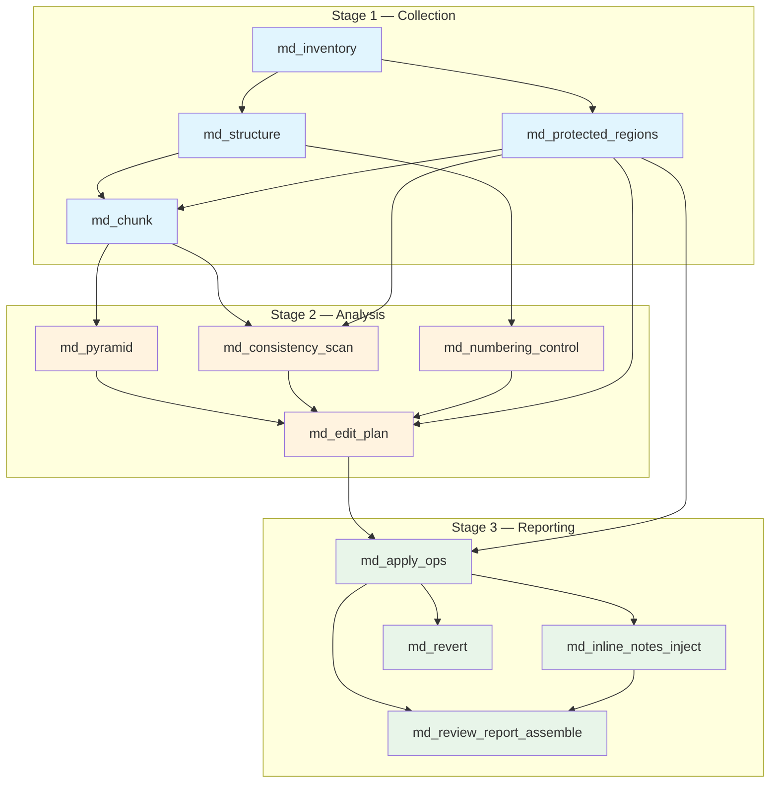
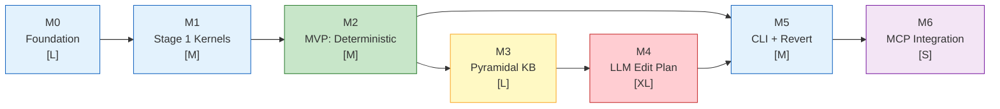

# ROADMAP — KOAS Reviewer Kernel Family

**Author:** Olivier Vitrac, PhD, HDR | olivier.vitrac@adservio.fr | Adservio | 2026-02-06
**Spec reference:** [`KOAS_reviewer_specs.md`](./KOAS_reviewer_specs.md) (14 sections, 993 lines)
**Status:** Draft — Implementation roadmap

---

## 1. Executive Summary

The **KOAS Reviewer** is a new kernel family (`ragix_kernels/reviewer/`) implementing a **traceable, reversible Markdown reviewer/editor** for documents larger than context windows. It produces human-navigable inline review notes (GitHub Alerts prefixed with `REVIEWER:`), supports selective undo by change ID (`RVW-####`), and maintains a pyramidal knowledge base for global coherence during local edits.

**Key design principles:**

- **Everything traceable** — every edit has an ID, provenance, scope, and rationale
- **Everything reversible** — selective revert by change ID via stored inverse patches
- **No silent deletions** — any deletion that changes meaning requires an inline alert
- **Markdown-only** — preserve structure, code fences, tables, math, front-matter
- **LLM at the edge** — deterministic core, LLM only for structured edit-op generation and pyramid summaries
- **Dual LLM backend** — `gpt-oss-safeguard:120b` (Ollama, sovereign) as golden standard; Claude API as alternative when sovereignty is not required

**Milestone overview:**

| Milestone | Scope | Complexity | Key Deliverable |
|-----------|-------|------------|-----------------|
| M0 | Foundation & infrastructure | L | Data models, Markdown parser, patch engine, ledger, LLM backend |
| M1 | Stage 1 — Collection | M | 4 deterministic kernels: inventory, structure, protected regions, chunk |
| M2 | MVP — Deterministic pipeline | M | Stage 2+3 deterministic kernels; full trace-and-revert with manual ops |
| M3 | Pyramidal KB | L | Single-document pyramid, context assembly, enhanced consistency scan |
| M4 | LLM Edit Plan | XL | Constrained LLM edit ops, Worker+Tutor, prompt templates |
| M5 | CLI + Selective Revert | M | `reviewctl` CLI, `md_revert` kernel with conflict detection |
| M6 | MCP Integration | S | 4 MCP tools for Claude Code orchestration |

---

## 2. Architecture

### 2.1 Target File Tree

```
ragix_kernels/reviewer/
├── __init__.py                       # Package registration
├── config.py                         # ReviewerConfig, ChunkConfig, LLMConfig
├── models.py                         # ChangeID, EditOp, LedgerEntry, ProtectedSpan, PyramidNode
├── md_parser.py                      # Markdown AST (mistune v3), heading tree, protected regions
├── patch_engine.py                   # Forward/inverse unified diff, hash-anchored application
├── ledger.py                         # JSONL append-only ledger, ChangeID allocator
├── llm_backend.py                    # Ollama + Claude API behind unified interface
├── context.py                        # Adaptive context assembly for edit-time injection
│
├── prompts/                          # Jinja2 prompt templates
│   ├── __init__.py
│   ├── review.j2                     # Edit-plan generation
│   ├── tutor_validate.j2             # Tutor verification
│   ├── pyramid_summary.j2            # Pyramid node summarization
│   └── regenerate.j2                 # Simplified retry after rejection
│
├── kernels/                          # All 12 kernels
│   ├── __init__.py
│   ├── md_inventory.py               # Stage 1 — File stats, SHA256, front-matter
│   ├── md_structure.py               # Stage 1 — Heading tree, anchors, numbering
│   ├── md_protected_regions.py       # Stage 1 — Code fences, inline code, YAML, tables, math
│   ├── md_chunk.py                   # Stage 1 — Structure-aligned chunk plan
│   ├── md_consistency_scan.py        # Stage 2 — AI leftovers, drift, duplicates, broken refs
│   ├── md_numbering_control.py       # Stage 2 — Heading/figure/table numbering validation
│   ├── md_pyramid.py                 # Stage 2 — Single-document hierarchical summaries
│   ├── md_edit_plan.py               # Stage 2 — LLM-constrained edit ops generation
│   ├── md_apply_ops.py               # Stage 3 — Validate + apply ops + patches
│   ├── md_inline_notes_inject.py     # Stage 3 — GitHub alert blocks (REVIEWER: prefix)
│   ├── md_review_report_assemble.py  # Stage 3 — Generate REVIEW_doc.md
│   └── md_revert.py                  # Stage 3 — Selective revert by change ID
│
├── cli/
│   ├── __init__.py
│   └── reviewctl.py                  # CLI entry point (review, report, revert, show, grep)
│
├── mcp/
│   ├── __init__.py
│   └── tools.py                      # 4 MCP tools (run, status, revert, show_change)
│
└── tests/
    ├── __init__.py
    ├── conftest.py
    ├── fixtures/
    │   ├── sample_small.md           # ~50 lines, 2 headings, 1 code fence
    │   ├── sample_medium.md          # ~500 lines, nested H1-H4, code+tables+YAML+math
    │   ├── sample_large.md           # ~3000 lines, simulated 200-page report
    │   ├── manual_edit_ops.json      # Pre-crafted EditOp list for M2
    │   ├── cached_llm_responses/     # Pre-recorded for CI (cache-replay)
    │   └── expected_outputs/
    ├── test_md_parser.py
    ├── test_patch_engine.py
    ├── test_ledger.py
    ├── test_kernels_stage1.py
    ├── test_kernels_stage2.py
    ├── test_kernels_stage3.py
    ├── test_pyramid.py
    ├── test_reviewctl.py
    └── test_invariants.py            # Cross-cutting deterministic invariants
```

### 2.2 Kernel Map (12 Kernels × 3 Stages)

| # | Kernel | Stage | Category | Deterministic | LLM | Description |
|---|--------|-------|----------|:---:|:---:|-------------|
| 1 | `md_inventory` | 1 (Collection) | reviewer | Yes | No | File stats, SHA-256, front-matter, code fences, tables |
| 2 | `md_structure` | 1 (Collection) | reviewer | Yes | No | Heading tree, section anchors, numbering patterns |
| 3 | `md_protected_regions` | 1 (Collection) | reviewer | Yes | No | Protected spans: code, YAML, tables, math, link refs |
| 4 | `md_chunk` | 1 (Collection) | reviewer | Yes | No | Structure-aligned chunk plan with hash-stable IDs |
| 5 | `md_consistency_scan` | 2 (Analysis) | reviewer | Partial* | Optional | AI leftovers (regex), register shifts, duplicates, broken refs |
| 6 | `md_numbering_control` | 2 (Analysis) | reviewer | Yes | No | Heading/figure/table numbering validation + fix proposals |
| 7 | `md_pyramid` | 2 (Analysis) | reviewer | No** | Yes | Bottom-up hierarchical summaries (single-document) |
| 8 | `md_edit_plan` | 2 (Analysis) | reviewer | No** | Yes | Constrained LLM produces structured edit ops per chunk |
| 9 | `md_apply_ops` | 3 (Reporting) | reviewer | Yes | No | Validate ops → apply → forward/inverse patches → ledger |
| 10 | `md_inline_notes_inject` | 3 (Reporting) | reviewer | Yes | No | Inject GitHub alert blocks after attention changes |
| 11 | `md_review_report_assemble` | 3 (Reporting) | reviewer | Yes | No | Generate `REVIEW_doc.md` from ledger |
| 12 | `md_revert` | 3 (Reporting) | reviewer | Yes | No | Selective inverse-patch application by change ID |

*\* v1 deterministic (regex); v2 adds optional LLM-assisted contradiction detection*
*\*\* Uses LLM at the edge, but output is validated deterministically*

### 2.3 Kernel Dependency Graph



### 2.4 Workspace Layout (Per Run)

Following KOAS-Docs conventions:

```
.KOAS/runs/run_<timestamp>_<uid>/
├── stage1/
│   ├── doc.raw.md              # Immutable snapshot
│   ├── doc.meta.json           # File stats, hashes
│   ├── outline.json            # Heading tree
│   ├── anchors.json            # Section anchors
│   ├── protected_spans.json    # Protected regions
│   └── chunks.json             # Chunk plan
├── stage2/
│   ├── preflight_findings.json # Deterministic validators
│   ├── coherence_issues.json   # Consistency scan findings
│   ├── numbering_findings.json # Numbering validation
│   ├── pyramid.json            # Hierarchical summaries
│   ├── pyramid.md              # Human-readable pyramid
│   └── ops/
│       ├── ops_CH-001.json     # Edit ops per chunk
│       └── edit_plan.json      # Merged edit plan
├── stage3/
│   ├── apply_log.jsonl         # Application log
│   ├── doc.edited.md           # Edited snapshot
│   └── doc.REVIEWED.md         # Final annotated document
├── review/
│   ├── ledger.jsonl            # Machine-readable audit trail
│   ├── patches/
│   │   ├── RVW-0001.patch
│   │   ├── RVW-0001.inverse.patch
│   │   └── ...
│   └── REVIEW_doc.md           # Human-readable review report
└── audit_trail/
    ├── run_metadata.json       # Tool/model versions, operator, hashes
    └── sovereignty.json        # local_only attestation, external_calls count
```

---

## 3. Reuse Analysis

### 3.1 Direct Reuse (No Modification Needed)

| Component | File | Interface | Strategy |
|-----------|------|-----------|----------|
| `Kernel` base class | `ragix_kernels/base.py` | `compute()`, `summarize()`, `validate_input()` | All 12 kernels subclass `Kernel` with `category="reviewer"`, inherit `run()`, `KernelInput`/`KernelOutput`, input hashing |
| `KernelRegistry` | `ragix_kernels/registry.py` | `discover()`, `resolve_dependencies()` | Auto-discovers `ragix_kernels/reviewer/kernels/*.py` via existing `pkgutil.walk_packages()` |
| `Orchestrator` | `ragix_kernels/orchestrator.py` | `run_stage()`, `ManifestConfig` | Manifest-driven stage execution, DAG dependency resolution, parallel mode, cache support |
| `ActivityWriter` | `ragix_kernels/activity.py` | `emit()`, `track_kernel()` | Centralized event logging; reviewer uses `scope="reviewer.kernel"` |
| `LLMCache` | `ragix_kernels/cache.py` | `get()`, `put()`, `CacheMode` | LLM response caching with sovereignty attestation; `CacheMode.READ_ONLY` for CI |
| `KernelCache` | `ragix_kernels/cache.py` | `get()`, `put()` | Deterministic kernel output caching for `--use-cache` mode |
| `llm_call()` | `ragix_kernels/llm_wrapper.py` | `llm_call(model, prompt, temperature, cache, mode, ...)` | Ollama backend with cache and activity integration; wrapped by `OllamaBackend` |

### 3.2 Pattern Reuse (New Code, Existing Architecture)

| Existing Component | File | Pattern Borrowed | Adaptation for Reviewer |
|-------------------|------|-----------------|------------------------|
| `DocPyramidKernel` | `ragix_kernels/docs/doc_pyramid.py` | 4-level bottom-up aggregation, level structure, i18n strings, output format | Multi-doc → single-doc: heading hierarchy replaces file clusters; hash-stable nodes for incremental updates; LLM-driven summarization (existing pyramid is pure aggregation). ~30% code reuse. |
| `DocSummarizeTutoredKernel` | `ragix_kernels/docs/doc_summarize_tutored.py` | Worker+Tutor two-model verification, `TutorConfig`, verdict protocol (ACCEPTED/CORRECTED/REJECTED), cache integration | Worker proposes edit ops (not summaries); Tutor validates protected-region respect and hallucination detection. Same retry logic. |
| `DocsConfig` | `ragix_kernels/docs/config.py` | Dataclass-based configuration with model selection, cache mode, language | Follow pattern for `reviewer/config.py`: `ReviewerConfig`, `ChunkConfig`, `LLMConfig`, `StyleRules` |
| `run_doc_koas.py` | `ragix_kernels/run_doc_koas.py` | CLI launcher with argparse, workspace init, stage execution, summary display | Follow for `reviewctl.py` with reviewer-specific subcommands |
| `ToolCallAdapter` | `ragix_core/reasoning_tutor/tool_call_adapter.py` | Structured output parsing (JSON/XML), format-agnostic dispatch, model auto-detection | Reference for edit-op JSON parsing from LLM output; may reuse extraction patterns |

### 3.3 New Code Required

| Component | Reason |
|-----------|--------|
| `md_parser.py` | No existing Markdown AST parser. Current `MarkdownChunker` (`ragix_core/chunking.py`) is header-regex only. Reviewer needs: full AST via mistune v3, protected-region-aware parsing, heading tree with stable IDs, token counting per node. |
| `patch_engine.py` | No patch/diff engine exists in codebase. Must support: forward + inverse unified diff, content-hash anchoring (not line numbers), conflict detection, batch application in reverse order. Uses `difflib` (stdlib). |
| `ledger.py` | No JSONL audit ledger exists. Must support: append-only writes (thread-safe via `threading.Lock`), filtered queries by ID/kind/severity/timestamp, `ChangeID` allocation, revert event tracking. |
| `llm_backend.py` | Existing `llm_call()` is Ollama-only. Need: `LLMBackend` ABC, `OllamaBackend` (wraps existing `llm_call()`), `ClaudeAPIBackend` (uses `anthropic` SDK), factory function, sovereignty metadata per call. |
| `context.py` | Novel module: adaptive context assembly from pyramid nodes for edit-time LLM injection. Priority-based budget allocation. No existing equivalent. |
| `reviewctl` CLI | New tool; no existing CLI pattern for document review in RAGIX. |
| MCP tools | 4 new tools following KOAS MCP conventions via `koas_helpers.py` patterns. |
| All 12 kernels | Core reviewer logic is entirely new domain code. |

---

## 4. Pyramidal Decomposition

### 4.1 The Problem

A 200-page technical report contains ~100K tokens. Even `gpt-oss-safeguard:120b` (~128K context) leaves insufficient room for instructions and output. Claude Opus (200K context) has diminished attention on large inputs. The reviewer must **edit locally** while **reasoning globally**.

### 4.2 Single-Document Pyramid (4 Levels)

Unlike `doc_pyramid.py` which aggregates across a corpus (corpus → domain → group → document), the reviewer builds a hierarchy **within a single Markdown document**, aligned to its heading structure:

```
Level 0 (root): Document abstract                       ≤ 500 tokens
    └── Level 1: Top-level section summaries (H1/H2)    ~200 tokens each
        └── Level 2: Subsection summaries (H3/H4)       ~150 tokens each
            └── Level 3: Paragraph-group micro-summaries ~100 tokens each
```

Each `PyramidNode` stores:

```json
{
  "node_id": "S2.3",
  "level": 2,
  "heading": "Reasoning, Acting, and Their Limitations",
  "anchor": "doc.md#reasoning-acting",
  "content_hash": "sha256:abc123...",
  "summary": "This subsection argues that...",
  "keywords": ["reasoning", "acting", "limitations"],
  "claims": ["X implies Y under condition Z"],
  "dependencies": ["S2.1", "S2.2"],
  "children": ["S2.3.1", "S2.3.2"],
  "token_count": 1240
}
```

### 4.3 Bottom-Up Construction Algorithm

```
ALGORITHM: BuildPyramid(document, heading_tree, chunks)

INPUT:
  - heading_tree: from md_structure (with section boundaries)
  - chunks: from md_chunk (with stable IDs and content hashes)

PHASE 1 — Level 3 (leaf nodes):
  For each leaf section (no sub-headings):
    group_text = concatenate(chunks ∈ section)
    IF token_count(group_text) ≤ 1500:
      summary = LLM_summarize(group_text,
        constraints="Extract key claims, terms, dependencies.
                     Preserve cross-references to other sections.")
    ELSE:
      Split into paragraph groups of ~1000 tokens each.
      For each group: summary = LLM_summarize(group, ...)
      Section summary = LLM_synthesize(group_summaries)
    Store PyramidNode with content_hash.

PHASE 2 — Level 2 (subsections):
  For each H3/H4 parent:
    children_summaries = [pyramid[child].summary for child in children]
    summary = LLM_summarize(join(children_summaries),
      constraints="Preserve cross-references. Maintain argument flow.")
    Store PyramidNode.

PHASE 3 — Level 1 (top sections):
  For each H1/H2:
    children_summaries = [pyramid[child].summary for child in children]
    summary = LLM_summarize(join(children_summaries),
      constraints="Capture scope and key contributions.")
    Store PyramidNode.

PHASE 4 — Level 0 (document abstract):
  all_L1 = [pyramid[section].summary for each top section]
  abstract = LLM_summarize(join(all_L1),
    constraints="Overall scope, structure, key claims, intended audience.")
  Store as root PyramidNode.

OPTIONAL — Global glossary:
  Collect unique keywords across all nodes.
  Generate terminology map: term → definition + first-occurrence section.
  Store as pyramid.glossary (~200 tokens).

OUTPUT: pyramid.json + pyramid.md
```

**Incremental update**: On subsequent runs, compare `content_hash` per node. Only recompute nodes whose source text changed and propagate upward to ancestors. Unchanged sections cost 0 LLM calls.

### 4.4 Context Injection at Edit Time

When `md_edit_plan` reviews a chunk $C$ in section $S.s.p$ (section → subsection → paragraph), the context window is assembled with **priority-based budget allocation**:

| Priority | Content | Budget | Source |
|----------|---------|--------|--------|
| 1 (always) | Target chunk text | ~40% (~1500 tok) | `chunks.json` |
| 2 (always) | Edit instructions + style rules | ~8% (~300 tok) | Template |
| 3 (high) | Document abstract (L0) | ~12% (~500 tok) | `pyramid.json` |
| 4 (high) | Current section summary (L1) | ~5% (~200 tok) | `pyramid.json` |
| 5 (high) | Issue findings for this chunk | ~5% (~200 tok) | `coherence_issues.json` |
| 6 (medium) | Current subsection summary (L2) | ~4% (~150 tok) | `pyramid.json` |
| 7 (medium) | Sibling section summaries (L1) | ~10% (~400 tok) | `pyramid.json` |
| 8 (low) | Global glossary | ~3% (~100 tok) | `pyramid.json` |
| **Total** | | **~87%** (~3350 tok) | |
| **Remaining for output** | | **~13%** (~500–1500 tok) | |

Based on a ~4000-token budget for local models. For `gpt-oss-safeguard:120b` (128K) or Claude Opus (200K), the budget is far more generous — more context can be injected, including full sibling texts.

### 4.5 Adaptive Context Assembly

```python
def assemble_context(chunk, pyramid, issues, style_rules, budget_tokens):
    """Priority-based adaptive context assembly.

    When budget is tight (8K model), drops low-priority items.
    When budget is generous (128K+ model), includes full siblings.
    """
    parts = []
    remaining = budget_tokens

    # ALWAYS: target chunk (~40% of budget)
    parts.append(("chunk", chunk.content))
    remaining -= count_tokens(chunk.content)

    # ALWAYS: edit instructions (~8%)
    parts.append(("instructions", render_instructions(style_rules)))
    remaining -= INSTRUCTION_TOKENS

    # Priority 3: Document abstract
    if remaining > 500:
        abstract = pyramid.root.summary
        parts.append(("abstract", abstract))
        remaining -= count_tokens(abstract)

    # Priority 4: Current section summary
    if remaining > 200:
        section = pyramid.get_parent(chunk)
        parts.append(("section_summary", section.summary))
        remaining -= count_tokens(section.summary)

    # Priority 5: Issue findings
    if remaining > 200:
        chunk_issues = filter_issues(issues, chunk.id)
        parts.append(("issues", format_issues(chunk_issues)))
        remaining -= count_tokens(parts[-1][1])

    # Priority 6: Subsection summary
    if remaining > 150:
        subsection = pyramid.get_subsection(chunk)
        if subsection:
            parts.append(("subsection_summary", subsection.summary))
            remaining -= count_tokens(subsection.summary)

    # Priority 7: Sibling summaries (2 nearest)
    if remaining > 400:
        siblings = pyramid.get_siblings(chunk, max_count=2)
        for sib in siblings:
            sib_text = sib.summary
            if remaining > count_tokens(sib_text):
                parts.append(("sibling", sib_text))
                remaining -= count_tokens(sib_text)

    # Priority 8: Global glossary (fallback for tight budgets)
    if remaining > 100 and pyramid.glossary:
        parts.append(("glossary", pyramid.glossary[:remaining * 4]))

    return parts
```

### 4.6 Granularity Adaptation (Small Context Budgets)

When the local model has a small context window (e.g. 4K tokens):

1. **Drop distant siblings** — keep only immediate neighbors (prev/next section)
2. **Compress to L0 + current section only** — skip L1 siblings entirely
3. **Extract global terminology map once** (~200 tokens) — shared across all chunks
4. **Sub-split large chunks** at sentence boundaries to fit within budget
5. **`--skip-pyramid`** flag: bypass pyramid entirely, review chunk-by-chunk with no global context (fast but less coherent)

### 4.7 Handling Very Large Documents (100K+ Tokens)

| Dimension | Strategy |
|-----------|----------|
| **LLM call count** | ~109 calls for a 200-page report (80 leaf + 20 subsection + 8 section + 1 abstract). Cached after first run. |
| **Incremental update** | Each node stores `content_hash`. On re-run, unchanged sections skip LLM calls. Only modified branches recompute upward. |
| **Parallelism** | Level 3 summaries (leaf nodes) are independent → parallel via `ThreadPoolExecutor`. |
| **Model tiering** | Fast model (7B) for pyramid summaries, large model (120B) for edit ops. Configurable per kernel. |
| **Batching** | Group 3-5 micro-summaries per LLM call where context allows. |
| **Skip mode** | `--skip-pyramid` flag for users who want quick review without global coherence (edits still work, just no cross-section context). |
| **Large leaf sections** | If a section with no sub-headings exceeds token budget, `md_chunk` sub-splits at paragraph boundaries. The pyramid builds L3 micro-summaries for each sub-chunk. |

### 4.8 Comparison: Doc Pyramid vs. Reviewer Pyramid

| Aspect | `doc_pyramid.py` (existing) | `md_pyramid.py` (reviewer) |
|--------|---------------------------|---------------------------|
| **Scope** | Multi-document corpus | Single Markdown document |
| **Levels** | Corpus → Domain → Group → Document | Document → Section → Subsection → Paragraph-group |
| **Grouping** | TF-IDF clustering + Leiden | Heading structure (deterministic) |
| **Input** | `doc_metadata`, `doc_concepts`, `doc_cluster`, `doc_extract`, `doc_coverage` | `md_chunk` only |
| **LLM usage** | None (pure aggregation) | Summarization at each level |
| **Incremental** | No (full rebuild) | Yes (hash-based selective recompute) |
| **Code reuse** | — | ~30% pattern reuse (level structure, i18n, output format) |

---

## 5. LLM Strategy

### 5.1 Dual-Backend Abstraction

```
┌─────────────────────┐
│    LLMBackend (ABC)  │
│  call()              │
│  sovereignty_info()  │
│  is_local: bool      │
└─────────┬───────────┘
          │
    ┌─────┴──────┐
    │            │
┌───▼───┐  ┌────▼────┐
│ Ollama │  │ Claude  │
│Backend │  │ API     │
│        │  │ Backend │
└───┬────┘  └────┬────┘
    │            │
    ▼            ▼
  Local       External
  (sovereign) (non-sovereign)
```

**`OllamaBackend`**: Wraps existing `ragix_kernels/llm_wrapper.py::llm_call()`. Uses `LLMCache` for caching and `ActivityWriter` for sovereignty attestation. Default model: `gpt-oss-safeguard:120b`.

**`ClaudeAPIBackend`**: Uses `anthropic` Python SDK. Same `LLMCache` interface (prompt hash keying). Audit trail marks `local_only: false` and logs the API endpoint. Optional dependency: `pip install ragix[claude]`.

Factory:

```python
def get_backend(config: LLMConfig) -> LLMBackend:
    if config.backend == "ollama":
        return OllamaBackend(model=config.model, endpoint=config.endpoint)
    elif config.backend == "claude":
        if config.strict_sovereign:
            raise SovereigntyError("Claude API rejected: --strict-sovereign is active")
        return ClaudeAPIBackend(model=config.model, api_key=config.api_key)
```

### 5.2 Model Configuration

| Role | Sovereign (default) | Non-sovereign alternative |
|------|-------------------|--------------------------|
| **Pyramid summaries** | `granite3.1-moe:3b` or `mistral:7b-instruct` (fast) | Claude Haiku (fast, cheap) |
| **Edit ops generation** | `gpt-oss-safeguard:120b` (golden standard) | Claude Opus (highest quality) |
| **Tutor validation** | `gpt-oss-safeguard:120b` | Claude Opus |

Configuration via `config.py`:

```yaml
llm:
  backend: ollama              # ollama | claude | auto
  pyramid_model: granite3.1-moe:3b   # Fast model for summarization
  edit_model: gpt-oss-safeguard:120b  # Primary model for edit ops
  tutor_model: null                   # null = single-model mode
  strict_sovereign: true              # Reject non-local backends
  temperature: 0.1
  timeout: 120
```

### 5.3 Worker+Tutor Architecture

Following the proven pattern from `doc_summarize_tutored.py`:

```
Worker model (fast)          Tutor model (large)
        │                           │
        ▼                           │
 Propose edit ops              ◄────┘
 for chunk C                   Validate:
        │                       - No hallucination
        ▼                       - Protected regions respected
  Edit ops JSON ──────────────► - Rationale quality check
        │                       - Alert format contract
        ▼                           │
  If ACCEPTED: ◄────────────────────┘
    pass to md_apply_ops
  If CORRECTED:
    use Tutor's corrections
  If REJECTED:
    retry with simplified prompt (max 2 retries)
  If STILL REJECTED:
    skip chunk, log WARNING
```

**Single-model mode**: When Worker+Tutor overhead is unacceptable (small documents, time constraints), use a single model for both proposal and self-verification. Configurable via `worker_model` / `tutor_model` in `config.py`. When `tutor_model: null`, Worker output goes directly to `md_apply_ops` without Tutor validation.

### 5.4 Sovereignty Tracking

Every LLM call is recorded via `ActivityWriter` with:

```json
{
  "scope": "reviewer.llm",
  "sovereignty": {
    "local_only": true,
    "endpoint": "http://127.0.0.1:11434",
    "model_digest": "sha256:abc123...",
    "hostname": "workstation-01"
  },
  "metrics": {
    "prompt_hash": "sha256:...",
    "response_hash": "sha256:...",
    "duration_ms": 2340,
    "cache_hit": false
  }
}
```

- `--strict-sovereign` CLI flag: rejects any non-local LLM backend (fails fast with `SovereigntyError`)
- `audit_trail/sovereignty.json` includes `external_calls` count and `local_only` boolean
- `REVIEW_doc.md` includes sovereignty attestation section

---

## 6. Milestones

### M0 — Foundation & Infrastructure

**Complexity**: L (Large)
**Dependencies**: None
**Goal**: Establish the `reviewer/` package with all shared infrastructure modules.

**Deliverables:**

| Module | Purpose | Lines (est.) | Notes |
|--------|---------|-------------|-------|
| `__init__.py` | Package registration, version string | ~20 | Follow `ragix_kernels/docs/__init__.py` pattern |
| `config.py` | `ReviewerConfig`, `ChunkConfig`, `LLMConfig`, `StyleRules` | ~150 | Follow `ragix_kernels/docs/config.py` pattern |
| `models.py` | `ChangeID`, `EditOp`, `LedgerEntry`, `ProtectedSpan`, `ReviewChunk`, `PyramidNode`, `ReviewNote` | ~250 | All JSON-serializable via dataclasses |
| `md_parser.py` | Markdown AST (mistune v3), heading tree, protected region detection, node classification, token counting | ~400 | **New dependency**: `mistune>=3.0` (pure Python, MIT, GFM) |
| `patch_engine.py` | Forward/inverse unified diff, hash-anchored application, conflict detection | ~350 | Uses `difflib` (stdlib); content-hash anchoring |
| `ledger.py` | JSONL append-only writer (thread-safe), reader with filtering, `ChangeID` allocator | ~200 | Thread-safe via `threading.Lock`; revert = new entry |
| `llm_backend.py` | `LLMBackend` ABC, `OllamaBackend`, `ClaudeAPIBackend`, factory | ~250 | `OllamaBackend` wraps existing `llm_call()` |

**Key decisions:**

- **Markdown parser**: `mistune` v3.x chosen over `markdown-it-py` — pure Python, fast, MIT, extensible renderer, GFM support, active maintenance. Thin abstraction layer in `md_parser.py` allows swap if needed.
- **Patch format**: Standard unified diff (`.patch`) for human readability and tool compatibility. Content-hash anchoring (not line numbers) for robustness across shifting content.
- **ChangeID format**: `RVW-NNNN` canonical. Optional namespace `RVW-GRAM-NNNN` for display; revert always uses canonical ID.
- **Ledger**: Append-only; reverts add new entries (type `"revert"`), never mutate existing entries.

**Exit criteria**: All data models serializable to/from JSON round-trip; `md_parser` correctly parses all 3 test fixtures (code fences, YAML, tables, math); patch engine round-trips (apply → invert → original byte-identical); ledger thread-safety verified under concurrent writes.

---

### M1 — Stage 1 Kernels (Collection)

**Complexity**: M (Medium)
**Dependencies**: M0
**Goal**: Deterministic document intake, structure extraction, protected region marking, chunk planning.

**Kernels:**

**`md_inventory`** — File stats and fingerprint
- Input: `doc_path`
- Output: `{ file_hash, line_count, size_bytes, has_frontmatter, code_fence_count, table_count }`
- Creates immutable snapshot `stage1/doc.raw.md` + `stage1/doc.meta.json`
- Similar to `doc_metadata` in KOAS-Docs but single-file scoped

**`md_structure`** — Heading tree and section boundaries
- Requires: `md_inventory`
- Parses Markdown via `md_parser.py` to extract heading tree
- Output: `outline.json` (heading tree with stable IDs, line ranges, anchors) + `anchors.json`
- Detects numbering patterns (explicit "1.2.3" vs. implicit heading levels)

**`md_protected_regions`** — Immutable span detection
- Requires: `md_inventory`
- Identifies: fenced code blocks (` ``` ` and `~~~`), inline code, YAML front matter, HTML blocks, tables (configurable), math blocks (`$$` and inline `$`), reference link definitions
- Output: `protected_spans.json` with kind, line range, content hash per span
- Policy: conservative — when in doubt, mark as protected

**`md_chunk`** — Structure-aligned chunk plan
- Requires: `md_structure`, `md_protected_regions`
- Chunk boundaries respect: section boundaries (never split mid-section if section fits budget), protected regions (never split inside code block or table)
- Each chunk: stable ID = `f"{section_anchor}_{content_hash[:8]}"`, section reference, line range, token estimate
- Config: `max_chunk_tokens` (default: 1800), `overlap_tokens` (default: 100)
- Handles large sections with no sub-headings by sub-splitting at paragraph boundaries
- Output: `chunks.json`

**Exit criteria**: All 4 kernels pass with 3 fixtures; chunk IDs are hash-stable (same input → same IDs); protected spans are complete (no false negatives on code fences or YAML).

---

### M2 — MVP: Deterministic Pipeline

**Complexity**: M (Medium)
**Dependencies**: M0, M1
**Goal**: Full trace-and-revert cycle with manually provided edit ops (no LLM required).

**Kernels:**

**`md_consistency_scan`** (v1, deterministic)
- Requires: `md_chunk`, `md_protected_regions`
- Detects:
  - AI leftover phrases (configurable regex list: "As an AI", "In conclusion", "Sure, here's", ...)
  - Register shifts (formal/casual scoring per paragraph, heuristic)
  - Duplicated paragraphs (SimHash or MinHash fuzzy comparison)
  - Orphan referents ("this", "it" without antecedent — heuristic)
  - Broken cross-references ("see Section X" where X not in outline)
- Output: `coherence_issues.json` with severity, location, evidence

**`md_numbering_control`**
- Requires: `md_structure`
- Validates:
  - Heading level continuity (no skipping H2 → H4)
  - Heading numbering sequence (if explicit "1.2.3" style)
  - Figure/Table/Equation numbering (gaps, duplicates)
  - Cross-reference existence ("Table 3" vs. actual tables)
- Generates deterministic renumbering proposals as `EditOp` objects
- Output: `numbering_findings.json` + optional `numbering_ops.json`

**`md_apply_ops`** — The critical deterministic engine
- Requires: edit ops (from `md_edit_plan` or manually provided), `md_protected_regions`
- **Validates each `EditOp`:**
  1. `before_hash` matches current content (reject if document changed)
  2. Target does not cross protected spans (reject if boundary violated)
  3. Deletion has `review_note` (enforce "no silent deletion")
  4. `needs_attention=true` has `review_note`
  5. Alert format starts with `REVIEWER:` and includes change ID
  6. No ID collisions with existing ledger entries
- **Applies edits in reverse order** (bottom-up by line number) to avoid offset shift
- For each applied op: generates forward patch (`.patch`), inverse patch (`.inverse.patch`)
- Appends to `ledger.jsonl`
- Output: `apply_log.jsonl`, updated doc snapshot, patches in `.review/patches/`

**`md_inline_notes_inject`**
- Requires: `md_apply_ops`
- For every `needs_attention=true` op: inserts GitHub alert block immediately after edited text
- Alert types mapped to severity:
  - `minor` → `[!NOTE]`
  - `attention` → `[!WARNING]`
  - `deletion` → `[!CAUTION]`
  - `critical` → `[!IMPORTANT]`
- Each alert starts with `REVIEWER: RVW-NNNN — <summary>`
- Output: final `doc.REVIEWED.md`

**`md_review_report_assemble`**
- Requires: `md_apply_ops`, `md_inline_notes_inject`
- Generates `REVIEW_doc.md` from ledger:
  - Run metadata (date, tool version, model, doc hash)
  - Summary counts (attention, deletions, silent minor)
  - Per-section change table (section id, change IDs, severities, rationales)
  - Full chronological ledger
- Output: `REVIEW_doc.md`

**MVP Demonstration:**

```bash
# User provides doc.md + edit_ops.json (hand-crafted)
python -m ragix_kernels.reviewer.cli.reviewctl review doc.md --ops edit_ops.json --no-llm
# → doc.REVIEWED.md + REVIEW_doc.md + .review/ledger.jsonl + patches

# Inspect a change
python -m ragix_kernels.reviewer.cli.reviewctl show doc.md RVW-0003

# Revert a change
python -m ragix_kernels.reviewer.cli.reviewctl revert doc.md RVW-0003
# → doc restored for that change, ledger updated with revert event
```

**Exit criteria**: End-to-end deterministic pipeline with hand-crafted ops; round-trip revert produces byte-identical original; `REVIEW_doc.md` renders correctly in GitHub; all invariants pass (see §8).

---

### M3 — Pyramidal Knowledge Base

**Complexity**: L (Large)
**Dependencies**: M0, M1, M2
**Goal**: Build single-document pyramid for handling large documents + adaptive context assembly.

**Deliverables:**

**`md_pyramid`** kernel
- Requires: `md_chunk`
- Implements the bottom-up construction algorithm (§4.3)
- Uses `llm_backend.py` for summarization calls
- Hash-based incremental update: unchanged nodes skip LLM calls
- Level 3 summaries parallelizable (independent leaf nodes) via `ThreadPoolExecutor`
- Config: `pyramid_levels` (1-4), `summary_max_tokens`, `model_for_summaries`
- Output: `pyramid.json` + `pyramid.md` + optional `glossary.json`

**`context.py`** module
- `assemble_edit_context(chunk, pyramid, issues, style_rules, budget_tokens)`
- Priority-based adaptive allocation (§4.5)
- Returns structured context dict ready for prompt template

**Enhanced `md_consistency_scan` v2** (optional LLM features)
- Add LLM-assisted contradiction detection: feed section summary pairs to LLM
- Add terminology consistency: extract key terms per section from pyramid, flag inconsistencies
- Both toggled by config (`llm_consistency: true/false`)
- Default: off (deterministic-only for speed)

**Exit criteria**: Pyramid builds correctly for all 3 fixtures; incremental update skips unchanged sections (verified by LLM call count); context assembly stays within token budget; `md_consistency_scan` v2 finds contradictions undetectable by regex alone.

---

### M4 — LLM Edit Plan Generation

**Complexity**: XL (Extra Large)
**Dependencies**: M0, M1, M2, M3
**Goal**: The non-deterministic kernel where LLM proposes structured edit operations.

**Deliverables:**

**`md_edit_plan`** kernel
- Requires: `md_chunk`, `md_pyramid`, `md_consistency_scan`, `md_numbering_control`, `md_protected_regions`
- For each chunk:
  1. Assembles context using `context.py`
  2. Renders prompt from `prompts/review.j2`
  3. Calls LLM (Worker model)
  4. Parses structured JSON edit ops from response
  5. Validates ops (hash check, protected spans, format)
  6. Optional: sends to Tutor model for validation
  7. If rejected: retry with simplified prompt (max 2 retries)
  8. If still rejected: skip chunk, log WARNING
- Output: `stage2/ops/ops_<chunk_id>.json` per chunk, merged `edit_plan.json`

**Edit op JSON schema** (from specs §14):

```json
{
  "ops": [
    {
      "id": "RVW-0034",
      "action": "replace",
      "target": {
        "chunk_id": "s2_3_a1b2c3d4",
        "anchor": "doc.md#reasoning-acting",
        "node_path": "2.3.p5",
        "line_start": 142,
        "line_end": 148
      },
      "before_hash": "sha256:abc123...",
      "before_text": "original text...",
      "after_text": "replacement text...",
      "needs_attention": true,
      "kind": "logic_flow",
      "severity": "attention",
      "silent": false,
      "review_note": {
        "alert": "WARNING",
        "text": "REVIEWER: RVW-0034 — Removed illogical transition..."
      },
      "rationale": "Sentence was off-topic and broke argument chain."
    }
  ]
}
```

**Rejection rules** (enforced deterministically by `md_apply_ops`):

1. `before_hash` mismatches (document changed since op was generated)
2. Target crosses protected spans
3. `action=delete` without `review_note`
4. `needs_attention=true` without `review_note`
5. `review_note.text` does not start with `REVIEWER:`
6. Change ID collision with existing ledger entries

**Prompt templates** (Jinja2):
- `prompts/review.j2` — Main review prompt with constraints: "Edit only editable nodes", "No silent deletion", "If uncertain: use `flag_only` action", "Every attention-worthy change requires REVIEWER: alert block"
- `prompts/tutor_validate.j2` — Tutor validation prompt (check hallucination, protected regions, rationale quality, alert format)
- `prompts/regenerate.j2` — Simplified retry prompt after rejection

**Graceful degradation**: Unparseable LLM output → skip chunk with WARNING in log; retry once with simplified prompt; never halt pipeline.

**Exit criteria**: Full LLM-driven review of `sample_medium.md`; all generated ops pass validation; Worker+Tutor mode catches at least one Worker error in test scenario; graceful degradation verified with intentionally malformed LLM output.

---

### M5 — CLI (`reviewctl`) + Selective Revert

**Complexity**: M (Medium)
**Dependencies**: M0, M1, M2, M4
**Goal**: Complete CLI and the `md_revert` kernel for selective undo.

**`md_revert`** kernel
- Input: `doc_path` + list of change IDs (or filter: `--kind`, `--since`, `--all`)
- Reads inverse patches from `.review/patches/RVW-NNNN.inverse.patch`
- **Conflict detection**: if a later change modified the same region, the inverse patch may not apply cleanly. In that case: report conflict, refuse silent application, offer manual resolution path.
- For bulk revert (`--all`): applies inverse patches in reverse chronological order (avoids most conflicts)
- Updates ledger with revert events (new entries, type `"revert"`)
- Output: reverted document + updated ledger

**`reviewctl` CLI** (following `run_doc_koas.py` pattern):

```
reviewctl review doc.md [OPTIONS]
    --in-place / --output doc.REVIEWED.md
    --max-chunk-tokens 1800
    --silent-minor true
    --strict                       # Refuse edits touching protected areas
    --rules rules.yaml             # House style rules
    --no-llm                       # Deterministic passes only (M2 mode)
    --skip-pyramid                 # Skip pyramid construction
    --ops edit_ops.json            # Manually provided edit ops
    --model <name>                 # Override edit model
    --worker-model <name>          # Override worker model
    --tutor-model <name>           # Override tutor model
    --strict-sovereign             # Reject non-local backends
    --llm-cache write_through|read_only|read_prefer|off

reviewctl report doc.md
    # Regenerate REVIEW_doc.md from ledger

reviewctl revert doc.md RVW-0034 [RVW-0040 ...]
    --range RVW-0034:RVW-0040      # Range revert
    --kind typo                     # Bulk revert by category
    --since 2026-02-06T10:00:00Z   # Time-based revert
    --all                           # Full run revert

reviewctl show doc.md RVW-0034
    # Show before/after snippet + rationale + patch references

reviewctl grep doc.md
    --severity attention            # Filter by severity
    --kind logic_flow               # Filter by kind
    --section 2.3                   # Filter by section
    --silent / --no-silent          # Include/exclude silent edits
```

**Exit criteria**: CLI exercises full pipeline; revert produces correct document state for single, range, and bulk operations; `reviewctl show` displays accurate before/after; `reviewctl grep` filters correctly.

---

### M6 — MCP Integration

**Complexity**: S (Small)
**Dependencies**: M0–M5
**Goal**: Expose 4 MCP tools for Claude Code orchestration.

Following KOAS MCP conventions: single values, simplified presets, mandatory summaries, details in files, auto-workspace.

| MCP Tool | Params | Returns |
|----------|--------|---------|
| `koas_docs_review_md_run` | `doc_path`, `language`, `style_preset`, `model` (opt), `workspace` (opt) | `summary`, `workspace`, `report_file`, `edited_file`, `details_file` |
| `koas_docs_review_md_status` | `workspace` | Progress, last kernel summary |
| `koas_docs_review_md_revert` | `workspace`, `doc_path`, `change_ids` (comma-separated string) | Summary + updated hashes |
| `koas_docs_review_md_show_change` | `workspace`, `change_id` | Short before/after + rationale + patch file references |

**Integration point**: Register in `MCP/ragix_mcp_server.py` alongside existing KOAS audit/security/docs tools, using `koas_helpers.py` patterns for auto-workspace and output simplification.

**Exit criteria**: All 4 tools callable from Claude Desktop / Claude Code; `review_md_run` produces correct workspace; `review_md_revert` round-trips correctly.

---

## 7. Milestone Dependency Chain



**Critical path**: M0 → M1 → M2 (MVP) → M3 → M4 → M5 → M6

**Early deliverable at M2**: Deterministic pipeline works end-to-end with manually crafted edit ops. No LLM dependency. Full trace-and-revert cycle demonstrated.

---

## 8. Testing Strategy

### 8.1 Per-Kernel Unit Tests

| Kernel Type | Strategy | CI Compatibility |
|-------------|----------|-----------------|
| **Deterministic** (Stage 1, Stage 3) | Run 3 times, assert hash-identical output | Full CI (no external deps) |
| **LLM-edge** (`md_pyramid`, `md_edit_plan`, `md_consistency_scan` v2) | Cache-replay mode (`CacheMode.READ_ONLY`) with pre-recorded responses | Full CI (cached responses in fixtures) |

### 8.2 Invariant Tests (Cross-Cutting)

These invariants must hold across **all** test scenarios:

1. **Deletion requires review_note**: `md_apply_ops` rejects any `delete` op without `review_note`
2. **Protected spans immutable**: No edit touches content inside `protected_spans` (unless `allow_protected_edits=true` AND `needs_attention=true`)
3. **Alert format contract**: Every injected alert is a GitHub alert block, starts with `REVIEWER:`, includes change ID
4. **Round-trip revert**: For any set of applied changes, reverting all produces byte-identical original document
5. **Hash verification**: Modify document between plan and apply → `before_hash` mismatch → rejection
6. **Ledger completeness**: Every applied edit has a corresponding ledger entry; every `needs_attention` edit has a `review_note`
7. **Silent edit policy**: Only categories in `silent_allowlist` (typo, punctuation, capitalization) may have `silent=true`

### 8.3 Integration Tests

- **Small document E2E**: `sample_small.md` through all 12 kernels
- **Medium document with code fences + tables**: Verify protected regions survive editing
- **Large document pyramid**: Build pyramid, edit one section, verify only that branch recomputed
- **Revert after partial edits**: Apply 10 ops, revert 3, verify remaining 7 intact
- **MVP mode (no LLM)**: `--no-llm` flag exercises deterministic pipeline only

### 8.4 Test Fixtures

```
tests/fixtures/
├── sample_small.md                   # ~50 lines, 2 headings, 1 code fence
├── sample_medium.md                  # ~500 lines, nested H1-H4, code+tables+YAML+math
├── sample_large.md                   # ~3000 lines, simulated technical report
├── manual_edit_ops.json              # Pre-crafted EditOp list for M2
├── cached_llm_responses/             # Pre-recorded for CI
│   ├── pyramid_responses.json
│   └── edit_plan_responses.json
└── expected_outputs/
    ├── sample_small.REVIEWED.md
    ├── REVIEW_sample_small.md
    └── sample_small_ledger.jsonl
```

All fixtures include: code fences, YAML front-matter, tables, math blocks, cross-references, intentional issues (AI leftovers, numbering gaps, duplicated paragraphs).

### 8.5 CI Configuration

```yaml
# CI without Ollama (cache-replay mode)
- name: KOAS Reviewer Tests
  run: |
    pytest ragix_kernels/reviewer/tests/ \
      --cache-mode=read_only \
      -x --tb=short
```

- **Smoke tests**: No Ollama required; all LLM calls served from cache
- **Full tests**: Require local Ollama with at least one model; run on developer machines
- **Benchmark tests** (optional): Track pyramid construction time and LLM call count on `sample_large.md`

---

## 9. Risks and Mitigations

| Risk | Impact | Likelihood | Mitigation |
|------|--------|:---:|------------|
| **Context window limits** on small local models | Edit quality degrades without global context | High | Granularity adaptation (§4.6): drop distant siblings, compress to L0 + current section, extract terminology map, sub-split at sentence boundaries |
| **Patch conflicts during revert** when multiple changes overlap | Revert produces corrupted document | Medium | Content-hash anchoring (not line numbers); reverse-chronological bulk revert; conflict detection aborts with clear error |
| **LLM output quality** — malformed ops, hallucinated content | Pipeline stalls or produces bad edits | High | Structured JSON schema with strict validation; Worker+Tutor pattern; graceful degradation (skip chunk with warning); cache-replay for regression |
| **Markdown parser edge cases** — GFM extensions, nested fences, HTML blocks | Protected regions missed; edits corrupt structure | Medium | Conservative protected region marking (over-protect rather than under); mistune v3 with GFM extensions; comprehensive fixtures with edge cases |
| **Performance on 200-page documents** — 100+ LLM calls for pyramid | Review takes hours | Medium | Hash-based caching (unchanged = 0 calls); Level 3 parallelism; model tiering (7B for pyramid, 120B for edits); `--skip-pyramid` flag; batching |
| **Sovereignty compliance** — accidental use of cloud API | Violates data sovereignty requirements | Low | `strict_sovereign: true` in config (default); `--strict-sovereign` CLI flag; `ClaudeAPIBackend` refused at initialization; audit trail marks `local_only: false` for any external call |
| **mistune v3 dependency** — breaking changes or unmaintained | Parser needs replacement | Low | Thin abstraction layer in `md_parser.py`; parser isolated behind `parse_markdown()` function; can swap to `markdown-it-py` if needed |

---

## 10. Open Questions

These require explicit decisions before or during implementation:

| # | Question | Options | Default Assumption |
|---|----------|---------|-------------------|
| 1 | **Alert block variants** — which GitHub Alert types to support? | `NOTE`, `WARNING`, `CAUTION`, `IMPORTANT`, `TIP` | Allow all five; map severity to type in config |
| 2 | **Output mode default** — in-place editing vs. `*.REVIEWED.md`? | `--in-place` (mutate original) vs `--output *.REVIEWED.md` (new file) | Default to `*.REVIEWED.md`; `--in-place` as opt-in |
| 3 | **Run folder naming** — follow KOAS-Docs convention exactly? | Match KOAS-Docs vs. reviewer-specific | Match KOAS-Docs: `.KOAS/runs/run_<timestamp>_<uid>/` |
| 4 | **Change ID format** — namespaced or flat? | `RVW-0001` (flat) vs. `RVW-GRAM-0001` (namespaced) | Flat `RVW-####` as canonical; `kind` field for categorization |
| 5 | **Table editing** — protected or editable? | Always protected vs. table-aware editing mode | Protected by default; `protect_tables: false` in config to enable |
| 6 | **Minimum model requirements** — smallest viable local model? | Granite 3B? Mistral 7B? Qwen 7B? | Pyramid: Granite 3B; Edit ops: Mistral 7B minimum |
| 7 | **`anthropic` SDK dependency** — optional or required? | Hard dependency vs. optional import | Optional: `pip install ragix[claude]` extra; `OllamaBackend` always available |
| 8 | **Markdown parser choice** — `mistune` v3.x vs. `markdown-it-py`? | Lighter/faster vs. CommonMark-strict | `mistune` (lighter, faster, sufficient for our needs) |
| 9 | **Style rules format** — should `rules.yaml` follow a specific schema? | Structured vs. freeform | YAML with `silent_allowlist`, `protected_regions`, `alert_thresholds`, `terminology_map` |

---

## 11. References

| Reference | Location | Role |
|-----------|----------|------|
| Specification | `docs/developer/KOAS_reviewer_specs.md` | Full 14-section design spec (993 lines) |
| `Kernel` base class | `ragix_kernels/base.py` | `compute()`, `summarize()`, `validate_input()` |
| Orchestrator | `ragix_kernels/orchestrator.py` | Manifest-driven stage execution |
| Registry | `ragix_kernels/registry.py` | Auto-discovery, `resolve_dependencies()` |
| Activity logging | `ragix_kernels/activity.py` | `ActivityWriter`, `ActivityEvent` |
| LLM cache | `ragix_kernels/cache.py` | `LLMCache`, `KernelCache`, `CacheMode` |
| LLM wrapper | `ragix_kernels/llm_wrapper.py` | `llm_call()` with cache and sovereignty |
| Doc pyramid | `ragix_kernels/docs/doc_pyramid.py` | 4-level multi-doc pyramid pattern |
| Worker+Tutor | `ragix_kernels/docs/doc_summarize_tutored.py` | Two-model verification pattern |
| Docs config | `ragix_kernels/docs/config.py` | Dataclass configuration pattern |
| Markdown chunking | `ragix_core/chunking.py` | `MarkdownChunker` — baseline reference |
| Tool call adapter | `ragix_core/reasoning_tutor/tool_call_adapter.py` | Structured output parsing patterns |
| MCP helpers | `MCP/koas_helpers.py` | Auto-workspace, output simplification |
| MCP server | `MCP/ragix_mcp_server.py` | Tool registration patterns |
