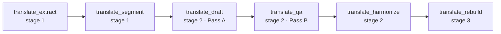

# KOAS-Translate — Design Proposal for a Translation Kernel Family

**Author:** Olivier Vitrac, PhD, HDR | olivier.vitrac@adservio.fr | Adservio | 2026-06-27
**Status:** P1 COMPLETE (2026-06-27) — 6/6 stage kernels registered (registry 94);
segment + rebuild verified byte-for-byte against the original pipeline. P2/P3 pending.
**Scope:** Promote the punctual EN→FR scientific translation pipeline
(`~/Documents/Adservio/draft/translation/`, ~1,955 LOC) into a registered KOAS
kernel family `translate`, reusing RAGIX infrastructure.

---

## 1. Motivation & current state

A protocol-driven (`translation.md`) pipeline already translated a full book
EN→FR, locally, on the GPU box. It is **not** throwaway scripting — it already
embodies the KOAS contract:

| Property | Where (current pipeline) |
|---|---|
| Deterministic decoding | `modelfiles/granite4.1-translate.Modelfile` (temp 0, top_p 1, top_k 1) |
| Idempotent + resumable | `out/tm.sqlite`, keyed by `segment_id` + `source_hash` |
| Auditable | per-segment `model`, `prompt_version`, `created_at/updated_at` |
| Protected spans | `P0001` codec in `pipeline/segment.py` / `pipeline/rebuild.py` |
| Terminology control | `glossary/glossary.csv` (EN, FR, rule) |
| Local-first | Ollama + conda env, no cloud |

Six stages: **extract → segment → draft (Pass A) → qa (Pass B) → harmonize →
rebuild**, orchestrated by a `Makefile`.

**Goal:** make this a first-class, reusable, multi-language RAGIX capability
rather than a single-book one-off.

## 2. Goals / non-goals

**Goals**
- Register the six stages as KOAS kernels (orchestrator-driven, provenance-tracked).
- Reuse `ragix_core/llm_backends.py`, the orchestrator, activity logging, MCP/CLI.
- Generalize beyond EN→FR (language-pair parameter) and beyond one book.
- Extract the protected-span codec to `shared/` (tested), for translate and any
  future substitution-based caller. *(Note — verified 2026-06-29: this codec is
  translate-specific; presenter, sealed, and reviewer use **different** protection
  mechanisms, so there is no cross-family consolidation. See §5.2.)*
- Add a test suite (the current pipeline has none).

**Non-goals (for v1)**
- Replacing the SQLite translation memory with the generic kernel cache (keep the TM).
- Cloud translation backends (stays local/Ollama; commercial APIs only via explicit opt-in).
- A GUI/CAT editor.

## 3. The generative-vs-compute kernel distinction (must settle first)

KOAS's headline guarantee is *"kernels compute deterministically; LLMs only plan
and reason, never produce metrics — no hallucinated numbers."* Translation
kernels **generate content with the LLM**, so they are a **generative** kernel
class, not deterministic-compute.

This is already true of `reviewer` and `summary` (LLM-authored edits/summaries),
so the family is consistent — but the README guarantee should be reworded to make
the boundary explicit:

> *Compute* kernels (audit, security, parts of docs/summary) never put an LLM in
> the numeric path. *Generative* kernels (reviewer, summary authoring, **translate**)
> use the LLM for content, and guarantee **reproducibility** instead of
> determinism via greedy decoding (temperature 0), pinned model digests, and a
> recorded `prompt_version`.

Action: add a "Kernel classes" subsection to `README.md` / `docs/KOAS.md`.

## 4. The `translate` kernel family

Stage maps onto KOAS's coarse `stage` (1=collection, 2=analysis, 3=reporting);
fine ordering is the `requires` DAG.



| Kernel | stage | requires | config (from manifest) | reads → writes (workspace) |
|---|---|---|---|---|
| `translate_extract` | 1 | — | `src_glob`, `max_pages?` | `src/*.pdf` → `out/source.md` |
| `translate_segment` | 1 | extract | `lang_pair`, `protect_rules` | `source.md` → `chunks.jsonl`, `tm.sqlite` |
| `translate_draft` | 2 | segment | `lang_pair`, `model`, `glossary`, `prompt_version`, `limit?` | TM.source → TM.raw_translation |
| `translate_qa` | 2 | draft | `model`, `prompt_version` | TM.raw → TM.qa_report, TM.final (when ok) |
| `translate_harmonize` | 2 | qa | `model`, `prompt_version` | TM.final → `chapter_revisions` |
| `translate_rebuild` | 3 | harmonize | `only_translated?` | chapters → `out/final.md` (+ unprotect) |

Each kernel implements `compute(self, input: KernelInput) -> Dict[str, Any]`
where `input.workspace` is the translation project dir, `input.config` the manifest
block, `input.dependencies` the upstream artifacts. `data` returns counts +
artifact paths; `summary` is the `make status` line (segments / translated / qa /
final / chapter_revisions). The base wraps it into `KernelOutput` with
`input_hash` for provenance — complementing (not replacing) the TM's per-segment
hashing.

**Resumability contract:** these kernels are long-running and externally stateful
(the TM). A kernel re-run is a no-op for segments whose `source_hash` and
`prompt_version` are unchanged — identical to today's behavior, but now reported
through `KernelOutput.summary` and the activity log.

## 5. Shared assets

### 5.1 Translation Memory store
Keep `pipeline/store.py` (218 LOC) as a family-local store
`ragix_kernels/translate/tm_store.py`. Schema is already clean (`segments`,
`chapter_revisions`); add `lang_pair` and `glossary_version` columns for
multi-pair reuse. **Do not** fold into the generic orchestrator cache — the TM is
a domain artifact (CAT-tool pattern), inspectable and portable.

### 5.2 Protected-span codec (unification)
Promote the `P####` mechanism to `ragix_kernels/shared/protected_spans.py`
with a tested API:

```python
def protect(text: str, rules: list[str]) -> tuple[str, dict[str,str]]   # → masked, map
def restore(text: str, mapping: dict[str,str]) -> tuple[str, Report]    # → text, missing/hallucinated
```

**Reality check (verified 2026-06-29):** the original "unify across presenter,
sealed, translate" premise was wrong. A repo-wide audit shows the `P####`
substitution codec has **no other caller** and the superficially-similar
mechanisms are fundamentally different:
- **presenter** (`marp_postprocess.py`): no span codec at all — pure layout regexes.
- **sealed** (`ragix_sealed/kernels/analysis.py`): `[TYPE_123 | role]` placeholders
  with crypto-vault reversal + entity semantics (redaction, not span-shielding).
- **reviewer** (`ragix_kernels/reviewer/models.py::ProtectedSpan`): a
  *region-avoidance* model `(kind, line_start, line_end, content_hash)` — marks
  line ranges the editor must not split/touch; the text is **never substituted**.

Token-substitution (translate) vs region-avoidance (reviewer) vs crypto-redaction
(sealed) are three different abstractions; force-fitting them would be harmful.
**P2 (cross-family consolidation) is therefore dropped.** The codec stays in
`shared/` as a tested, reusable utility — available if a real substitution-based
caller ever appears.

### 5.3 Glossary & model registry
- `glossary/<lang_pair>.csv` (EN,FR,rule today) → resolved by `lang_pair`.
- A small registry mapping `lang_pair → {ollama_model, modelfile, decoding}` so the
  pinned-determinism settings live in one declarative place (mirrors the sealed
  contracts pattern).

## 6. Infrastructure reuse
- Replace `pipeline/ollama_client.py` (198 LOC) with `ragix_core/llm_backends.py`;
  bake the deterministic params via the modelfile **and** assert them at call time.
- Emit per-stage events through the existing activity logger (`ragix_kernels/activity.py`).
- Optional `[translate]` extra in `pyproject.toml` (`pymupdf4llm`, etc.) — off the
  core install, exactly like `[sealed]`.

## 7. Exposure
- Orchestrator manifest template `templates/translate_manifest.yaml`.
- MCP tools (`koas_translate_run`, `koas_translate_status`) + `ragix-koas translate …`.
- `docs/KOAS_TRANSLATE.md` (mirror `KOAS_PRESENTER.md` structure).

## 8. Testing plan (mirror `tests/test_marp_postprocess.py`)
Pure-ish, no-LLM targets first:
- `protected_spans`: protect/restore round-trip, missing/hallucinated detection, idempotency.
- `segment`: chunk boundaries, hash stability, protected-map correctness.
- `rebuild`: stitch order, unprotect, missing-token report.
- TM store: idempotent upsert, `source_hash` invalidation, resume.
- LLM stages: mock backend (deterministic stub) to test gating logic (`qa` status=ok → final).

## 9. Module → kernel migration map

| Current | LOC | Becomes |
|---|---|---|
| `pipeline/extract.py` | 178 | `translate/extract.py` (kernel) — consider reusing `docs` extraction |
| `pipeline/segment.py` | 316 | `translate/segment.py` + `shared/protected_spans.py` |
| `pipeline/translate.py` | 194 | `translate/draft.py` |
| `pipeline/qa.py` | 151 | `translate/qa.py` |
| `pipeline/harmonize.py` | 170 | `translate/harmonize.py` |
| `pipeline/rebuild.py` | 132 | `translate/rebuild.py` |
| `pipeline/store.py` | 218 | `translate/tm_store.py` (+lang_pair) |
| `pipeline/ollama_client.py` | 198 | **drop** → `llm_backends.py` |
| `pipeline/glossary.py` / `config.py` | 49 / 127 | `translate/glossary.py` / merge into KOAS config |

## 10. Phasing
- **P1 — kernelize (no behavior change) — ✅ DONE (2026-06-27):** the six stages are
  registered kernels (`extract`, `segment`, `draft`, `qa`, `harmonize`, `rebuild`)
  reusing llm_backends; TM unchanged; backend seam + deterministic-stub tests; the
  shared `protected_spans` codec landed (extracted first). Acceptance: the
  deterministic kernels (`segment`, `rebuild`) reproduce the original pipeline
  **byte-for-byte** on the 30-page snapshot (`tests/test_translate_acceptance.py`,
  gated on `RAGIX_TRANSLATE_FIXTURE` — copyrighted book data never committed).
  *Deferred to P3:* orchestrator manifest + `koas` CLI status; the full real-LLM
  `make all` end-to-end (runs on the GPU, ~hours).
- **P2 — DROPPED (2026-06-29):** the planned cross-family consolidation does not
  exist — presenter has no span codec, sealed uses crypto entity placeholders, and
  reviewer uses region-avoidance `ProtectedSpan`. The codec stays translate-local
  in `shared/`. (See §5.2.) Next real work is therefore P3.
- **P3 — generalize:** language-pair parameter + glossary/model registry; MCP +
  CLI + `docs/KOAS_TRANSLATE.md`; `[translate]` extra packaging (ship `prompts/`);
  README "kernel classes" wording.

## 11. Decisions (resolved 2026-06-27)
1. **Family name:** `translate`. ✓
2. **Extraction:** keep the dedicated `pymupdf4llm` extractor for fidelity on
   math/figures/protected spans; revisit converging with the `docs` family later. ✓
3. **TM location:** per-project `out/tm.sqlite` (portable, inspectable, CAT-tool layout). ✓
4. **Repo placement:** public `ovitrac/RAGIX`, consistent with sealed/pentest;
   only kernel code ships — book/source content always stays out. ✓
5. **Counts:** the 6-kernel `translate` family takes the registry 88 → 94 (noted).

## 12. Risks
- Long single-call latency (~40 min/chunk) — kernels must stream progress and be
  killable/resumable; the orchestrator timeout model needs a long-running mode.
- Determinism caveat: greedy decoding is reproducible *per model digest*; pin the
  Ollama image/digest or record it in provenance.
- Scope creep into a CAT GUI — explicitly out of scope for v1.
