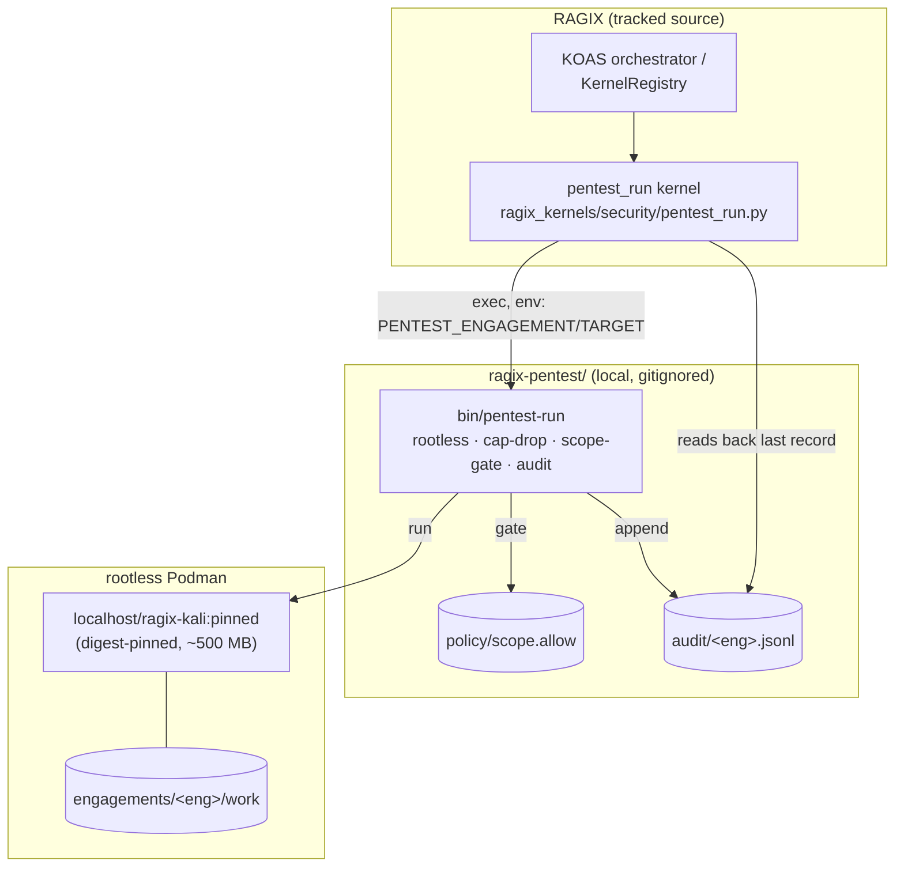

# Containerized Pentest Guide — `pentest_run` Kernel

**RAGIX Version:** 0.72.0+
**Author:** Olivier Vitrac, PhD, HDR | olivier.vitrac@adservio.fr | Adservio | 2026-06-22

---

## Overview

The `pentest_run` kernel executes offensive-security tools **inside a sovereign,
rootless Kali container** instead of running them bare on the host. It is the
containerized counterpart to the host-direct security kernels documented in
[SECURITY_KERNELS_GUIDE.md](SECURITY_KERNELS_GUIDE.md).

| | Host-direct kernels (`port_scan`, `web_scan`, …) | `pentest_run` (this guide) |
|---|---|---|
| Execution | Tool runs on the host | Tool runs in a rootless Kali container |
| Isolation | None (host namespace) | User namespace, `--cap-drop=ALL` + minimal caps |
| Toolkit | Whatever is installed on the host | Pinned, reproducible Kali image |
| Scope control | Kernel-level only | Enforced **scope gate** (refusal = exit 77) |
| Audit | Kernel JSON output | + append-only JSONL trail (image digest, target, argv) |

> ⚖️ **Authorized use only.** Run tools exclusively against targets you are
> legally/contractually authorized to test. The scope gate is a safety aid, not
> a substitute for authorization.

| Field | Value |
|---|---|
| Kernel name | `pentest_run` |
| Category | `security` |
| Stage | 1 (Discovery) |
| Source | `ragix_kernels/security/pentest_run.py` |
| Tooling | `ragix-pentest/` (local, **gitignored**) |
| Architecture | aarch64-native (x86 via emulation) |

---

## Architecture

The kernel is a thin orchestration layer. The **entire security boundary lives in
the wrapper** `ragix-pentest/bin/pentest-run`, so isolation, scope-gating, and
auditing are defined once and never re-implemented per caller.



**Why this split:** `ragix-pentest/` holds engagement data and target lists, so it
is **gitignored** and stays out of repo history. The kernel is **tracked** RAGIX
source and resolves the tooling at runtime (repo-relative path, or
`RAGIX_PENTEST_DIR`), degrading gracefully with a clean error if the tooling is
not built. Tracked code remains portable; local engagement artifacts stay local.

---

## Prerequisites

### 1. Host packages (one-time, requires sudo)

```bash
sudo apt update && sudo apt install -y \
  podman distrobox uidmap slirp4netns fuse-overlayfs passt \
  qemu-user-static binfmt-support
```

Rootless `subuid`/`subgid` delegation is set by Ubuntu's `adduser`; verify:

```bash
podman info --format '{{.Host.Security.Rootless}}'   # -> true
grep "^$USER:" /etc/subuid /etc/subgid               # -> a delegated range
```

### 2. Build the toolkit base (rootless, no sudo)

```bash
cd ragix-pentest
./build.sh            # pulls Kali, pins the digest -> image.lock, builds localhost/ragix-kali:pinned
```

The toolkit is declared in `ragix-pentest/packages.list` (single source of truth).
Add a line and rerun `./build.sh`; the build is **layer-cached**, so only the apt
step re-runs. Ad-hoc `apt install` *inside* a container does **not** persist
(containers run `--rm`).

### 3. RAGIX Python environment

RAGIX runs in the `ragix-env` conda environment:

```bash
source ~/miniforge3/etc/profile.d/conda.sh
conda run -n ragix-env python -c "from ragix_kernels.registry import KernelRegistry; KernelRegistry.discover(); print('pentest_run' in KernelRegistry.list_category('security'))"
# -> True
```

---

## Configuration

The kernel reads its options from `KernelInput.config`:

| Option | Type | Default | Description |
|---|---|---|---|
| `tool` | string | — (**required**) | Tool binary inside the container (e.g. `nmap`, `whatweb`) |
| `args` | list \| string | `[]` | Arguments for the tool (string is `shlex`-split) |
| `target` | string | `""` | Target host/IP; when set, **must** match `scope.allow` or the run is refused |
| `engagement` | string | `"default"` | Isolates the `/work` volume and the audit log |
| `pentest_dir` | path | `<repo>/ragix-pentest` | Override location of the tooling (or env `RAGIX_PENTEST_DIR`) |
| `timeout` | int | `600` | Subprocess timeout in seconds |

---

## Usage

### A. From Python (registry)

```python
from pathlib import Path
from ragix_kernels.registry import KernelRegistry
from ragix_kernels.base import KernelInput

KernelRegistry.discover()
K = KernelRegistry.get("pentest_run")

out = K().run(KernelInput(
    workspace=Path("./audit/acme"),
    config={
        "tool": "whatweb",
        "args": ["https://authorized.example"],
        "target": "https://authorized.example",
        "engagement": "acme",
    },
))
print(out.success, out.summary)
print(out.output_file)   # ./audit/acme/stage1/pentest_run.json
```

### B. From a KOAS manifest

```yaml
pentest_run:
  enabled: true
  options:
    tool: "nmap"
    args: ["-sV", "10.0.0.5"]
    target: "10.0.0.5"
    engagement: "acme"
```

### C. Direct wrapper (human-driven, still audited)

```bash
cd ragix-pentest
echo 10.0.0.5 >> policy/scope.allow
PENTEST_ENGAGEMENT=acme PENTEST_TARGET=10.0.0.5 ./bin/pentest-run -- nmap -sV 10.0.0.5
# interactive shell, same isolation profile:
PENTEST_ENGAGEMENT=acme ./bin/pentest-enter
```

---

## Output

`compute()` returns a JSON-serializable dict (persisted to
`<workspace>/stage1/pentest_run.json` with full kernel metadata):

| Field | Description |
|---|---|
| `tool`, `args`, `target`, `engagement` | Echo of the request |
| `command` | The exact wrapper invocation |
| `exit_code` | Tool exit code (`77` = scope refusal) |
| `scope_refused` | `true` when the scope gate blocked execution |
| `stdout` / `stderr` | Captured streams (capped at 20 000 / 4 000 chars) |
| `audit_record` | The JSONL audit line this invocation appended |
| `image` | Pinned image digest from the audit record |

The `summarize()` method emits an LLM-consumable one-liner (<500 chars), e.g.:

```
pentest-run [acme] nmap -sV 10.0.0.5 -> exit 0. Target: 10.0.0.5.
Containerized (rootless, cap-pruned), audited (image @359c8d8ea58f).
```

---

## Scope gate

When `target` is set, the wrapper checks it against `policy/scope.allow`
(exact-match, one target per line). A target not listed is **refused before any
execution** (`exit 77`), and the refusal is still audited:

```json
{"ts":"…","engagement":"acme","image":"…@sha256:359c…","target":"10.9.9.9",
 "note":"scope-refused","argv":["nmap","-sV","10.9.9.9"],"exit":77}
```

Leave `scope.allow` empty to disable the gate — then **you** are responsible for
scope.

---

## Audit & reproducibility

- **Audit trail:** every invocation (including refusals) appends one JSON object to
  `ragix-pentest/audit/<engagement>.jsonl`, recording timestamp, image digest,
  target, argv, and exit code — a complete provenance chain.
- **Reproducibility:** the upstream Kali image is pinned by **digest** in
  `ragix-pentest/image.lock`; the toolkit is declared in `packages.list`. Same
  spec → same environment.

---

## Security profile

What the wrapper enforces (inherited unchanged by the kernel):

- **Rootless** — container-root maps to an unprivileged host subuid; no privileged
  daemon in the trust path.
- **Least-privilege** — `--cap-drop=ALL` plus only `NET_RAW`, `NET_ADMIN`,
  `NET_BIND_SERVICE`; `--security-opt no-new-privileges`.
- **No host `$HOME` mount** — only the per-engagement `/work` volume is exposed.
- **No baked secrets** — VPN profiles / credentials are injected at runtime, never
  committed to the image.

---

## ARM64 notes

Web/API/network tooling runs natively on aarch64. For x86-only binaries, register
emulation once:

```bash
podman run --rm --privileged docker.io/tonistiigi/binfmt --install amd64
```

Emulation is slower; for x86-heavy engagements prefer a native x86 host.

---

## Troubleshooting

| Symptom | Cause / fix |
|---|---|
| `RuntimeError: pentest wrapper not found` | Tooling not built — run `ragix-pentest/build.sh`, or set `RAGIX_PENTEST_DIR` |
| `RuntimeError: config 'tool' is required` | Provide `config["tool"]` |
| Kernel not discovered | Wrong env — run under `conda run -n ragix-env`; `conda run` swallows heredoc stdin, use a script file |
| `exit 77` / `scope_refused: true` | Target absent from `policy/scope.allow` (expected safety behavior) |
| `CAP_* operation not permitted` during build | Cosmetic rootless-build warning; the image still builds |

---

## References

- [SECURITY_KERNELS_GUIDE.md](SECURITY_KERNELS_GUIDE.md) — host-direct security kernels
- [../KOAS.md](../KOAS.md) — Kernel-Orchestrated Audit System
- `ragix_kernels/security/pentest_run.py` — kernel source
- `ragix_kernels/base.py` — `Kernel` / `KernelInput` / `KernelOutput` contract
- `ragix-pentest/README.md` — environment runbook (local)
- `ragix-pentest/RAGIX-Pentest-Distrobox-Kali-Rootless-Podman-WP.md` — design white paper (local)
