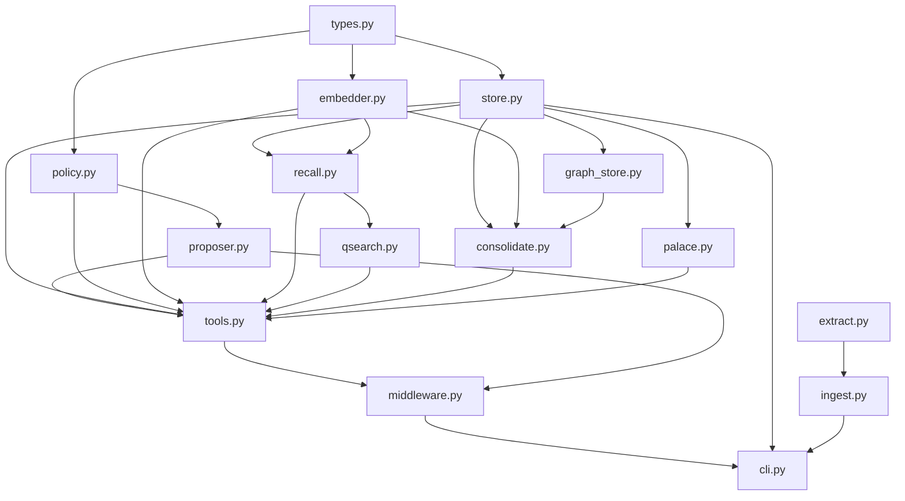

# RAGIX Memory Subsystem

**Author:** Olivier Vitrac, PhD, HDR | olivier.vitrac@adservio.fr | Adservio

---

## Overview

The RAGIX Memory Subsystem provides **persistent, policy-governed, auditable memory for LLM-assisted workflows**. It enables local AI agents to maintain context across sessions, learn from interactions, and build structured knowledge bases without relying on external services.

### Design Philosophy

1. **Local-first:** All data remains on your infrastructure. No external dependencies beyond optional Ollama for embeddings.
2. **Deterministic:** Reproducible behavior via MockEmbedder for testing and development.
3. **Auditable:** Every operation creates an immutable event log with full provenance tracking.
4. **Policy-driven:** Hard and soft blocks prevent secrets, injection attacks, and low-quality data from polluting memory.
5. **Never-delete:** Items are superseded or archived, never physically removed. Complete revision history is maintained.

### Core Capabilities

1. **Memory Candidate Identification:** LLMs propose memory items during conversation. Proposals are governed by policy engine before storage.
2. **Q\*-Style QA Search:** Priority-queue-based iterative search builds support sets instead of simple top-k retrieval.
3. **Hybrid Recall:** Combines tag overlap (0.3), embedding similarity (0.5), and provenance quality (0.2) for ranking.
4. **Memory Palace:** Hierarchical navigation (domain/room/shelf/card) complements embedding-based search.
5. **Consolidation:** Automatic merging and tier promotion (STM → MTM → LTM) based on usage patterns.
6. **Graph-RAG (V2.1+):** Graph-neighborhood-aware clustering prevents cross-document contamination during consolidation.

---

## Architecture



**Module Dependencies:**

- **types.py:** Data model (MemoryItem, MemoryProposal, MemoryLink, provenance)
- **store.py:** SQLite backend with WAL mode, FTS5, and revision tracking
- **embedder.py:** MockEmbedder (deterministic) + OllamaEmbedder (nomic-embed-text)
- **policy.py:** Write governance (secret/injection blocks, quarantine rules)
- **recall.py:** Hybrid scoring with optional FAISS acceleration (V3.1)
- **qsearch.py:** Q\*-search iterative expansion with composite scoring
- **palace.py:** Memory palace hierarchical browse API
- **consolidate.py:** Clustering + merging + promotion pipeline
- **graph_store.py:** Graph-RAG support (V2.1+) for locality-aware consolidation
- **proposer.py:** LLM output parser (tool calls + delimiter blocks)
- **tools.py:** JSON API dispatcher (`memory.*` namespace)
- **middleware.py:** Chat pipeline hooks (pre_call, post_call, pre_return, intercept)
- **extract.py:** Unified text extraction for 46 file formats (text + binary: docx, pptx, xlsx, odt, odp, ods, pdf)
- **cli.py:** Unix-composable CLI with 19 subcommands (`ragix-memory`)

---

## Data Model

### MemoryItem

Each memory item is a first-class object with:

| Field | Type | Description |
|-------|------|-------------|
| `id` | `str` | Unique identifier (`MEM-XXXXXXXXXXXX`) |
| `tier` | `stm\|mtm\|ltm` | Short/mid/long-term tier |
| `type` | `str` | fact, decision, definition, constraint, pattern, todo, pointer, note |
| `title` | `str` | Concise title (max 200 chars) |
| `content` | `str` | Canonical content (max 3000 chars for non-pointer) |
| `tags` | `List[str]` | Searchable tags (lowercase normalized) |
| `entities` | `List[str]` | Named entities (people, products, systems) |
| `links` | `List[Dict]` | Typed relationships `{rel, to}` |
| `provenance` | `MemoryProvenance` | Source tracking (kind, ID, hashes) |
| `confidence` | `float` | 0.0-1.0 confidence score |
| `validation` | `str` | unverified, verified, contested, retracted |
| `scope` | `str` | Project/domain scope |
| `expires_at` | `str?` | ISO timestamp for STM expiry |
| `usage_count` | `int` | Access counter for promotion |
| `last_used_at` | `str?` | Last access timestamp |
| `created_at` | `str` | Creation timestamp (ISO-8601 UTC) |
| `updated_at` | `str` | Last update timestamp |
| `rule_id` | `str?` | Domain-specific ID (e.g. `RIE-RHEL-042`) |
| `corpus_id` | `str?` | Corpus version for cross-corpus ops (V3.0) |
| `superseded_by` | `str?` | ID of canonical item if superseded |
| `archived` | `bool` | Soft-delete flag (never physically removed) |

**Content hash:** SHA-256 with `sha256:` prefix for integrity verification.

### MemoryProvenance

Tracks the origin of a memory item:

```python
@dataclass
class MemoryProvenance:
    source_kind: SourceKind = "chat"  # chat, doc, tool, mixed
    source_id: str = ""               # e.g. "filename.pdf:chunk_3"
    chunk_ids: List[str] = []         # document chunk references
    content_hashes: List[str] = []    # SHA-256 hashes of source content
    created_at: str = field(default_factory=_now_iso)
```

**Provenance quality scoring:**

- `doc` + content_hashes: 1.0 (highest)
- `doc` without hashes: 0.7
- `tool` + hashes: 0.8
- `chat` + hashes: 0.5
- `chat` without hashes: 0.2 (lowest)

### Memory Tiers

- **STM (short-term):** Ephemeral, auto-expires, minimal provenance. Stores unverified proposals, session data.
- **MTM (mid-term):** Persists across sessions, provenance required. Stores verified facts, decisions.
- **LTM (long-term):** Permanent, verified provenance, high confidence. Stores canonical knowledge.

**Promotion rules:**

- STM → MTM: `usage_count >= 2` or auto-promote types (decision, constraint)
- MTM → LTM: `usage_count >= 5` or `validation == "verified"` or type in auto-promote list

---

## Store (SQLite)

### Tables

The memory store uses 6 core tables plus 3 V3.0 extensions:

1. **memory_items:** Current state of all items (44 fields, indexed on tier/type/scope/archived/corpus_id)
2. **memory_revisions:** Full revision history (append-only, revision_num per item)
3. **memory_embeddings:** Vector embeddings (BLOB float32, dimension+model_name tracked)
4. **memory_links:** Typed relationships (src_id, dst_id, rel, created_at)
5. **memory_palace_locations:** Palace assignments (domain/room/shelf/card)
6. **memory_events:** Audit log (action, item_id, details_json, content_hash, timestamp)
7. **corpus_hashes:** Delta-mode change tracking (V2.4, file_path → sha256 + item_ids)
8. **corpus_metadata:** Cross-corpus tracking (V3.0, corpus_id → parent + doc/item counts)
9. **graph_nodes / graph_edges / graph_kv:** Graph-RAG support (V2.1+)

### FTS5 Full-Text Search

V3.1 adds SQLite FTS5 virtual table with external-content mode:

```sql
CREATE VIRTUAL TABLE memory_items_fts USING fts5(
    title, content, tags, entities,
    content='memory_items',
    content_rowid='rowid'
);
```

Three triggers keep the FTS index in sync with `memory_items`. Queries use `MATCH` with ranked results. Falls back gracefully to `LIKE` if FTS5 unavailable.

**Search query escaping:** Terms wrapped in double-quotes, joined with `AND` for conjunctive matching.

### Thread Safety

- **Lock:** `threading.Lock` serializes all mutations and read-then-write operations
- **WAL mode:** `PRAGMA journal_mode=WAL` for concurrent readers (disabled for `:memory:`)
- **Foreign keys:** `PRAGMA foreign_keys=ON` enforces referential integrity

### Revision History

Every write creates a revision entry:

```python
{
    "revision_id": "REV-XXXXXXXXXXXX",
    "item_id": "MEM-XXXXXXXXXXXX",
    "revision_num": 3,
    "snapshot": {...},  # full JSON of item at this revision
    "changed_at": "2026-02-14T12:34:56Z",
    "reason": "consolidation_merge"
}
```

Reasons: `create`, `update`, `import`, `consolidation_merge`, `delta_consolidation_merge`

---

## Embedder

Three backends implement the `MemoryEmbedder` protocol:

### MockEmbedder (deterministic)

```python
MockEmbedder(dimension=768, seed=42)
```

- **Deterministic:** SHA-256 hash-based pseudo-embeddings
- **No external deps:** Suitable for tests and CI
- **L2-normalized:** Unit vectors for cosine similarity
- **Model name:** `mock-768d-seed42`

### OllamaEmbedder (production)

```python
OllamaEmbedder(
    model="nomic-embed-text",
    dimension=768,
    base_url="http://localhost:11434"
)
```

- **Real embeddings:** Via Ollama `/api/embed` endpoint
- **Auto-dimension:** Updates dimension from first response
- **Availability check:** Graceful fallback with warning
- **Model name:** As configured (e.g. `nomic-embed-text`)

### SentenceTransformerEmbedder (local, no Ollama)

```python
SentenceTransformerEmbedder(
    model="all-MiniLM-L6-v2",
    dimension=384
)
```

- **Local model:** Loaded via `sentence-transformers` library
- **No external API:** Runs entirely on local GPU/CPU
- **Batch support:** Efficient multi-text encoding
- **Lazy loading:** Model loaded on first use

---

## Policy

The policy engine enforces write governance at two levels:

### Hard Blocks (reject)

1. **Secrets:** 9 patterns (PEM blocks, API keys, JWTs, GitHub PATs, AWS credentials, long base64)
2. **Injection:** 8 patterns ("ignore previous instructions", "you are now...", `<system>`, etc.)
3. **Oversized content:** `len(content) > 3000` for non-pointer types
4. **Missing provenance:** MTM/LTM items require `source_id`

### Soft Blocks (quarantine to STM)

1. **Missing justification:** `why_store == ""`
2. **Missing source:** `provenance.source_id == ""`

Quarantined items:

- Forced to `tier="stm"`
- `validation="unverified"`
- Auto-expire after 24 hours (configurable via `quarantine_expiry_hours`)

### Configuration

```python
PolicyConfig(
    secret_patterns_enabled=True,
    injection_patterns_enabled=True,
    max_content_length=3000,
    require_provenance_for=["mtm", "ltm"],
    quarantine_expiry_hours=24
)
```

---

## Recall Engine

Hybrid retrieval combining three signals:

### Scoring Formula

```python
score = w_tag * tag_overlap + w_emb * embedding_sim + w_prov * provenance_quality
```

**Default weights:**

- `w_tag = 0.3` (tag overlap via weighted Jaccard)
- `w_emb = 0.5` (cosine similarity, L2-normalized)
- `w_prov = 0.2` (provenance quality, 0-1 scale)

### FAISS Acceleration (V3.1)

Optional `faiss-cpu` integration for O(log n) embedding search:

- **Index type:** `IndexFlatIP` (inner product = cosine on normalized vectors)
- **Build:** Lazy on first search, bulk-loads all embeddings via `store.all_embeddings()`
- **Normalization:** L2-normalize before insertion and search
- **Invalidation:** `invalidate_faiss_index()` after store mutations
- **Fallback:** Sequential cosine scan if FAISS unavailable

**Performance:** ~500 items scanned in <10ms with FAISS vs ~200ms sequential.

### Tag Extraction

Query text → lowercase words ≥3 chars, stopword-filtered (200+ English + French stopwords).

### Modes

- **inject:** Top-k items formatted for context injection (`format_inject()`)
- **catalog:** Top-k items as structured catalog (`format_catalog_entry()`)
- **hybrid:** Both injection and catalog

---

## Q\*-Search

Priority-queue-based iterative search building support sets:

### Algorithm

```python
1. Initial retrieval: top-k by embedding similarity
2. Build root node with support_memory_ids, covered_entities, score
3. Agenda loop (max expansions or time limit):
   a. Pop best node (highest score)
   b. Check stop: no open_subgoals + score > threshold
   c. Expand: find related items via tag overlap
   d. Score children, push to agenda
4. Return best node's support set
```

### Scoring Formula

```python
S = w_r*R + w_p*P + w_c*C - w_d*D - w_x*X
```

**Components:**

- **R (relevance):** Average embedding cosine similarity to query (0-1)
- **P (provenance):** Average provenance quality across support items (0-1)
- **C (coverage):** Fraction of covered entities / total known entities (0-1)
- **D (duplication):** Pairwise tag Jaccard overlap (0-1, penalizes redundancy)
- **X (contradiction):** Fraction of contested/retracted items (0-1, penalty)

**Default weights:** `w_r=0.4, w_p=0.3, w_c=0.2, w_d=0.05, w_x=0.05`

### Configuration

```python
QSearchConfig(
    enabled=True,
    max_expansions=30,
    max_time_seconds=15.0,
    score_threshold=0.6,
    w_relevance=0.4,
    w_provenance=0.3,
    w_coverage=0.2,
    w_duplication=0.05,
    w_contradiction=0.05
)
```

---

## Memory Palace

Hierarchical location scheme: `domain/room/shelf/card`

- **domain:** Project or corpus (e.g. `default`, `grdf-rie`)
- **room:** Topic cluster (derived from primary tag or first entity)
- **shelf:** Memory type (fact, decision, etc.)
- **card:** Individual item ID

### Browse API

```python
palace.list_path("")                         # List domains
palace.list_path("default")                  # List rooms
palace.list_path("default/architecture")     # List shelves
palace.list_path("default/architecture/decision")  # List cards
```

Returns:

```python
{
    "level": "shelf",
    "path": "default/architecture",
    "children": [...],
    "count": 12
}
```

### Auto-Assignment

```python
palace.auto_assign(item)
```

Derives location from metadata:

- `domain`: Uses `scope` or `"default"`
- `room`: Primary tag → lowercase, spaces to hyphens (fallback: first entity or `"misc"`)
- `shelf`: `item.type`
- `card`: `item.id`

---

## Consolidation

Pipeline: **cluster → merge → promote → palace assignment**

### Clustering (Two-Pass)

**Pass 1 (coarse):** Group by `type + primary_tag`

**Pass 2 (fine):** Within each group, agglomerative clustering by embedding distance

- **Threshold:** `cluster_distance_threshold = 0.15` (default)
- **Similarity metric:** Cosine ≥ (1 - threshold) = 0.85
- **Graph-assisted (V2.1+):** Requires BFS neighbors + locality signal (same doc OR same tag OR cosine ≥ 0.90)

### Merge Confidence Formula (V3.1-3)

Four-component weighted blend:

```python
confidence = w_max * max_conf
           + w_overlap * jaccard_overlap
           + w_recency * recency_decay
           + w_validation * validation_bonus
```

**Components:**

1. **max_conf:** Highest confidence among cluster members (backward compat)
2. **jaccard_overlap:** Fraction of tags shared by ≥2 members / total unique tags
3. **recency_decay:** `exp(-lambda * days_old)` using most recent `updated_at`
4. **validation_bonus:** 1.0 if any "verified", 0.0 if any "retracted", else 0.5

**Default weights:** `w_max=0.4, w_overlap=0.3, w_recency=0.2, w_validation=0.1`
**Recency lambda:** 0.05 (default, half-life ~14 days)

Result clamped to [0.0, 1.0].

### Merge Strategies

1. **LLM merge (Granite 3.2B via Ollama):** Generates canonical title/content/type via summarization
2. **Deterministic fallback:** Longest content wins, tags/entities/provenance unioned

**Configuration:**

```python
ConsolidateConfig(
    enabled=True,
    model="granite3.2:3b",
    ollama_url="http://localhost:11434",
    fallback_to_deterministic=True,
    stm_threshold=30,
    cluster_distance_threshold=0.15,
    usage_count_for_ltm=5,
    auto_promote_types=["decision", "constraint"]
)
```

### Promotion

Items promoted based on:

1. `usage_count >= usage_count_for_ltm` (default 5)
2. `type` in `auto_promote_types` (e.g. decision, constraint)
3. `validation == "verified"`

**Tier transition:**

- STM → MTM: `usage_count >= 2`
- MTM → LTM: Meets one of 3 conditions above + has `provenance.source_id`

### Delta Mode (V2.4)

Neighborhood-scoped re-consolidation for incremental updates:

```python
consolidator.run_delta(
    new_item_ids=["MEM-abc123", "MEM-def456"],
    scope="project",
    promote=True
)
```

1. BFS neighborhood (depth=2, max_size=50) for each new item
2. Collect all items in affected neighborhoods
3. Standard clustering + merge on subset only
4. Promote as usual

**Use case:** After ingesting modified files, only re-consolidate items linked to changed content.

---

## Graph Store

Graph-RAG support for locality-aware consolidation (V2.1+).

### Node Kinds

- `doc`: Document nodes (e.g. `doc:report.pdf`)
- `chunk`: Document chunks (e.g. `chunk:report.pdf:chunk_3`)
- `item`: Memory items (e.g. `item:MEM-XXXXXXXXXXXX`)
- `entity`: Named entities (controlled vocabulary only)

### Edge Kinds

1. **contains:** `doc → chunk` (deterministic from provenance)
2. **adjacent:** `chunk → chunk` (consecutive in same doc)
3. **extracted_from:** `item → chunk` (item provenance links)
4. **mentions:** `item → entity` (item.entities with vocabulary filter)
5. **similar:** `item → item` (cosine > threshold, optional top-k constraint)

### Entity Vocabulary

**Controlled patterns** (regex):

- CVE IDs: `CVE-\d{4}-\d+`
- Versions: `\d+(?:\.\d+){1,3}[a-z]?`
- Review IDs: `RVW-\d+`
- Memory IDs: `MEM-[0-9a-f]+`
- Compliance markers: `MUST|SHALL|SHOULD|PROHIBITED|REQUIRED`
- Config paths: `/etc/...`, `*.conf`, `*.yaml`, etc.
- Port numbers: `8080/tcp`, `443/udp`

**Product vocabulary** (case-insensitive):

- OS: windows, linux, rhel, centos, debian, ubuntu
- Container: kubernetes, k8s, docker, podman
- Database: postgresql, mysql, mariadb, oracle, mongodb, redis
- Infra: ansible, terraform, grafana, prometheus, kafka
- Security: openssl, tls, ssh, ldap, kerberos, crowdstrike

Rejects generic words, enforces 2-60 char length.

### Build Performance

Typical: ~1,500 nodes + ~3,000 edges built in <30s (deterministic edges only).

With similarity edges (cosine ≥ 0.85): +500 edges, ~60s total.

### Compaction

Post-consolidation graph cleanup:

1. Find superseded item nodes (`archived=1` + `superseded_by` set)
2. Rewire edges from superseded → canonical node
3. Remove superseded nodes and orphaned similar edges

**Result:** Prevents hub explosion after repeated consolidations.

---

## Tools API

JSON I/O dispatcher for `memory.*` namespace:

| Action | Parameters | Returns |
|--------|-----------|---------|
| `memory.propose` | `items[]` (proposals) | `{status, accepted, rejected, items[]}` |
| `memory.write` | item fields | `{status, id}` |
| `memory.search` | `query, tags?, tier?, type?, scope?, k?` | `{status, count, items[]}` |
| `memory.read` | `ids[]` | `{status, items[]}` |
| `memory.update` | `id, patch fields` | `{status, id}` |
| `memory.link` | `src_id, dst_id, rel` | `{status, src_id, dst_id}` |
| `memory.consolidate` | `scope, tiers[], promote?` | `{status, items_processed, clusters_found, items_merged, items_promoted}` |
| `memory.palace.list` | `path` | `{status, locations[]}` |
| `memory.palace.get` | `item_id` or `location` | `{status, location, item}` |

**Factory:**

```python
from ragix_core.memory.tools import create_dispatcher
dispatcher = create_dispatcher(config)
result = dispatcher.dispatch("search", {"query": "architecture", "k": 5})
```

---

## Middleware

Chat pipeline integration via 4 hooks:

### Hook 1: pre_call (inject memory)

```python
augmented_context = middleware.pre_call(
    user_query="What is our architecture decision?",
    system_context="...",
    turn_id="turn_001"
)
```

Retrieves relevant items, formats via `format_inject()`, injects into system context within token budget.

### Hook 2: post_call (parse proposals, govern, store)

```python
cleaned_response, summary = middleware.post_call(
    response_text="...<MEMORY_PROPOSALS_JSON>[...]</MEMORY_PROPOSALS_JSON>...",
    tool_calls=[{"action": "memory.propose", "items": [...]}],
    turn_id="turn_001"
)
```

Extracts proposals via delimiter blocks or tool calls, applies policy, stores accepted items.

**Consolidation triggers:**

1. **Context fraction:** `stm_tokens / ctx_limit_tokens >= ctx_fraction_trigger` (default 0.3)
2. **STM count:** `count_items(tier="stm") >= stm_threshold` (default 30)

### Hook 3: pre_return (Q\*-search recall)

```python
final_response, catalog = middleware.pre_return(
    user_query="...",
    assistant_response="...",
    turn_id="turn_001"
)
```

Runs Q\*-search if `qsearch.enabled=True` and `recall.mode` in {catalog, hybrid}.

### Hook 4: intercept (explicit recall requests)

```python
recall_result = middleware.intercept_recall(
    user_query="What do we know about the database migration?",
    tool_calls=[...]
)
```

Detects patterns: `recall`, `what do we know about`, `from memory`, `remember when`, etc.

---

## CLI Usage

### Installation

```bash
pip install -e .                   # installs ragix-memory entry point
pip install -e ".[docs]"           # + Office format support (docx, pptx, xlsx, odt, odp, ods)
ragix-memory --help
```

### Environment Variables

| Variable | Description |
|----------|-------------|
| `RAGIX_MEMORY_DB` | Path to SQLite database (overrides last-db cache) |
| `RAGIX_MEMORY_BUDGET` | Default token budget for pipe/recall |

**DB resolution chain:** `--db` flag → `RAGIX_MEMORY_DB` env → `~/.cache/ragix/last_memory_db` → `memory.db`

### Commands (15 subcommands)

**Init — create memory workspace:**

```bash
ragix-memory init ./my_workspace
# Creates: memory.db, config.yaml, .gitignore
```

**Ingest — load files into memory:**

```bash
# Single files, directories, or globs (46 supported formats)
ragix-memory --db $DB ingest --source docs/ --injectable --format auto --tags project
ragix-memory --db $DB ingest --source report.docx slides.pptx data.xlsx
```

**Search:**

```bash
ragix-memory --db $DB search "architecture database" --tier ltm --k 10
```

**Recall — token-budgeted injection block:**

```bash
ragix-memory --db $DB recall "security policy" --budget 2000
```

**Pipe — ingest + recall in one shot (alias: push):**

```bash
# Pipe to local LLM (Ollama)
ragix-memory --db $DB pipe "summarize" --source docs/ --budget 3000 \
    | { cat; echo '---'; echo 'Summarize in 5 bullets.'; } \
    | ollama run granite3.1-moe:3b

# Pipe to Claude (cloud) — use --system-prompt + --tools "" for clean isolation
ragix-memory --db $DB pipe "summarize" --budget 4000 \
    | claude --system-prompt "Doc analyst." --tools "" -p
```

**Pull — capture LLM output into memory:**

```bash
echo "Analysis results..." | ragix-memory --db $DB pull --tags analysis --title "My Analysis"

# Full RAG feedback loop: recall → LLM → capture
ragix-memory --db $DB pipe "topic" --budget 3000 \
    | ollama run mistral \
    | ragix-memory --db $DB pull --tags summary --title "Topic Summary"
```

**Show item:**

```bash
ragix-memory --db $DB show MEM-abc123defg4567
```

**Statistics:**

```bash
ragix-memory --db $DB stats
```

**Consolidation:**

```bash
ragix-memory --db $DB consolidate --scope project --tiers stm,mtm --no-promote
```

**Export (with secrecy redaction):**

```bash
ragix-memory --db $DB export -o memory_export.jsonl --tier S2
```

Secrecy tiers:

- `S3`: No redaction (full detail)
- `S2`: Redact hostnames, IPs, hashes
- `S0`: Redact entity labels, filenames, paths

**Import:**

```bash
ragix-memory --db $DB import memory_export.jsonl
```

**Palace browse:**

```bash
ragix-memory --db $DB palace default/architecture
```

**Serve — start MCP server:**

```bash
ragix-memory --db $DB serve --fts-tokenizer fr
```

### Claude Code Integration

RAGIX Memory integrates with Claude Code via MCP server registration and hooks. The installer (`scripts/install_claude.sh`) automates setup.

**MCP Server Registration:**

The installer adds the Memory MCP server to `.claude/settings.local.json`:

```json
{
  "mcpServers": {
    "ragix-memory": {
      "command": "ragix-memory",
      "args": ["serve", "--db", "memory.db", "--fts-tokenizer", "fr"]
    }
  }
}
```

This exposes 17 MCP tools to Claude Code:

| Tool | Purpose |
|------|---------|
| `memory_recall` | Token-budgeted retrieval for context injection |
| `memory_search` | FTS5 + hybrid scoring search |
| `memory_propose` | Governed write path (policy validation) |
| `memory_write` | Direct write (bypass governance) |
| `memory_read` | Read a memory item by ID |
| `memory_update` | Update an existing item |
| `memory_link` | Create semantic links between items |
| `memory_consolidate` | Dedup, merge, tier promotion cycle |
| `memory_stats` | Store statistics |
| `memory_palace_list` | List memory palaces |
| `memory_palace_get` | Get palace contents |
| `memory_session_inject` | Inject context into session |
| `memory_session_store` | Store session context |
| `memory_workspace_list` | List registered workspaces |
| `memory_workspace_register` | Register a new workspace |
| `memory_workspace_remove` | Remove a workspace |
| `memory_metrics` | Tool call metrics and performance |

**Hooks:**

The installer registers three hooks relevant to memory:

1. **Memory auto-inject** (UserPromptSubmit) — calls `ragix-memory recall` before each user turn, injects relevant context as a system message. Graceful degradation if no DB exists.
2. **Audit logger** (PostToolUse) — logs all Bash/Write/Edit tool actions to `.agent_logs/commands.log` with timestamps.
3. **Safety guard** (PreToolUse:Bash) — blocks dangerous shell commands (mirrors `unix-rag-agent.py` denylist).

**Slash Commands:**

10 slash commands are available in `.claude/commands/`:

| Command | Delegates to |
|---------|-------------|
| `/memory` | Master command (7 subcommands: search, recall, add, stats, consolidate, workspaces, metrics) |
| `/memory-add` | `memory_propose` MCP tool |
| `/memory-search` | `memory_search` MCP tool |
| `/memory-recall` | `memory_recall` MCP tool |

**Quick Start:**

```bash
# 1. Install RAGIX and create a memory workspace
pip install -e .
ragix-memory init ./my_project

# 2. Register with Claude Code
bash scripts/install_claude.sh

# 3. Restart Claude Code, then use slash commands
#    /memory search "architecture decisions"
#    /memory-add "Finding title" --tags arch,decision
#    /memory recall "security policy" --budget 2000
```

### Supported File Formats (46 extensions)

| Category     | Extensions                                        | Method            |
|--------------|---------------------------------------------------|-------------------|
| Markdown     | `.md`                                             | Direct read       |
| Text         | `.txt`, `.rst`, `.csv`, `.tsv`                    | Direct read       |
| Source code  | `.py`, `.java`, `.js`, `.ts`, `.go`, `.rs`, etc.  | Direct read       |
| Config       | `.yaml`, `.yml`, `.json`, `.toml`, `.xml`         | Direct read       |
| Web          | `.html`, `.htm`, `.css`                           | Direct read       |
| Shell        | `.sh`, `.bash`, `.sql`                            | Direct read       |
| Office docs  | `.docx`, `.odt`                                   | python-docx/odfpy |
| Slides       | `.pptx`, `.odp`                                   | python-pptx/odfpy |
| Spreadsheets | `.xlsx`, `.ods`                                   | openpyxl/odfpy    |
| PDF          | `.pdf`                                            | pdftotext/poppler |

Install Office format support: `pip install ragix[docs]`

---

## Testing

### Run Full Suite

```bash
cd /home/olivi/Documents/Adservio/Projects/RAGIX
pytest ragix_core/memory/tests/ -v
```

**Test files:**

- `test_policy.py` (15 tests) — Hard/soft blocks, quarantine
- `test_store.py` (20 tests) — CRUD, revisions, embeddings, FTS5
- `test_recall.py` (10 tests) — Hybrid scoring, FAISS, tag extraction
- `test_qsearch.py` (8 tests) — Agenda, scoring, expansions
- `test_integration_loop.py` (18 tests) — Multi-turn, consolidation, graph build

**Total:** 176 tests, fully deterministic via `MockEmbedder`, ~0.18s runtime.

### Example Test

```python
def test_policy_secret_patterns(tmp_path):
    policy = MemoryPolicy()
    proposal = MemoryProposal(
        type="note",
        title="API Key",
        content="api_key=sk-abc123def456...",
        why_store="test"
    )
    verdict = policy.evaluate_proposal(proposal)
    assert verdict.rejected
    assert "secret pattern" in verdict.reasons[0].lower()
```

---

## Configuration

Nested dataclass config via `MemoryConfig.from_dict()`:

```python
from ragix_core.memory.config import MemoryConfig

config = MemoryConfig.from_dict({
    "store": {
        "db_path": "/path/to/memory.db",
        "wal_mode": True
    },
    "embedder": {
        "backend": "ollama",
        "model": "nomic-embed-text",
        "dimension": 768,
        "ollama_url": "http://localhost:11434"
    },
    "policy": {
        "max_content_length": 3000,
        "quarantine_expiry_hours": 24
    },
    "recall": {
        "mode": "hybrid",
        "inject_budget_tokens": 2000,
        "catalog_k": 10,
        "tag_weight": 0.3,
        "embedding_weight": 0.5,
        "provenance_weight": 0.2
    },
    "qsearch": {
        "enabled": True,
        "max_expansions": 30,
        "max_time_seconds": 15.0,
        "score_threshold": 0.6
    },
    "consolidate": {
        "enabled": True,
        "model": "granite3.2:3b",
        "stm_threshold": 30,
        "cluster_distance_threshold": 0.15,
        "usage_count_for_ltm": 5
    },
    "proposer": {
        "strategy": "both",  # tool + delimiter
        "delimiter_open": "<MEMORY_PROPOSALS_JSON>",
        "delimiter_close": "</MEMORY_PROPOSALS_JSON>"
    }
})
```

---

## Security

### Policy Engine

- **9 secret patterns:** PEM blocks, API keys, JWTs, GitHub PATs, AWS creds, base64 ≥60 chars
- **8 injection patterns:** "ignore previous instructions", "you are now", `<system>`, etc.
- **Oversized check:** `len(content) > 3000` for non-pointer types
- **Provenance enforcement:** MTM/LTM require `source_id`

### Secrecy Tiers (V2.1+)

Write-time and export-time redaction:

- **S3:** No redaction (default)
- **S2:** Redact hostnames, IPs, SHA-256 hashes, port numbers
- **S0:** Redact entity labels, filenames, paths, everything in S2

Applied via `summary_redact.redact_for_storage()` during consolidation merge and export.

### Audit Trail

Every operation creates an immutable `MemoryEvent`:

```python
{
    "id": "EVT-XXXXXXXXXXXX",
    "action": "write",
    "item_id": "MEM-XXXXXXXXXXXX",
    "details": {"reason": "consolidation_merge"},
    "content_hash": "sha256:...",
    "timestamp": "2026-02-14T12:34:56Z"
}
```

Actions: `write`, `read`, `update`, `search`, `link`, `consolidate`, `corpus_register`

---

## Extension Points

### Adding a New Embedder

```python
from ragix_core.memory.embedder import MemoryEmbedder

class CustomEmbedder:
    def __init__(self, api_key: str):
        self._api_key = api_key
        self._dimension = 1536

    @property
    def dimension(self) -> int:
        return self._dimension

    @property
    def model_name(self) -> str:
        return "custom-embedder-v1"

    def embed_text(self, text: str) -> List[float]:
        # Call external API
        return [...]

    def embed_batch(self, texts: List[str]) -> List[List[float]]:
        return [self.embed_text(t) for t in texts]
```

Register in `embedder.create_embedder()` factory.

### Adding a New Memory Type

Edit `types.py`:

```python
VALID_TYPES: set = {
    "fact", "decision", "definition", "constraint",
    "pattern", "todo", "pointer", "note",
    "experiment",  # NEW
}
```

Update `__post_init__` type mapping if needed.

### Custom Consolidation Strategy

Subclass `ConsolidationPipeline` and override `_merge_cluster()`:

```python
class CustomConsolidator(ConsolidationPipeline):
    def _merge_cluster(self, cluster: List[MemoryItem]) -> Optional[MemoryItem]:
        # Custom merge logic
        return merged_item
```

---

## Troubleshooting

### FAISS not available

**Symptom:** "FAISS not available, falling back to sequential scan"

**Fix:** Install `faiss-cpu`:

```bash
pip install faiss-cpu
```

### FTS5 not available

**Symptom:** "FTS5 not available, falling back to LIKE search"

**Cause:** SQLite built without FTS5 extension (very old or custom builds).

**Fix:** Upgrade SQLite or accept LIKE fallback (behavior identical, just slower).

### Ollama connection errors

**Symptom:** "Ollama not available at http://localhost:11434"

**Fix:**

```bash
ollama serve &
ollama pull nomic-embed-text
```

### Consolidation produces mega-chains

**Symptom:** Single canonical item merges 20+ sources from different documents.

**Cause:** Pure embedding clustering without graph constraints.

**Fix:** Enable Graph-RAG (V2.1+):

```python
from ragix_core.memory.graph_store import GraphStore

graph = GraphStore(db_path="memory.db")
graph.build_from_store(store, scope="project", embedder=embedder)
consolidator = ConsolidationPipeline(store, embedder, config, graph=graph)
```

---

## Performance Benchmarks

**Environment:** Intel i7-12700K, 32GB RAM, SQLite 3.46, FAISS 1.8.0

| Operation | Without FAISS | With FAISS | Speedup |
|-----------|---------------|------------|---------|
| Search 500 items | 200ms | 8ms | 25x |
| Consolidate 500 STM | 45s | 32s | 1.4x |
| FTS5 search (1000 items) | 15ms | N/A | N/A |
| LIKE fallback | 80ms | N/A | 5.3x slower |

**Graph build:** 1,500 nodes + 3,000 edges in ~30s (deterministic edges only).

---

## References

1. **Q\* algorithm:** Inspired by Q-learning + A\* search for iterative refinement
2. **Memory palace:** Ancient mnemonic technique adapted for structured navigation
3. **Graph-RAG:** Local neighborhood constraints prevent cross-corpus contamination
4. **FAISS:** Facebook AI Similarity Search (IndexFlatIP for cosine)
5. **FTS5:** SQLite full-text search extension with BM25 ranking

---

## Changelog

- **V3.2 (2026-02-18):** Multi-format extract (46 exts, 7 binary), CLI hardening (init/pull/serve, 15 subcommands), env vars, `ragix-memory` entry point, `ragix[docs]` optional deps
- **V3.1 (2026-02-14):** FTS5 full-text search, FAISS acceleration, merge confidence formula
- **V3.0 (2026-02-14):** Cross-corpus edges, corpus metadata, secrecy tiers
- **V2.4 (2026-02-13):** Delta mode, corpus hash registry, edge cap enforcement
- **V2.1 (2026-02-12):** Graph-RAG integration, locality-aware clustering
- **V2.0 (2026-02-10):** Q\*-search, memory palace, consolidation pipeline
- **V1.0 (2026-02-08):** Initial release with hybrid recall, policy engine, SQLite store
