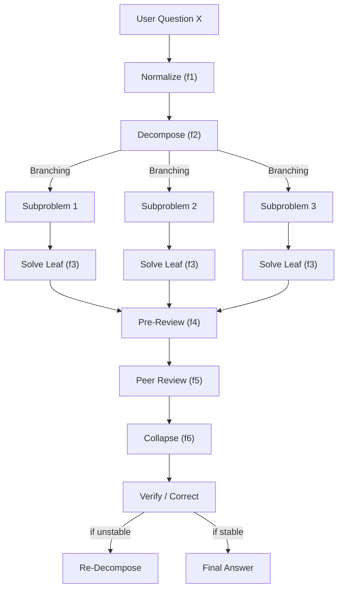
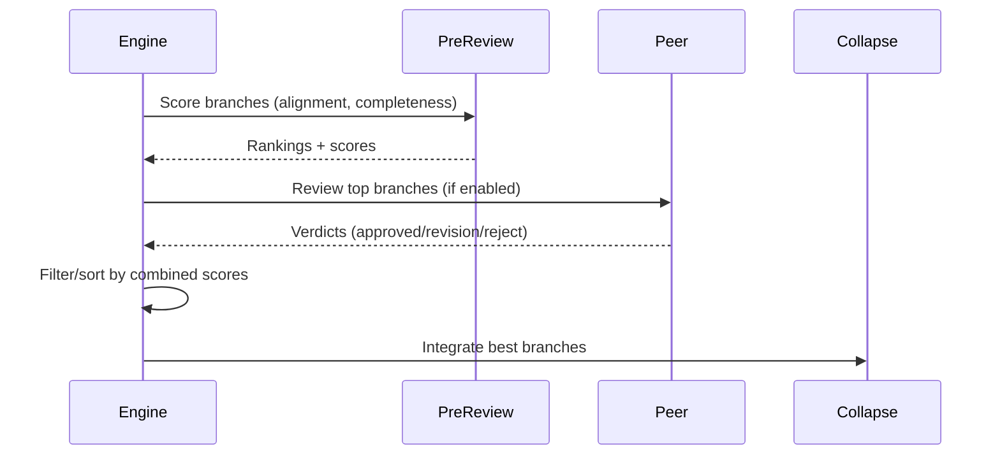

# ContractiveReasoner

### **A Branching, Contractive Reasoning Engine for Slim LLMs**

> **Goal:** Transform small models into *deep reasoners*
> **Method:** Externalize reasoning as a **tree of contractive transformations**
> **Strategy:** Decompose → Solve → Pre-Review → Peer-Review → Collapse → Converge
> **Outcome:** Stable reasoning through *fixed-point iteration in reasoning space*

**Author:** Olivier Vitrac, PhD, HDR | olivier.vitrac@adservio.fr | Adservio Innovation Lab

---

## Table of Contents

1. [Overview](#overview)
2. [Installation](#installation)
3. [Quick Start](#quick-start)
4. [CLI Reference](#cli-reference)
5. [Configuration Files](#configuration-files)
6. [Interactive Calibration](#interactive-calibration)
7. [Peer Review System](#peer-review-system)
8. [Benchmarking for Papers](#benchmarking-for-papers)
9. [Metrics & Analysis](#metrics--analysis)
10. [Entropy Metrics & Decision Logic](#-entropy-metrics--decision-logic)
11. [Relevance Filtering (BM25-like)](#-relevance-filtering-bm25-like)
12. [Async & Concurrency](#-async--concurrency)
13. [Manual Rebranching](#-manual-rebranching)
14. [Diagnostic: Branching Issues](#-diagnostic-branching-issues)
15. [Experimental Notes](#-experimental-notes)
16. [Mathematical Foundation](#mathematical-foundation)
17. [Architecture](#architecture)

---

## Overview

`ContractiveReasoner` is a Python engine implementing **branching contractive reasoning** on top of local LLMs served by **Ollama**. It is designed to be:

- **Mathematically principled** (fixed-point contraction, entropy analysis)
- **Asynchronous and concurrent** (independent branch exploration)
- **Traceable and introspectable** (full metrics + real-time events)
- **Peer-reviewable** (external LLM validation with constructive feedback)
- **Composable** (plug into RAGIX, LangGraph, custom orchestration)

### Key Features

| Feature | Description |
|---------|-------------|
| **Entropy-based decomposition** | High uncertainty → decompose; low uncertainty → solve directly |
| **Semantic pruning** | Kill branches that drift from the root question |
| **Pre-review scoring** | Internal quality check before peer review |
| **Constructive peer review** | External LLM validates answers (helps, not gatekeeps) |
| **Branch ranking** | Preference-based ranking before collapse |
| **Configurable presets** | Factual, math, complex, exploration modes |
| **Duration strings** | Timeouts as "3m", "2m30s", "1h" |

---

## Installation

### Requirements

- Python 3.10+
- `httpx`, `pyyaml` (optional)
- Ollama running locally

```bash
# Install dependencies
pip install httpx pyyaml

# Start Ollama
ollama serve

# Pull models
ollama pull granite3.1-moe:3b
ollama pull mistral:7b-instruct
ollama pull qwen2.5:7b
```

---

## Quick Start

### Python API

```python
import asyncio
from ContractiveReasoner import ContractiveReasoner

async def main():
    engine = ContractiveReasoner(
        model="granite3.1-moe:3b",
        max_depth=3,
        max_loops=6,
    )
    result = await engine.solve("What causes ocean tides?")
    print(result.final_answer)
    print(result.to_mermaid())

asyncio.run(main())
```

### 🔧 Constructor Parameters (Full Reference)

```python
engine = ContractiveReasoner(
    # === Ollama Connection ===
    base_url="http://localhost:11434",
    model="granite3.1-moe:3b",

    # === Tree Structure Limits ===
    max_depth=4,                    # maximum tree depth
    max_loops=10,                   # global reasoning loop iterations
    max_global_tokens=64000,        # stop condition: total token budget
    max_branch_tokens=16000,        # triggers branch summarization
    max_concurrent_branches=4,      # async parallelism for branch exploration

    # === Entropy Thresholds ===
    entropy_decompose_threshold=0.9,   # high entropy → DECOMPOSE
    entropy_collapse_threshold=0.4,    # low entropy → eligible for COLLAPSE
    entropy_gamma_min_reduction=0.05,  # minimum entropy reduction required
    k_entropy_samples=4,               # samples for model entropy estimation

    # === Semantic Filtering ===
    min_relevance_threshold=0.15,      # prune branches below this BM25 relevance
    max_rebranch_attempts=2,           # auto-rebranch on bad decomposition

    # === Timeouts ===
    timeout_sec=120,                   # per-call timeout (supports "2m", "90s")
)
```

> **Note:** All defaults are tuned for **Granite 3B** and **Mistral 7B** local models.

### 📘 Programming Manual (Intuitive API)

#### 1. Start reasoning
```python
result = await engine.solve("Explain the physics of frying and oil degradation.")
```

#### 2. Inspect reasoning tree
```python
tree = result.tree
root = tree[result.root_id]
print(root.question, root.answer)
```

#### 3. Export JSON trace
```python
trace = result.export_trace()
with open("trace.json", "w") as f:
    json.dump(trace, f, indent=2)
```

#### 4. Generate Mermaid diagram
```python
print(result.to_mermaid())
# Paste in https://mermaid.live for visualization
```

#### 5. Rebranch (try alternative strategy)
```python
engine.rebranch(node_id)  # clears subtree, resets node
result = await engine.solve(...)
```

#### 6. Browse subtree
```python
sub = engine.get_subtree(node_id)
for node in sub.values():
    print(node.role, node.state)
```

#### 7. Real-time metrics (live dashboard)

Attach a callback for step-by-step telemetry:

```python
def on_step(engine, node, metrics):
    print(f"[{metrics.step_index}] Node {node.node_id[:6]} "
          f"Entropy={metrics.entropy_model:.3f} "
          f"Relevance={metrics.relevance_root:.3f}")

engine.event_callback = on_step
result = await engine.solve("Your question")
```

### Command Line

```bash
# Basic usage
python ContractiveReasoner.py "What is photosynthesis?"

# With telemetry
python ContractiveReasoner.py \
  --model granite3.1-moe:3b \
  --max-depth 3 \
  --print-events \
  --export-trace trace.json \
  "Explain polymer migration."

# Interactive chat
python ContractiveReasoner.py --config config.yaml --chat
```

---

## CLI Reference

### Core Parameters

| Flag | Default | Description |
|------|---------|-------------|
| `--model` | granite3.1-moe:3b | Primary LLM model |
| `--base-url` | http://localhost:11434 | Ollama API URL |
| `--max-depth` | 3 | Maximum reasoning tree depth |
| `--max-loops` | 6 | Maximum main loop iterations |
| `--max-global-tokens` | 64000 | Global token budget |
| `--max-branch-tokens` | 16000 | Per-branch token limit |
| `--max-concurrent-branches` | 4 | Parallel branch exploration |
| `--timeout-sec` | 120 | Per-call timeout (supports "2m", "90s") |

### Entropy Thresholds

| Flag | Default | Description |
|------|---------|-------------|
| `--entropy-decompose-threshold` | 0.9 | High entropy triggers decomposition |
| `--entropy-collapse-threshold` | 0.4 | Threshold for collapse eligibility |
| `--entropy-gamma-min-reduction` | 0.05 | Minimum entropy reduction required |
| `--entropy-samples` | 4 | Samples for entropy estimation |
| `--min-relevance-threshold` | 0.15 | Prune branches below this relevance |
| `--max-rebranch-attempts` | 2 | Auto-rebranch limit on bad decomposition |

### Peer Review Parameters

| Flag | Default | Description |
|------|---------|-------------|
| `--peer-model` | (none) | Peer model for validation (enables peer review) |
| `--peer-base-url` | (same as --base-url) | Peer model API URL |
| `--peer-timeout-sec` | 180 | Peer call timeout (supports "3m") |
| `--peer-timing` | before_collapse | When to review: `before_collapse`, `end_of_reasoning`, `on_demand` |
| `--peer-min-depth` | 2 | Minimum branch depth for peer eligibility |
| `--peer-min-nodes` | 3 | Minimum nodes in branch for eligibility |
| `--peer-max-per-branch` | 1 | Max peer calls per branch path |
| `--peer-max-calls` | 10 | Total peer calls per solve |
| `--peer-token-budget` | 50000 | Token budget for all peer calls |
| `--peer-approval-threshold` | 0.6 | Score >= this is approved |
| `--peer-rejection-threshold` | 0.3 | Score <= this is rejected |
| `--peer-kill-rejected` | true | Kill rejected branches |
| `--no-peer-kill-rejected` | | Only penalize, don't kill |
| `--peer-force-root` | false | Force peer review of final answer |
| `--peer-as-tiebreaker` | false | Only call peer on high-entropy nodes |
| `--peer-log-prompts` | false | Log full peer prompts |
| `--peer-experiment` | (none) | Use predefined experiment config |

### Output Options

| Flag | Description |
|------|-------------|
| `--config FILE` | Load parameters from YAML/JSON config |
| `--chat` | Interactive chat mode |
| `--print-events` | Show per-step telemetry |
| `--summary-only` | Skip full answer output |
| `--no-mermaid` | Skip Mermaid diagram |
| `--width N` | Text wrap width (default: 90) |
| `--export-trace FILE` | Export full trace JSON |
| `--export-mermaid FILE` | Export Mermaid diagram |
| `--log-events FILE` | Export per-step NDJSON |

---

## Configuration Files

### Basic Config (`config.yaml`)

```yaml
# Ollama settings
model: granite3.1-moe:3b
base_url: http://localhost:11434

# Tree limits
max_depth: 3
max_loops: 6
max_global_tokens: 64000
max_branch_tokens: 16000

# Entropy thresholds
entropy_decompose_threshold: 0.85
entropy_collapse_threshold: 0.4
entropy_samples: 3

# Semantic pruning
min_relevance_threshold: 0.15

# Timeouts (duration strings supported)
timeout_sec: 2m

# Output
print_events: true
```

### Config with Peer Review

```yaml
model: granite3.1-moe:3b
max_depth: 3
entropy_decompose_threshold: 0.5
timeout_sec: 2m
print_events: true

# Peer review configuration
peer:
  model: mistral:7b-instruct
  timeout_sec: 3m
  timing: before_collapse
  min_depth: 2
  min_nodes: 3
  max_calls: 10
  approval_threshold: 0.6
  rejection_threshold: 0.3
  kill_rejected: true
```

### Duration String Format

Timeouts accept human-readable durations:
- `180` or `180s` → 180 seconds
- `3m` or `3m0s` → 180 seconds
- `2m30s` → 150 seconds
- `1h` or `1h30m` → 3600 or 5400 seconds

---

## Interactive Calibration

The `calibrate.py` tool provides interactive parameter tuning and challenge testing.

### Usage

```bash
# Interactive mode with defaults
python calibrate.py

# Start with a preset
python calibrate.py --preset math

# Start with a specific model
python calibrate.py --model mistral:7b-instruct

# Run challenge suite directly
python calibrate.py --preset factual --run-suite
```

### Presets

| Preset | Use Case | Key Settings |
|--------|----------|--------------|
| `factual` | Simple Q&A | High decompose threshold, low samples |
| `complex` | Multi-step problems | Lower threshold, more samples |
| `math` | Mathematical reasoning | Low threshold, deep trees |
| `exploration` | Research questions | Very low threshold, max depth |
| `fast` | Quick responses | Shallow, few iterations |
| `deep` | Thorough analysis | Deep trees, many iterations |

### Interactive Commands

```
preset <name>     - Switch to a preset (factual/complex/math/exploration/fast/deep)
model <name>      - Change the LLM model
set <param> <val> - Set a specific parameter
status            - Show current configuration
challenge <id>    - Run a single challenge
suite             - Run all challenges in current category
save <file>       - Save current config to file
load <file>       - Load config from file
help              - Show all commands
exit              - Quit calibration
```

---

## Peer Review System

### Design Philosophy

The peer reviewer acts as a **constructive academic reviewer**, not a gatekeeper.

> *"The goal is to HELP the reviewed model improve its answer, not simply reject it."*

This mirrors the academic peer review process:
- A professor reviewing a student's work provides constructive feedback
- An imperfect answer that addresses the question is better than no answer
- Partial correctness should be acknowledged and built upon
- Rejection is reserved for fundamentally wrong or harmful answers

### Model Roles

| Role | Symbol | Description |
|------|--------|-------------|
| **Primary (f)** | $f$ | Main reasoning model, generates answers |
| **Peer (g)** | $g$ | External validator, reviews and scores |

### Peer Model Options

| Peer Type | Model Examples | Characteristics |
|-----------|----------------|-----------------|
| **Light checker** | `llama3.2:3b`, `phi3:latest` | Fast, cheap, diverse dissent |
| **Symmetric peer** | `mistral:7b-instruct` | Higher agreement, deeper critique |
| **Diversity peer** | `qwen2.5:7b` | Different training stack, fresh perspective |
| **Control peer** | Same as $f$ | For ablation studies |

### Review Process (3 Phases)

```
Phase 1: PRE-REVIEW (Internal)
┌─────────────────────────────────────────────────────────────────┐
│  For each candidate branch:                                      │
│    1. Compute semantic alignment with root question              │
│    2. Measure topic coverage (key terms present?)                │
│    3. Assess answer completeness (structure, depth)              │
│    4. Calculate hedging ratio (uncertainty markers)              │
│    5. Score assertion strength (confidence level)                │
│                                                                  │
│  Output: PreReviewScore with overall_score and issues list       │
└─────────────────────────────────────────────────────────────────┘
                                ↓
Phase 2: PEER REVIEW (External)
┌─────────────────────────────────────────────────────────────────┐
│  For top-scoring candidates (after pre-review):                  │
│    1. Format context: question + answer + root question          │
│    2. Call peer model with constructive review prompt            │
│    3. Parse verdict: approved / minor_revision / major_revision / reject │
│    4. Extract score (0.0-1.0) and improvement suggestions        │
│                                                                  │
│  Output: PeerReviewResult with verdict, score, feedback          │
└─────────────────────────────────────────────────────────────────┘
                                ↓
Phase 3: RANKING & COLLAPSE
┌─────────────────────────────────────────────────────────────────┐
│  Combine pre-review and peer scores:                             │
│    1. Rank branches by combined score (Borda count)              │
│    2. Filter out rejected branches (if kill_rejected=true)       │
│    3. Select best candidates for collapse                        │
│    4. Merge answers into parent node                             │
└─────────────────────────────────────────────────────────────────┘
```

### Peer Verdicts

| Verdict | Score Range | Action |
|---------|-------------|--------|
| `approved` | ≥ 0.6 | Keep as-is |
| `minor_revision` | 0.4 - 0.6 | Keep, flag for improvement |
| `major_revision` | 0.3 - 0.4 | Keep with noted issues |
| `reject` | < 0.3 | Remove from collapse |

### Pre-Review Metrics

Before sending to peer, each branch is scored on:
- **Semantic alignment**: How well answer addresses the question
- **Topic coverage**: Coverage of key topics from question
- **Answer completeness**: Structural completeness
- **Confidence**: Assertion strength vs. hedging ratio

### Predefined Experiments

| Experiment | Description |
|------------|-------------|
| `no_peer` | Baseline without peer review |
| `peer_before_collapse` | Standard peer review at collapse |
| `peer_final_only` | Review only the final answer |
| `peer_aggressive` | Low thresholds, more reviews |
| `peer_conservative` | High thresholds, fewer reviews |
| `peer_budget_limited` | Cost-constrained peer review |
| `peer_large_model` | Use larger model for peer |

```bash
# Use predefined experiment
python ContractiveReasoner.py \
  --model granite3.1-moe:3b \
  --peer-experiment peer_aggressive \
  --peer-model qwen2.5:7b \
  "Explain quantum entanglement"
```

---

## Benchmarking for Papers

### Benchmark Framework

The benchmark system supports systematic evaluation for scientific papers.

### Directory Structure

```
benchmarks/
├── configs/
│   ├── paper_scenarios.yaml    # Experiment scenarios S1-S6
│   ├── task_set.yaml           # Curated task set (20-30 items)
│   └── calibration_set.yaml    # Parameter tuning challenges
├── results/
│   ├── <scenario>_<task>_trace.json
│   ├── <scenario>_<task>_events.ndjson
│   ├── <scenario>_<task>_summary.json
│   └── aggregate_results.csv
├── run_benchmarks.py           # Benchmark runner
├── run_paper_experiments.py    # Paper experiment runner
└── summarize_benchmarks.py     # Results aggregator
```

### Paper Scenarios (S1-S6)

```yaml
# benchmarks/configs/paper_scenarios.yaml
scenarios:
  S1_baseline_fast:
    description: "Baseline contractive reasoning (f only)"
    model: granite3.1-moe:3b
    peer_enabled: false
    entropy_samples: 1
    max_depth: 2
    max_loops: 3

  S2_self_consistency:
    description: "Self-consistency with majority vote"
    model: granite3.1-moe:3b
    peer_enabled: false
    entropy_samples: 3
    max_depth: 3
    max_loops: 6

  S3_peer_light:
    description: "Light peer checker (fast, cheap)"
    model: granite3.1-moe:3b
    peer:
      model: llama3.2:3b
      timing: before_collapse
      min_depth: 1
      token_budget: 2000

  S4_peer_diverse:
    description: "Diverse peer (different training stack)"
    model: granite3.1-moe:3b
    peer:
      model: qwen2.5:7b
      timing: before_collapse
      min_depth: 2
      token_budget: 4000
      force_root: true

  S5_peer_strong:
    description: "Symmetric peer (same model family)"
    model: mistral:7b-instruct
    peer:
      model: mistral:7b-instruct
      timing: end_of_reasoning
      token_budget: 3000

  S6_safety_focus:
    description: "Safety/regulation focus (same model as f)"
    model: granite3.1-moe:3b
    peer:
      model: granite3.1-moe:3b
      timing: before_collapse
      request_clarification: true

  S0_brute_force:
    description: "Direct LLM call (no contractive reasoning)"
    brute_force: true
    model: granite3.1-moe:3b
```

### Task Categories

```yaml
# benchmarks/configs/task_set.yaml
tasks:
  # Math/Logic (5 items)
  - id: math_1
    category: math
    difficulty: easy
    question: "What is 15 + 27?"
    keywords: ["42"]

  - id: math_2
    category: math
    difficulty: medium
    question: "How many ways can you arrange 4 distinct books on a shelf?"
    keywords: ["24", "4!", "factorial"]

  # Coding (5 items)
  - id: code_1
    category: coding
    difficulty: medium
    question: "Write a Python regex to match email addresses."
    keywords: ["re.", "pattern", "@", "\\w"]

  # Reasoning (5 items)
  - id: reason_1
    category: reasoning
    difficulty: hard
    question: "If all A are B, and some B are C, what can we conclude about A and C?"
    keywords: ["some", "may", "possible", "cannot conclude all"]

  # Food Engineering (5 items)
  - id: food_1
    category: food_engineering
    difficulty: hard
    question: "Design a migration test protocol for a multilayer PET/PE food packaging film."
    keywords: ["migration", "simulant", "temperature", "time", "contact"]
    expected_decomposition: true

  # Regulation (5 items)
  - id: reg_1
    category: regulation
    difficulty: hard
    question: "What are the key requirements for EU FCM compliance for plastic materials?"
    keywords: ["Regulation 10/2011", "SML", "OML", "migration", "testing"]
    expected_decomposition: true
```

### Running Paper Experiments

```bash
# Run full experiment matrix
python benchmarks/run_paper_experiments.py \
  --scenarios benchmarks/configs/paper_scenarios.yaml \
  --tasks benchmarks/configs/task_set.yaml \
  --output-dir benchmarks/results/paper_run_001

# Run specific scenarios only
python benchmarks/run_paper_experiments.py \
  --scenarios benchmarks/configs/paper_scenarios.yaml \
  --tasks benchmarks/configs/task_set.yaml \
  --include-scenarios S1_baseline_fast S3_peer_light \
  --output-dir benchmarks/results/quick_test

# Run specific categories only
python benchmarks/run_paper_experiments.py \
  --scenarios benchmarks/configs/paper_scenarios.yaml \
  --tasks benchmarks/configs/task_set.yaml \
  --include-categories math reasoning \
  --output-dir benchmarks/results/math_reasoning
```

### Collecting Baseline (Brute Force) Answers

```bash
# Collect direct LLM answers for comparison
python benchmarks/collect_baseline.py \
  --tasks benchmarks/configs/task_set.yaml \
  --models granite3.1-moe:3b mistral:7b-instruct \
  --output benchmarks/results/baseline_answers.json
```

### Summarizing Results

```bash
# Generate CSV summary
python benchmarks/summarize_benchmarks.py \
  benchmarks/results/paper_run_001 \
  --output benchmarks/results/summary.csv

# Include peer review columns
python benchmarks/summarize_benchmarks.py \
  benchmarks/results/paper_run_001 \
  --output benchmarks/results/summary_with_peer.csv \
  --include-peer-metrics
```

---

## Metrics & Analysis

### Output Metrics

Each run generates metrics in multiple formats:

#### Summary JSON
```json
{
  "task_id": "math_2",
  "scenario": "S3_peer_light",
  "params": {...},
  "duration_sec": 12.5,
  "final_answer": "...",
  "summary": {
    "total_nodes": 8,
    "solved_nodes": 5,
    "failed_nodes": 1,
    "pruned_nodes": 2,
    "max_depth": 3,
    "entropy_mean": 0.65,
    "relevance_mean": 0.42,
    "total_tokens": 4521
  },
  "peer_metrics": {
    "total_calls": 2,
    "approved": 1,
    "rejected": 0,
    "revision": 1,
    "peer_tokens": 856,
    "peer_time_sec": 8.2
  },
  "keywords_found": 2,
  "keywords_total": 3,
  "score": 0.85
}
```

#### NDJSON Events
```json
{"step":1,"node_id":"abc123","state":"solved","entropy_model":0.72,"relevance_root":0.45,"tokens":312}
{"step":2,"node_id":"def456","state":"pruned","entropy_model":0.0,"relevance_root":0.08,"tokens":0}
{"peer_review":true,"node_id":"abc123","verdict":"approved","score":0.85,"peer_tokens":428}
```

#### CSV Summary Columns

| Column | Description |
|--------|-------------|
| `task_id` | Task identifier |
| `scenario` | Scenario name |
| `model` | Primary model |
| `peer_model` | Peer model (if any) |
| `duration_sec` | Total wall time |
| `total_nodes` | Nodes in reasoning tree |
| `max_depth` | Maximum tree depth |
| `total_tokens` | Primary model tokens |
| `peer_tokens` | Peer model tokens |
| `peer_calls` | Number of peer reviews |
| `peer_approved` | Peer approvals |
| `peer_rejected` | Peer rejections |
| `keywords_found` | Matching keywords |
| `score` | Composite quality score |
| `baseline_score` | Brute force baseline score |

### Analysis Scripts

```python
# Load and analyze results
import pandas as pd

df = pd.read_csv("benchmarks/results/summary.csv")

# Compare scenarios
by_scenario = df.groupby("scenario").agg({
    "score": "mean",
    "total_tokens": "mean",
    "duration_sec": "mean",
    "peer_tokens": "sum"
})

# Plot peer agreement vs quality
import matplotlib.pyplot as plt

peer_df = df[df["peer_calls"] > 0]
plt.scatter(peer_df["peer_approved"] / peer_df["peer_calls"], peer_df["score"])
plt.xlabel("Peer Agreement Rate")
plt.ylabel("Quality Score")
```

---

## 📏 Entropy Metrics & Decision Logic

### Entropy Computation

Each node computes multiple entropy metrics to guide the reasoning process:

| Metric | Formula | Meaning |
|--------|---------|---------|
| **Model entropy** | $H_{model} = -\sum p_i \log p_i$ | Disagreement across $k$ LLM samples |
| **Structural entropy** | $H_{struct} = \log(\text{len}(Q))$ | Length/complexity of the question |
| **Consistency entropy** | $H_{consist} = \text{Var}(\text{rephrasings})$ | Variability across re-phrasings |
| **BM25 relevance** | $\text{BM25}(Q_{node}, Q_{root})$ | Topical similarity to root question |

### Decision Logic (State Machine)

```
                    ┌─────────────────────────────────────────────┐
                    │                  NEW NODE                   │
                    └─────────────────────────────────────────────┘
                                        │
                                        ▼
                              ┌───────────────────┐
                              │  Compute Entropy  │
                              └───────────────────┘
                                        │
                    ┌───────────────────┴───────────────────┐
                    │                                       │
                    ▼                                       ▼
        ┌───────────────────────┐           ┌───────────────────────┐
        │  H >= threshold_high  │           │  H < threshold_high   │
        │     (high entropy)    │           │    (low entropy)      │
        └───────────────────────┘           └───────────────────────┘
                    │                                       │
                    ▼                                       ▼
        ┌───────────────────────┐           ┌───────────────────────┐
        │      DECOMPOSE        │           │     SOLVE LEAF        │
        │   (create children)   │           │   (direct answer)     │
        └───────────────────────┘           └───────────────────────┘
                    │                                       │
                    ▼                                       │
        ┌───────────────────────┐                           │
        │  Children all solved? │◄──────────────────────────┘
        └───────────────────────┘
                    │ YES
                    ▼
        ┌───────────────────────┐
        │     PRE-REVIEW        │
        │  (alignment scores)   │
        └───────────────────────┘
                    │
                    ▼
        ┌───────────────────────┐
        │    PEER REVIEW        │
        │   (if configured)     │
        └───────────────────────┘
                    │
                    ▼
        ┌───────────────────────┐
        │      COLLAPSE         │
        │ (merge best answers)  │
        └───────────────────────┘
```

### Branching Conditions

| Condition | Action | Rationale |
|-----------|--------|-----------|
| $H_{model} \geq$ `entropy_decompose_threshold` | **DECOMPOSE** | Model is uncertain, break into sub-questions |
| $H_{model} <$ `entropy_decompose_threshold` | **SOLVE** | Model is confident, answer directly |
| All children `solved` | **PRE-REVIEW** | Check quality before collapse |
| Pre-review passes | **PEER-REVIEW** | External validation (if enabled) |
| Peer approves | **COLLAPSE** | Merge answers into parent |
| $\text{relevance} <$ `min_relevance_threshold` | **PRUNE** | Branch drifted off-topic |

### Collapse Conditions

A parent node can collapse when:
1. All children are in state `solved` or `collapsed`
2. Pre-review scores exceed minimum threshold
3. Peer review (if enabled) approves at least one child
4. Combined entropy is below `entropy_collapse_threshold`

If collapse produces high entropy → **re-decompose** or request clarification.

---

## 🧲 Relevance Filtering (BM25-like)

### Purpose

The engine computes BM25-style similarity between:
- The node's question/answer text
- The root question (core topic)

**This protects against topic drift** — branches that wander away from the original question.

### Relevance Score Computation

```python
def compute_relevance(node_text: str, root_question: str) -> float:
    """
    BM25-inspired relevance score.

    - Tokenizes both texts
    - Computes term frequency (TF) and inverse document frequency (IDF)
    - Returns normalized score in [0, 1]
    """
    # Simplified: overlap ratio with IDF weighting
    node_tokens = set(tokenize(node_text.lower()))
    root_tokens = set(tokenize(root_question.lower()))

    overlap = node_tokens & root_tokens
    idf_weighted = sum(idf(t) for t in overlap)

    return min(1.0, idf_weighted / max_possible_score)
```

### Pruning Strategy

| Relevance | Action | Description |
|-----------|--------|-------------|
| $\geq 0.3$ | **Keep** | On-topic, contributes to answer |
| $0.1 - 0.3$ | **Flag** | Marginal, may be deprioritized |
| $< 0.1$ | **Prune** | Off-topic, remove from consideration |

### Example

```
Root question: "What are the key factors in food packaging migration testing?"

Branch 1: "What simulants are used for fatty foods?"
  → relevance = 0.45 ✓ (shares key terms: food, simulants)

Branch 2: "How does temperature affect migration rates?"
  → relevance = 0.38 ✓ (shares: migration, temperature → testing)

Branch 3: "What is the history of plastic manufacturing?"
  → relevance = 0.08 ✗ PRUNED (off-topic drift)
```

---

## 🧵 Async & Concurrency

### Parallel Branch Exploration

Branches are evaluated **independently** and **concurrently**:

```python
# Internal implementation pattern
async def explore_branches(parent_node):
    async with asyncio.Semaphore(max_concurrent_branches):
        tasks = [
            explore_child(child)
            for child in parent_node.children
        ]
        results = await asyncio.gather(*tasks, return_exceptions=True)
    return results
```

### Concurrency Model

| Feature | Implementation | Benefit |
|---------|----------------|---------|
| **Async Ollama calls** | `httpx.AsyncClient` | Non-blocking I/O |
| **Semaphore control** | `asyncio.Semaphore(N)` | Limits concurrent LLM calls |
| **Independent evaluation** | No child depends on sibling | Maximum parallelism |
| **Automatic collapse** | Triggered when all children resolve | No busy waiting |

### Performance Implications

```
Sequential (max_concurrent_branches=1):
  Child1 ──────▶ Child2 ──────▶ Child3 ──────▶ Total: 30s
       10s           10s           10s

Parallel (max_concurrent_branches=4):
  Child1 ──────▶
  Child2 ──────▶  All complete ──────▶ Total: 10s
  Child3 ──────▶
       10s              0s
```

This allows scaling to **deep trees** even with slow local LLMs.

---

## 🧩 Manual Rebranching

### When to Rebranch

You can restart reasoning from any node:

```python
engine.rebranch(node_id)   # clears subtree, resets node
result = await engine.solve(...)   # continue reasoning
```

**Useful when:**
- Decomposition failed (children don't cover the question)
- Entropy didn't reduce (stuck in uncertainty)
- You want an alternative line of reasoning
- Peer review rejected all branches

### Rebranch Limits

The engine automatically rebranches up to `max_rebranch_attempts` times if:
- All children were pruned (relevance too low)
- Collapse produced higher entropy than decomposition
- Peer review rejected all candidates

---

## 🔬 Diagnostic: Branching Issues

### Common Problem: "No Branching Occurs"

**Symptom:** The engine solves directly without decomposition.

**Root Cause:** `entropy_decompose_threshold` is too high for your model.

### Diagnostic Tool

```bash
# Run diagnostic to see entropy values
python diagnose_branching.py "Your question" --threshold 0.5

# Quick test with multiple thresholds
python diagnose_branching.py --quick-test

# Parameter sweep
python diagnose_branching.py --sweep "Your question"
```

### Model-Specific Thresholds

Based on diagnostic experiments:

| Model | Typical Entropy | Recommended Threshold |
|-------|-----------------|----------------------|
| `granite3.1-moe:3b` | 0.8 - 1.0 | **0.3 - 0.5** |
| `mistral:7b-instruct` | 0.5 - 0.8 | **0.4 - 0.6** |
| `qwen2.5:7b` | 0.6 - 0.9 | **0.4 - 0.6** |
| `llama3.2:3b` | 0.7 - 1.0 | **0.3 - 0.5** |

### Diagnostic Output Example

```
============================================================
DIAGNOSTIC RUN
============================================================
Question: What are the key factors in food packaging migration testing?
Parameters:
  entropy_decompose_threshold: 0.3
  entropy_samples: 2

[ROOT] Entropy=1.000 (threshold=0.3)
       → WILL DECOMPOSE (entropy >= threshold)
[step 01] depth=0 state=partially_solved E=1.000 rel=0.384
[step 02] depth=1 state=partially_solved E=1.000 rel=0.409
[step 03] depth=1 state=partially_solved E=1.000 rel=0.198
...

============================================================
RESULT SUMMARY
============================================================
Total nodes: 21
Decomposed: True
Max depth reached: 3
```

### Threshold Tuning Guide

| Threshold | Behavior | Use Case |
|-----------|----------|----------|
| **0.9+** | Almost never decompose | Simple factual Q&A |
| **0.5-0.7** | Occasional decomposition | Balanced reasoning |
| **0.3-0.5** | Regular decomposition | Complex multi-step problems |
| **< 0.3** | Aggressive decomposition | Deep exploration (may over-branch) |

---

## 📓 Experimental Notes

This section documents observations from calibration and diagnostic experiments.

### Observation 1: Granite 3B Produces High Entropy (2025-12-06)

**Finding:** `granite3.1-moe:3b` consistently produces entropy ≈ 1.0 (maximum uncertainty) across diverse questions.

**Implication:** The default `entropy_decompose_threshold=0.9` is too high for this model. With threshold=0.3, successful branching occurs:

```
Question: "What are the key factors in food packaging migration testing?"

With threshold=0.9: No decomposition (entropy 1.0 < 0.9 FALSE... wait, 1.0 >= 0.9, should decompose!)
With threshold=0.3: 21 nodes, depth 3, successful tree structure
```

**Recommendation:** For `granite3.1-moe:3b`, use `--entropy-decompose-threshold 0.3` to 0.5.

### Observation 2: Relevance Pruning Works Effectively

**Finding:** Branches with relevance < 0.1 are correctly identified as off-topic.

```
[step 07] depth=2 state=pruned E=0.000 rel=0.047 role="Analyze relationships..."
[step 17] depth=3 state=pruned E=0.000 rel=0.055 role="List possible deviations"
[step 20] depth=3 state=pruned E=0.000 rel=0.092 role="Analyze how individual factors..."
```

These branches drifted from the root question and were correctly pruned.

### Observation 3: Collapse Timing

**Finding:** Collapse occurs when all children reach `solved` state. The pre-collapse entropy drops significantly (from 1.0 to 0.09-0.18).

```
[step 22] depth=2 state=solved E=0.090 rel=0.000 role="To identify essential elements..."
[step 23] depth=2 state=solved E=0.180 rel=0.000 role="To understand how each factor..."
```

This indicates the contraction is working: children provide more certain answers than the parent's decomposition.

### Observation 4: Performance Characteristics

| Configuration | Nodes | Depth | Duration | Notes |
|--------------|-------|-------|----------|-------|
| threshold=0.3, samples=2 | 21 | 3 | ~6 min | Deep exploration |
| threshold=0.5, samples=2 | 8-12 | 2 | ~2-3 min | Balanced |
| threshold=0.9, samples=1 | 1-3 | 1 | ~30 sec | Mostly direct answers |

**Trade-off:** Lower threshold = deeper reasoning = higher cost/time.

### Observation 5: Parallel Execution Benefits

With `max_concurrent_branches=4`, sibling nodes at the same depth are explored in parallel. This significantly reduces wall-clock time for deep trees.

---

## Mathematical Foundation

### Fixed-Point Iteration

Let $X$ be the original problem. Define reasoning operators:
- $f_1$: normalize
- $f_2$: decompose
- $f_3$: solve leaf
- $f_4$: pre-review
- $f_5$: peer-review
- $f_6$: collapse

Composite operator:
$$F(X) = f_6(f_5(f_4(f_3(f_2(f_1(X))))))$$

Each $f_k$ is designed to be **contractive**:
$$|f_k(a) - f_k(b)| \le \alpha |a - b|, \quad \alpha < 1$$

We iterate until convergence:
$$X_{n+1} = F(X_n) \quad \text{with} \quad |X_{n+1}-X_n| < \varepsilon$$

This is Banach's fixed-point theorem applied to LLM reasoning.

### Entropy Metrics

| Metric | Description |
|--------|-------------|
| **Model entropy** | Disagreement across k LLM samples |
| **Structural entropy** | Length/complexity of the question |
| **Consistency entropy** | Variability across re-phrasings |
| **BM25 relevance** | Topical similarity to root question |

Decision logic:
- **High entropy** → DECOMPOSE
- **Low entropy** → SOLVE as leaf
- **Children solved** → PRE-REVIEW → PEER-REVIEW → COLLAPSE

---

## Architecture

### High-Level Flow



### Peer Review Integration



---

## License

MIT License

---

## Citation

If you use ContractiveReasoner in academic work, please cite:

```bibtex
@software{contrastive_reasoner,
  author = {Vitrac, Olivier},
  title = {ContractiveReasoner: Branching Contractive Reasoning for Slim LLMs},
  year = {2025},
  institution = {Adservio Innovation Lab}
}
```

---

**Olivier Vitrac**, PhD, HDR | olivier.vitrac@adservio.fr | *Adservio Innovation Laboratory*
