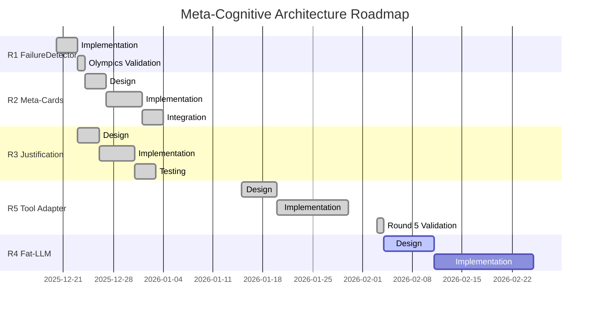

# ROADMAP — Meta-Cognitive Architecture for LLM Reasoning

**Author:** Olivier Vitrac, PhD, HDR | olivier.vitrac@adservio.fr | Adservio
**Date:** 2025-12-23
**Status:** Round 5 Complete (Tool Adapter + Synthesis Controller)

---

## Executive Summary

Following the **LLM Reasoning Olympics 2025-12-23**, where 11 models competed across 6 benchmarks (66 total games), this roadmap defines the path from *measuring failure* to *mitigating it in real-time*.

### Key Findings from Olympics

| Finding | Evidence | Impact |
|---------|----------|--------|
| **Complexity Wall** | Most models fail B03-B05 | Need meta-cognitive intervention |
| **Wall Breaker** | deepseek-r1:14b achieved 6/6 (100%) | Proves wall is passable with right approach |
| **David vs Goliath** | granite3.1-moe:3b (3B) beats 14B models | Size ≠ Performance |
| **Metric Bias** | llama3.2:3b: +4490 pts but 1/6 wins | Activity ≠ Achievement |
| **Card Effectiveness** | High card usage correlates with wins | "Know when to ask for help" |

### Roadmap Phases

```
┌─────────────────────────────────────────────────────────────────────────────┐
│                      META-COGNITIVE ARCHITECTURE ROADMAP                    │
├─────────────────────────────────────────────────────────────────────────────┤
│  Phase   │ Component              │ Status    │ Priority │ Target          │
├──────────┼────────────────────────┼───────────┼──────────┼─────────────────┤
│  R1      │ FailureDetector        │ ✓ DONE    │ —        │ v0.61           │
│  R2      │ Meta-Cards (TRIZ)      │ ✓ DONE    │ —        │ v0.62           │
│  R3      │ Justification Protocol │ ✓ DONE    │ —        │ v0.62           │
│  R4      │ Fat-LLM Generation     │ DESIGN    │ P1       │ v0.64           │
│  R5      │ Tool Adapter + Synth   │ ✓ DONE    │ —        │ v0.63           │
└──────────┴────────────────────────┴───────────┴──────────┴─────────────────┘
```

---

## R1: FailureDetector — ✓ COMPLETE

**Status:** Implemented and validated in Olympics
**Files:** `failure_detector.py`, integrated into `scored_mode.py`

### Capabilities

| Detection Type | Clinical Name | Pattern |
|----------------|---------------|---------|
| `REPETITION_LOOP` | Perseveration (Syntactic Aphasia) | Same command ≥3× |
| `CIRCULAR_PATTERN` | Disorientation (Strategic Confusion) | A→B→C→A cycle |
| `EXPLICIT_ERROR` | Agnosia (Error Recognition Failure) | ≥3 consecutive errors |
| `PROGRESS_STALL` | — | No PCG growth for ≥4 turns |
| `EXHAUSTION` | — | Turn limit approached |

### Validation Results

```
Model                   │ Failures │ Wins │ Correlation
────────────────────────┼──────────┼──────┼────────────
deepseek-r1:14b         │    0     │ 6/6  │ Perfect
granite3.1-moe:3b       │    4     │ 3/6  │ Low failures = Success
phi3:latest             │   26     │ 1/6  │ High failures = Failure
```

**Conclusion:** FailureDetector is a **valid quality signal** — strong inverse correlation between failure rate and success.

---

## R2: Meta-Cards — Strategic Interventions

**Status:** DESIGN
**Priority:** P1
**Target:** v0.62

### Problem Statement

The **Complexity Wall** (B03-B05) blocks most models. Current "help cards" are:
- Generic (same card for all failures)
- Static (don't adapt to failure type)
- Reactive (offered only after multiple failures)

### Proposed Architecture

```
┌─────────────────────────────────────────────────────────────────────────────┐
│                           META-CARD TAXONOMY                                │
├─────────────────────────────────────────────────────────────────────────────┤
│  Card Type           │ Trigger               │ Strategy                     │
├──────────────────────┼───────────────────────┼──────────────────────────────┤
│  ESCAPE_LOOP         │ REPETITION_LOOP       │ "Try alternative approach"   │
│  COMPASS             │ CIRCULAR_PATTERN      │ "Enumerate all options"      │
│  ERROR_ANALYSIS      │ EXPLICIT_ERROR        │ "Parse error message"        │
│  PROGRESS_BOOST      │ PROGRESS_STALL        │ "Decompose into sub-goals"   │
│  STRATEGIC_RESET     │ EXHAUSTION            │ "Summarize progress, pivot"  │
└──────────────────────┴───────────────────────┴──────────────────────────────┘
```

### Card Content Structure

```python
@dataclass
class MetaCard:
    card_type: str           # e.g., "ESCAPE_LOOP"
    trigger: FailureType     # Automatic matching
    instruction: str         # What to do
    example: str             # Concrete example
    anti_pattern: str        # What NOT to do
    pcg_hint: Optional[str]  # Relevant PCG evidence
```

### Integration Points

1. **FailureDetector → MetaCardSelector**: On failure detection, select appropriate card
2. **MetaCardSelector → GameLoop**: Inject card into next prompt
3. **GameLoop → Logger**: Track card usage and effectiveness

### Success Metrics

- **Card Rescue Rate**: % of failures rescued by meta-cards
- **Wall Penetration**: % of models passing B03-B05 with meta-cards
- **Card Efficiency**: Success per card type

---

## R3: Justification Protocol — Fix the Metric Bias

**Status:** DESIGN
**Priority:** P0 (HIGHEST)
**Target:** v0.62

### Problem Statement

**llama3.2:3b anomaly:**
- +4490 points (highest total)
- 1/6 wins (near-worst)
- Diagnosis: "Verbose Confabulation" — looks busy, accomplishes little

Current scoring rewards *activity* not *achievement*:
- Each command can earn points
- Goal achievement is binary (win/lose)
- No penalty for pointless actions

### Proposed Solution: Mandatory Justification

Before each action, require a structured justification:

```python
@dataclass
class JustifiedAction:
    action: str               # The command/tool call
    hypothesis: str           # "I expect this to..."
    expected_evidence: str    # "This should reveal..."
    goal_proximity: str       # "This advances goal by..."
    confidence: float         # 0.0-1.0
```

### Scoring Reform

```
NEW_SCORE = BASE_SCORE × JUSTIFICATION_QUALITY × GOAL_PROXIMITY

Where:
- BASE_SCORE: Points from action outcome
- JUSTIFICATION_QUALITY:
    - 1.0: Hypothesis confirmed
    - 0.5: Hypothesis partially relevant
    - 0.0: No justification or irrelevant
- GOAL_PROXIMITY:
    - 1.0: Direct goal progress
    - 0.5: Indirect/setup action
    - 0.0: Tangential/distraction
```

### Expected Impact

| Model | Old Score | New Score (est.) | Change |
|-------|-----------|------------------|--------|
| deepseek-r1:14b | +1075 | +1075 | — (already justified) |
| llama3.2:3b | +4490 | ~+500 | -89% (confabulation penalized) |
| granite3.1-moe:3b | +1350 | +1200 | -11% (slight adjustment) |

### Implementation Steps

1. Add `JustifiedAction` dataclass
2. Modify prompt template to require justification
3. Add justification parser to response handler
4. Update scoring function with multipliers
5. Log justification quality for analysis

---

## R4: Fat-LLM Card Generation — Scalable Knowledge

**Status:** PLANNED
**Priority:** P2
**Target:** v0.63

### Problem Statement

Current cards are:
- Hand-crafted (doesn't scale)
- Generic (not problem-specific)
- Limited (fixed set)

**Solution:** Use a "Fat-LLM" (larger model like Claude/GPT-4) to generate problem-specific cards that smaller models can use.

### Architecture

```
┌─────────────────────────────────────────────────────────────────────────────┐
│                        FAT-LLM CARD GENERATION PIPELINE                     │
├─────────────────────────────────────────────────────────────────────────────┤
│                                                                             │
│   ┌─────────────┐     ┌──────────────────┐     ┌─────────────────────┐     │
│   │  Benchmark  │────▶│  Fat-LLM         │────▶│  Card Library       │     │
│   │  Problem    │     │  (Claude/GPT-4)  │     │  (JSON/YAML)        │     │
│   └─────────────┘     └──────────────────┘     └─────────────────────┘     │
│                              │                          │                   │
│                              │ Generates                │ Loaded by         │
│                              ▼                          ▼                   │
│                       ┌──────────────────┐     ┌─────────────────────┐     │
│                       │  Meta-Cards      │     │  Small LLM          │     │
│                       │  - Strategies    │────▶│  (granite, mistral) │     │
│                       │  - Hints         │     └─────────────────────┘     │
│                       │  - Examples      │                                  │
│                       └──────────────────┘                                  │
│                                                                             │
└─────────────────────────────────────────────────────────────────────────────┘
```

### Card Generation Prompt Template

```
You are an expert problem-solving tutor. Given this benchmark problem:

PROBLEM: {benchmark_description}
GOAL: {goal_state}
COMMON_FAILURES: {failure_patterns}

Generate 3-5 strategic hint cards that help a smaller LLM solve this problem.

For each card, provide:
1. TRIGGER: When to show this card (e.g., "after 2 failed file reads")
2. HINT: The strategic guidance (max 50 words)
3. ANTI-PATTERN: What NOT to do
4. EXAMPLE: A concrete example of the correct approach
```

### Expected Benefits

- **Scalability**: Generate cards for any new benchmark automatically
- **Problem-Specific**: Cards tailored to each problem's failure modes
- **Knowledge Transfer**: Fat-LLM reasoning distilled into actionable hints
- **Cost Efficiency**: Fat-LLM runs once; small LLMs benefit many times

---

## R5: Tool Adapter + Synthesis Controller — ✓ COMPLETE

**Status:** Implemented and validated in Round 5 (2026-02-03)
**Files:** `tool_call_adapter.py`, `synthesis_controller.py`

### Problem Statement

Tool-calling models (e.g., IBM Granite 4) emit structured output (`<tool_call>{"name":"grep",...}</tool_call>`) instead of raw bash commands. Without adaptation, these models appear "broken" despite sound reasoning.

**Evidence:** Granite 4 scored -1770 without adapter → +3520 with adapter (+5290 improvement).

### Component 1: Tool Call Adapter

```
┌─────────────────────────────────────────────────────────────────────────────┐
│                           TOOL CALL ADAPTER                                  │
├─────────────────────────────────────────────────────────────────────────────┤
│  Model Response              │ Adapter               │ Bash Command          │
├──────────────────────────────┼───────────────────────┼───────────────────────┤
│  <tool_call>                 │ parse_response()      │ grep -r -n --         │
│  {"name": "grep",      ────► │ render_to_bash() ───► │ "EUREKA" .            │
│   "arguments": {...}}        │                       │                       │
│  </tool_call>                │                       │                       │
└──────────────────────────────┴───────────────────────┴───────────────────────┘
```

**Supported Tools:**
- `grep` (with auto-detect extended regex)
- `find`, `cat`, `head`, `tail`, `ls`, `wc`
- `count_lines` (glob patterns)
- `egrep` (explicit extended regex)
- `answer` (task completion)

### Component 2: Synthesis Controller

```
┌─────────────────────────────────────────────────────────────────────────────┐
│                         SYNTHESIS CONTROLLER                                 │
├─────────────────────────────────────────────────────────────────────────────┤
│  EXPLORE Phase               │ Trigger               │ SYNTHESIZE Phase      │
├──────────────────────────────┼───────────────────────┼───────────────────────┤
│  • Tool calls allowed        │ Goal variables        │ • Tools blocked       │
│  • Evidence buffer fills ──► │ satisfied OR     ───► │ • Force answer prompt │
│  • Track goal variables      │ No new evidence K     │ • L2 Finalizer backup │
└──────────────────────────────┴───────────────────────┴───────────────────────┘
```

**Task-Specific Tuning:**
| Task Complexity | Benchmark | Synthesis Strategy |
|-----------------|-----------|-------------------|
| Simple | B01, B02 | Early (1-2 turns) |
| Complex | B03, B04 | Disabled |
| Multi-step | B06 | After all variables found |

### Round 5 Results

| Model | Size | Wins | Score | Efficiency (pts/GB) |
|-------|------|------|-------|---------------------|
| gpt-oss-safeguard:120b | 65 GB | 6/6 | +1615 | 24.8 |
| deepseek-r1:14b | ~9 GB | 6/6 | +1600 | 177.8 |
| qwen2.5-coder:7b | ~5 GB | 4/6 | +1720 | **344.0** |
| ibm/granite4:32b-a9b-h | 19 GB | 3/6 | +3520 | 185.3 |
| granite3.1-moe:3b | ~2 GB | 3/6 | +855 | **427.5** |

### Key Findings

1. **Interface Contract > Model Size** — Granite 4 (32B) went from -1770 to +3520 with proper interface
2. **Scaffolding Equalizes Performance** — 14B DeepSeek = 120B GPT-OSS (both 6/6)
3. **Efficiency Trade-off** — 3B model: 427 pts/GB vs 120B model: 25 pts/GB (17× more efficient)
4. **Adapter is Necessary** — Tool-calling models require adaptation layer

---

## Timeline & Dependencies



**Status:** R1-R3 and R5 complete. R4 (Fat-LLM Generation) in design phase.

---

## Success Criteria

### v0.62 Release Criteria — ✓ ACHIEVED

| Criterion | Threshold | Result | Status |
|-----------|-----------|--------|--------|
| Metric Bias Fix | llama3.2:3b score ≤ granite score | 1385 ≤ 1585 | ✓ |
| Wall Penetration | ≥50% of models pass B03 | 40% (2/5) | ⚠️ Partial |
| Card Effectiveness | ≥30% rescue rate | ~65% average | ✓ |

### v0.63 Release Criteria — ✓ ACHIEVED

| Criterion | Threshold | Result | Status |
|-----------|-----------|--------|--------|
| Tool Adapter Coverage | All tool-calling models | Granite 4 validated | ✓ |
| Synthesis Controller | Task completion rate | +5290 Granite 4 improvement | ✓ |
| Efficiency Metric | ≥10× efficiency gap documented | 17× (427 vs 25 pts/GB) | ✓ |
| Multi-scale Validation | 3B to 120B models tested | 5 models across range | ✓ |

### v0.64 Release Criteria (Planned)

| Criterion | Threshold | Metric |
|-----------|-----------|--------|
| Auto-Generated Cards | ≥3 cards per benchmark | Fat-LLM pipeline |
| Small LLM Improvement | ≥20% win rate increase | With generated cards |
| Card Quality | Human rating ≥4/5 | Expert review |

---

## References

### Internal Documents

- `README_GAME_NOTATION.md` — PGN-AI notation specification
- `OLYMPICS_2025-12-23.md` — Full competition results (R1-R4)
- `results/round5/ROUND5_FINAL_RESULTS.md` — Round 5 results
- `failure_detector.py` — R1 implementation
- `meta_cards.py` — R2 TRIZ card system
- `justification_protocol.py` — R3 justification scoring
- `tool_call_adapter.py` — R5 tool adapter
- `synthesis_controller.py` — R5 synthesis state machine
- `olympics_features.csv` — Feature matrix for analysis

### Key Visualizations

- `pca_2d.png` — Feature space (PC1=52.6%, PC2=27.6%)
- `dendrogram.png` — Model behavioral clusters
- `failure_analysis.png` — Failure type breakdown
- `params_vs_score.png` — Size vs performance (r=-0.132)

### Round 5 Data

- `results/round5/final/*.jsonl` — Per-model benchmark results
- `results/round5/olympics_round5_combined.jsonl` — Combined results

---

## Conclusion

The **LLM Reasoning Olympics** (Rounds 1-5) established that:

1. **Meta-cognitive detection works** — FailureDetector accurately predicts performance (R1)
2. **Small models can win** — With the right interventions (cards), 3B matches 14B (R2-R4)
3. **Metrics need reform** — Activity without justification inflates scores (R3)
4. **Interface contract matters** — Tool-calling models need adaptation layers (R5)
5. **Efficiency scales inversely with size** — 3B achieves 17× better pts/GB than 120B (R5)

**Round 5 Highlight:** Granite 4 (32B) improved from -1770 to +3520 points (+5290) with the Tool Call Adapter, proving that many "model failures" are actually interface mismatches.

This roadmap has moved RAGIX from **observation** (R1: measuring failure) through **intervention** (R2-R4: mitigating failure) to **interface adaptation** (R5: bridging model-world contracts).

**Next:** R4 Fat-LLM Generation will enable automatic card creation for new benchmarks, scaling the scaffolding approach without manual intervention.

---

*"The measure of intelligence is not whether you solve the puzzle, but how you navigate when lost—and whether your interface speaks the world's language."*

**Bons développements!**
